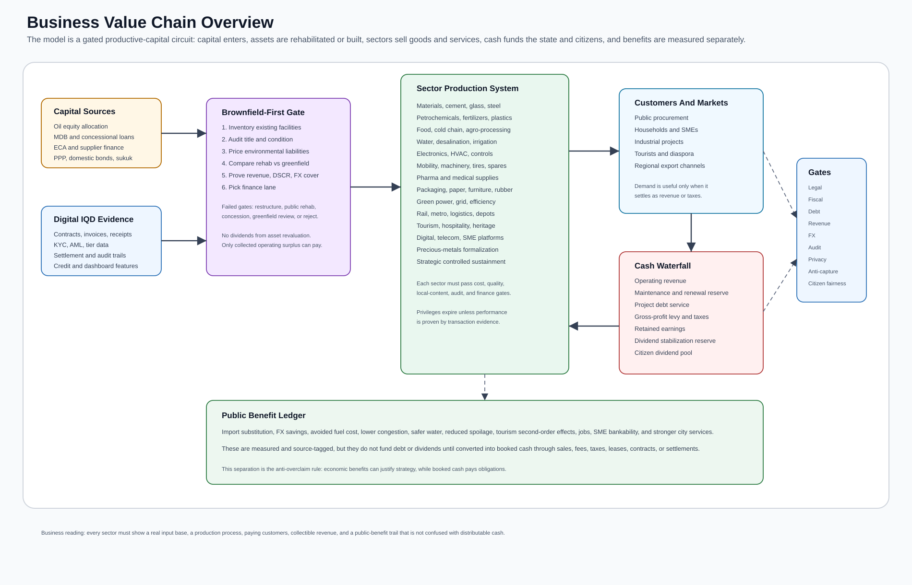

# Cylinder Seal

Economic, environmental, social, and cultural operating model for Iraq.

Cylinder Seal is primarily a national economic-system proposal: a way to
convert oil income, project finance, existing Iraqi facilities, Iraqi labor,
domestic production, tourism, civic works, culture, and environmental repair
into auditable cashflows and public benefits.

The main subject is the economy. Oil income becomes productive capital; domestic
industry, services, tourism, infrastructure, finance, and civic work create
measured value; ministries are funded through explicit taxes, levies, and
service contracts; citizens benefit through wages, services, credit access,
civic-work income, and equal dividends from audited surplus.

The Cylinder Seal software sits behind that model as an evidence, settlement,
and analytics layer. It is included to test how contracts, payments, invoices,
local-content evidence, public transfers, tax flows, credit features, and
dashboards could be measured. The code is a pilot-grade prototype, not the main
claim of the repository. It is not production CBDC infrastructure, not an
official Central Bank of Iraq project, and not an externally validated
macroeconomic forecast.



## Economic Model

The front-door subject is the national economic cycle:

```text
Oil income and project finance
  -> productive Iraqi assets
  -> domestic goods, services, infrastructure, tourism, exports, and civic work
  -> booked cash plus source-tagged public benefits
  -> maintenance, debt service, Treasury levy, retained earnings
  -> citizen dividends only from audited distributable surplus
```

The model has six practical rules:

1. No cash claim without settled evidence.
2. No benefit claim without source-tagged measurement.
3. No capital allocation without legal, fiscal, debt, revenue, FX, maintenance,
   audit, privacy, and anti-capture gates.
4. No dividend from oil receipts, borrowing, asset revaluation, or estimated GDP
   effects.
5. Existing Iraqi facilities are screened before greenfield capex.
6. Digital IQD evidence exists to make the economy bankable and governable, not
   to overstate readiness.

## System Map

| Layer | Purpose | Main document |
| --- | --- | --- |
| Unified model | Connects Digital IQD, INDHC, ministries, banks, producers, tourism, green capital, rail, taxes, reinvestment, civic work, and dividends into one accounting structure. | [Unified economic model](docs/unified-economic-model.md) |
| Business value chains | Shows sector value chains, funding lanes, repayment paths, and society/economy feedback loops. | [Business value chain charts](docs/business-value-chain-charts.md) |
| Operating logic | Defines ledgers, hard gates, scorecards, waterfalls, cash/benefit conversion, capital allocation, dashboards, and escalation rules. | [National economic operating logic](docs/national-economic-operating-logic.md) |
| Legal roadmap | Maps the authority path for the oil lockbox, INDHC, citizen entitlements, Digital IQD, project debt, securities, privacy, emergency powers, federalism, and appeals. | [National legal and institutional roadmap](docs/national-legal-institutional-roadmap.md) |
| Project pipeline | Converts sector ambition into project families with capex, revenue source, DSCR, FX exposure, facility reuse, environmental, legal, and evidence gates. | [Project pipeline and investment gates](docs/project-pipeline-and-investment-gates.md) |
| Political economy | Models resistance, capture risk, reform coalition strength, service continuity, staff transition, procurement transparency, and pause/rollback rules. | [Political-economy transition and anti-capture model](docs/political-economy-transition-and-anti-capture.md) |
| Federalism equity | Controls governorate/regional authority, local compact readiness, needs-adjusted allocation fairness, local revenue/jobs/suppliers, grievance resolution, data publication, audit, appeals, and land/water/heritage disputes. | [Federalism, governorate equity, and local compacts](docs/federalism-governorate-equity-and-local-compacts.md) |
| Environmental and social safeguards | Blocks or redesigns projects when water, pollution, marshland, biodiversity, heritage, resettlement, safety, maintenance, remediation, monitoring, audit, or accessibility gates fail. | [Environmental, social, water, and cultural safeguards](docs/environmental-social-cultural-safeguards.md) |
| Fiscal stress | Tests oil-equity caps, stressed DSCR, FX mismatch, maintenance gaps, guarantees, collection weakness, capex overruns, and dividend affordability under downside cases. | [Fiscal stress and contingent liability model](docs/fiscal-stress-and-contingent-liability-model.md) |
| Program sequencing | Decides whether each domain is not ready, evidence-only, pilot, build, controlled scale, or hold/rollback based on dependencies and gates. | [National program sequencing and dependency control](docs/national-program-sequencing-and-dependency-control.md) |
| Procurement integrity | Controls beneficial ownership, competition depth, price benchmarks, single-source justification, contract variations, milestone evidence, payment discipline, quality, and SME participation. | [Procurement integrity and market discipline](docs/procurement-integrity-and-market-discipline.md) |
| Benefit realization | Audits whether claimed cashflows, public benefits, avoided costs, service outcomes, and dividends are measured, attributable, audited, and correctly classified. | [Benefit realization and claim audit](docs/benefit-realization-and-claim-audit.md) |
| Public-finance architecture | Proposes an oil-income lockbox, citizen beneficial shares, ministry-funding feedback, cash formalization controls, and Digital IQD dividends. | [National dividend holding company](docs/national-dividend-holding-company.md) |
| Ten-year productive plan | Maps import substitution, profitable subsidiaries, strategic resilience, electronics, HVAC, water, irrigation, food, tourism, green capital, rail, raw-material processing, and Iraqi-only staffing. | [INDHC ten-year plan](docs/indhc-10-year-plan.md) |
| Affordability and cashflow | Uses IMF-baseline constraints to distinguish fiscal-safe, constrained-base, and strategic-upper envelopes. | [Iraq quantified affordability model](docs/iraq-quantified-affordability-model.md) |
| Growth and benefits | Quantifies scenario paths for non-oil growth, infrastructure, environmental, social, cultural, and dividend benefits. | [Growth model](docs/iraq-integrated-growth-impact-model.md), [benefits model](docs/iraq-comprehensive-benefits-model.md) |
| Facility recycling | Screens underutilized Iraqi assets before greenfield builds and maps international credit, PPP, domestic bond/sukuk/equity, local-bank, and diaspora finance lanes. | [Facility recycling and capital markets](docs/facility-recycling-and-capital-markets.md) |
| Import, services, diaspora | Adds missing import screens, attraction-based service production, and diaspora income, expertise, capital, marketing, and distribution channels. | [Import, services, and diaspora expansion](docs/import-services-diaspora-expansion.md) |
| Industrial champions | Reframes the industrial-group idea as sectoral Iraqi production champions with conditional demand, credit, export discipline, competition gates, and anti-capture controls. | [Digitally governed industrial champions](docs/digitally-governed-industrial-champions.md) |
| Civic work | Defines verified public-value work, training, care, environmental restoration, sport, culture, municipal repair, and disaster resilience. | [National civic work system](docs/national-civic-work-system.md) |
| Ministry transition | Lists candidate functions to deprecate, merge, regulate, corporatize, or sunset after legal, service-continuity, staff, and audit gates pass. | [Ministry transition roadmap](docs/ministry-transition-roadmap.md) |

## Business Charts

The strategy is visualized as business chains rather than only policy prose:

| Chart | What it demonstrates |
| --- | --- |
| [Business value chain overview](docs/diagrams/business-value-chain-overview.svg) | How capital, Digital IQD evidence, facility reuse, sectors, markets, cash waterfalls, public benefits, and risk gates connect. |
| [Sector value chain matrix](docs/diagrams/sector-value-chain-matrix.svg) | Asset base, operations, customers, revenue, public benefit, and evidence controls for every current sector. |
| [Capital and repayment lanes](docs/diagrams/capital-and-repayment-lanes.svg) | Which sources of capital fit which sectors and how repayment or return works. |
| [Society and economy feedback loop](docs/diagrams/society-economy-feedback-loop.svg) | How citizens benefit through wages, local goods, civic work, public services, credit histories, and dividends from audited surplus. |
| [System and financial flow diagrams](docs/system-and-financial-flow-diagrams.md) | End-to-end financial-flow combinations, with software architecture treated as an implementation appendix. |

## Current Status

| Status | Scope |
| --- | --- |
| Economic-system front door | Unified economic architecture, business value-chain charts, source discipline, legal/institutional roadmap, political-economy controls, project pipeline, affordability framing, ministry transition, civic work, facility recycling, industrial champions, tourism, diaspora channels, domestic capital markets, and long-horizon benefit scenarios. |
| Governance and cashflow model | Oil-income lockbox, capital allocation gates, treasury levy, debt-service waterfalls, retained earnings, audited dividend constraints, ministry feedback mechanisms, and citizen benefit channels. |
| Sector production model | Import substitution, profitable domestic subsidiaries, defence manufacturing, electronics, HVAC, water desalination, irrigation, food substitution, raw-material post-processing, Open Source Rail, green technology, tourism, services, and cultural production, reduced to project families before capital allocation. |
| Evidence software appendix | Rust analytics modules, SQL tables, payment-rail primitives, dashboard routes, and tests exist only to demonstrate how the economic model could be measured and audited. |
| Not production-ready | Real CBDC issuance, national identity/KYC integration, HSM or secure-element custody, audited offline double-spend prevention, live multi-peer deployment, CBI/core-banking integration, privacy review, disaster recovery, and independent economic validation. |

The repo is suitable first for policy review, economic-model critique, and
scenario debate. The software appendix can support demo workflows and technical
review, but it should not be represented as ready for national-scale deployment
or as a validated investment program.

## Source Discipline

The front README intentionally does not present national-scale deployment
timelines, sovereign-rating upgrade paths, diaspora capital figures, or Year 5
benefit ranges as project deliverables. Scenario figures belong only in the
source-disciplined documents with explicit caveats and independent-validation
requirements.

Current public facts that shape the framing:

- Iraq's final 2024 census count was reported at 46.1 million people, not the
  older approximately 43 million baseline used in earlier drafts. Source:
  [AP, Feb. 24, 2025](https://apnews.com/article/iraq-census-final-count-45b7753ddc82c188c79faea0d5a8c90d).
- Iraq's National Financial Inclusion Strategy 2025-2029 targets account
  ownership of 50% by 2030 and digital payment usage of 85%. Sources:
  [CBI NFIS PDF](https://cbi.iq/static/uploads/up/file-175032973296039.pdf),
  [Arab Monetary Fund](https://www.amf.org.ae/en/news/25-05-2025/iraq-launches-national-financial-inclusion-strategy-2025-2029).
- On June 12, 2026, S&P affirmed Iraq at `B-/B`, removed the long-term rating
  from CreditWatch negative, and kept a negative outlook. Source:
  [S&P Global Ratings](https://www.spglobal.com/ratings/en/regulatory/article/-/view/type/HTML/id/3580473).
- Public sources continue to describe Iraq as highly oil-revenue-dependent and
  fiscally exposed to rigid spending and weak non-oil revenues. Sources:
  [EIA Iraq analysis](https://www.eia.gov/international/analysis/country/irq),
  [EITI Iraq country page](https://eiti.org/countries/iraq),
  [IMF Iraq 2025 Article IV](https://www.imf.org/-/media/files/publications/cr/2025/english/1irqea2025001-source-pdf.pdf).

See [Economic assumptions](docs/economic-assumptions.md) for source discipline
and current public facts.

## Production Readiness Boundary

Before this could be evaluated as real payment or economic infrastructure, the
project would need at minimum:

- legal authority for Digital IQD, INDHC, citizen entitlements, oil-income
  allocation, borrowing, securities issuance, privacy, and dispute resolution;
- a formal threat model for wallets, POS devices, offline settlement,
  super-peers, operator access, and emergency controls;
- hardware-backed key custody and recovery design;
- offline double-spend limits backed by secure monotonic counters or equivalent
  attestation;
- privacy architecture separating payment data, identity data, regulatory
  access, and aggregate economic analytics;
- real multi-node consensus deployment with operational runbooks and failover
  tests;
- project-level feasibility studies, debt-capacity analysis, procurement
  sequencing, and independent macroeconomic review;
- legal and institutional validation for the lockbox, INDHC, citizen shares,
  federal/governorate compacts, project finance, domestic securities, privacy,
  appeals, and emergency powers;
- independent security audit, compliance review, and economic model validation.

## Software Appendix

This is intentionally a back-of-README section. The software is not the main
policy claim; it is an evidence rail for testing whether the economic model can
be measured, audited, settled, and challenged without relying on narrative
claims alone.

The workspace is organized as focused Rust crates:

| Area | Crates and files |
| --- | --- |
| Core ledger models | `crates/cs-core`, `crates/cs-storage` |
| Sync and consensus | `crates/cs-sync`, `crates/cs-consensus`, `proto/chain_sync.proto` |
| Policy, AML, credit | `crates/cs-policy`, `crates/cs-credit`, `crates/cs-exchange`, `crates/cs-feeds` |
| APIs and node runtime | `crates/cs-api`, `crates/cs-node` |
| POS and mobile surfaces | `crates/cs-pos`, `crates/cs-mobile-core`, `android/`, `ios/` |
| CBI-style dashboard and analytics | `crates/cbi-dashboard`, `crates/cs-analytics` |
| Specification tests | `crates/cs-tests` |

Technical review entry points:

- [Technical primitives](docs/technical-primitives.md) maps offline payments,
  double-spend checks, wire-format primitives, Raft, key handling, privacy, AML,
  and disaster recovery to code and remaining gaps.
- [Implementation status](IMPLEMENTATION_STATUS.md) summarizes current prototype
  scope and important gaps.
- [Specification and fixture results](SPECIFICATION_AND_FIXTURE_RESULTS.md) and
  [cs-tests README](crates/cs-tests/README.md) describe test evidence and missing
  live PostgreSQL/Redis coverage.
- [API reference](API_REFERENCE.md) documents dashboard endpoints.
- [Security model](SECURITY.md) lists threat areas and production requirements.

## Software Appendix: Scenario Analytics

The `cs-analytics` crate carries executable planning primitives for parts of
the economic model. These are scenario engines, not calibrated national
forecasts.

| Model | Code | Migration |
| --- | --- | --- |
| Economic operating kernel | `crates/cs-analytics/src/economic_operating.rs` | `migrations/20260702000001_economic_operating_kernel.sql` |
| Sovereign holding capital plan | `crates/cs-analytics/src/sovereign_holding.rs` | `migrations/20260703000001_sovereign_holding_capital_plan.sql` |
| Economic cycle and citizen income | `crates/cs-analytics/src/economic_cycle.rs` | `migrations/20260704000001_economic_cycle_projection.sql` |
| Integrated growth impact | `crates/cs-analytics/src/growth_impact.rs` | `migrations/20260705000001_growth_impact_projection.sql` |
| Comprehensive benefits | `crates/cs-analytics/src/comprehensive_benefits.rs` | `migrations/20260706000001_comprehensive_benefits_projection.sql` |
| Production capacity and import substitution | `crates/cs-analytics/src/production_capacity.rs` | `migrations/20260707000001_production_capacity_projection.sql` |
| Strategic resilience | `crates/cs-analytics/src/strategic_resilience.rs` | `migrations/20260708000001_strategic_resilience_projection.sql` |
| Tourism and tradable services | `crates/cs-analytics/src/tourism_services.rs` | `migrations/20260709000001_tourism_services_projection.sql` |
| Diaspora channels | `crates/cs-analytics/src/diaspora_channels.rs` | `migrations/20260710000001_diaspora_channels_projection.sql` |
| Facility recycling and capital markets | `crates/cs-analytics/src/facility_recycling.rs` | `migrations/20260711000001_facility_recycling_projection.sql` |
| Political-economy transition and anti-capture | `crates/cs-analytics/src/political_economy.rs` | `migrations/20260712000001_political_economy_transition.sql` |
| Fiscal stress and contingent liabilities | `crates/cs-analytics/src/fiscal_stress.rs` | `migrations/20260713000001_fiscal_stress_projection.sql` |
| Program sequencing and dependencies | `crates/cs-analytics/src/program_sequencing.rs` | `migrations/20260714000001_program_sequencing.sql` |
| Benefit realization and claim audit | `crates/cs-analytics/src/benefit_realization.rs` | `migrations/20260715000001_benefit_realization_claim_audit.sql` |
| Procurement integrity and market discipline | `crates/cs-analytics/src/procurement_integrity.rs` | `migrations/20260716000001_procurement_integrity.sql` |
| Federalism, governorate equity, and local compacts | `crates/cs-analytics/src/federalism_equity.rs` | `migrations/20260717000001_federalism_equity_compact.sql` |
| Environmental, social, water, and cultural safeguards | `crates/cs-analytics/src/environmental_social_safeguards.rs` | `migrations/20260718000001_environmental_social_safeguards.sql` |

## Developer Appendix: Local Software Demo

Install Rust and Docker if you want to run the dashboard stack locally. The
dashboard currently uses PostgreSQL and Redis. POS-local SQLite remains only for
the device-side terminal store, not for the dashboard runtime.

```bash
# Start PostgreSQL and Redis.
cp .env.example .env
docker compose up -d

# Build the main dashboard package.
cargo build --package cbi-dashboard

# Run the dashboard.
export DATABASE_URL="postgresql://postgres:${DB_PASSWORD:-change-me-dev-only}@localhost:5432/cylinder_seal"
cargo run --package cbi-dashboard
```

The dashboard defaults to `http://127.0.0.1:8081` when run locally. Demo
operators are seeded only for local development; see `.env.example` and
[API_REFERENCE.md](API_REFERENCE.md) before using them.

`docker-compose.yml` reads `DB_PASSWORD` from `.env` and falls back to
`change-me-dev-only` for local demos. Change all demo secrets before sharing,
deploying, or connecting real systems.

## Repository Hygiene

Local artifacts such as generated databases, Redis dumps, virtualenvs, local
env files, ad hoc logs, and build outputs are ignored. Do not commit generated
database state.
