# Cylinder Seal

Digital IQD, Industrial Dividends, Civic Work, and Iraq's Unified Economic Model

**Status:** Prototype and policy-design ebook. Not production CBDC infrastructure.

**Generated:** 2026-06-14

This ebook is generated from the repository documentation. It preserves the
prototype boundary: Cylinder Seal is suitable for technical review, policy
exploration, and demo workflows, but it is not production-ready payment
infrastructure and is not an official Central Bank of Iraq project.

# Contents

1. Project Overview
2. Executive Summary
3. Final Summary
4. Economic Assumptions And Source Discipline
5. National Economic Operating Logic
6. National Legal And Institutional Roadmap
7. Project Pipeline And Investment Gates
8. Political-Economy Transition And Anti-Capture
9. Federalism Governorate Equity And Local Compacts
10. Environmental Social Water And Cultural Safeguards
11. Fiscal Stress And Contingent Liability
12. National Program Sequencing And Dependency Control
13. Procurement Integrity And Market Discipline
14. Benefit Realization And Claim Audit
15. Iraq Integrated Growth Impact Model
16. Iraq Comprehensive Benefits Model
17. Iraq Quantified Affordability And Cashflow Model
18. System And Financial Flow Diagrams
19. Business Value Chain Charts
20. Unified Economic Model
21. National Dividend Holding Company
22. INDHC Ten-Year Plan
23. Import, Services, And Diaspora Expansion
24. Facility Recycling And Capital Markets
25. Digitally Governed Industrial Champions
26. National Civic Work System
27. Ministry Transition Roadmap
28. Security Model
29. Current Implementation Status
30. Technical Primitives
31. Legacy Policy Paper Boundary

# Diagram Atlas

## Software System Architecture

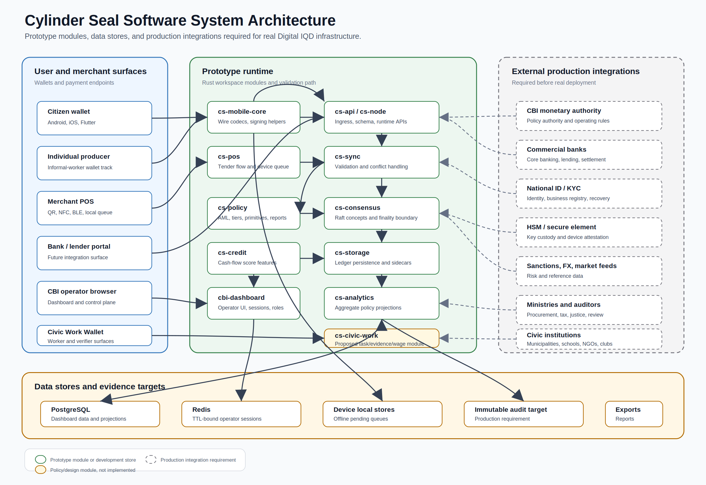

## Unified Economic Model

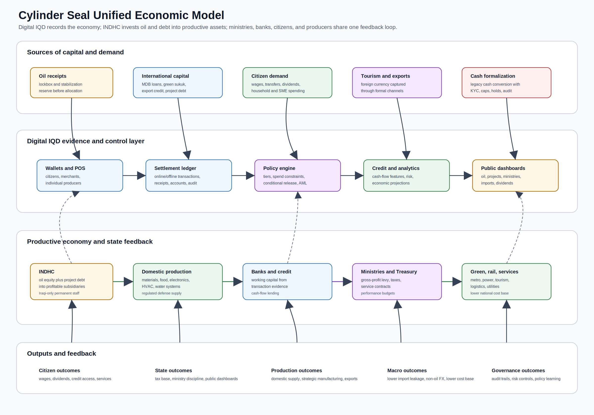

## Transaction Lifecycle

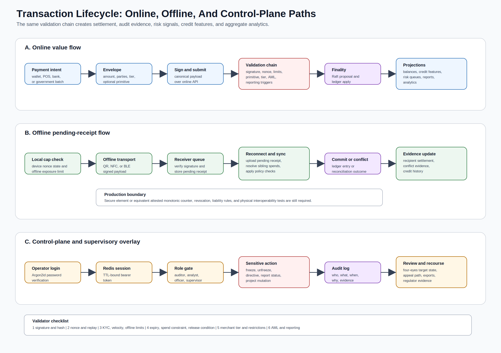

## Financial Flow Combinations

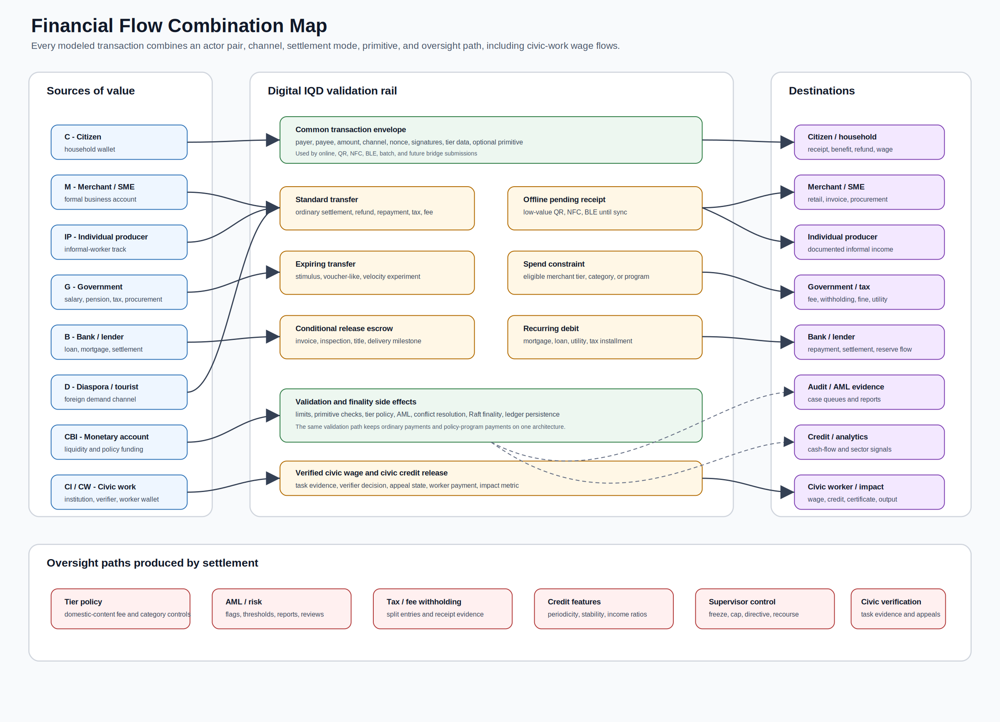

## Transaction Combination Matrix

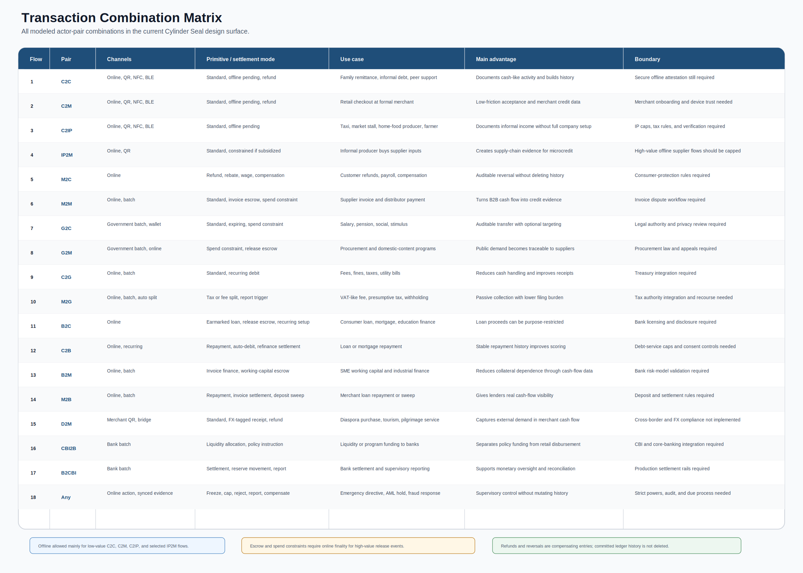

## National Dividend Holding Company

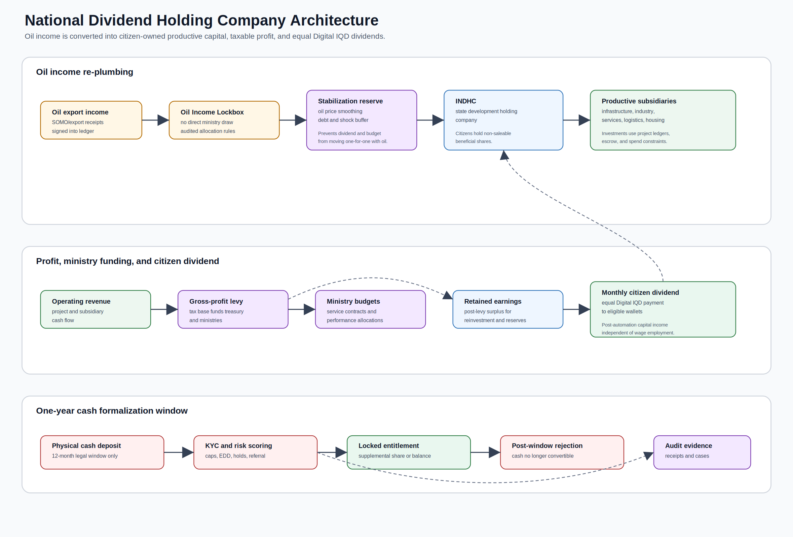

## National Civic Work System

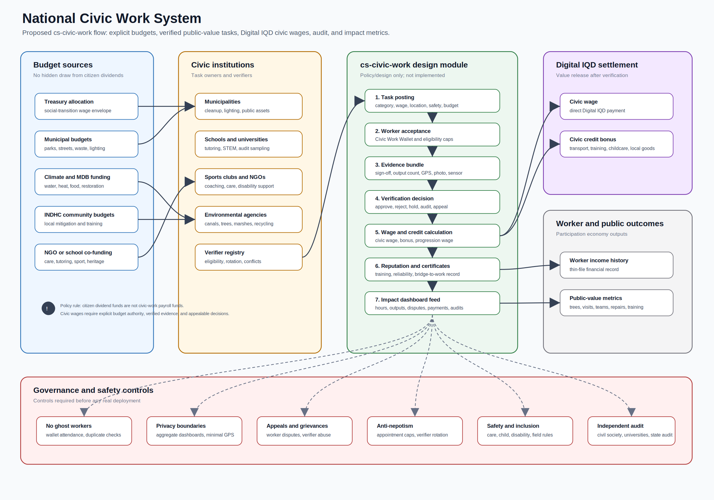

## Business Value Chain Overview

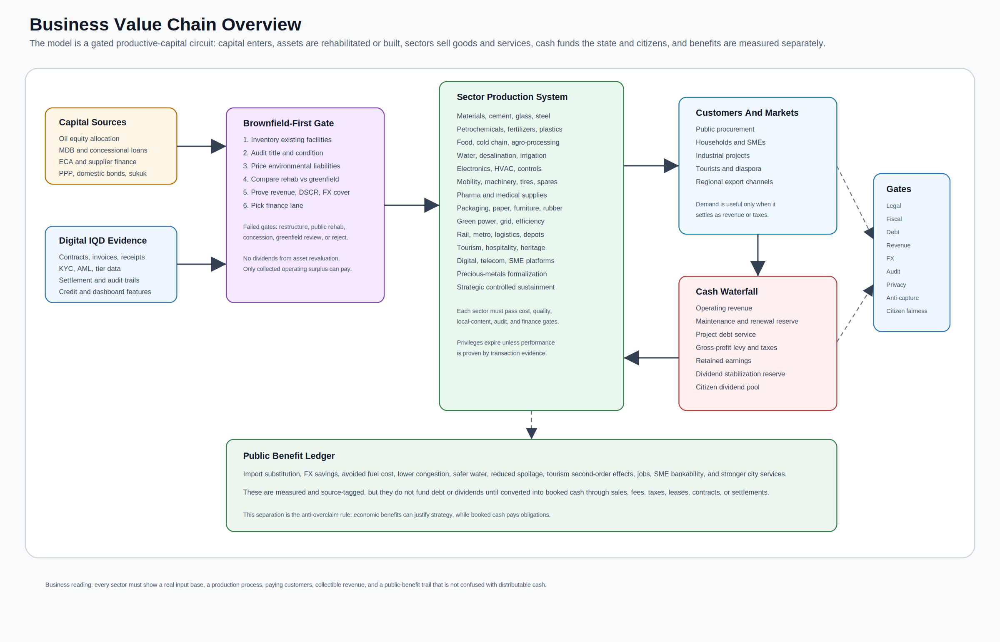

## Sector Value Chain Matrix

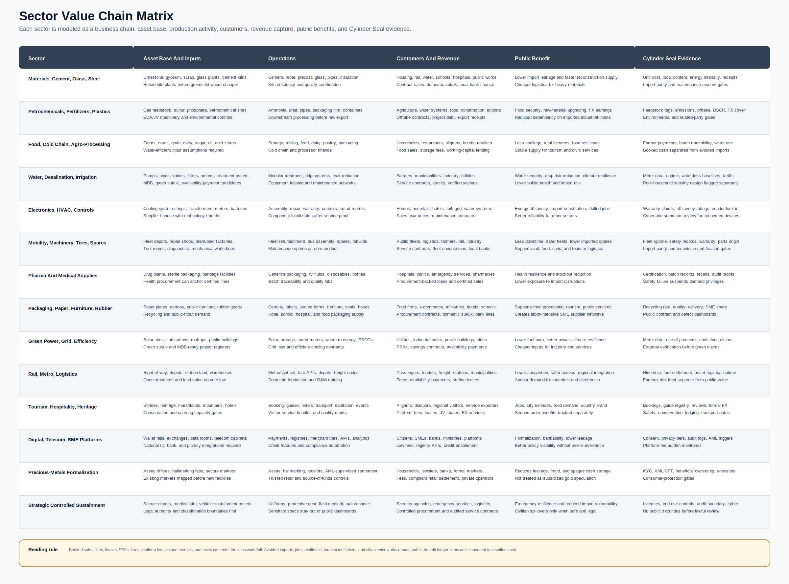

## Capital And Repayment Lanes

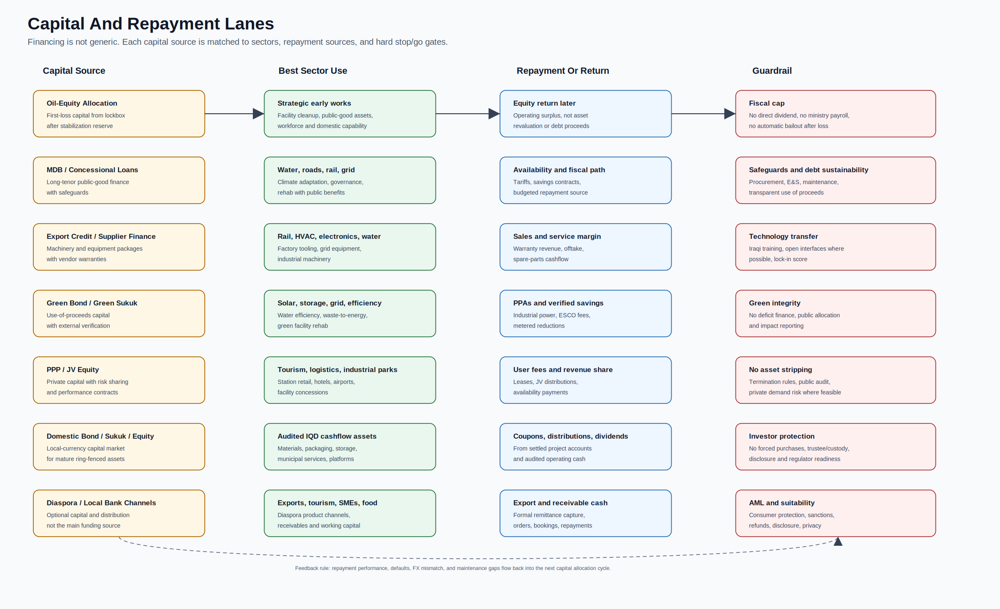

## Society And Economy Feedback Loop

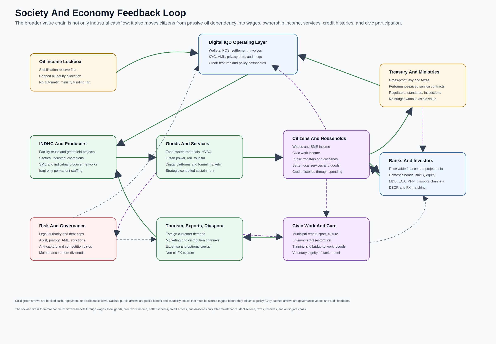

# Part 1: Project Overview

## Cylinder Seal

Economic, environmental, social, and cultural operating model for Iraq.

Cylinder Seal is primarily a national economic-system proposal: a way to
convert oil income, project finance, existing Iraqi facilities, Iraqi labor,
domestic production, tourism, civic works, culture, and environmental repair
into auditable cashflows and public benefits.

The main subject is the economy. Oil income becomes productive capital; domestic
industry, services, tourism, infrastructure, finance, and civic work create
measured value; ministries are funded through explicit taxes, levies, and
service contracts; citizens benefit through wages, services, credit access,
civic-work income, and equal dividends from audited surplus.

The Cylinder Seal software sits behind that model as an evidence, settlement,
and analytics layer. It is included to test how contracts, payments, invoices,
local-content evidence, public transfers, tax flows, credit features, and
dashboards could be measured. The code is a pilot-grade prototype, not the main
claim of the repository. It is not production CBDC infrastructure, not an
official Central Bank of Iraq project, and not an externally validated
macroeconomic forecast.


### Economic Model

The front-door subject is the national economic cycle:

```text
Oil income and project finance
  -> productive Iraqi assets
  -> domestic goods, services, infrastructure, tourism, exports, and civic work
  -> booked cash plus source-tagged public benefits
  -> maintenance, debt service, Treasury levy, retained earnings
  -> citizen dividends only from audited distributable surplus
```

The model has six practical rules:

1. No cash claim without settled evidence.
2. No benefit claim without source-tagged measurement.
3. No capital allocation without legal, fiscal, debt, revenue, FX, maintenance,
   audit, privacy, and anti-capture gates.
4. No dividend from oil receipts, borrowing, asset revaluation, or estimated GDP
   effects.
5. Existing Iraqi facilities are screened before greenfield capex.
6. Digital IQD evidence exists to make the economy bankable and governable, not
   to overstate readiness.

### System Map

| Layer | Purpose | Main document |
| --- | --- | --- |
| Unified model | Connects Digital IQD, INDHC, ministries, banks, producers, tourism, green capital, rail, taxes, reinvestment, civic work, and dividends into one accounting structure. | [Unified economic model](docs/unified-economic-model.md) |
| Business value chains | Shows sector value chains, funding lanes, repayment paths, and society/economy feedback loops. | [Business value chain charts](docs/business-value-chain-charts.md) |
| Operating logic | Defines ledgers, hard gates, scorecards, waterfalls, cash/benefit conversion, capital allocation, dashboards, and escalation rules. | [National economic operating logic](docs/national-economic-operating-logic.md) |
| Legal roadmap | Maps the authority path for the oil lockbox, INDHC, citizen entitlements, Digital IQD, project debt, securities, privacy, emergency powers, federalism, and appeals. | [National legal and institutional roadmap](docs/national-legal-institutional-roadmap.md) |
| Project pipeline | Converts sector ambition into project families with capex, revenue source, DSCR, FX exposure, facility reuse, environmental, legal, and evidence gates. | [Project pipeline and investment gates](docs/project-pipeline-and-investment-gates.md) |
| Political economy | Models resistance, capture risk, reform coalition strength, service continuity, staff transition, procurement transparency, and pause/rollback rules. | [Political-economy transition and anti-capture model](docs/political-economy-transition-and-anti-capture.md) |
| Federalism equity | Controls governorate/regional authority, local compact readiness, needs-adjusted allocation fairness, local revenue/jobs/suppliers, grievance resolution, data publication, audit, appeals, and land/water/heritage disputes. | [Federalism, governorate equity, and local compacts](docs/federalism-governorate-equity-and-local-compacts.md) |
| Environmental and social safeguards | Blocks or redesigns projects when water, pollution, marshland, biodiversity, heritage, resettlement, safety, maintenance, remediation, monitoring, audit, or accessibility gates fail. | [Environmental, social, water, and cultural safeguards](docs/environmental-social-cultural-safeguards.md) |
| Fiscal stress | Tests oil-equity caps, stressed DSCR, FX mismatch, maintenance gaps, guarantees, collection weakness, capex overruns, and dividend affordability under downside cases. | [Fiscal stress and contingent liability model](docs/fiscal-stress-and-contingent-liability-model.md) |
| Program sequencing | Decides whether each domain is not ready, evidence-only, pilot, build, controlled scale, or hold/rollback based on dependencies and gates. | [National program sequencing and dependency control](docs/national-program-sequencing-and-dependency-control.md) |
| Procurement integrity | Controls beneficial ownership, competition depth, price benchmarks, single-source justification, contract variations, milestone evidence, payment discipline, quality, and SME participation. | [Procurement integrity and market discipline](docs/procurement-integrity-and-market-discipline.md) |
| Benefit realization | Audits whether claimed cashflows, public benefits, avoided costs, service outcomes, and dividends are measured, attributable, audited, and correctly classified. | [Benefit realization and claim audit](docs/benefit-realization-and-claim-audit.md) |
| Public-finance architecture | Proposes an oil-income lockbox, citizen beneficial shares, ministry-funding feedback, cash formalization controls, and Digital IQD dividends. | [National dividend holding company](docs/national-dividend-holding-company.md) |
| Ten-year productive plan | Maps import substitution, profitable subsidiaries, strategic resilience, electronics, HVAC, water, irrigation, food, tourism, green capital, rail, raw-material processing, and Iraqi-only staffing. | [INDHC ten-year plan](docs/indhc-10-year-plan.md) |
| Affordability and cashflow | Uses IMF-baseline constraints to distinguish fiscal-safe, constrained-base, and strategic-upper envelopes. | [Iraq quantified affordability model](docs/iraq-quantified-affordability-model.md) |
| Growth and benefits | Quantifies scenario paths for non-oil growth, infrastructure, environmental, social, cultural, and dividend benefits. | [Growth model](docs/iraq-integrated-growth-impact-model.md), [benefits model](docs/iraq-comprehensive-benefits-model.md) |
| Facility recycling | Screens underutilized Iraqi assets before greenfield builds and maps international credit, PPP, domestic bond/sukuk/equity, local-bank, and diaspora finance lanes. | [Facility recycling and capital markets](docs/facility-recycling-and-capital-markets.md) |
| Import, services, diaspora | Adds missing import screens, attraction-based service production, and diaspora income, expertise, capital, marketing, and distribution channels. | [Import, services, and diaspora expansion](docs/import-services-diaspora-expansion.md) |
| Industrial champions | Reframes the industrial-group idea as sectoral Iraqi production champions with conditional demand, credit, export discipline, competition gates, and anti-capture controls. | [Digitally governed industrial champions](docs/digitally-governed-industrial-champions.md) |
| Civic work | Defines verified public-value work, training, care, environmental restoration, sport, culture, municipal repair, and disaster resilience. | [National civic work system](docs/national-civic-work-system.md) |
| Ministry transition | Lists candidate functions to deprecate, merge, regulate, corporatize, or sunset after legal, service-continuity, staff, and audit gates pass. | [Ministry transition roadmap](docs/ministry-transition-roadmap.md) |

### Business Charts

The strategy is visualized as business chains rather than only policy prose:

| Chart | What it demonstrates |
| --- | --- |
| [Business value chain overview](docs/diagrams/business-value-chain-overview.svg) | How capital, Digital IQD evidence, facility reuse, sectors, markets, cash waterfalls, public benefits, and risk gates connect. |
| [Sector value chain matrix](docs/diagrams/sector-value-chain-matrix.svg) | Asset base, operations, customers, revenue, public benefit, and evidence controls for every current sector. |
| [Capital and repayment lanes](docs/diagrams/capital-and-repayment-lanes.svg) | Which sources of capital fit which sectors and how repayment or return works. |
| [Society and economy feedback loop](docs/diagrams/society-economy-feedback-loop.svg) | How citizens benefit through wages, local goods, civic work, public services, credit histories, and dividends from audited surplus. |
| [System and financial flow diagrams](docs/system-and-financial-flow-diagrams.md) | End-to-end financial-flow combinations, with software architecture treated as an implementation appendix. |

### Current Status

| Status | Scope |
| --- | --- |
| Economic-system front door | Unified economic architecture, business value-chain charts, source discipline, legal/institutional roadmap, political-economy controls, project pipeline, affordability framing, ministry transition, civic work, facility recycling, industrial champions, tourism, diaspora channels, domestic capital markets, and long-horizon benefit scenarios. |
| Governance and cashflow model | Oil-income lockbox, capital allocation gates, treasury levy, debt-service waterfalls, retained earnings, audited dividend constraints, ministry feedback mechanisms, and citizen benefit channels. |
| Sector production model | Import substitution, profitable domestic subsidiaries, defence manufacturing, electronics, HVAC, water desalination, irrigation, food substitution, raw-material post-processing, Open Source Rail, green technology, tourism, services, and cultural production, reduced to project families before capital allocation. |
| Evidence software appendix | Rust analytics modules, SQL tables, payment-rail primitives, dashboard routes, and tests exist only to demonstrate how the economic model could be measured and audited. |
| Not production-ready | Real CBDC issuance, national identity/KYC integration, HSM or secure-element custody, audited offline double-spend prevention, live multi-peer deployment, CBI/core-banking integration, privacy review, disaster recovery, and independent economic validation. |

The repo is suitable first for policy review, economic-model critique, and
scenario debate. The software appendix can support demo workflows and technical
review, but it should not be represented as ready for national-scale deployment
or as a validated investment program.

### Source Discipline

The front README intentionally does not present national-scale deployment
timelines, sovereign-rating upgrade paths, diaspora capital figures, or Year 5
benefit ranges as project deliverables. Scenario figures belong only in the
source-disciplined documents with explicit caveats and independent-validation
requirements.

Current public facts that shape the framing:

- Iraq's final 2024 census count was reported at 46.1 million people, not the
  older approximately 43 million baseline used in earlier drafts. Source:
  [AP, Feb. 24, 2025](https://apnews.com/article/iraq-census-final-count-45b7753ddc82c188c79faea0d5a8c90d).
- Iraq's National Financial Inclusion Strategy 2025-2029 targets account
  ownership of 50% by 2030 and digital payment usage of 85%. Sources:
  [CBI NFIS PDF](https://cbi.iq/static/uploads/up/file-175032973296039.pdf),
  [Arab Monetary Fund](https://www.amf.org.ae/en/news/25-05-2025/iraq-launches-national-financial-inclusion-strategy-2025-2029).
- On June 12, 2026, S&P affirmed Iraq at `B-/B`, removed the long-term rating
  from CreditWatch negative, and kept a negative outlook. Source:
  [S&P Global Ratings](https://www.spglobal.com/ratings/en/regulatory/article/-/view/type/HTML/id/3580473).
- Public sources continue to describe Iraq as highly oil-revenue-dependent and
  fiscally exposed to rigid spending and weak non-oil revenues. Sources:
  [EIA Iraq analysis](https://www.eia.gov/international/analysis/country/irq),
  [EITI Iraq country page](https://eiti.org/countries/iraq),
  [IMF Iraq 2025 Article IV](https://www.imf.org/-/media/files/publications/cr/2025/english/1irqea2025001-source-pdf.pdf).

See [Economic assumptions](docs/economic-assumptions.md) for source discipline
and current public facts.

### Production Readiness Boundary

Before this could be evaluated as real payment or economic infrastructure, the
project would need at minimum:

- legal authority for Digital IQD, INDHC, citizen entitlements, oil-income
  allocation, borrowing, securities issuance, privacy, and dispute resolution;
- a formal threat model for wallets, POS devices, offline settlement,
  super-peers, operator access, and emergency controls;
- hardware-backed key custody and recovery design;
- offline double-spend limits backed by secure monotonic counters or equivalent
  attestation;
- privacy architecture separating payment data, identity data, regulatory
  access, and aggregate economic analytics;
- real multi-node consensus deployment with operational runbooks and failover
  tests;
- project-level feasibility studies, debt-capacity analysis, procurement
  sequencing, and independent macroeconomic review;
- legal and institutional validation for the lockbox, INDHC, citizen shares,
  federal/governorate compacts, project finance, domestic securities, privacy,
  appeals, and emergency powers;
- independent security audit, compliance review, and economic model validation.

### Software Appendix

This is intentionally a back-of-README section. The software is not the main
policy claim; it is an evidence rail for testing whether the economic model can
be measured, audited, settled, and challenged without relying on narrative
claims alone.

The workspace is organized as focused Rust crates:

| Area | Crates and files |
| --- | --- |
| Core ledger models | `crates/cs-core`, `crates/cs-storage` |
| Sync and consensus | `crates/cs-sync`, `crates/cs-consensus`, `proto/chain_sync.proto` |
| Policy, AML, credit | `crates/cs-policy`, `crates/cs-credit`, `crates/cs-exchange`, `crates/cs-feeds` |
| APIs and node runtime | `crates/cs-api`, `crates/cs-node` |
| POS and mobile surfaces | `crates/cs-pos`, `crates/cs-mobile-core`, `android/`, `ios/` |
| CBI-style dashboard and analytics | `crates/cbi-dashboard`, `crates/cs-analytics` |
| Specification tests | `crates/cs-tests` |

Technical review entry points:

- [Technical primitives](docs/technical-primitives.md) maps offline payments,
  double-spend checks, wire-format primitives, Raft, key handling, privacy, AML,
  and disaster recovery to code and remaining gaps.
- [Implementation status](IMPLEMENTATION_STATUS.md) summarizes current prototype
  scope and important gaps.
- [Specification and fixture results](SPECIFICATION_AND_FIXTURE_RESULTS.md) and
  [cs-tests README](crates/cs-tests/README.md) describe test evidence and missing
  live PostgreSQL/Redis coverage.
- [API reference](API_REFERENCE.md) documents dashboard endpoints.
- [Security model](SECURITY.md) lists threat areas and production requirements.

### Software Appendix: Scenario Analytics

The `cs-analytics` crate carries executable planning primitives for parts of
the economic model. These are scenario engines, not calibrated national
forecasts.

| Model | Code | Migration |
| --- | --- | --- |
| Economic operating kernel | `crates/cs-analytics/src/economic_operating.rs` | `migrations/20260702000001_economic_operating_kernel.sql` |
| Sovereign holding capital plan | `crates/cs-analytics/src/sovereign_holding.rs` | `migrations/20260703000001_sovereign_holding_capital_plan.sql` |
| Economic cycle and citizen income | `crates/cs-analytics/src/economic_cycle.rs` | `migrations/20260704000001_economic_cycle_projection.sql` |
| Integrated growth impact | `crates/cs-analytics/src/growth_impact.rs` | `migrations/20260705000001_growth_impact_projection.sql` |
| Comprehensive benefits | `crates/cs-analytics/src/comprehensive_benefits.rs` | `migrations/20260706000001_comprehensive_benefits_projection.sql` |
| Production capacity and import substitution | `crates/cs-analytics/src/production_capacity.rs` | `migrations/20260707000001_production_capacity_projection.sql` |
| Strategic resilience | `crates/cs-analytics/src/strategic_resilience.rs` | `migrations/20260708000001_strategic_resilience_projection.sql` |
| Tourism and tradable services | `crates/cs-analytics/src/tourism_services.rs` | `migrations/20260709000001_tourism_services_projection.sql` |
| Diaspora channels | `crates/cs-analytics/src/diaspora_channels.rs` | `migrations/20260710000001_diaspora_channels_projection.sql` |
| Facility recycling and capital markets | `crates/cs-analytics/src/facility_recycling.rs` | `migrations/20260711000001_facility_recycling_projection.sql` |
| Political-economy transition and anti-capture | `crates/cs-analytics/src/political_economy.rs` | `migrations/20260712000001_political_economy_transition.sql` |
| Fiscal stress and contingent liabilities | `crates/cs-analytics/src/fiscal_stress.rs` | `migrations/20260713000001_fiscal_stress_projection.sql` |
| Program sequencing and dependencies | `crates/cs-analytics/src/program_sequencing.rs` | `migrations/20260714000001_program_sequencing.sql` |
| Benefit realization and claim audit | `crates/cs-analytics/src/benefit_realization.rs` | `migrations/20260715000001_benefit_realization_claim_audit.sql` |
| Procurement integrity and market discipline | `crates/cs-analytics/src/procurement_integrity.rs` | `migrations/20260716000001_procurement_integrity.sql` |
| Federalism, governorate equity, and local compacts | `crates/cs-analytics/src/federalism_equity.rs` | `migrations/20260717000001_federalism_equity_compact.sql` |
| Environmental, social, water, and cultural safeguards | `crates/cs-analytics/src/environmental_social_safeguards.rs` | `migrations/20260718000001_environmental_social_safeguards.sql` |

### Developer Appendix: Local Software Demo

Install Rust and Docker if you want to run the dashboard stack locally. The
dashboard currently uses PostgreSQL and Redis. POS-local SQLite remains only for
the device-side terminal store, not for the dashboard runtime.

```bash
## Start PostgreSQL and Redis.
cp .env.example .env
docker compose up -d

## Build the main dashboard package.
cargo build --package cbi-dashboard

## Run the dashboard.
export DATABASE_URL="postgresql://postgres:${DB_PASSWORD:-change-me-dev-only}@localhost:5432/cylinder_seal"
cargo run --package cbi-dashboard
```

The dashboard defaults to `http://127.0.0.1:8081` when run locally. Demo
operators are seeded only for local development; see `.env.example` and
[API_REFERENCE.md](API_REFERENCE.md) before using them.

`docker-compose.yml` reads `DB_PASSWORD` from `.env` and falls back to
`change-me-dev-only` for local demos. Change all demo secrets before sharing,
deploying, or connecting real systems.

### Repository Hygiene

Local artifacts such as generated databases, Redis dumps, virtualenvs, local
env files, ad hoc logs, and build outputs are ignored. Do not commit generated
database state.


# Part 2: Executive Summary

## Cylinder Seal Executive Summary

**Contact:** Hayder Aziz, Modern EcoTech - hayder@modernecotech.com
**Repository:** internal / provided on request
**Status:** economic-system proposal with a pilot-grade evidence software
appendix. Not production CBDC infrastructure, not an official Central Bank of
Iraq project, and not a validated investment program.

---

### What It Is

Cylinder Seal is an economic, environmental, social, and cultural operating
model for Iraq. Its purpose is to turn oil income, project finance, domestic
facilities, Iraqi labor, tourism, culture, services, industrial production,
green infrastructure, and civic work into auditable cashflows and public
benefits.

The Digital IQD software prototype sits behind the economic model. It is an
evidence rail for testing how contracts, payments, invoices, tax flows,
local-content evidence, project milestones, civic-work proofs, credit features,
and public dashboards could be measured. The software is not the main claim of
the repository.

### The Problem It Addresses

The model is designed around eight linked Iraqi economic problems:

1. Oil income can act as an automatic funding source for ministries, weakening
   the feedback loop between public spending and productive economic results.
2. Domestic production is too often displaced by finished-goods imports, so oil
   revenue leaks back out through external supply chains.
3. SMEs, individual producers, and informal workers lack verified transaction
   histories that banks can use for cashflow lending.
4. Infrastructure gaps in power, water, logistics, transport, housing inputs,
   and urban services raise the cost base of the whole economy.
5. Tourism, culture, heritage, medical services, education services, and
   diaspora distribution channels are not yet treated as coordinated export and
   foreign-currency industries.
6. Productivity gains from automation, digitization, and industrial champions
   could displace low-productivity work unless a civic-work and training layer
   converts spare labor capacity into public value.
7. Public-benefit claims can become fiscal illusion unless cash revenue,
   avoided losses, second-order benefits, and distributable surplus are kept in
   separate ledgers.
8. Reform designs that look rational on a spreadsheet can fail if they ignore
   political capture, ministry resistance, staff transition, federal/governorate
   authority, public-service continuity, and citizen appeal rights.

### Core Operating Model

```text
Oil income and project finance
  -> productive Iraqi assets and services
  -> booked operating cash plus source-tagged public benefits
  -> maintenance, debt service, Treasury levy, retained earnings
  -> citizen dividends only from audited distributable surplus
```

The model rejects direct dividends from raw oil receipts, borrowing, asset
revaluation, or estimated GDP benefits. Citizens benefit through wages, public
services, credit access, civic-work income, lower system costs, and equal
dividends only after the portfolio produces audited surplus.

### Main Components

- **Oil Income Lockbox and INDHC:** a proposed national dividend holding-company
  architecture that converts a capped share of oil income into productive
  capital rather than automatic ministry funding.
- **Industrial champions:** sectoral Iraqi production groups with conditional
  demand, conditional credit, export discipline, competition gates, debt caps,
  local-content evidence, and anti-capture controls.
- **Constrained-base capital plan:** a USD 115B ten-year scenario is the
  default planning case under the IMF-baseline affordability discipline. USD
  190B is treated only as a strategic upper envelope after fiscal, debt, cashflow,
  and delivery gates are proven.
- **Project pipeline:** every sector must be reduced to project families with
  capex, opex, revenue source, DSCR, FX exposure, local-content target,
  facility-reuse status, environmental risk, legal authority, and audit evidence.
- **Political-economy gates:** reforms can move only through visibility, pilot,
  controlled transition, and scale modes when capture, resistance, coalition,
  service-continuity, staff-transition, federalism, and citizen-appeal gates
  pass.
- **Federalism and governorate-equity gates:** national programs can scale only
  when authority is mapped, local compacts exist, allocation variance is
  explained, local revenue/jobs/suppliers/benefits are visible, grievances and
  appeals work, and land/water/heritage disputes are resolved.
- **Environmental, social, water, and cultural safeguards:** projects are
  blocked, redesigned, limited to pilots, or held at evidence-only status when
  water budgets, pollution controls, marshland/biodiversity plans, heritage
  clearance, resettlement, livelihood restoration, safety, maintenance,
  remediation, monitoring, audit, or accessibility gates fail.
- **Fiscal stress gates:** scale-up and dividends stop when stressed oil-equity
  capacity, DSCR, FX cover, maintenance reserves, contingent liabilities,
  collections, capex overruns, or dividend affordability fail.
- **Program sequencing:** every domain is held at not-ready, evidence-only,
  pilot, build, controlled-scale, or hold/rollback until legal, data, audit,
  procurement, delivery, political, fiscal, service, and cashflow dependencies
  pass.
- **Procurement integrity:** awards and privileges are restricted, suspended,
  cancelled, or retendered when ownership, competition, pricing, contract
  changes, payment discipline, quality, or SME participation fails.
- **Benefit realization:** delivered-outcome claims require baseline, target,
  observed value, evidence quality, source confidence, attribution confidence,
  audit status, cash settlement, and dividend-boundary classification.
- **Tourism, services, and diaspora:** Iraq's natural, religious, historical,
  cultural, medical, education, and business-service assets are treated as
  service-production inputs, with diaspora channels used for demand, expertise,
  distribution, formal payments, tourism referrals, and optional capital.
- **Civic work:** productivity displacement is managed through verified paid
  work in municipal repair, care, education support, environmental restoration,
  sport, culture, disaster resilience, food security, and bridge-to-work
  training.
- **Legal and institutional roadmap:** the model requires enabling laws,
  federal/governorate compacts, CBI/payment authority decisions, Treasury rules,
  securities safeguards, privacy and audit authority, procurement controls, and
  citizen appeals before real deployment.

### What Exists In The Repository

- Source-disciplined economic model documents, business value-chain charts,
  affordability/cashflow models, growth and benefits scenarios, ministry
  transition logic, facility-recycling screens, capital-market lanes, and
  diaspora/service expansion logic.
- A Rust analytics crate with scenario primitives for the economic operating
  kernel, sovereign holding plan, economic cycle, growth impact, comprehensive
  benefits, production capacity, strategic resilience, tourism services,
  diaspora channels, facility recycling, political-economy transition
  readiness, federalism/governorate equity, environmental/social safeguards,
  fiscal stress, program sequencing, benefit realization, and procurement
  integrity.
- A pilot-grade Digital IQD software appendix covering transaction models,
  signing primitives, policy modules, POS/mobile codecs, dashboard routes,
  PostgreSQL migrations, Redis sessions, and specification tests.

### What Is Not Proven

- Legal authority for the Oil Income Lockbox, INDHC, citizen entitlement shares,
  ministry funding transition, Digital IQD, project borrowing, securities
  issuance, privacy, audit powers, or dispute resolution.
- Independent macroeconomic validation, project finance review, debt-capacity
  analysis, procurement sequencing, or sector-level feasibility studies.
- Independent debt-sustainability and contingent-liability review of guarantees,
  availability payments, FX mismatch, collection risk, and dividend
  affordability.
- Independent federalism, governorate, municipal, KRG/regional, land, water,
  grievance, heritage, and environmental validation of any local compact or
  allocation rule.
- Independent environmental, social, water, heritage, biodiversity, resettlement,
  livelihood, safety, remediation, monitoring, and accessibility validation for
  any project that claims to be bankable or scalable.
- Independent program-management review of sequencing, dependency ownership,
  operator readiness, milestone realism, pilot scope, citizen consultation, and
  rollback authority.
- Independent procurement-law, open-contracting, beneficial-ownership,
  price-benchmarking, supplier-market, and audit validation.
- Independent monitoring, evaluation, and audit review before any scenario
  output becomes a delivered-outcome claim.
- Independent political-economy validation, including real actor incentives,
  veto points, anti-capture enforcement capacity, federal/governorate authority,
  civil-service transition, and citizen legitimacy.
- Production-grade CBDC/payment infrastructure: national identity/KYC
  integration, HSM or secure-element custody, audited offline double-spend
  prevention, real multi-peer deployment, CBI/core-banking integration, privacy
  review, disaster recovery, and independent security audit.

### Review Questions

1. Are the legal and institutional gates complete enough for a sovereign reader?
2. Are the capital envelopes, DSCR rules, FX rules, and dividend gates
   conservative enough under Iraq's fiscal baseline?
3. Which sector project families should be removed, delayed, or repriced before
   any external presentation?
4. Which governorate, KRG, municipal, or citizen-appeal risks are still missing?
5. Which public-benefit claims need stronger source labels, confidence levels,
   or independent validation before being shown outside the repo?

Not seeking: procurement conversations, claims of official endorsement, or
representation that this is production-ready infrastructure.


# Part 3: Final Summary

## Cylinder Seal Summary

### Status

Cylinder Seal is an economic-system proposal for Iraq with a pilot-grade Digital
IQD evidence and analytics appendix. It is not production-ready CBDC/payment
infrastructure, not an official Central Bank of Iraq project, and not a
validated investment program.

Current posture:

- **Economic model:** documented as a unified operating architecture for oil
  income, productive capital, domestic industry, tourism, services, civic work,
  ministry funding, credit, public benefits, and citizen dividends.
- **Cashflow discipline:** modeled through capital, productive asset, booked
  cash, public benefit, distribution, and risk ledgers so public benefits are
  not confused with distributable cash.
- **Political-economy discipline:** modeled through explicit capture,
  resistance, coalition, service-continuity, staff-transition, federalism,
  emergency-power, and citizen-appeal gates before reforms can scale.
- **Federalism discipline:** modeled through authority mapping, governorate or
  regional compacts, allocation-gap checks, local revenue/jobs/suppliers,
  grievance resolution, audit, appeals, and land/water/heritage dispute gates.
- **Safeguard discipline:** modeled through water, pollution, climate,
  marshland/biodiversity, heritage, resettlement, livelihood, consultation,
  grievance, safety, maintenance, remediation, monitoring, audit, waste, and
  accessibility gates.
- **Stress discipline:** modeled through oil-equity caps, stressed DSCR, FX
  mismatch, maintenance gaps, guarantees, availability payments, collections,
  capex overruns, and dividend-affordability gates.
- **Sequencing discipline:** modeled through not-ready, evidence-only, pilot,
  build, controlled-scale, and hold/rollback phases for each domain.
- **Procurement discipline:** modeled through ownership, competition, price,
  contract-variation, evidence, delivery, payment, quality, and SME gates before
  awards or privileges proceed.
- **Outcome discipline:** modeled through benefit-realization reports that
  classify claims as verified, track-only, in-progress, underperforming,
  overstated, failed, or unsupported.
- **Affordability:** USD 65B fiscal-safe and USD 115B constrained-base scenarios
  are the credible starting envelopes; USD 190B is a strategic upper envelope
  only after fiscal, debt, cashflow, governance, and delivery gates pass.
- **Software appendix:** Rust crates, dashboard routes, migrations, and tests
  demonstrate how evidence, settlement, analytics, and policy controls might be
  measured. They are not production infrastructure.
- **Security:** threat model and production controls are documented as
  requirements in `SECURITY.md`; they are not complete.

### What Exists

- Economic-system documentation connecting Digital IQD evidence, INDHC capital
  allocation, oil-income lockbox rules, ministry feedback, credit expansion,
  domestic production, strategic resilience manufacturing, tourism/exports,
  green/rail cost reduction, civic work, reinvestment, and citizen dividends.
- Business value-chain diagrams covering sector chains, capital and repayment
  lanes, and society/economy feedback loops.
- Quantified affordability and cashflow models separating fiscal-safe,
  constrained-base, and strategic-upper capital envelopes.
- Growth and long-horizon benefit scenario models for infrastructure, industry,
  Open Source Rail, green power, food/water systems, tourism, Digital IQD
  formalization, civic work, environmental repair, and cultural production.
- Policy documentation for a proposed National Dividend Holding Company:
  oil-income lockbox, citizen non-saleable beneficial shares, ten-year
  industrial/infrastructure plan, gross-profit levy for Treasury and ministries,
  and equal Digital IQD dividend distribution from audited surplus.
- Ministry transition roadmap for deprecating, merging, regulating,
  corporatizing, or sunsetting low-feedback ministry functions only after legal,
  service-continuity, staff-transition, and audit gates.
- National Civic Work System policy architecture for turning productivity
  displacement into verified Digital IQD civic wages, training records, care,
  environmental restoration, sport, culture, municipal repair, and
  disaster-resilience work.
- Facility-recycling and capital-market logic for screening underutilized Iraqi
  assets before greenfield capex and attracting international credit, PPP/JV
  capital, local bank finance, domestic sukuk/bonds/equity, and diaspora
  co-investment only through audited project vehicles.
- Political-economy transition and anti-capture logic that can force a reform
  into visibility-only, pilot, pause, rollback, or redesign even when the
  financial case is attractive.
- Federalism, governorate-equity, and local-compact logic that blocks national
  scale-up when authority, allocation, local benefit capture, grievances,
  appeals, audit, or land/water/heritage issues are unresolved.
- Environmental, social, water, and cultural safeguard logic that blocks,
  redesigns, or limits projects when externalized harm, missing clearances,
  unfunded maintenance/remediation, weak monitoring, or unresolved community
  risks would make the economics misleading.
- Fiscal stress and contingent-liability logic that can force defensive or
  stop-scale-up mode when shocks make dividends, guarantees, FX debt, or new
  capex unsafe.
- Program sequencing logic that blocks domains from jumping to scale before
  legal, baseline, audit, procurement, delivery, political, fiscal, service, and
  cashflow dependencies pass.
- Procurement integrity logic that can restrict, suspend, cancel, or retender
  awards and industrial privileges when market-discipline gates fail.
- Benefit-realization logic that keeps public benefits out of dividend
  waterfalls and removes overstated or failed claims from front-door summaries.
- Rust workspace with core models, storage, API, policy, AML, credit, consensus,
  sync, POS, mobile-core, analytics, and dashboard crates.
- PostgreSQL-backed dashboard routes, Redis-backed session storage, Argon2id
  password hash verification, and admin action audit recording for current
  sensitive handlers.
- Specification tests covering crypto primitives, signing, nonce chains, Raft
  behavior, AML, credit scoring, wire formats, conflict resolution,
  programmability primitives, and tier policy behavior.

### What Is Not Proven Yet

- Legal authority for Digital IQD, INDHC, citizen share entitlements,
  oil-income allocation, ministry funding transition, securities issuance,
  privacy boundaries, emergency powers, procurement controls, and appeals.
- Independent macroeconomic validation, audited baselines, calibrated equations,
  project-level feasibility studies, debt-capacity analysis, procurement
  sequencing, and sensitivity testing.
- Real endpoint/database integration coverage across all dashboard routes.
- Production-grade role enforcement on every sensitive route.
- Full browser-session hardening beyond the current cookie/CSRF foundation.
- HSM or secure-element key custody.
- Audited offline double-spend prevention.
- National identity/KYC integration.
- Real multi-peer consensus deployment and recovery testing.
- Immutable audit-log storage and regulator evidence-pack workflows.
- Independent constitutional, administrative-law, labor, federalism,
  service-continuity, AML/CFT, competition, privacy, disability-access, and
  anti-corruption review for the economic model.
- Independent political-economy validation that maps real actors, incentives,
  veto points, coercive risks, governorate authority, citizen trust, and
  implementation capacity.
- Independent local-compact validation using official authority maps,
  governorate/KRG/municipal input where applicable, real needs data, grievance
  records, and land/water/environment/heritage status.
- Independent environmental/social validation using field studies, regulator
  approvals, water budgets, heritage clearance, biodiversity and marshland
  review, resettlement/livelihood plans, safety systems, remediation estimates,
  monitoring evidence, and accessibility review.
- Independent fiscal stress validation of oil-equity caps, project debt,
  contingent liabilities, guarantees, availability payments, FX exposure,
  collection efficiency, maintenance reserves, and dividend rules.
- Independent sequencing validation that turns the model into a realistic
  rollout with owners, pilot limits, milestones, public consultation, operator
  readiness tests, and rollback authority.
- Independent procurement validation using real bid data, ownership registries,
  price benchmarks, supplier-market data, sanctions/PEP feeds, protest records,
  and payment history.
- Independent monitoring, evaluation, and audit validation for any claim that is
  presented as delivered rather than modelled.

### Development Stack

```bash
cp .env.example .env
docker compose up -d
export DATABASE_URL="postgresql://postgres:${DB_PASSWORD:-change-me-dev-only}@localhost:5432/cylinder_seal"
cargo run --package cbi-dashboard
```

Use local demo operators only for development. Replace all seeded operator
hashes and all placeholder secrets before sharing, staging, or deploying.

### Credible Positioning

Use this language externally:

> Cylinder Seal is a source-disciplined proposal for an Iraqi economic operating
> model, with a pilot-grade Digital IQD evidence and analytics prototype used to
> test how cashflows, public benefits, policy controls, and citizen dividends
> could be measured.

Avoid this language:

> Production-ready national digital dinar infrastructure.

Also avoid:

> A guaranteed national growth plan, official CBI project, or validated
> investment program.

### Next Readiness Work

1. Add a full legal and institutional validation package.
2. Convert the sector plan into a project-level pipeline with capex, opex,
   revenue, DSCR, FX exposure, facility-reuse status, environmental gates, and
   responsible public authority.
3. Validate policy/economic scenarios with cited sources and independent review.
4. Add real dashboard route integration tests against PostgreSQL and Redis.
5. Enforce role-based authorization consistently.
6. Add CSRF/session hardening for browser flows.
7. Implement and test immutable audit logging.


# Part 4: Economic Assumptions And Source Discipline

## Economic Assumptions And Source Discipline

The economic narrative is the strongest part of Cylinder Seal, but it must be presented as an illustrative model until every number is independently sourced, dated, and stress-tested.

### Current Public Facts To Use

| Topic | Current framing | Source |
| --- | --- | --- |
| Population | Use the final 2024 census count of 46.1 million as the latest official census baseline. Avoid the older approximately 43 million figure in external summaries. | [AP, Feb. 24, 2025](https://apnews.com/article/iraq-census-final-count-45b7753ddc82c188c79faea0d5a8c90d) |
| Financial inclusion | Iraq's NFIS says inclusion is low, with cited ranges around 11% to 19% depending on the data source. It also notes persistent cash use and weak credit infrastructure. | [CBI NFIS PDF](https://cbi.iq/static/uploads/up/file-175032973296039.pdf) |
| NFIS targets | Iraq's 2025-2029 strategy targets 50% adult bank or digital account ownership by 2030 and 85% digital payment usage. | [Arab Monetary Fund, May 25, 2025](https://www.amf.org.ae/en/news/25-05-2025/iraq-launches-national-financial-inclusion-strategy-2025-2029), [AFI](https://afi-global.org/news/iraq-launches-national-financial-inclusion-strategy-2025-2029/) |
| Credit infrastructure | The NFIS states that the credit reporting system covers only 1.3% of adults, below the MENA average cited in the strategy. | [CBI NFIS PDF](https://cbi.iq/static/uploads/up/file-175032973296039.pdf) |
| Sovereign rating | On June 12, 2026, S&P affirmed Iraq at `B-/B`, removed the long-term rating from CreditWatch negative, and kept a negative outlook. Do not describe the rating as still on CreditWatch negative after that date. | [S&P Global Ratings, Jun. 12, 2026](https://www.spglobal.com/ratings/en/regulatory/article/-/view/type/HTML/id/3580473) |
| Oil-revenue dependence | Current framing may state that Iraq remains highly dependent on oil revenue, but exact percentages must be dated and sourced. | [EIA Iraq analysis](https://www.eia.gov/international/analysis/country/irq), [EITI Iraq country page](https://eiti.org/countries/iraq) |
| Fiscal rigidity and non-oil revenue | Current framing may state that IMF staff have highlighted rigid fiscal spending, subdued non-oil revenues, and vulnerability to lower oil prices. Do not treat any policy remedy as IMF-endorsed unless directly stated by the IMF. | [IMF Iraq 2025 Article IV](https://www.imf.org/-/media/files/publications/cr/2025/english/1irqea2025001-source-pdf.pdf), [IMF Iraq 2024 Article IV](https://www.imf.org/en/publications/cr/issues/2024/05/15/iraq-2024-article-iv-consultation-press-release-staff-report-and-statement-by-the-executive-549028) |

### How To Present Modeled Numbers

Every major economic number should carry four labels:

| Label | Meaning |
| --- | --- |
| Source | Where the baseline came from, with date and URL or document name. |
| Model step | The equation or assumption used to transform the baseline. |
| Confidence | High, medium, low, or illustrative. |
| Owner | Person or institution responsible for validating the figure before external use. |

Recommended language:

- "Illustrative model" for benefit projections, adoption curves, credit-rating pathways, GDP impacts, and import-substitution gains.
- "Pilot target" for near-term deployment goals.
- "Production dependency" for prerequisites such as national ID, CBI integration, HSM custody, and audited offline settlement.

Avoid language that implies certainty:

- National-scale deployment timelines should become pilot-to-scale hypotheses
  requiring regulatory approval, security audit, procurement, banking
  integration, operational testing, and public authority.
- Year-5 benefit ranges should become illustrative scenario outputs pending
  independent macroeconomic modeling, project finance review, and sensitivity
  testing.
- Financial inclusion improvement claims should reconcile baseline and target
  definitions with Iraq's NFIS and should not use informal older unbanked
  percentages without source notes.
- Sovereign-credit relevance may be discussed as an indirect fiscal-resilience
  hypothesis, but no rating outcome should be forecast as a project
  deliverable.
- Diaspora capital claims should be framed as merchant, tourism, service-export,
  and formal-payment-channel hypotheses unless backed by measured flow data.
- "Cylinder Seal is a complete economic operating system" should become "unified economic model proposal requiring legal authority, audited data, calibrated equations, policy review, and independent macroeconomic validation."
- "Cylinder Seal will abolish frivolous ministries" should become "ministry-transition scenario in which specific functions are deprecated, merged, regulated, corporatized, or sunset only after legal authority, service-continuity gates, staff-transition plans, and independent audits."
- "Oil income should fund a citizen-owned state industrial holding company" should become "proposed national dividend holding-company architecture requiring constitutional, fiscal, oil-revenue, AML/CFT, competition, and governance review."
- "The holding company will invest $190B over ten years" should become "strategic upper envelope requiring fiscal reform, oil-revenue stress testing, debt-capacity analysis, procurement sequencing, audited cashflow, and independent project finance review; the constrained-base front plan is USD 115B."
- "INDHC will make Iraq self-sufficient in defense, electronics, HVAC, water, irrigation, and food" should become "strategic resilience manufacturing objective requiring delivered-cost tests, quality certification, legal controls, supplier development, and security/procurement review."
- "INDHC will generate $43B in Year 10 revenue" should become "illustrative Year 10 consolidated revenue run-rate in the base-case cashflow model, requiring audited baseline demand, project-level feasibility studies, utilization assumptions, and downside sensitivity tests."
- The state-conglomerate shorthand should become "digitally governed sectoral industrial champions with conditional demand, conditional credit, export discipline, competition gates, debt caps, and anti-capture governance."
- "Automation and industrial champions will solve employment" should become "productivity gains may displace low-productivity work and require a verified civic-work, training, and bridge-to-employment system."

### Data Gaps To Close

- Updated Iraq population projection for 2026 from an official source, if a 2026 estimate is needed.
- Current CBI digital-payment adoption metrics and definitions.
- Government wage bill and public-transfer volumes by payment channel.
- Merchant acceptance and POS penetration by governorate.
- Informal employment and MSME counts by source and year.
- Import bill and sectoral import-substitution baselines.
- Bank credit to MSMEs, collateral requirements, and rejection rates.
- Official CBI or Ministry of Finance stance on any digital dinar or CBDC pilot.

### Recommended External Pitch

Use this positioning until the economic model is independently validated:

> Cylinder Seal is a source-disciplined proposal for an Iraqi economic operating
> model, with a pilot-grade Digital IQD evidence and analytics prototype used to
> test how cashflows, public benefits, policy controls, credit signals, public
> transfers, and citizen dividends could be measured.

That claim keeps the national economic model in front while preserving the
prototype boundary around the software.


# Part 5: National Economic Operating Logic

## National Economic Operating Logic

This document defines the management logic that holds the Cylinder Seal,
Digital IQD, INDHC, ministry-transition, industrial-champion, civic-work,
tourism, green, rail, and dividend model together.

Status: operating architecture. It is not a budget law, investment mandate,
central-bank rulebook, sovereign-debt recommendation, or production system.

### Core Principle

The whole system should be managed as a national productive-capital operating
system:

```text
No cash claim without settled evidence.
No benefit claim without source-tagged measurement.
No capital allocation without gates.
No dividend without audited distributable surplus.
No ministry funding without visible public value.
No strategic program without anti-capture controls.
No transition scale-up without political-economy readiness.
No national scale-up without governorate compact readiness.
No project scale-up without environmental, social, water, and cultural safeguards.
No scale-up under fiscal stress.
No scale before predecessor dependencies pass.
No award or privilege without procurement integrity.
No delivered-outcome claim without benefit-realization audit.
```

The purpose is to stop oil income from flowing directly into passive ministry
budgets while also avoiding a new opaque conglomerate. Oil, loans, PPP capital,
public procurement, tourism, civic work, and citizen dividends all become parts
of one managed circuit.

### One Operating Sentence

Cylinder Seal records economic events; INDHC and private producers turn capital
into productive assets; those assets generate cash, public benefits, resilience,
and citizen income; the operating logic decides which claims are cash, which are
benefits, which are risks, and which are eligible for reinvestment, ministry
funding, or dividends.

### The Six Ledgers

Every activity belongs to at least one ledger. The ledgers are separate because
mixing them is how overclaiming, double counting, and fiscal illusion begin.

| Ledger | What it records | Can fund debt or dividends? | Main controls |
| --- | --- | --- | --- |
| Capital ledger | Oil equity, concessional loans, green sukuk, ECA finance, PPP/JV equity, retained earnings, grants, local bonds. | No, not directly. | Fiscal cap, debt approval, source-of-funds tags, use-of-proceeds registry. |
| Productive asset ledger | Factories, rail assets, hotels, logistics hubs, power assets, water systems, platforms, intellectual property, service contracts. | No, not until they generate cash. | Asset registry, depreciation, maintenance reserve, ownership and custody records. |
| Booked cash ledger | Settled sales, leases, PPAs, availability payments, platform fees, service contracts, fares, exports, JV distributions, taxes, levies. | Yes, after waterfall rules. | Invoice-to-settlement matching, collection efficiency, audit trail, currency matching. |
| Public benefit ledger | Import substitution, avoided fuel cost, reduced grid losses, tourism second-order effects, jobs, SME bankability, city-service outcomes, resilience gains. | No, unless converted into booked cash. | Source tags, attribution method, confidence score, no-dividend flag. |
| Citizen and state distribution ledger | Wages, civic-work income, public transfers, ministry service payments, gross-profit levy, retained earnings, dividend batches. | It is the distribution layer. | Eligibility, equity, appeals, audit publication, privacy limits. |
| Risk, rights, and control ledger | AML/CFT flags, sanctions exposure, conflict of interest, related-party exposure, privacy tier, security status, project overruns, DSCR, FX mismatch. | No; it can veto. | Hard gates, escalation, suspension, independent audit, legal review. |

Management rule:

```text
Capital and public benefits can justify action.
Only booked cash can satisfy debt service, levies, retained earnings, and
dividends.
Risk can stop any flow.
```

### Canonical Economic Event

Cylinder Seal should treat each policy-relevant transaction or measurement as a
typed economic event.

```text
EconomicEvent
  = actor
  + counterparty
  + amount
  + currency
  + sector
  + governorate
  + contract or mandate
  + source of funds
  + source of revenue or benefit
  + evidence bundle
  + privacy tier
  + risk tags
  + audit hash
  + ledger impacts
```

Examples:

| Event | Ledger impacts |
| --- | --- |
| Oil-equity allocation to INDHC | Capital ledger increases; risk ledger checks fiscal cap. |
| Loan draw for a solar project | Capital ledger increases; risk ledger records currency, tenor, DSCR covenant. |
| Payment to a factory after milestone inspection | Capital ledger use decreases; productive asset ledger increases; risk ledger records procurement status. |
| Hotel JV distribution | Booked cash ledger increases; Treasury levy and retained earnings become possible. |
| Tourist spending at an SME restaurant | Booked merchant cash for the SME; public benefit ledger records tourism multiplier; INDHC cash only if a platform fee or contract exists. |
| Verified grid-loss reduction | Public benefit ledger increases; booked cash only if an approved savings contract settles. |
| Civic-work payment | Citizen distribution ledger increases after task evidence; public benefit ledger records municipal output. |
| Monthly citizen dividend | Distribution ledger increases only after debt service, levy, reserves, and retained earnings pass. |

### Management Cycle

The system should run on a formal operating calendar.

| Cadence | Decision work | Output |
| --- | --- | --- |
| Daily | Settlement, AML alerts, payment failures, offline reconciliation, operator exceptions. | Exception queue and settlement health. |
| Monthly | Close booked cash ledger, pay eligible service contracts, calculate levy, update debt service, test dividend gate. | Monthly operating statement and citizen-facing summary. |
| Quarterly | Review project milestones, DSCR, collection efficiency, capex overruns, local content, ministry service results, second-order benefits. | Portfolio reallocation, project stop/go decisions, public dashboard update. |
| Annual | Refresh macro assumptions, oil-equity cap, borrowing envelope, sector priorities, dividend formula, ministry transition schedule. | National economic operating plan and audited public report. |

The monthly cycle protects solvency. The quarterly cycle protects performance.
The annual cycle protects strategy.

### Portfolio Modes

The operating system should not use the same settings in every macro condition.

| Mode | Trigger | Capital behavior | Dividend behavior | Ministry behavior |
| --- | --- | --- | --- | --- |
| Defensive | Oil stress, rising debt stress, reserve pressure, weak collections, DSCR breach. | Freeze new non-critical capex; protect maintenance, water, food, power, debt service. | Suspend growth; pay only if fully funded by audited surplus. | Protect essential services; delay deprecation. |
| Build | Fiscal cap available, projects pass gates, collections improving. | Fund quick cashflow, import-substitution, water, power, food, and logistics projects. | Small or zero; prioritize proof. | Shift budgets into service contracts. |
| Scale | DSCR strong, revenue broad, delivery credible, governance clean. | Expand proven sectors; add PPP/JV and green capital. | Increase only after reserves and reinvestment. | Corporatize or merge functions with proven alternatives. |
| Dividend | Mature portfolio, high retained earnings, stable debt, strong maintenance coverage. | More renewal and reinvestment than new speculative capex. | Stable monthly payments from surplus. | Ministries funded mainly through explicit levy, taxes, and priced outputs. |

### Hard Gates

Hard gates run before scoring. If a project fails a hard gate, it does not move
forward no matter how attractive the narrative is.

| Gate | Pass condition |
| --- | --- |
| Legal authority | Statutory mandate, procurement authority, data authority, and dispute path exist. |
| Fiscal affordability | Oil-equity draw and public exposure fit the affordability rules. |
| Facility reuse | Existing Iraqi facilities have been screened before greenfield capex, or reuse failed title, engineering, environmental, revenue, DSCR, FX, maintenance, or investor-protection gates. |
| Debt safety | Base DSCR, stress DSCR, tenor, grace period, and currency match are acceptable. |
| Maintenance coverage | Lifecycle cost and renewal reserve are funded before dividends. |
| Revenue proof | Cashflow source is identified: sale, PPA, lease, fare, service contract, platform fee, export receipt, or lawful levy. |
| Benefit discipline | Second-order benefits are source-tagged and excluded from dividend cash. |
| Local capability | Iraqi staffing, training transfer, supplier upgrading, and handover plan exist. |
| Anti-capture | Related-party exposure, monopoly risk, PEP/sanctions risk, and procurement concentration are within limits. |
| Local compact readiness | Governorate, municipal, regional, or disputed-authority compact exists where required; allocation variance is explained; local revenue, jobs, suppliers, benefits, grievances, audit, appeals, and land/water/heritage issues are controlled. |
| Environmental and social safeguards | Water, pollution, climate, biodiversity, marshland, heritage, resettlement, livelihood, consultation, grievance, safety, maintenance, remediation, monitoring, audit, and accessibility gates pass. |
| Privacy and security | Data use, access controls, auditability, offline settlement, and operator powers meet the security model. |
| Citizen fairness | Dividends, civic work, transfers, and appeals are rules-based and auditable. |
| Political-economy readiness | Resistance, capture risk, coalition support, service continuity, staff transition, procurement transparency, competition control, federalism, and appeals support the proposed transition mode. |
| Fiscal stress | Oil-equity draw, stressed DSCR, FX cover, maintenance reserves, contingent liabilities, collection efficiency, capex overruns, and dividend affordability remain inside limits. |

### Portfolio Scoring

After hard gates, projects can be ranked with a transparent score. The weights
below are planning defaults, not law.

| Component | Weight | What it asks |
| --- | ---: | --- |
| Cash adequacy | 25% | Does the project generate collectible revenue after maintenance? |
| Fiscal relief | 15% | Does it fund Treasury, reduce subsidy pressure, or replace inefficient spending? |
| Import and FX effect | 15% | Does it reduce critical imports, earn foreign currency, or lower FX leakage? |
| Strategic resilience | 15% | Does it strengthen food, water, power, defense-controlled supply, electronics, HVAC, logistics, or health resilience? |
| Iraqi employment and capability | 10% | Does it create skilled Iraqi jobs and technical control? |
| Public service benefit | 10% | Does it improve city services, transport, safety, sanitation, productivity, or inclusion? |
| Citizen distribution potential | 10% | Does it raise future dividend capacity without starving maintenance or debt service? |

Negative modifiers:

- Capex overrun risk.
- Foreign-currency mismatch.
- Imported-input dependency.
- Water or energy stress.
- Monopoly or patronage risk.
- Weak audit evidence.
- High platform-fee burden on SMEs.

### Cash And Benefit Conversion Rules

Second-order benefits are useful for strategy, but they must cross a conversion
line before they become fiscal or dividend capacity.

| Benefit | Not cash when | Becomes booked cash when |
| --- | --- | --- |
| Import substitution | It is only an estimated avoided import. | A domestic sale, lease, service contract, or procurement settlement occurs. |
| Tourism multiplier | Visitors spend money at private merchants. | INDHC receives platform fees, leases, JV shares, ticketing, service contracts, or taxes/levies are settled. |
| Grid-loss reduction | Engineers estimate savings. | A verified savings contract, tariff adjustment, or budget transfer settles. |
| Rail land value | Property values rise near stations. | Lease, development charge, tax increment, concession, or revenue share is collected. |
| Civic work | A task is assigned. | Evidence is verified, appeals window passes, and payment is released. |
| SME bankability | Transaction history improves. | A loan is issued and repaid, or tax/fee settlement occurs. |
| Ministry performance | A ministry claims reform. | Service outputs are verified and tied to budget release or service payment. |

This is the most important anti-overclaim rule in the model.

### Waterfall Logic

Every operating subsidiary follows the same basic waterfall.

```text
Gross operating receipts
  - refunds, reversals, fraud losses
  - operating costs
  - maintenance and renewal reserve
  - project debt service
  - statutory risk reserve
  - gross-profit levy / tax
  - retained earnings allocation
  - dividend stabilization reserve
  = distributable surplus
```

The holding company may distribute only the consolidated surplus that remains
after all subsidiary and holding-company gates pass.

### Capital Allocation Logic

Capital allocation should proceed in this order:

1. Protect existing asset maintenance, safety, cybersecurity, and debt service.
2. Fund projects that preserve water, food, power, and critical logistics.
3. Rehabilitate existing facilities when reuse beats greenfield and bankability
   gates pass.
4. Fund projects with near-term booked cash and clear collection mechanisms.
5. Fund import-substitution and strategic-resilience projects with credible unit
   economics.
6. Fund tourism, services, and export platforms that bring non-oil demand.
7. Fund civic-work and workforce transitions that preserve social legitimacy.
8. Fund dividends only from audited surplus after reserves and retained
   earnings.

If a project or reform passes commercial scoring but fails political-economy
readiness, the correct action is visibility-only measurement, a smaller pilot,
pause, rollback, or redesign. A rational spreadsheet is not enough.

This order prevents a politically attractive dividend from consuming the capital
base that must produce future dividends.

### Governance Roles

| Body | Operating responsibility |
| --- | --- |
| Parliament | Passes legal mandate, debt limits, disclosure duties, dividend rules, emergency powers, and citizen rights. |
| CBI / payment authority | Supervises Digital IQD issuance, settlement, wallet limits, privacy boundaries, and payment-system resilience. |
| Treasury | Receives levy/tax revenue, funds ministries, reports fiscal exposure, and enforces debt limits. |
| INDHC board | Allocates capital, approves subsidiaries, enforces waterfall rules, and publishes portfolio accounts. |
| Portfolio risk committee | Can suspend disbursement, dividends, or borrowing when gates fail. |
| Sector boards | Manage industrial, tourism, rail, green, water, food, and platform subsidiaries under published mandates. |
| Ministries | Become policy owners, regulators, standard setters, or service buyers instead of automatic oil claimants. |
| Municipalities | Contract city services, tourism services, transport integration, and local maintenance with measurable outputs. |
| Banks | Lend against verified cashflows, receivables, and repayment history without political allocation. |
| Auditors and anti-corruption bodies | Review procurement, related parties, project accounts, source tags, and public dashboards. |
| Citizens | Receive equal dividends, see public dashboards, appeal entitlement errors, and benefit from services and jobs. |

### Data Model Surface

Cylinder Seal has now started representing this logic with explicit objects in
`crates/cs-analytics/src/economic_operating.rs` and persistence tables in
`migrations/20260702000001_economic_operating_kernel.sql`. This is an initial
kernel, not a complete national operating system.

| Primitive | Purpose |
| --- | --- |
| `EconomicOperatingPeriod` | Monthly, quarterly, and annual ledger close period. |
| `EconomicEvent` | Canonical event with amount, source, evidence, risk, and ledger impacts. |
| `LedgerImpact` | Links events to capital, asset, booked cash, public benefit, distribution, or risk ledgers. |
| `PortfolioMode` | Defensive, build, scale, or dividend mode with rule settings. |
| `HardGateResult` | Legal, fiscal, debt, revenue, benefit, local capability, security, and fairness checks. |
| `PortfolioScorecard` | Weighted project ranking after hard gates pass. |
| `BenefitAttribution` | Source-tagged estimate for import savings, tourism second-order effects, civic output, or city-service gains. |
| `CashBenefitConversion` | Records when a benefit becomes settled revenue, tax, fee, lease, or service payment. |
| `WaterfallStatement` | Subsidiary and holding-company distribution statement. |
| `CapitalAllocationDecision` | Board-approved movement of oil equity, loans, PPP capital, or retained earnings. |
| `DividendGateDecision` | Monthly eligibility, reserve, DSCR, audit, and distribution decision. |
| `PublicDashboardSnapshot` | Published aggregate view with confidence levels and privacy protection. |
| `GrowthImpactProjection` | Baseline, constrained-base, and strategic-upper non-oil growth paths from [Iraq Integrated Growth Impact Model](iraq-integrated-growth-impact-model.md). |
| `ComprehensiveBenefitProjection` | Long-horizon economic, infrastructure, environmental, social, and cultural benefit paths from [Iraq Comprehensive Benefits Model](iraq-comprehensive-benefits-model.md). |
| `ProductionCapacityProjection` | Domestic output, local content, quality, cost discipline, booked sales, verified import substitution, FX savings, and procurement-dependence gates. |
| `FacilityRecyclingProjection` | Underutilized facility reuse, greenfield-avoidance economics, DSCR, FX cover, international credit readiness, domestic capital-market readiness, and finance-lane gates. |
| `StrategicResilienceProjection` | Controlled-sector resilience, import-vulnerability reduction, critical spares, supplier diversification, end-use controls, and audit boundaries. |
| `TourismServiceClusterProjection` | Attraction-based service revenue, non-oil FX capture, local supplier demand, second-order benefit, visitor safety, conservation, and capacity gates. |
| `DiasporaChannelProjection` | Formal remittances, Iraqi-product demand, export distribution, expertise, investment pipeline, marketing attribution, and compliance gates. |
| `PoliticalEconomyProjection` | Capture risk, resistance pressure, coalition readiness, citizen legitimacy, transition readiness, and recommended transition mode. |
| `FederalismEquityAssessment` | Governorate/regional compact status, needs-adjusted allocation gap, local revenue/jobs/suppliers/benefits, grievances, authority risk, decision, and required actions. |
| `EnvironmentalSocialSafeguardAssessment` | Water risk, pollution risk, ecosystem/heritage risk, social risk, safeguard readiness, decision, and required actions. |
| `FiscalStressProjection` | Stressed oil-equity capacity, fiscal-rule breach, DSCR, FX mismatch, maintenance gap, contingent liability, dividend gap, and recommended stress mode. |
| `ProgramSequencingDecision` | Domain readiness, dependency completion, operating capacity, legitimacy, recommended phase, blocked dependencies, and next required actions. |
| `ProcurementIntegrityAssessment` | Competition, integrity, value-for-money, delivery, market-development, overall risk, decision, and required actions for awards and privileges. |
| `BenefitRealizationReport` | Claim achievement, target variance, evidence score, realization score, cash eligibility, public-benefit-only value, disposition, and corrective actions. |

Initial executable coverage:

- `LedgerKind` and `LedgerImpact` enforce that public benefits do not become
  distributable cash.
- `EconomicOperatingKernel::evaluate_hard_gates` checks the first legal,
  fiscal, debt, maintenance, revenue, benefit, local-capability, anti-capture,
  privacy/security, and citizen-fairness gates.
- `EconomicOperatingKernel::compute_waterfall` pays senior claims before
  distributable surplus.
- `EconomicOperatingKernel::decide_dividend` blocks dividends unless the
  waterfall is solvent, holding-company DSCR passes, and audit is complete.
- The new migration creates operating-period, assumption-set, event, impact,
  hard-gate, waterfall, capital-allocation, and dividend-gate tables.
- `crates/cs-analytics/src/sovereign_holding.rs` adds the first capital-plan
  layer: capital stacks, milestones, revenue streams, gross-profit levies,
  retained-earnings allocation, dividend distribution math, and holding-company
  governance gates. `migrations/20260703000001_sovereign_holding_capital_plan.sql`
  adds the corresponding persistence surface.
- `crates/cs-analytics/src/economic_cycle.rs` adds the first economic-cycle
  projection layer: capital formation, oil dependence, booked revenue, treasury
  revenue, citizen income, domestic recirculation, import leakage, non-oil FX,
  dividend revenue cover, cycle-quality warnings, and citizen-income math.
  `migrations/20260704000001_economic_cycle_projection.sql` adds the
  corresponding projection and gate tables.
- `crates/cs-analytics/src/growth_impact.rs` adds the first integrated
  non-oil growth-impact layer: baseline, constrained-base, and strategic-upper
  real-growth paths, sector contribution rows, additional GDP ranges, phase
  filtering, and claim-confidence controls. `migrations/20260705000001_growth_impact_projection.sql`
  adds projection, sector-contribution, and claim-audit tables.
- `crates/cs-analytics/src/comprehensive_benefits.rs` now produces
  comprehensive benefit-ledger statements for 2036, 2040, and 2050. It
  separates booked cash from real output, infrastructure capacity,
  environmental resilience, social capability, cultural tourism, and citizen
  distributions. `migrations/20260706000001_comprehensive_benefits_projection.sql`
  adds projection, benefit-ledger, and claim-audit tables.
- `crates/cs-analytics/src/production_capacity.rs` adds the first production
  capacity and import-substitution layer: utilization, local content, quality
  certification, delivered-cost discipline, booked domestic sales, verified
  import-substitution value, modelled FX savings, public-procurement
  dependence, and anti-protectionism gates. `migrations/20260707000001_production_capacity_projection.sql`
  adds projection, local-content, import-substitution-ledger, and gate tables.
- `crates/cs-analytics/src/facility_recycling.rs` adds the first facility
  recycling and capital-market finance layer: existing facility utilization,
  rehabilitation capex, greenfield replacement cost, environmental liabilities,
  revenue-contract cover, DSCR, FX cover, maintenance reserves, international
  credit readiness, domestic capital-market readiness, recommended finance
  lane, and gates for legal title, asset registry, engineering/environmental
  audit, labor transition, disclosure, investor protection, hidden guarantees,
  and controlled-sector review. `migrations/20260711000001_facility_recycling_projection.sql`
  adds projection, financing-instrument, and gate tables.
- `crates/cs-analytics/src/strategic_resilience.rs` adds the first
  controlled-sector resilience layer: import dependency, domestic capacity,
  local content, critical spares, civilian spillover, supplier diversification,
  control readiness, and scaling gates for regulated defense sustainment,
  electronics, HVAC, water/desalination, irrigation, food, rail components,
  grid equipment, and medical supplies. `migrations/20260708000001_strategic_resilience_projection.sql`
  adds projection and gate tables.
- `crates/cs-analytics/src/tourism_services.rs` adds the first
  attraction-based services layer: visitor spend potential, booked service
  revenue, non-oil FX capture, local supplier demand, second-order benefit,
  direct jobs, capacity utilization, readiness scoring, leakage, and gates for
  safety, heritage/environment protection, service quality, formal payments,
  local procurement, capacity, guides, lodging/transport, and maintenance.
  `migrations/20260709000001_tourism_services_projection.sql` adds projection,
  revenue-ledger, and gate tables.
- `crates/cs-analytics/src/diaspora_channels.rs` adds the first diaspora
  channel layer: booked income, formalized remittances, export distribution,
  expertise value, investment pipeline, marketing attribution, distribution
  readiness, and compliance gates for KYC/AML, sanctions, product quality,
  consumer protection, data privacy, distribution coverage, conversion evidence,
  and investment suitability. `migrations/20260710000001_diaspora_channels_projection.sql`
  adds projection, ledger, and gate tables.
- `crates/cs-analytics/src/political_economy.rs` adds the first
  political-economy transition layer: capture risk, resistance pressure,
  coalition readiness, citizen legitimacy, transition mode selection, and gates
  for legal authority, service continuity, staff transition, audit, appeals,
  procurement transparency, beneficial ownership, competition, federalism, and
  emergency powers. `migrations/20260712000001_political_economy_transition.sql`
  adds projection and gate tables.
- `crates/cs-analytics/src/federalism_equity.rs` adds the first federalism,
  governorate-equity, and local-compact layer: authority mapping, compact
  status, needs-adjusted allocation fairness, local revenue, employment,
  supplier participation, local benefit capture, grievance resolution, land and
  water authority, municipal approval, data publication, local audit, citizen
  appeals, environmental/heritage consent, decision state, and required
  actions. `migrations/20260717000001_federalism_equity_compact.sql` adds
  assessment and gate tables.
- `crates/cs-analytics/src/environmental_social_safeguards.rs` adds the first
  environmental, social, water, and cultural safeguard layer: water budgets,
  withdrawal and reuse, pollution controls, climate resilience, biodiversity
  and marshland sensitivity, heritage clearance, resettlement, livelihood
  restoration, consultation, grievances, worker safety, maintenance,
  remediation escrow, waste/circularity, disability access, monitoring
  publication, independent audit, decision state, and required actions.
  `migrations/20260718000001_environmental_social_safeguards.sql` adds
  assessment and gate tables.
- `crates/cs-analytics/src/fiscal_stress.rs` adds the first fiscal-stress and
  contingent-liability layer: stressed oil-equity capacity, deficit/debt/reserve
  pressure, stressed DSCR, FX mismatch, maintenance gaps, guarantee and
  availability-payment exposure, collection efficiency, capex overruns,
  dividend affordability, and stable/watch/defensive/stop-scale-up mode
  selection. `migrations/20260713000001_fiscal_stress_projection.sql` adds
  projection and gate tables.
- `crates/cs-analytics/src/program_sequencing.rs` adds the first program
  sequencing layer: legal authority, baseline data, audit capacity, procurement
  capacity, delivery capacity, operator readiness, staff transition, citizen
  trust, service continuity, cashflow evidence, predecessor completion,
  political mode, fiscal stress mode, recommended phase, blocked dependencies,
  and next required actions. `migrations/20260714000001_program_sequencing.sql`
  adds decision and gate tables.
- `crates/cs-analytics/src/procurement_integrity.rs` adds the first procurement
  integrity and market-discipline layer: beneficial ownership, PEP/sanctions,
  competition depth, single-source justification, open contracting data,
  independent evaluation, price benchmarks, contract variations, advances,
  milestone evidence, delivery, payment discipline, quality, SME participation,
  decision state, and required actions. `migrations/20260716000001_procurement_integrity.sql`
  adds assessment and gate tables.
- `crates/cs-analytics/src/benefit_realization.rs` adds the first benefit
  realization and claim-audit layer: baseline/target/observed values, source
  confidence, attribution confidence, evidence quality, audit status, cash
  settlement, dividend boundary, achievement, variance, disposition, and
  corrective actions. `migrations/20260715000001_benefit_realization_claim_audit.sql`
  adds report and gate tables.

### Management Dashboards

The operating dashboard should show the economy as a controlled portfolio:

| Dashboard | Main question |
| --- | --- |
| Source and uses | Where did oil, loans, PPP capital, and retained earnings go? |
| Booked cash | Which revenue streams actually settled? |
| Collections | Which invoices, contracts, fares, PPAs, leases, or fees are unpaid? |
| Debt safety | Which projects are close to DSCR, FX, or maturity stress? |
| Public benefits | Which second-order effects are real, source-tagged, and not double counted? |
| Growth impact | Are infrastructure, industry, open-source rail, tourism, Digital IQD, and civic work raising non-oil growth versus baseline? |
| Comprehensive benefits | Are economic, environmental, social, cultural, and infrastructure benefits tracked separately from booked cash? |
| Local capability | Which sectors are becoming Iraqi-operated and less import-dependent? |
| Facility recycling | Which existing assets can be rehabilitated before greenfield capex, and which can attract international credit, domestic bonds/sukuk, listed equity, PPP, or blended finance? |
| Attraction services | Which natural, cultural, religious, medical, education, and business-service clusters are capturing formal revenue without exceeding safety or conservation gates? |
| Diaspora channels | Which diaspora markets are producing settled income, export orders, expertise, investment leads, marketing conversion, or formalized remittances? |
| Ministry productivity | Which public budgets now buy measured outputs? |
| Citizen welfare | What changed in wages, transfers, civic income, dividends, prices, and credit access? |
| Political economy | Which reforms face capture, resistance, weak coalition support, service-continuity failure, staff-transition failure, or federalism risk? |
| Federalism equity | Which governorates or regions have signed compacts, allocation gaps, weak local benefit capture, unresolved grievances, authority disputes, or appeal/audit gaps? |
| Environmental and social safeguards | Which projects have water, pollution, marshland, biodiversity, heritage, resettlement, livelihood, safety, maintenance, remediation, monitoring, audit, or accessibility risks? |
| Fiscal stress | Which projects or portfolios breach oil-equity limits, stressed DSCR, FX cover, maintenance reserves, contingent-liability caps, collection efficiency, or dividend affordability? |
| Program sequencing | Which domains are not-ready, evidence-only, pilot, build, controlled-scale, or hold/rollback, and which dependencies block the next phase? |
| Procurement integrity | Which awards, service contracts, concessions, champion privileges, or facility-reuse procurements are eligible, watch, restricted, suspended, or retender/cancel? |
| Benefit realization | Which claimed benefits are verified, track-only, in-progress, underperforming, overstated, failed, or unsupported? |
| Risk and capture | Where are procurement, related-party, concentration, AML, or security risks rising? |
| Dividend sustainability | Is the dividend funded by recurring surplus after all senior claims? |

### Escalation Rules

| Condition | Automatic response |
| --- | --- |
| DSCR breach | Freeze new debt and dividends for the affected portfolio until recovery plan is approved. |
| Maintenance reserve breach | Block distributions from the asset or subsidiary. |
| Related-party or PEP concentration breach | Escalate to audit; suspend affected procurement privileges. |
| Unpaid public invoices | Stop counting revenue as collectible; review ministry or municipal payment capacity. |
| Local compact failure | Freeze scale-up, publish the affected compact issue, and move the program to evidence-only, compact-required, pilot-only, or renegotiation mode. |
| Safeguard failure | Freeze capital release, remove project surplus from dividend logic, and require redesign, mitigation, or evidence-only status. |
| FX mismatch | Restrict new foreign-currency borrowing unless offset by FX revenue, hedge, or approved reserve. |
| Benefit overclaim | Move claim to low-confidence public-benefit ledger and remove from policy headline. |
| Civic-work evidence failure | Hold payment, trigger appeal or re-verification, and flag verifier reliability. |
| Privacy or security breach | Suspend affected data product, access role, or operator privilege. |

### Why This Encompasses The Whole Model

This logic gives every major part of the Cylinder Seal architecture a controlled
place:

- Oil income is capital, not a ministry entitlement.
- Loans are repayment claims, not free spending.
- INDHC subsidiaries are productive assets, not payroll vehicles.
- Tourism and second-order benefits are visible but not overcounted.
- Ministries are service buyers, regulators, or policy owners.
- Citizens are owners, workers, consumers, producers, and auditors.
- Civic work is paid public value with evidence, not disguised unemployment.
- Digital IQD is the evidence and settlement layer.
- Dashboards are management tools, not publicity pages.

### Bottom Line

The coherent logic is a rules-based national portfolio:

```text
Measure every event.
Classify it into the right ledger.
Apply hard gates.
Score the portfolio.
Allocate capital.
Collect revenue.
Separate benefits from cash.
Pay obligations before dividends.
Publish evidence.
Reallocate away from failure.
```

That is how the system can include oil, industry, ministries, tourism,
second-order benefits, civic work, credit, and citizen dividends without
collapsing into either a passive sovereign fund or another opaque state
bureaucracy.


# Part 6: National Legal And Institutional Roadmap

## National Legal And Institutional Roadmap

Status: legal-design checklist. This is not legal advice, not a draft bill, not
an opinion on Iraqi constitutional law, and not a claim that any public body has
approved Cylinder Seal, Digital IQD, INDHC, or the ministry transition model.

This roadmap exists because the economic model cannot be credible without a
clear authority path. The software, cashflow model, citizen-share design,
project debt, domestic securities, public dashboards, ministry contracts, and
dividend rules all depend on law and institutional mandate.

### Source Discipline

| Source | Why it matters |
| --- | --- |
| [Iraq Constitution 2005, Articles 111-112](https://www.constituteproject.org/constitution/Iraq_2005) | Oil and gas ownership, revenue distribution, federal/regional/governorate roles, and balanced-development principles must be respected before any oil-income lockbox is proposed. |
| [Central Bank of Iraq Law 2004](https://investpromo.gov.iq/wp-content/uploads/2013/06/Central-Bank-2004-En.pdf) | Any Digital IQD, settlement, wallet limit, monetary-control, or payment-system role needs CBI legal review and must not undermine central-bank autonomy. |
| [IMF note on Iraq's 2019 General Financial Management Law](https://www.elibrary.imf.org/view/journals/002/2019/249/article-A001-en.xml) | Public-finance reform, budget control, debt treatment, and reporting discipline are central to oil-equity allocation and ministry funding. |
| [Iraqi Securities Commission](https://www.isc.gov.iq/en) and [Iraqi Depository Center rules and instructions](https://csd.gov.iq/en/rules-and-instructions/) | Domestic bonds, sukuk, listed minority equity, project-company securities, foreign investors, depository rules, and AML/CFT controls need capital-market authority. |
| [Natural Resource Governance Institute, oil and gas revenue sharing in Iraq](https://resourcegovernance.org/sites/default/files/documents/oil-gas-revenue-sharing-iraq.pdf) | Oil-revenue allocation has federalism and interpretation risks; the model must not assume a frictionless central lockbox. |
| [World Bank, Iraq oil revenue management for economic diversification](https://documents1.worldbank.org/curated/en/669171643036848080/pdf/Iraq-Oil-revenue-management-for-economic-diversification.pdf) | Supports the public-finance logic of converting oil revenue into productive capital, while leaving implementation design to legal and fiscal review. |

These sources identify the authority surface. They do not validate the proposed
institution, capital plan, dividend formula, or legal structure.

### Legal Principle

No economic flow should be deployed until the legal owner, public authority,
budget treatment, audit authority, appeal right, privacy boundary, and dispute
forum are explicit.

```text
Economic design
  -> legal mandate
  -> institutional owner
  -> fiscal treatment
  -> operating rule
  -> audit trail
  -> citizen/business appeal
  -> public reporting
```

### Authority Map

| Domain | Required authority question | Possible instrument | Hard gate |
| --- | --- | --- | --- |
| Oil Income Lockbox | Who may receive, classify, hold, allocate, and report oil receipts before Treasury appropriation? | Framework law, budget law amendments, revenue-management law, federal/governorate compact. | Constitutional and public-finance review complete. |
| INDHC charter | Is INDHC a public corporation, sovereign holding company, statutory fund, trust-like vehicle, or state-owned enterprise group? | INDHC enabling law and charter. | Ownership, board powers, audit rights, dividend rules, debt limits, and anti-capture controls enacted. |
| Citizen beneficial shares | What legal right does each citizen hold, and how are inheritance, minors, death, displacement, fraud, and appeals handled? | Citizen entitlement law and registry rules. | Non-saleability, equal treatment, inheritance, appeals, and data correction rules are live. |
| Digital IQD | Does the model require a CBDC, tokenized claim, payment instrument, regulated wallet, or only payment evidence rails? | CBI regulation, payment-system rulebook, statutory amendment if required. | CBI and legal review define monetary status, settlement finality, wallet limits, and operator duties. |
| Ministry funding transition | Which functions can move to service contracts, regulators, municipalities, operators, or sunset agencies? | Budget law, civil-service law, procurement rules, service-contract rules. | Service continuity, staff transition, and citizen appeal gates pass before any function moves. |
| Project borrowing | Who may borrow, in what currency, against which revenue, with which sovereign support? | Public debt rules, project-finance SPV contracts, guarantees law. | DSCR, FX, contingent-liability, and disclosure rules pass. |
| Domestic securities | Can project sukuk, bonds, or minority equity be issued to domestic or diaspora investors? | Securities approval, prospectus, trustee, depository, listing rules. | Investor protection, AML/CFT, no-forced-purchase, and use-of-proceeds controls pass. |
| PPP/JV concessions | Which assets may be concessioned, leased, operated, or co-owned? | PPP/concession law, procurement law, public-asset rules. | Competitive procurement, public value test, termination rights, and audit access pass. |
| Political-economy transition | Is the reform coalition strong enough, are capture risks controlled, and can services continue without coercive or arbitrary disruption? | Transition law, audit mandate, procurement disclosure rulebook, civil-service transition rules, governorate compact, appeals code. | The political-economy readiness engine permits pilot, controlled transition, or scale mode. |
| Fiscal stress and contingent liabilities | Are guarantees, availability payments, FX support, collection risk, and dividend pressure visible before they become public debt? | Fiscal-risk statement, guarantee register, availability-payment register, debt-office approval, budget disclosure. | Fiscal stress mode is stable or watch; defensive and stop-scale-up modes block expansion and dividends. |
| Data and privacy | Which actors can see identity, transaction, tax, health, welfare, diaspora, and civic-work data? | Privacy law, data-sharing agreements, CBI confidentiality rules. | Purpose limitation, minimization, consent/authority, retention, and redress controls pass. |
| Emergency powers | Who can freeze payments, suspend dividends, halt disbursements, or override ordinary rules? | Emergency-control statute and board/CBI/Treasury rulebook. | Time limits, public notice, audit, parliamentary review, and judicial path exist. |
| Defense-controlled production | What can be produced, procured, exported, classified, or publicly reported? | Defense procurement law, licensing, export-control and classification rules. | Public finance is auditable without disclosing sensitive specifications. |
| Heritage and environmental assets | Who protects cultural sites, marshlands, water, land, emissions, and resettlement rights? | Environmental, heritage, municipal, water, and land-use approvals. | Carrying capacity, conservation funding, water limits, and community safeguards pass. |

### Institutional Design

| Institution | Role | Must not do |
| --- | --- | --- |
| Parliament | Enact enabling authority, debt limits, disclosure duties, citizen rights, emergency limits, and oversight powers. | Delegate unlimited oil-revenue or borrowing power without public accounts. |
| CBI / payment authority | Define monetary status, settlement finality, payment-system rules, wallet limits, AML/CFT, and payment resilience. | Become an industrial allocator or weaken monetary-policy independence. |
| Treasury / Ministry of Finance | Own fiscal classification, levy/tax flows, debt exposure, budget treatment, guarantees, and ministry appropriations. | Treat INDHC borrowing or dividends as off-book fiscal magic. |
| Oil Income Lockbox | Record oil receipts, stabilization allocation, fiscal transfer, INDHC oil-equity allocation, and reconciliation. | Become an opaque parallel budget. |
| INDHC board | Allocate capital, govern subsidiaries, enforce waterfall rules, publish accounts, and protect citizen benefit rights. | Become another ministry, patronage vehicle, or unchecked monopoly. |
| Portfolio risk committee | Suspend capex, borrowing, dividends, or project disbursements when hard gates fail. | Override legal rights without published reason and appeal path. |
| Supreme audit body / external auditors | Audit source-of-funds, procurement, related parties, project accounts, and public dashboards. | Rely only on management self-reporting. |
| Securities regulator and depository | Approve listed instruments, disclosure, trustee arrangements, depository records, and investor protection. | Allow forced purchases by banks, pension funds, citizens, or captive institutions. |
| Competition and procurement authorities | Control concentration, related-party procurement, bid design, price discipline, and public-service obligations. | Grant permanent protection without export, price, quality, and SME-inclusion discipline. |
| Governorates, municipalities, and KRG authorities where applicable | Contract local services, protect local assets, manage land/use permits, and receive fair development benefits. | Be bypassed by a central project model where local authority is legally required. |
| Citizens and businesses | Hold entitlements, receive dividends/services, use appeals, see aggregate dashboards, and challenge errors. | Lose privacy, appeal rights, or equal treatment in exchange for digitization. |

### Federalism And Governorate Compact

The model needs a federalism layer before any real lockbox, rail, water,
tourism, facility-reuse, or dividend program can be credible.

The working control document is
[Federalism, Governorate Equity, And Local Compacts](federalism-governorate-equity-and-local-compacts.md).
The executable planning primitive is
`crates/cs-analytics/src/federalism_equity.rs`, with persistence in
`migrations/20260717000001_federalism_equity_compact.sql`.

| Compact issue | Required rule |
| --- | --- |
| Revenue fairness | Oil-equity allocation must be reconciled with population, producing-governorate, damaged-region, and balanced-development principles. |
| Asset location | Facilities, rail, water, tourism, land, and industrial assets need ownership and permitting clarity by governorate. |
| KRG and regional coordination | Projects touching regional authority need separate legal mapping, revenue sharing, payments, data, and dispute rules. |
| Municipal service contracts | City services should be contracted with local authority and measured through service-level evidence. |
| Local employment | Iraqi-only permanent staffing should include governorate training, local supplier participation, and anti-patronage rules. |
| Appeals and grievance | Citizens, SMEs, landholders, workers, and municipalities need a clear complaint path before project scale-up. |

### Environmental, Social, Water, And Cultural Safeguards

The working control document is
[Environmental, Social, Water, And Cultural Safeguards](environmental-social-cultural-safeguards.md).
The executable planning primitive is
`crates/cs-analytics/src/environmental_social_safeguards.rs`, with persistence
in `migrations/20260718000001_environmental_social_safeguards.sql`.

This layer should remain legally independent from commercial project sponsors.
INDHC, ministries, PPP operators, tourism platforms, and industrial champions
should not be able to approve their own water, heritage, resettlement,
pollution, safety, remediation, or monitoring conditions.

### Phased Legal Roadmap

| Phase | Years | Legal work | Output |
| --- | --- | --- | --- |
| 0. Independent review | 0-1 | Commission constitutional, fiscal, CBI, securities, procurement, privacy, AML/CFT, competition, labor, federalism, environment, and heritage reviews. | Legal risk register and stop/go memo. |
| 1. Framework mandate | 1-2 | Draft economic operating framework: ledgers, public dashboards, source tags, audit hashes, evidence admissibility, and public-benefit discipline. | Cylinder Seal Economic Evidence Act or equivalent. |
| 2. Oil lockbox and INDHC | 1-3 | Define oil-receipt treatment, stabilization reserve, Treasury transfer, capped oil-equity allocation, INDHC charter, board duties, citizen shares, and audit publication. | Oil Income Lockbox and INDHC enabling package. |
| 3. Payment authority | 1-3 | Decide whether Digital IQD is CBDC, regulated wallet rail, payment-evidence layer, or staged pilot; define settlement finality, wallet limits, AML/CFT, privacy, and operator rules. | CBI/payment authority rulebook. |
| 4. Project finance and securities | 2-4 | Define SPV standards, DSCR covenants, FX rules, guarantees, green sukuk/bond rules, project-company disclosure, trustee, depository, and investor-protection requirements. | Project finance and domestic capital-market readiness package. |
| 5. Ministry service transition | 2-6 | Convert selected functions into service contracts, regulators, municipalities, autonomous operators, or sunset agencies with civil-service and continuity protections. | Ministry function registry and transition decrees. |
| 6. Citizen rights and appeals | 2-5 | Define entitlement registry, inheritance, minors, death, displacement, diaspora eligibility, fraud review, correction, privacy, and dividend appeals. | Citizen entitlement and appeals code. |
| 7. Environmental/cultural safeguards | 2-6 | Define marshland, water, heritage, resettlement, pollution, carrying-capacity, conservation, and community-benefit rules. | Environmental and cultural project gate rulebook. |
| 8. Pilot authority | 3-6 | Authorize limited pilots by sector, governorate, project type, payment channel, data scope, and fiscal exposure. | Time-bounded pilot licenses and public reporting. |
| 9. Scale authority | 6-10 | Scale only after audited cashflow, service continuity, legal compliance, citizen appeals, and independent review. | Annual operating plan and parliamentary/audit report. |

### Citizen Share And Dividend Law Questions

The citizen share is the most politically sensitive part of the model. It must
be a rule-bound public entitlement, not a tradable private asset.

| Question | Required answer before deployment |
| --- | --- |
| Eligibility | Citizens by what registry, date, age, residency, diaspora status, displacement status, and appeal process? |
| Non-saleability | How are sale, pledge, seizure, collateralization, political capture, and coercive transfer prohibited? |
| Inheritance | How do shares transfer to children or legal heirs, and what happens when heirs are disputed? |
| Minors | Who receives dividend flows for minors, and how is misuse prevented? |
| Death and fraud | How are death records, duplicate identities, forged documents, and dormant accounts reconciled? |
| Divorce/family law | Are dividend claims individual, marital, household, or personal rights? |
| Sanctions/AML | Can dividends be suspended for sanctions, court order, or fraud investigation, and with what appeal? |
| Appeals | Which body hears entitlement, payment, privacy, or suspension disputes? |
| Privacy | Which agencies can see entitlement, identity, wallet, and payment records? |

### Debt, Guarantees, And Fiscal Exposure

No project debt is credible if investors believe the sovereign will quietly bail
out every failed project.

| Exposure type | Rule |
| --- | --- |
| Sovereign guarantee | Explicit, capped, budgeted, disclosed, and approved through fiscal authority. |
| Availability payment | Budgeted as a real future obligation, not hidden debt. |
| FX debt | Matched to FX revenue, hedged, concessional, or backed by approved reserve buffer. |
| Local-currency debt | Used only for assets with IQD cashflows and investor-protection readiness. |
| PPP termination | Compensation formula and public step-in rights must be public before signing. |
| Dividend pressure | Dividends stop before maintenance, debt service, reserves, or fiscal obligations are weakened. |

### Data, Evidence, And Privacy Authority

Cylinder Seal can be useful only if evidence is trusted and privacy is bounded.

| Evidence domain | Legal need |
| --- | --- |
| Payment evidence | Settlement finality, reversal rules, dispute handling, fraud liability, and record retention. |
| Project evidence | Procurement record, milestone proof, inspection authority, engineering signoff, and audit hash. |
| Citizen evidence | Identity, eligibility, appeal history, wallet status, and privacy tier. |
| Tax and levy evidence | Legal basis for collection, reconciliation, audit, and taxpayer/business rights. |
| Civic-work evidence | Labor status, safety, child protection, disability access, municipal authority, and task verification. |
| Public dashboard evidence | Aggregation, anonymization, confidence labels, source tags, and redaction rules. |

### Decision Gate

The legal roadmap should produce a single public stop/go dashboard:

| Gate | Green means |
| --- | --- |
| Constitutional/federalism | Oil, revenue, governorate, regional, and citizen-rights issues have legal path and dispute forum. |
| CBI/payment | Monetary status, settlement, wallet, AML/CFT, and privacy rules are approved for pilot scope. |
| Fiscal/debt | Oil-equity cap, guarantees, project debt, and budget treatment are disclosed and approved. |
| Fiscal stress | Oil-equity draw, stressed DSCR, FX mismatch, maintenance gaps, guarantees, availability payments, collections, capex overruns, and dividend affordability remain inside limits. |
| INDHC governance | Board, audit, procurement, related-party, competition, and dividend rules are enforceable. |
| Citizen rights | Eligibility, inheritance, appeals, privacy, and fraud controls are operational. |
| Environment/culture | Water, marshland, biodiversity, heritage, pollution, resettlement, livelihood, safety, maintenance, remediation, monitoring, audit, carrying-capacity, and accessibility gates are enforceable. |
| Local authority | Governorate, municipality, regional/KRG, producing-governorate, and disputed-authority issues are mapped; local compact, allocation, grievance, audit, appeal, land/water, environmental, and heritage gates pass for each project. |
| Political economy | Capture risk, resistance pressure, coalition support, service continuity, staff transition, procurement transparency, and citizen appeals support the proposed transition mode. |

If any gate is red, the model remains a planning architecture and may not be
presented as deployable public infrastructure.


# Part 7: Project Pipeline And Investment Gates

## Project Pipeline And Investment Gates

Status: investment-pipeline design. This is not an investment recommendation,
procurement plan, financing offer, project-feasibility study, or budget
submission.

The unified model is credible only if broad sectors become project families
with falsifiable numbers, legal owners, revenue sources, environmental gates,
facility-reuse screens, and debt-service logic. This document turns the
constrained-base USD 115B plan into a pipeline structure.

Machine-readable starter table:
[docs/data/iraq-project-pipeline-template.csv](data/iraq-project-pipeline-template.csv).

### Pipeline Rule

No sector receives capital only because it appears in the national strategy.
Every project family must pass through the same pipeline:

```text
Sector thesis
  -> facility-reuse screen
  -> legal authority
  -> political-economy readiness
  -> fiscal stress screen
  -> project concept note
  -> feasibility and safeguards
  -> bankability package
  -> procurement / PPP / SPV structure
  -> financial close
  -> milestone disbursement
  -> operation and maintenance
  -> audited cashflow and public-benefit reporting
```

### Required Project Fields

| Field | Why it matters |
| --- | --- |
| Project family | Prevents vague sector claims. |
| Governorate / corridor | Shows local authority, land, water, labor, and service implications. |
| Asset owner | Identifies public, municipal, INDHC, SPV, PPP, or private ownership. |
| Existing-facility option | Forces brownfield-first screening before greenfield capex. |
| Capex range | Keeps ambition tied to affordability. |
| Opex and maintenance reserve | Prevents assets from becoming unfunded liabilities. |
| Revenue source | Distinguishes sale, lease, fare, PPA, service contract, platform fee, export receipt, tax, or levy. |
| Public-benefit source | Allows avoided imports, avoided losses, resilience, jobs, and cultural value to be tracked without becoming dividend cash. |
| DSCR base / stress | Tests debt safety. |
| FX exposure | Prevents foreign-currency debt from becoming hidden sovereign pressure. |
| Local-content target | Converts import substitution into measurable supplier development. |
| Iraqi staffing plan | Implements the Iraqi-only permanent staffing rule through training and succession. |
| Environmental and cultural gate | Protects water, marshlands, heritage, pollution, biodiversity, land, and community rights. |
| Legal authority | Identifies the required law, regulator, municipality, CBI rule, procurement authority, concession, or securities approval. |
| Evidence bundle | Defines what Cylinder Seal must record. |
| Stop condition | Makes failure enforceable. |

### Constrained-Base Portfolio

The default pipeline uses the USD 115B constrained-base envelope from
[Iraq Quantified Affordability And Cashflow Model](iraq-quantified-affordability-model.md).

| Sector | Ten-year capex | First pipeline objective |
| --- | ---: | --- |
| Strategic manufacturing, import substitution, electronics, HVAC, defense-controlled sustainment, and raw-material post-processing | USD 37.0B | Convert public demand and Iraqi inputs into audited domestic production and selective exports. |
| Open rail, metro, logistics, and intercity connections | USD 19.0B | Lower transport/logistics costs while building domestic operating and maintenance capability. |
| Green power, grid, and efficiency | USD 18.0B | Reduce energy bottlenecks and create bankable PPA/savings cashflows. |
| Agriculture, food substitution, water/desalination, irrigation, and cold chain | USD 16.0B | Turn water and food security into recurring industrial and service revenue. |
| Tourism and tradable services | USD 12.0B | Capture non-oil FX, visitor services, diaspora demand, and cultural-service exports. |
| Housing inputs and urban services | USD 5.0B | Supply domestic materials and municipal services without reviving broad housing speculation. |
| Digital public infrastructure and SME platforms | USD 4.0B | Make the evidence, payment, procurement, compliance, and credit layer self-sustaining. |
| Workforce, R&D, and standards | USD 4.0B | Fund capability, certification, quality labs, and Iraqi staff succession across all sectors. |

### Starter Project Families

These are project families, not final procurement lots. Each one needs a
separate feasibility study and legal owner before funding.

| Project family | Sector | Capex band | Revenue source | Main public benefit | First gate |
| --- | --- | ---: | --- | --- | --- |
| Cement, brick, glass, rebar, and construction-input rehabilitation | Manufacturing / housing inputs | USD 4-7B | Domestic sales, public procurement, contractor supply contracts | Reduced import leakage and lower housing/infrastructure input costs | Facility registry and environmental audit. |
| Basra petrochemical, fertilizer, plastics, and raw-material processing belt | Raw-material processing | USD 6-10B | Feedstock-linked sales, export receipts, industrial offtake | More value captured from Iraqi resources | Feedstock, pollution, water, and FX gate. |
| Electronics, smart meters, control cabinets, CPE/router assembly, and repair centers | Electronics / telecom / grid | USD 3-5B | Utility procurement, telecom operators, maintenance contracts | Import substitution and technical skills | Cybersecurity and standards gate. |
| HVAC, pumps, valves, filters, irrigation equipment, and water-treatment assemblies | HVAC / water / irrigation | USD 5-8B | Public works, farms, hotels, hospitals, industrial users | Water efficiency and lower building costs | Delivered-cost and warranty gate. |
| Defense-controlled sustainment, protective equipment, uniforms, field medical supplies, and secure repair depots | Strategic resilience | USD 3-6B | Controlled public procurement and maintenance contracts | Emergency readiness and domestic capability | Legal classification and end-use gate. |
| Grain storage, milling, feed, poultry, dairy, dates, tomato paste, and cold chain | Food substitution | USD 5-8B | Food sales, storage fees, offtake contracts, logistics fees | Food security and farmer market access | Water-use and delivered-cost gate. |
| Desalination, leakage reduction, water treatment, irrigation modernization, and efficient pumping | Water | USD 4-7B | Water-service contracts, equipment sales, municipal/industrial service fees | Reduced water stress and climate resilience | Basin, tariff, and social-protection gate. |
| Solar, storage, grid-loss reduction, public-building efficiency, waste-to-energy, and district cooling | Green / grid | USD 12-18B | PPAs, verified savings contracts, industrial power, waste fees | Lower energy costs, emissions, and fuel burn | PPA, grid connection, and green-verification gate. |
| Baghdad metro and city light-metro/open rail reference systems | Rail / urban mobility | USD 8-12B | Fares, availability payments, station concessions, land-value capture | Congestion relief and urban productivity | Right-of-way, affordability, and O&M gate. |
| Rail depots, bus depots, logistics hubs, dry ports, cold-chain nodes, and station-area development | Rail / logistics | USD 5-8B | Freight, warehousing, leases, concessions, station retail | Lower logistics cost and facility reuse | Land title and brownfield gate. |
| Najaf-Karbala visitor corridor, Baghdad/Kadhimiya services, Babylon/Ur heritage, marshland eco-services, and mountain routes | Tourism / culture | USD 5-8B | Hotel/JV revenue, guide/ticketing/platform fees, transport contracts | Non-oil FX, cultural jobs, conservation funding | Carrying-capacity and conservation gate. |
| Medical, education, business, software, professional, and diaspora-distributed tradable services | Tradable services | USD 2-4B | Service invoices, platform fees, referral fees, export receipts | Human-capital exports and diaspora channels | Certification and consumer-protection gate. |
| Municipal repair, waste services, street lighting, drainage, public-building maintenance, and urban service contracts | Urban services | USD 3-5B | Municipal service contracts, savings contracts, availability payments | Visible city improvements and civic-work bridge | Municipality authority and payment-capacity gate. |
| Payment, procurement, tax/levy, facility registry, citizen entitlement, and public dashboard platforms | Digital public infrastructure | USD 3-4B | Public-service contracts, low platform fees, analytics services | Formalization, auditability, credit histories | Privacy, CBI/payment, and cybersecurity gate. |
| Standards labs, INDHC Academy, quality certification, supplier development, and Iraqi management pipeline | Workforce / standards | USD 3-4B | Mostly cost center; indirect returns through sector performance | Iraqi-only permanent staffing and quality discipline | Accreditation and labor-law gate. |

### Bankability Package

Every project family must produce a bankability package before it can move from
concept to capital allocation.

| Package item | Required evidence |
| --- | --- |
| Demand | Signed offtake, procurement framework, PPA, service contract, fare model, lease, platform customer pipeline, or export order evidence. |
| Cost | Capex estimate, opex estimate, maintenance reserve, lifecycle cost, contingency, imported-input exposure. |
| Revenue | Tariff, price, fee, lease, platform fee, levy, tax, export receipt, or availability-payment basis. |
| DSCR | Base and stress DSCR, grace period, tenor, currency, and reserve account. |
| FX | FX revenue match, hedge, concessional terms, or approved reserve buffer. |
| Legal | Authority to build, own, borrow, procure, charge, operate, collect data, and enforce contracts. |
| Environment | Water use, emissions, waste, biodiversity, cultural heritage, resettlement, and community impact. |
| Local capability | Iraqi staffing, training, vendor handover, local supplier plan, and quality certification. |
| Facility reuse | Existing facility screened and accepted, rejected with reason, or paired with partial reuse. |
| Anti-capture | Related-party check, procurement concentration, PEP/sanctions screen, competition plan. |
| Political economy | Reform coalition, resistance pressure, staff transition, service continuity, governorate compact, appeal process, and pause/rollback authority. |
| Fiscal stress | Stressed oil-equity capacity, DSCR, FX cover, maintenance gap, guarantee exposure, collection efficiency, capex overrun, and dividend-affordability status. |
| Public dashboard | Published source labels, confidence level, monthly milestones, risk flags, and citizen-facing summary. |

### Project Stage Gates

| Stage | Can spend money on | Cannot spend money on |
| --- | --- | --- |
| 0. Idea | Desk research and source labeling. | Capex, debt draw, public promise, or dividend claim. |
| 1. Concept note | Technical scoping, legal mapping, site screening, facility registry work. | Construction or procurement commitment. |
| 2. Feasibility | Engineering, safeguards, demand studies, financial model, local-capability plan. | Debt close or public securities. |
| 3. Bankability | Term sheets, offtake negotiation, SPV/PPP design, procurement documents. | Irreversible capex before hard gates pass. |
| 4. Financial close | Milestone-backed disbursement, escrow, guarantee registration, procurement award. | Dividends, unrelated ministry payroll, or loss cover. |
| 5. Construction / rehab | Milestone payments after inspection evidence. | Advances without performance bond or evidence. |
| 6. Operations | O&M, debt service, reserves, levy/tax, retained earnings, audited surplus. | Dividend before waterfall gates pass. |
| 7. Renewal / exit | Reinvestment, debt reduction, concession renewal, listing pilot, or shutdown. | Permanent subsidy without public vote and audit. |

### Revenue And Benefit Classification

| Project output | Cash ledger when | Public-benefit ledger when |
| --- | --- | --- |
| Domestic product | Invoice settles with verified buyer. | It only estimates avoided imports or resilience. |
| Energy savings | Savings contract or tariff/budget transfer settles. | Engineers estimate reduced fuel burn or grid loss. |
| Rail value | Fare, lease, concession, availability payment, freight fee, or land-value charge settles. | Congestion, pollution, travel-time, or land-value uplift is estimated. |
| Tourism value | Ticket, platform fee, JV distribution, service contract, or tax/fee settles. | Visitor multiplier, brand effect, repeat-visit potential, or merchant bankability is estimated. |
| Civic work | Task evidence is verified and payment released. | Public value is assigned before verification or payment. |
| Facility reuse | Lease, sale, concession, output, or service contract settles. | Asset is identified or engineering value is estimated. |

Only cash-ledger items can enter debt service, Treasury levy, retained earnings,
or dividends.

### Financing Lanes

| Financing lane | Best fit | Gate |
| --- | --- | --- |
| Oil-equity allocation | First-loss capital, strategic assets, feasibility, brownfield cleanup, standards, training. | Annual fiscal cap and no direct dividend from oil. |
| MDB / concessional debt | Water, grid, climate adaptation, public transport, governance systems, safeguards-heavy public goods. | Debt sustainability and procurement safeguards. |
| Green sukuk / green bonds | Solar, storage, grid, efficiency, district cooling, waste-to-energy, water efficiency. | External use-of-proceeds verification. |
| ECA / supplier finance | Rail equipment, machinery, grid systems, factory tooling, certified production lines. | Technology transfer and open-interface procurement. |
| PPP / JV equity | Tourism, logistics, industrial parks, station retail, facility concessions, private operations. | Public asset-control and anti-capture rules. |
| Domestic IQD sukuk / bonds | Mature local-currency assets with audited cashflow. | No forced purchases and investor-protection readiness. |
| Diaspora project bond / syndicate | Tourism, export platforms, facility-reuse pools, cultural goods distribution. | Suitability, AML/CFT, disclosure, and optional participation. |
| Local bank finance | Working capital, receivables, SME suppliers, inventory, maintenance contractors. | Cashflow evidence and credit-risk discipline. |

### Stop Conditions

A project should be paused, restructured, or cancelled when any of these occur:

- Legal authority is challenged and no dispute forum is available.
- Facility reuse was skipped without a public reason.
- Base DSCR falls below 1.30 or stress DSCR below 1.10.
- FX debt is not matched to FX revenue, hedge, concessional terms, or reserve.
- Maintenance reserve is unfunded.
- Water, heritage, environmental, resettlement, or safety gate fails.
- Local-content claims are unsupported by invoices and supplier evidence.
- Procurement concentration or related-party exposure exceeds limits.
- Political-economy readiness falls to blocked, visibility-only for a scale
  request, or pause/rollback mode.
- Fiscal stress mode moves to defensive or stop-scale-up.
- Public-benefit estimates are being used to justify dividends.
- Citizen, worker, SME, governorate, or municipality appeals are not functioning.

### Dashboard Views

The public dashboard should show enough to make the pipeline contestable without
publishing sensitive or private data.

| View | Shows |
| --- | --- |
| Portfolio map | Project family, governorate, stage, capex, financing lane, public owner, risk status. |
| Cashflow view | Revenue source, collections, O&M, debt service, levy, retained earnings, dividend eligibility. |
| Facility reuse view | Existing asset screened, reuse decision, audit, engineering status, and reason for greenfield if chosen. |
| Safeguards view | Water, environment, heritage, resettlement, labor, disability access, and conservation gates. |
| Local capability view | Iraqi staffing, training, supplier participation, quality certification, and handover milestones. |
| Capital market view | Instrument, trustee, disclosure, use-of-proceeds, investor class, repayment source, and covenant status. |
| Public-benefit view | Source-tagged benefits, confidence level, conversion-to-cash status, and no-dividend flag. |

### Minimum First-Year Pipeline

The first year should be boring on purpose. It should prove measurement before
committing to scale.

1. Create the project registry schema and publish all required fields.
2. Map at least 100 reusable facilities, depots, workshops, public buildings,
   industrial sites, hotels, warehouses, laboratories, and logistics nodes.
3. Select 20 concept notes across manufacturing, food/water, green/grid, rail,
   tourism, digital public infrastructure, urban services, and standards.
4. Advance only 8-10 to feasibility after legal, facility-reuse, and source
   discipline gates.
5. Advance only 3-5 to bankability after demand, DSCR, FX, safeguards, and
   procurement gates.
6. Fund no dividends from the first-year pipeline.

This makes the model credible: capital follows evidence, not enthusiasm.


# Part 8: Political-Economy Transition And Anti-Capture

## Political-Economy Transition And Anti-Capture Model

Status: governance-risk model. This is not a political forecast, legal opinion,
security assessment, party strategy, procurement accusation, or claim that any
Iraqi institution has endorsed the plan.

This document implements the main rationality correction to Cylinder Seal: the
model cannot assume that ministries, state-owned enterprises, procurement
networks, political intermediaries, banks, contractors, or local authorities will
quietly surrender rents, discretion, jobs, or control. The economic model is
rational only if it treats resistance, capture, service continuity, federalism,
and citizen legitimacy as first-class operating risks.

### Source Discipline

| Source | Use in this model |
| --- | --- |
| [IMF Iraq 2025 Article IV](https://www.imf.org/en/news/articles/2025/07/08/pr-25243-iraq-imf-executive-board-concludes-2025-article-iv-consultation) | IMF staff emphasize fiscal pressure, wage-bill reform, governance weaknesses, corruption, data gaps, and the need to improve procurement, public financial management, and accountability. |
| [OECD Guidelines on Corporate Governance of State-Owned Enterprises 2024](https://www.oecd.org/en/publications/2024/06/oecd-guidelines-on-corporate-governance-of-state-owned-enterprises-2024_68fa05cd.html) | INDHC and industrial champions need professional ownership, integrity, disclosure, fair competition, and sustainability discipline. |
| [EITI Iraq country page](https://eiti.org/countries/iraq) and [World Bank EITI validation note](https://www.worldbank.org/en/news/feature/2025/05/14/iraq-makes-strides-in-extractives-transparency-with-eiti-validation-milestone) | Oil-revenue transparency remains central; the lockbox must strengthen disclosure rather than create a parallel opaque account. |
| [Open Contracting Partnership evidence](https://www.open-contracting.org/impact/evidence/) | Procurement data, competition, red flags, and public monitoring are core anti-capture tools. |
| [Iraq Constitution 2005, Articles 111-112](https://www.constituteproject.org/constitution/Iraq_2005) | Oil ownership, fair distribution, producing governorates, regions, and balanced development make federalism a transition constraint, not a footnote. |

These sources justify the risk model. They do not prove that the proposed
institutions would succeed.

### Core Correction

The model should be read like this:

```text
Economic opportunity
  + legal authority
  + political coalition
  + service continuity
  + staff transition
  + anti-capture controls
  + citizen-visible benefit
  = reform that can scale
```

Without those political-economy conditions, the correct output is not scale. It
is visibility-only measurement, a smaller pilot, pause, rollback, or redesign.

### Actor Incentive Map

| Actor | What they gain if model works | What they may lose | Design response |
| --- | --- | --- | --- |
| Citizens | Better services, jobs, credit access, civic-work income, dividends from audited surplus, public dashboards. | Privacy risk, payment errors, entitlement disputes, weak dividends if expectations are inflated. | Appeals, privacy tiers, plain-language dashboards, dividend conservatism, service-first messaging. |
| Ministries | Measurable funding, service contracts, professional regulator role, better project evidence. | Automatic oil-funded budget entitlement, opaque procurement, patronage jobs, discretionary delays. | No sudden abolition; service-continuity gates; staff transition; budget movement into priced outputs. |
| Civil servants | Training, transfer to regulators/operators/municipalities/INDHC, digital service roles. | Loss of low-feedback administrative positions or informal influence. | Staff transition fund, retraining, no arbitrary dismissal, appeal and placement records. |
| State-owned enterprises | Capital, audit, facility rehabilitation, contracts, professional management. | Protected losses, hidden payroll, political board control, unpriced assets. | Ring-fenced accounts, board independence, restructuring triggers, sunset/exit rules. |
| Procurement intermediaries | Legitimate supplier roles and open competition. | Rent extraction, sole-source influence, invoice padding, related-party concealment. | Open contracting data, beneficial ownership, concentration caps, audit red flags, payment holds. |
| Political parties and blocs | Visible delivery and citizen benefit if reforms work. | Ministry allocation as patronage currency. | Parliamentary oversight, phased transition, public dashboards, no emergency powers without review. |
| Governorates and municipalities | Local service contracts, facility reuse, jobs, infrastructure, fair development evidence. | Central bypass, land/use conflicts, unfunded mandates. | Federalism compact, local asset registry, municipal authority gates, revenue-sharing visibility. |
| Private SMEs | Supplier access, receivables finance, lower barriers, formal credit histories. | Being crushed by protected champions. | SME quotas, modular contracts, payment-speed rules, competition review, supplier appeals. |
| Banks and investors | Better cashflow evidence, bankable projects, ring-fenced instruments. | Political lending pressure, forced bond purchases, hidden guarantees. | No-forced-purchase rule, DSCR gates, trustee/depository controls, investor suitability. |
| External lenders | Revenue-backed projects with safeguards and disclosure. | Sovereign bailout ambiguity and weak procurement. | SPV accounts, use-of-proceeds registry, covenant dashboards, no hidden guarantee. |

### Resistance Register

Every reform area receives a resistance register before capital allocation.

| Resistance type | Signal | Response |
| --- | --- | --- |
| Budget-holder resistance | Delay in moving funds to service contracts; refusal to publish outputs. | Visibility-only mode; freeze new discretionary capex; require Treasury/audit escalation. |
| Procurement capture | Concentrated awards, repeated single-source contracts, related-party suppliers, bid tailoring. | Open contracting data; beneficial ownership; concentration caps; payment holds. |
| SOE preservation | Loss-making assets request capital without audited accounts or restructuring plan. | Public rehab only; no external debt; management change; payroll liability disclosure. |
| Staff anxiety | High displacement, rumors, low placement rates, payroll disputes. | Staff transition fund; retraining ledger; no deprecation before placement/appeal gates. |
| Governorate objection | Local asset, land, water, or service authority disputed. | Pause project; negotiate compact; publish local benefit and grievance path. |
| Political sabotage | Artificial service failures, misinformation, blockages, emergency-power abuse. | Public evidence, audit trail, bounded pause powers, parliamentary review. |
| Citizen distrust | Low wallet uptake, high complaints, perceived unfairness, privacy concerns. | Slower rollout; service-first benefits; public appeal metrics; independent privacy review. |
| Bank/investor refusal | No market bid, high risk premium, weak disclosure, fear of forced participation. | Reduce debt, improve ring-fencing, pilot smaller instrument, never compel purchase. |

### Transition Modes

The new `PoliticalEconomyEngine` turns reform conditions into one of six modes.

| Mode | Meaning | Allowed actions |
| --- | --- | --- |
| Blocked | Legal authority or capture risk fails. | No transition; publish missing gates; keep measuring only if lawful. |
| Visibility only | Reform is too sensitive or service continuity is unproven. | Publish baseline, budgets, procurement, payroll, service metrics, and risk flags. |
| Pilot | Coalition and controls are adequate for limited scope. | Run one governorate, one service, one sector, or one project-family pilot. |
| Controlled transition | Gates pass and continuity is proven. | Move budgets into service contracts, transfer assets, or grant conditional privileges. |
| Scale | Readiness is high and audit evidence is clean. | Expand across sectors/governorates with annual review. |
| Pause or rollback | Resistance, capture, service risk, or citizen harm rises. | Stop new disbursement, preserve services, restructure or reverse the transfer. |

### Political-Economy Gates

| Gate | Pass condition |
| --- | --- |
| Legal authority | Enabling authority exists and dispute forum is known. |
| Service continuity | Critical services have operated under the replacement model for at least 12 months. |
| Staff transition | Funding, retraining, placement, compensation, and appeals are active. |
| Independent audit | Audit body can see source-of-funds, procurement, payroll, related parties, and project accounts. |
| Citizen appeals | Citizens and businesses can challenge entitlement, service, payment, privacy, or suspension errors. |
| Procurement transparency | Procurement lifecycle data is published or available to auditors in a structured form. |
| Beneficial ownership | Contractors, SPVs, champion groups, and major suppliers disclose beneficial ownership. |
| Competition control | Procurement concentration and related-party exposure stay within limits. |
| Federalism compact | Governorate, municipality, or regional authority is mapped and consent/dispute path exists. |
| Coalition support | Reform coalition is strong enough for the selected phase. |
| Emergency power bounded | Pause/freeze/suspend powers have time limits, publication, audit, and review. |

### INDHC Anti-Capture Constitution

INDHC is rational only if it is harder to capture than the ministry-funding
system it replaces.

| Control | Rule |
| --- | --- |
| Separate ownership and policy | Treasury/Parliament set mandate and limits; INDHC board allocates within mandate; CBI does not become industrial allocator. |
| Professional board | Fit-and-proper rules, conflict disclosure, fixed terms, removal for cause, public minutes for non-sensitive decisions. |
| Sector ring-fencing | Each subsidiary/project has separate accounts, debt, board, KPIs, and failure path. |
| No cross-subsidy without vote | Profitable lines cannot silently rescue failing lines; rescue requires board, Treasury, audit, and public reason. |
| Related-party firewall | Board, management, suppliers, banks, political figures, and relatives are screened and disclosed. |
| Open procurement default | Tender, award, amendment, delivery, invoice, payment, and audit data are published or regulator-visible. |
| Competition sunset | Procurement preference, tier advantage, or credit support expires unless scorecard renews it. |
| Debt firewall | Subsidiary debt is not sovereign debt unless explicitly guaranteed, budgeted, and disclosed. |
| Bankruptcy/restructuring rule | Persistent failure triggers management change, sale/concession, merger, asset reuse, or closure. |
| Citizen dividend firewall | Dividends are never used to justify hiding losses, debt rollovers, unfunded maintenance, or public-benefit estimates. |

### Champion Failure And Exit Rules

Industrial champions must be allowed to fail in controlled ways.

| Failure signal | Automatic consequence |
| --- | --- |
| Score below 50 for two quarters | New privileges stop; recovery plan required. |
| DSCR below covenant | No dividend contribution; new debt blocked; lender/Treasury review. |
| Price above import parity beyond learning margin | Procurement preference narrows or expires. |
| Quality or safety failure | Procurement eligibility suspended until certification returns. |
| Related-party abuse | Payment hold, investigation, board review, possible removal from champion registry. |
| Export/FX promise not met | Export-credit access stops; line becomes domestic-only and must justify public-good value. |
| Payroll expansion without output | Hiring freeze and productivity review. |
| Environmental or heritage breach | Project stop, remediation escrow, public report, possible termination. |
| Refusal to publish evidence | Treated as gate failure regardless of financial performance. |

### Ministry Transition Political Design

Ministry transition should start with visibility, not abolition.

| Phase | Political objective | Operating rule |
| --- | --- | --- |
| Baseline | Make costs and outputs visible without immediate threat. | Publish budgets, procurement, payroll bands, service outputs, delays, complaints. |
| Contracting | Move new money before old structure. | New projects use service contracts and milestones; existing payroll protected during audit. |
| Staff transition | Reduce fear and sabotage risk. | Retraining, placement, pension protection, municipal/operator transfer, appeal desk. |
| Function transfer | Move functions only after service continuity. | No transfer without 12-month continuity and citizen complaint metrics. |
| Sunset | Close redundant legal form. | Final audit, parliamentary report, staff map, service continuity certificate. |

### Citizen Legitimacy Design

The model should not ask citizens to trust a new institution blindly.

| Citizen concern | Required answer |
| --- | --- |
| "Will I lose services?" | Service continuity dashboard and complaint path before ministry transition. |
| "Will this become another corruption channel?" | Open procurement, beneficial ownership, audit exceptions, and payment-hold reports. |
| "Where is the dividend?" | Clear statement that dividends are small or zero until audited surplus exists. |
| "Who benefits locally?" | Governorate-level jobs, contracts, facility reuse, service metrics, and project maps. |
| "What happens to my data?" | Privacy tier, purpose limitation, retention rule, and redress path. |
| "What if I am excluded?" | Entitlement appeal, identity correction, death/inheritance dispute, and payment exception queues. |

### Software And Data Surface

The new analytics implementation is:

- `crates/cs-analytics/src/political_economy.rs`
- `migrations/20260712000001_political_economy_transition.sql`

Core objects:

| Object | Purpose |
| --- | --- |
| `PoliticalEconomyInput` | Captures affected budget, staff count, patronage exposure, procurement concentration, related-party exposure, service continuity, coalition support, opposition risk, citizen-visible benefit, and gate status. |
| `PoliticalEconomyProjection` | Scores capture risk, resistance pressure, coalition readiness, citizen legitimacy, transition readiness, and recommended transition mode. |
| `PoliticalEconomyGateResult` | Records pass/warn/fail state for legal, continuity, staff, audit, appeals, procurement, ownership, competition, federalism, coalition, and emergency-power gates. |

The dashboard should never show a ministry, champion, project, lockbox, dividend,
or securities reform as scalable unless this layer returns a green or controlled
transition state.

### Bottom Line

Cylinder Seal is rational only if it behaves like a disciplined reform operating
system, not like an optimistic master plan. The political-economy rule is:

```text
If capture risk rises, slow down.
If service continuity fails, stop.
If legal authority is missing, block.
If citizens cannot appeal, do not scale.
If procurement is opaque, no privilege.
If dividends compete with maintenance or debt service, dividends lose.
```


# Part 9: Federalism Governorate Equity And Local Compacts

## Federalism, Governorate Equity, And Local Compacts

Status: governance control model. This is not a constitutional opinion,
revenue-sharing law, KRG settlement, land-title determination, governorate
allocation formula, or claim that any Iraqi authority has accepted this model.

Cylinder Seal cannot be credible if oil income is merely centralized under a
new name. A national oil lockbox, INDHC, Digital IQD dividend, rail program,
water program, tourism program, facility-reuse program, or ministry-service
transition has to pass a federalism and governorate-equity layer before it
scales.

### Core Rule

```text
No national flow is scalable unless:
  the local authority is mapped,
  the compact is negotiated or signed,
  allocation variance is explained,
  local revenue, jobs, suppliers, and benefits are visible,
  grievances and appeals work,
  audit data is published,
  and land, water, environmental, heritage, municipal, or regional disputes are resolved.
```

The model is national, but it cannot behave as if every project belongs only to
the center. Producing governorates, municipalities, damaged regions, disputed
areas, and regional authorities need enforceable rules for participation,
benefit, grievance, and audit.

### Why This Layer Exists

The oil-lockbox proposal is meant to stop ministries from passively consuming
oil income. It should not replace ministry capture with central-company capture.

This layer exists to prevent five failures:

- Baghdad-centered allocation without governorate consent or evidence.
- Producing regions bearing environmental and infrastructure burdens while
  benefits are booked elsewhere.
- KRG, disputed-territory, municipal, or governorate authority issues being
  hidden until projects are already financed.
- Local citizens seeing construction, logistics, water, rail, tourism, or
  facility-reuse projects but not receiving jobs, supplier access, services, or
  grievance rights.
- National dashboards counting a benefit that the affected locality cannot see
  or challenge.

### Compact Surface

Each project family or program should have a governorate or regional compact
record before scale-up.

| Compact issue | Required control |
| --- | --- |
| Authority map | Identify whether the competent authority is federal, governorate, municipal, regional, joint, producing-governorate, or disputed. |
| Compact status | Missing, draft, negotiated, signed, disputed, or suspended. |
| Allocation fairness | Compare planned allocation share with population, damage, production burden, poverty, infrastructure deficit, and balanced-development need. |
| Local revenue share | Identify what share of cash revenue, fees, leases, service contracts, taxes, or municipal income is locally visible. |
| Local employment | Track Iraqi staffing by governorate, training seats, apprenticeships, worker safety, and anti-patronage rules. |
| Local suppliers | Track local SME participation, payment discipline, certification, and supplier upgrading. |
| Local benefit capture | Measure whether roads, water, power, transport, parks, services, tourism facilities, or environmental restoration are delivered locally. |
| Grievances | Record open grievances, resolution rate, escalation path, and independent review. |
| Land and water | Block scale-up when title, water rights, land-use permits, resettlement, or authority are disputed. |
| Municipality approval | Require local approval where city assets, streets, utilities, permits, or service contracts are affected. |
| Regional/KRG coordination | Require a separate compact where regional authority, revenue sharing, payments, data, border flows, or disputed authority is involved. |
| Data publication | Publish governorate-level allocation and benefit data at aggregate/privacy-safe level. |
| Local audit | Enable local audit access and public summary reporting. |
| Citizen appeals | Give citizens, SMEs, workers, landholders, and municipalities a usable appeal path. |
| Environmental and heritage consent | Require marshland, water, pollution, resettlement, carrying-capacity, and heritage gates before projects scale. |

### Decision States

| Decision | Meaning | Required response |
| --- | --- | --- |
| Blocked | Authority risk, land-title dispute, water/land authority dispute, or unresolved local legal conflict prevents scale-up. | Freeze capital release and publish dispute-resolution path. |
| Evidence only | Compact may be acceptable but publication, audit, or appeals are not live. | Continue analysis or limited evidence gathering, but do not scale. |
| Compact required | Local, regional, municipal, or disputed-authority compact is missing or too immature. | Negotiate compact and publish minimum terms. |
| Pilot only | Compact exists, but allocation variance or equity score is weak. | Limit scope, test delivery, and fix allocation or benefit capture before expansion. |
| Eligible | Authority, compact, allocation, local capture, grievance, audit, and appeal gates pass. | Proceed with routine annual compact review. |
| Pause or renegotiate | Compact is disputed or suspended. | Stop new commitments and renegotiate terms. |

### Allocation Logic

The model should not use population alone. A fair-share estimate should combine:

- population;
- infrastructure deficit;
- poverty and unemployment;
- historical underinvestment;
- oil and gas production burden;
- environmental damage or water stress;
- displacement and reconstruction needs;
- regional balance;
- project-specific land, water, tourism, logistics, or industrial footprint.

The executable engine compares the planned allocation share with a
needs-adjusted fair share. A large unexplained variance does not automatically
prove unfairness, but it forces disclosure and can cap the program at pilot
scale.

### Use In The Unified Model

This layer should be applied to:

- oil-equity allocations from the lockbox;
- INDHC industrial subsidiaries and industrial parks;
- rail, metro, freight, port, and logistics projects;
- water, desalination, irrigation, marshland, and wastewater projects;
- tourism and cultural-service clusters;
- facility recycling and brownfield concessions;
- ministry service contracts affecting local services;
- civic-work programs;
- strategic resilience and controlled-sector production where lawful;
- Digital IQD dividend, appeal, and service-channel deployment.

### Software And Data Surface

The executable implementation is:

- `crates/cs-analytics/src/federalism_equity.rs`
- `migrations/20260717000001_federalism_equity_compact.sql`

Core objects:

| Object | Purpose |
| --- | --- |
| `FederalismEquityInput` | Captures period, program, governorate/region, authority type, compact status, population and fair-share assumptions, planned allocation, local revenue/jobs/suppliers/benefits, grievances, disputes, publication, audit, appeals, and consent status. |
| `FederalismEquityAssessment` | Scores allocation gap, compact readiness, local capture, grievance quality, authority risk, equity score, decision, and required actions. |
| `FederalismEquityGateResult` | Records pass/warn/fail state for authority, compact, allocation, revenue, employment, supplier, benefit, grievance, land/water, municipal, data, audit, appeal, and consent gates. |

### Dashboard Requirements

The federalism dashboard should show:

- program reference and period;
- governorate or region;
- authority type;
- compact status;
- population share, needs-adjusted fair share, planned allocation share, and
  allocation gap;
- local revenue, employment, supplier, and benefit-capture shares;
- grievance resolution rate and backlog;
- land-title, water, municipal, regional, environmental, and heritage flags;
- data-publication, local-audit, and citizen-appeal status;
- decision and required actions.

### Governance Boundary

This layer does not solve Iraq's federalism disputes. It makes the model honest
about them.

The correct behavior is conservative:

```text
If authority is disputed, block.
If compact is missing, require compact.
If compact is disputed, pause and renegotiate.
If local data, audit, or appeals are missing, stay evidence-only.
If allocation variance is large, limit to pilot.
If local jobs, suppliers, and benefits are weak, fix the compact before scaling.
```

### Bottom Line

The national economic model has to be national in benefit, not merely national
in control. The federalism-equity layer turns governorates, municipalities,
producing regions, regional authorities, and affected communities into explicit
counterparties with measurable rights, rather than treating them as passive
locations where capital happens to land.


# Part 10: Environmental Social Water And Cultural Safeguards

## Environmental, Social, Water, And Cultural Safeguards

Status: safeguard control model. This is not an environmental approval,
heritage authorization, water-rights decision, resettlement plan, safety
certification, MDB safeguard review, or claim that any Iraqi regulator has
approved any project.

Cylinder Seal cannot be a coherent economic, environmental, social, and
cultural model if growth is purchased by exporting costs to water basins,
marshlands, heritage sites, displaced households, workers, municipalities, or
future maintenance budgets.

### Core Rule

```text
No project, concession, industrial privilege, tourism route, rail segment,
water scheme, facility reuse, civic-work program, or dividend claim should scale
unless environmental, social, water, heritage, safety, maintenance, remediation,
monitoring, audit, and grievance gates pass.
```

The system should not count a project as productive if it only looks profitable
because pollution, water depletion, heritage loss, resettlement, disability
access, or maintenance liabilities are hidden.

### What This Layer Controls

| Risk area | Control requirement |
| --- | --- |
| Environmental assessment | Project-specific environmental and social assessment before capital release. |
| Water budget | Basin, withdrawal, reuse, tariff/social-protection, and drought-stress logic before water-intensive projects proceed. |
| Pollution control | Emissions, effluent, hazardous waste, industrial discharge, dust, noise, and enforcement plan. |
| Climate resilience | Heat, drought, flood, grid stress, dust, and lifecycle resilience built into design. |
| Marshland and biodiversity | No sensitive marshland, wetland, river, or habitat impact without approval, mitigation, monitoring, and conservation funding. |
| Cultural heritage | Heritage authority clearance before tourism, rail, civil works, real estate, or visitor-service commercialization near sensitive assets. |
| Resettlement and livelihoods | No land access or construction before resettlement and livelihood restoration are approved and funded. |
| Community consultation | Local consultation, response-to-comments, affected-person registry, and public summary. |
| Grievance mechanism | Community, worker, SME, landholder, municipal, and disability-access complaint path. |
| Worker and community safety | Safety plan, training, incident reporting, emergency response, and contractor accountability. |
| Maintenance funding | Lifecycle maintenance and monitoring funded before dividend or expansion claims. |
| Remediation escrow | Facility reuse and industrial projects fund known environmental liabilities before restart. |
| Waste and circularity | Waste handling, recycling, materials reuse, and end-of-life responsibilities. |
| Disability access | Public infrastructure, tourism, civic work, and service platforms include access requirements. |
| Monitoring publication | Privacy-safe environmental and social monitoring data is published. |
| Independent audit | External safeguard review exists before scale-up or external financing. |

### Decision States

| Decision | Meaning | Required response |
| --- | --- | --- |
| Blocked | Critical heritage, biodiversity, marshland, resettlement, or livelihood clearance is missing. | Freeze capital release and obtain legal/regulatory clearance. |
| Redesign required | Water, pollution, or ecosystem/heritage risk is too high. | Redesign project scope, technology, site, water use, or mitigation package. |
| Mitigation required | Core design may work, but maintenance, monitoring, or remediation funding is missing. | Fund escrow, O&M, and monitoring before scale. |
| Evidence only | Assessment, public monitoring, or independent audit is missing. | Continue data gathering only; no scale claim. |
| Pilot only | Social risk or readiness score is weak. | Limit scope and prove consultation, safety, accessibility, and grievance performance. |
| Monitoring required | Project can proceed only with enhanced public monitoring and annual review. | Keep scale conditional on monitoring results. |
| Eligible | Safeguard gates pass and risks are controlled. | Proceed with normal monitoring, audit, and maintenance obligations. |

### Sector Application

| Sector | Main safeguard issue |
| --- | --- |
| Petrochemicals, fertilizers, cement, glass, and raw-material processing | Pollution, hazardous waste, water use, feedstock handling, worker safety, and remediation liabilities. |
| Water, desalination, wastewater, and irrigation | Basin effects, brine/discharge, tariff protection, farmer impact, drought resilience, and maintenance funding. |
| Rail, metro, roads, ports, and logistics | Land acquisition, resettlement, disability access, noise, dust, station-area displacement, and maintenance. |
| Tourism, heritage, marshlands, pilgrimage, and cultural routes | Carrying capacity, conservation authority, heritage clearance, local community benefit, visitor safety, and waste/water pressure. |
| Facility recycling | Environmental liability, asbestos/legacy contamination, worker transition, title, cleanup escrow, and safe restart. |
| Green power, grid, district cooling, and waste-to-energy | Land, grid stability, battery/waste handling, emissions assumptions, and lifecycle O&M. |
| Food, agriculture, cold chain, and irrigation equipment | Water efficiency, soil salinity, farmer debt, food safety, spoilage, and cold-chain energy use. |
| Civic work | Safety, child protection, disability access, sensitive heritage tasks, care-work safeguards, and verifier accountability. |

### Use In The Unified Model

The safeguard layer should sit before:

- project-bankability claims;
- external loans, MDB finance, ECA finance, PPPs, green bonds, or green sukuk;
- public procurement awards;
- INDHC equity release;
- facility-reuse restart;
- tourism route commercialization;
- water, irrigation, and desalination expansion;
- rail and metro construction;
- dividend claims based on project surplus.

If a project cannot fund its own maintenance, monitoring, remediation, or
community obligations, its apparent surplus should not enter the dividend
waterfall.

### Software And Data Surface

The executable implementation is:

- `crates/cs-analytics/src/environmental_social_safeguards.rs`
- `migrations/20260718000001_environmental_social_safeguards.sql`

Core objects:

| Object | Purpose |
| --- | --- |
| `EnvironmentalSocialSafeguardInput` | Captures project, domain, governorate/region, assessment status, water budget, pollution risk, climate resilience, biodiversity/marshland sensitivity, heritage status, resettlement, livelihood restoration, consultation, grievance, safety, maintenance, remediation escrow, waste/circularity, disability access, monitoring, and independent audit. |
| `EnvironmentalSocialSafeguardAssessment` | Scores water risk, pollution risk, ecosystem/heritage risk, social risk, readiness, decision, and required actions. |
| `SafeguardGateResult` | Records pass/warn/fail state for environmental, water, pollution, climate, biodiversity, heritage, resettlement, consultation, grievance, safety, maintenance, remediation, waste, accessibility, monitoring, and audit gates. |

### Dashboard Requirements

The safeguard dashboard should show:

- project reference, governorate/region, and domain;
- assessment status;
- water withdrawal, water reuse, water stress, and water-budget result;
- emissions/pollution risk and control status;
- climate resilience score;
- biodiversity, marshland, and heritage flags;
- resettlement and livelihood-restoration status;
- consultation score and grievance status;
- worker/community safety status;
- maintenance and monitoring funding;
- remediation escrow versus estimated liability;
- waste/circularity and disability-access scores;
- monitoring publication and independent audit status;
- decision and required actions.

### Governance Boundary

This layer should be conservative:

```text
If heritage clearance is missing, block.
If marshland or biodiversity approval is missing, block.
If resettlement or livelihood restoration is unfunded, block.
If water or pollution risk is extreme, redesign.
If monitoring or audit is missing, stay evidence-only.
If maintenance or remediation is unfunded, withhold scale-up.
If social readiness is weak, keep to pilot.
```

### Bottom Line

The unified economic model must create durable national wealth, not disguised
environmental debt. A project that cannot protect water, heritage, communities,
workers, accessibility, and future maintenance is not cheap. It is simply
borrowing from Iraq's people, places, and future budgets without recording the
liability.


# Part 11: Fiscal Stress And Contingent Liability

## Fiscal Stress And Contingent Liability Model

Status: downside-control model. This is not a sovereign-debt recommendation,
budget forecast, financing offer, rating view, or investment prospectus.

This document adds the missing pessimistic logic to Cylinder Seal. The unified
economic model is rational only if it keeps working when oil revenue falls,
collections disappoint, debt costs rise, FX exposure opens, capex overruns, or
project guarantees become hidden fiscal claims.

### Source Discipline

| Source | Use in this model |
| --- | --- |
| [IMF Iraq 2025 Article IV](https://www.imf.org/en/news/articles/2025/07/08/pr-25243-iraq-imf-executive-board-concludes-2025-article-iv-consultation) | Baseline fiscal pressure, deficit, debt, reserve, public-finance, and consolidation discipline. |
| [Iraq Quantified Affordability And Cashflow Model](iraq-quantified-affordability-model.md) | Defines the fiscal-safe, constrained-base, and strategic-upper envelopes and the existing stress-test table. |
| [National Economic Operating Logic](national-economic-operating-logic.md) | Defines the capital, productive asset, booked cash, public benefit, distribution, and risk ledgers. |
| [Project Pipeline And Investment Gates](project-pipeline-and-investment-gates.md) | Defines DSCR, FX, guarantees, project-stage gates, stop conditions, and bankability package requirements. |

These sources support the control framework. They do not validate the values
used in any scenario.

### Core Rule

```text
When stress appears:
  protect maintenance,
  protect debt service,
  protect essential services,
  protect legal reserves,
  disclose contingent liabilities,
  suspend dividends,
  stop scale-up.
```

The model should never solve a fiscal problem by pretending that project debt,
availability payments, or guarantees are not state exposure.

### Stress Inputs

| Input | Why it matters |
| --- | --- |
| GDP, oil revenue, public capex, deficit, debt, and reserves | Shows whether the sovereign balance sheet can support oil-equity allocation. |
| Oil-equity draw | Tests the rule that oil equity must fit inside stressed oil revenue and public-capex limits. |
| New project debt and debt service | Tests whether projects can service debt after shocks. |
| Foreign-currency debt service, FX revenue, and approved buffer | Exposes currency mismatch before it becomes a bailout claim. |
| Operating cash after maintenance | Keeps debt and dividends tied to cash, not benefit estimates. |
| Maintenance reserve required and funded | Prevents asset stripping and premature distributions. |
| Gross-profit levy and retained earnings | Senior claims before dividends. |
| Dividend pool | Residual distribution that must fail first under stress. |
| Government guarantees and availability payments | Contingent liabilities that can migrate back onto Treasury. |
| Collection efficiency | Distinguishes invoiced revenue from settled cash. |
| Capex overrun, oil shock, revenue shortfall, interest shock, FX shock, and delay | Makes downside assumptions explicit and testable. |

### Fiscal Stress Modes

| Mode | Meaning | Required posture |
| --- | --- | --- |
| Stable | Stress gates pass and dividends remain affordable after senior claims. | Continue only within normal gates. |
| Watch | Debt, collections, contingent liabilities, debt/GDP, or delays are weakening. | Slow new commitments and tighten monitoring. |
| Defensive | DSCR, deficit, overruns, or contingent liabilities are materially stressed. | Freeze non-critical capex; protect water, food, power, maintenance, and debt service. |
| Stop scale-up | Oil-equity rule, DSCR, maintenance, FX, collections, or dividend affordability fails. | Stop new scale-up, suspend dividends, restructure or cancel weak projects. |

### Gate Logic

| Gate | Pass | Warn | Fail |
| --- | --- | --- | --- |
| Oil-equity fiscal rule | Draw fits the stressed cap. | N/A | Draw exceeds the stressed cap. |
| Debt-service cover | Stressed DSCR at or above 1.30. | 1.10 to 1.30. | Below 1.10. |
| FX cover | FX debt service is covered by FX revenue or approved buffer. | Mismatch is limited. | Mismatch exceeds tolerance. |
| Maintenance coverage | Maintenance reserve is fully funded. | N/A | Maintenance reserve has a funding gap. |
| Contingent liability | Guarantees and availability payments below 2% of GDP. | 2-5% of GDP. | Above 5% of GDP. |
| Collection efficiency | At least 85%. | 70-85%. | Below 70%. |
| Capex overrun | At or below 10%. | 10-20%. | Above 20%. |
| Dividend affordability | Dividend is zero or fully covered after senior claims. | N/A | Dividend is not covered after senior claims. |

### Dividend Suspension Rule

Dividends are not a political promise. They are a residual cash distribution.

Under stress, dividends are suspended before:

- maintenance reserves;
- debt service;
- FX buffers;
- gross-profit levy or lawful tax obligations;
- retained earnings required for asset renewal;
- essential public-service continuity;
- cybersecurity, safety, audit, and legal compliance.

This prevents the citizen dividend from becoming a disguised asset-stripping
mechanism.

### Contingent Liability Rule

Guarantees and availability payments are not free because they are not paid
today. They must be shown as fiscal exposure.

| Exposure | Required treatment |
| --- | --- |
| Sovereign guarantee | Explicit, capped, budgeted, disclosed, and legally approved. |
| Project-company guarantee | Counted against the contingent-liability dashboard even if not called. |
| Availability payment | Treated as a future public payment obligation. |
| Minimum revenue guarantee | Counted as public exposure unless private demand risk is real. |
| FX support | Counted as reserve or fiscal exposure. |
| Political rescue expectation | Flagged as implicit guarantee risk even without signed documents. |

### Software And Data Surface

The executable implementation is:

- `crates/cs-analytics/src/fiscal_stress.rs`
- `migrations/20260713000001_fiscal_stress_projection.sql`

Core objects:

| Object | Purpose |
| --- | --- |
| `FiscalStressInput` | Captures macro baseline, oil-equity draw, project debt, cashflow, FX, maintenance, dividends, guarantees, collections, overruns, and shocks. |
| `FiscalStressProjection` | Computes stressed oil revenue, fiscal-rule breach, DSCR, FX mismatch, maintenance gap, contingent liability, dividend gap, and recommended mode. |
| `FiscalStressGateResult` | Records pass/warn/fail state for fiscal, debt, FX, maintenance, contingent-liability, collection, capex-overrun, and dividend gates. |

### Dashboard Implications

The public dashboard should show:

- stressed oil-equity capacity;
- oil-equity breach amount;
- stressed DSCR;
- FX mismatch;
- maintenance gap;
- guarantees and availability payments as percent of GDP;
- collection efficiency;
- capex overrun;
- dividend affordability gap;
- recommended mode.

The dashboard should not show a project, ministry transition, dividend formula,
or INDHC expansion as scalable when the fiscal stress mode is defensive or stop
scale-up.

### Bottom Line

The model becomes more credible when it can say no.

```text
If stress breaks the cashflow, stop scale-up.
If guarantees become hidden debt, disclose and cap them.
If maintenance is underfunded, block distributions.
If FX revenue cannot cover FX debt, do not borrow in FX.
If collections are weak, do not count invoices as cash.
If dividends compete with solvency, dividends lose.
```


# Part 12: National Program Sequencing And Dependency Control

## National Program Sequencing And Dependency Control

Status: program-control model. This is not a government implementation plan,
legal instruction, procurement timetable, financing commitment, or claim that
any Iraqi institution has approved the sequence.

Cylinder Seal now has economic logic, legal gates, political-economy controls,
and fiscal stress controls. This document adds the missing management layer:
which parts can move first, which can only be measured, which can pilot, which
can build, and which must stop.

### Core Sequencing Rule

```text
No legal authority -> no deployment.
No baseline data -> no policy claim.
No audit capacity -> no money movement.
No procurement capacity -> no capital allocation.
No service continuity -> no ministry transition.
No cashflow evidence -> no debt or dividend.
No political readiness -> no scale.
No fiscal stress pass -> no expansion.
```

The purpose is to stop the model from becoming a giant simultaneous reform
where every component depends on every other component working immediately.

### Program Phases

| Phase | Meaning | Allowed work |
| --- | --- | --- |
| Not ready | Legal authority or core dependency is missing. | Research, legal review, source discipline, risk register. |
| Evidence only | The topic can be measured but not operationally moved. | Baselines, dashboards, facility registry, procurement mapping, public-benefit source tags. |
| Pilot | Limited lawful test with explicit scope. | One governorate, one project family, one sector, one payment rail, or one service function. |
| Build | Gates pass for a controlled program. | Capital allocation, contracts, service delivery, audited milestones, limited debt. |
| Controlled scale | Legal, political, fiscal, audit, service, and cashflow gates pass. | Expansion with annual review and rollback powers. |
| Hold or rollback | Political or fiscal conditions have deteriorated. | Freeze new commitments, protect services, restructure, cancel, or reverse transfer. |

### Dependency Ladder

| Dependency | Must precede | Why |
| --- | --- | --- |
| Legal authority | Digital IQD pilots, oil lockbox, INDHC, citizen entitlements, debt, securities, ministry transition. | Without authority, the system is only a research model. |
| Baseline data | Any quantified claim. | Without baselines, benefits and cashflows cannot be falsified. |
| Audit capacity | Money movement, procurement, dividends, ministry service contracts. | Without audit, the model can recreate old opacity. |
| Procurement capacity | INDHC projects, industrial champions, facility reuse, PPP/JV. | Without procurement discipline, capex becomes rent allocation. |
| Political-economy readiness | Ministry transition, industrial privileges, lockbox scaling, citizen dividend rollout. | Without coalition, continuity, and appeals, reform can create backlash or capture. |
| Fiscal stress pass | Scale-up, new debt, guarantees, availability payments, dividends. | Without stress discipline, hidden liabilities migrate back to Treasury. |
| Service continuity | Ministry transition, public utilities, PDS/vouchers, health/education-adjacent services. | Citizens must not lose essential services while the model changes institutions. |
| Cashflow evidence | Debt, dividends, domestic securities, project-company floats. | Invoices, benefits, and narratives are not cash. |
| Staff transition | Ministry transition and civic-work substitution. | Reform should not become arbitrary dismissal or sabotage incentive. |
| Citizen trust and appeal path | Entitlements, dividends, civic work, data sharing, payment suspensions. | Digital governance fails if citizens cannot challenge errors. |

### Domain Sequence

| Domain | Minimum first phase | May build only after | May scale only after |
| --- | --- | --- | --- |
| Legal framework | Not ready / evidence only | Independent legal review and public authority map. | Enacted authority, dispute forum, appeal process, audit mandate. |
| Digital evidence rail | Evidence only | CBI/payment scope, privacy boundary, operator controls. | Security review, data minimization, tested settlement and recovery. |
| Oil Income Lockbox | Evidence only | Constitutional/fiscal review, reconciliation path, audit publication. | 24 months of audited reconciliation and federal/governorate compact. |
| INDHC capital allocation | Evidence only | Charter, board, procurement rules, capital cap, project pipeline. | Clean audits, cashflow evidence, fiscal stress pass, anti-capture controls. |
| Project pipeline | Evidence only | Project registry, facility screen, legal owner, DSCR, FX, safeguards. | Bankability package, procurement evidence, stress and political gates. |
| Industrial champions | Pilot | Sector registry, scorecard, demand contracts, competition authority. | Export/FX path, price discipline, SME inclusion, no hidden bailout. |
| Ministry transition | Evidence only | Service continuity pilot, staff transition fund, appeal desk. | 12-month continuity, parliamentary/audit report, citizen complaint metrics. |
| Civic work | Pilot | Labor-law/privacy review, municipal authority, task verification. | Verified public value, bridge-to-work outcomes, grievance and disability access. |
| Citizen dividend | Evidence only | Entitlement law, identity correction, cashflow waterfall, audit. | Audited distributable surplus after maintenance, debt, levy, reserves, and stress gates. |
| Domestic capital markets | Evidence only | Securities approval, trustee/depository, disclosure, investor protection. | Audited project cashflow, no forced purchase, suitability and AML/CFT controls. |
| Tourism services | Pilot | Safety, conservation, lodging/transport, guides, payment rails. | Carrying capacity, quality certification, local supplier benefit, collection evidence. |
| Facility recycling | Evidence only | Asset registry, title, engineering, environmental, labor transition. | Revenue contract, DSCR, investor protection, finance-lane readiness. |

### Sequencing Inputs

The program controller uses these inputs:

| Input | Meaning |
| --- | --- |
| Legal authority confirmed | Statute, regulation, public mandate, or pilot authority exists. |
| Data baseline quality | Sources, dates, coverage, and confidence are good enough for decisions. |
| Audit capacity | Independent audit can inspect funds, procurement, contracts, and dashboards. |
| Procurement capacity | Tender, award, amendment, delivery, invoice, and payment data can be controlled. |
| Delivery capacity | Project or service operator can actually deliver milestones. |
| Operator readiness | Wallets, registries, dashboards, service desks, or institutions are staffed and tested. |
| Staff transition readiness | Funding, placement, retraining, compensation, and appeals are ready. |
| Citizen trust | Complaints, appeals, privacy, uptime, access, and visible benefits support legitimacy. |
| Service continuity | Critical services have operated under replacement model for enough time. |
| Cashflow evidence | Settled revenue, not just invoices or estimated benefits. |
| Predecessor dependency completion | Required earlier steps are complete enough. |
| Political mode | Output from the political-economy engine. |
| Fiscal mode | Output from the fiscal stress engine. |

### Software And Data Surface

The executable implementation is:

- `crates/cs-analytics/src/program_sequencing.rs`
- `migrations/20260714000001_program_sequencing.sql`

Core objects:

| Object | Purpose |
| --- | --- |
| `ProgramSequencingInput` | Captures legal, data, audit, procurement, delivery, operator, staff, trust, service, cashflow, predecessor, political, and fiscal readiness. |
| `ProgramSequencingDecision` | Computes readiness, dependency, operating-capacity, legitimacy scores, recommended phase, blocked dependencies, and required next actions. |
| `ProgramSequencingGateResult` | Records pass/warn/fail state for sequencing gates. |

### Management Rule

The program controller should run monthly for operational domains and quarterly
for policy domains.

| Output | Decision |
| --- | --- |
| Not ready | Do not spend capex; close legal or data gaps. |
| Evidence only | Publish baselines and risk dashboards; no operational transfer. |
| Pilot | Keep scope small, reversible, and audited. |
| Build | Release money by milestones; keep stress and political gates active. |
| Controlled scale | Expand only with annual review and rollback authority. |
| Hold or rollback | Freeze new commitments and publish recovery or reversal plan. |

### Bottom Line

This layer makes the whole project less theatrical and more governable.

```text
Sequence before scale.
Pilot before build.
Audit before money.
Cash before dividends.
Continuity before ministry transition.
Stress pass before expansion.
Rollback before denial.
```


# Part 13: Procurement Integrity And Market Discipline

## Procurement Integrity And Market Discipline

Status: control model. This is not a procurement accusation, legal opinion,
bid evaluation, tender document, debarment decision, or claim that any specific
Iraqi contractor or institution has failed.

Cylinder Seal cannot be rational if capital allocation simply becomes a new
route for rent extraction. This document adds the procurement and market
discipline layer for projects, ministry service contracts, industrial champion
privileges, facility reuse, PPP/JV concessions, digital platforms, tourism
services, civic work, and strategic resilience production.

### Core Rule

```text
No award, payment privilege, project disbursement, or champion preference
without:
  beneficial ownership,
  competition depth or justified exception,
  price benchmark,
  open contracting data,
  independent evaluation,
  milestone evidence,
  delivery performance,
  payment discipline,
  and SME market protection.
```

### Procurement Decisions

| Decision | Meaning | Required response |
| --- | --- | --- |
| Eligible | Gates pass and risk is low. | Award or continue with routine monitoring. |
| Watch | Some risks need monitoring. | Proceed only with enhanced disclosure and review. |
| Restricted | Competition, transparency, delivery, or market risks are high. | Cap scope, withhold privilege, or require board/audit approval. |
| Suspended | Ownership, justification, related-party, or concentration gates fail. | Freeze award or payment until remediated. |
| Cancel or retender | PEP/sanctions, severe price variance, or extreme amendment risk appears. | Cancel, retender, or refer for legal/audit review. |

### Gate Logic

| Gate | Pass condition |
| --- | --- |
| Beneficial ownership | Contractors, suppliers, SPVs, and major subcontractors disclose beneficial ownership. |
| PEP/sanctions | No unresolved PEP, sanctions, or high-risk ownership hit. |
| Competition depth | At least three qualified bidders, or justified exception. |
| Single-source justification | Direct or emergency awards have published legal and technical justification. |
| Open contracting data | Tender, award, contract, amendment, delivery, invoice, and payment data are structured and visible to auditors or the public where lawful. |
| Independent evaluation | Technical and financial evaluation is separated from political instruction. |
| Price benchmark | Winning bid is within benchmark tolerance or variance is justified. |
| Contract variation | Amendments are limited and independently reviewed. |
| Advance payment | Advances are capped and secured. |
| Milestone evidence | Payments are backed by delivery evidence. |
| Delivery performance | Delays stay inside tolerance or trigger recovery plan. |
| Payment discipline | Government/INDHC pays valid invoices on time, especially for SMEs. |
| Quality | Defect, warranty, and certification failures stay inside tolerance. |
| SME participation | Domestic SMEs are not crowded out by protected champions. |

### Why Payment Discipline Is A Market Integrity Issue

Procurement corruption is not only overpaying connected suppliers. It is also
paying legitimate suppliers late until only politically protected firms can
survive.

The model therefore treats payment delay as a market-integrity gate. If valid
SME invoices are not paid on time, supplier diversity collapses and the program
creates the monopoly structure it was meant to prevent.

### Use In Industrial Champions

Industrial champion privileges should be suspended when:

- related-party exposure is high;
- domestic SME participation is thin;
- prices drift above benchmark;
- contract amendments repeatedly inflate value;
- quality defects rise;
- public procurement data is missing;
- valid SME suppliers are paid late.

Champion status is not a license to bypass procurement. It is a temporary
privilege conditional on better measurement and better market formation.

### Use In Facility Recycling

Facility reuse can become asset stripping if procurement discipline is weak.

Before a rehabilitated facility receives public capital, external debt, PPP/JV
capital, or domestic securities, the procurement layer should check:

- title and beneficial owner chain;
- rehabilitation benchmark cost;
- environmental remediation procurement;
- worker transition contracts;
- lease or concession terms;
- related-party subcontractors;
- payment evidence and delivery milestones.

### Use In Ministry Service Contracts

Ministry transition depends on service contracts replacing opaque budget claims.
Those contracts need:

- clear service level;
- price rule;
- grievance path;
- payment trigger;
- performance evidence;
- public dashboard;
- payment discipline.

If service contracts become a disguised direct-award channel, the ministry
transition should pause.

### Software And Data Surface

The executable implementation is:

- `crates/cs-analytics/src/procurement_integrity.rs`
- `migrations/20260716000001_procurement_integrity.sql`

Core objects:

| Object | Purpose |
| --- | --- |
| `ProcurementIntegrityInput` | Captures method, contract value, reference cost, bid data, SME share, related parties, concentration, variations, advances, evidence, delays, quality, ownership, sanctions, open data, evaluation, protest window, and justification. |
| `ProcurementIntegrityAssessment` | Scores competition, integrity, value for money, delivery, market development, overall risk, decision, and required actions. |
| `ProcurementIntegrityGateResult` | Records pass/warn/fail state for procurement gates. |

### Dashboard Requirements

The procurement dashboard should show:

- procurement reference;
- domain and method;
- reference cost and winning bid;
- benchmark variance;
- bidder count and qualified bidder count;
- beneficial ownership status;
- PEP/sanctions flag;
- related-party and supplier concentration;
- contract variation;
- advance payment;
- milestone evidence;
- delivery delay;
- payment delay;
- quality defect rate;
- SME participation;
- decision and required actions.

### Bottom Line

The economic model can only be a productive-capital model if procurement builds
markets instead of allocating rents.

```text
If ownership is hidden, suspend.
If sanctions or PEP risk is unresolved, cancel or refer.
If the price is irrational, retender.
If evidence is weak, withhold payment.
If SMEs are paid late, fix the buyer before blaming the market.
If champions crush suppliers, remove privilege.
```


# Part 14: Benefit Realization And Claim Audit

## Benefit Realization And Claim Audit

Status: accountability model. This is not an official monitoring framework,
audit opinion, macroeconomic validation, or project-feasibility result.

Cylinder Seal now has architecture for ambition, affordability, stress,
sequencing, and political-economy readiness. This document adds the operating
question that matters after implementation starts:

```text
Did the claimed benefit actually happen?
Can it be attributed?
Is it cash or only public benefit?
Can it enter the dividend waterfall?
What happens if it underperforms?
```

### Core Rule

```text
No benefit claim becomes verified without:
  baseline,
  target,
  observed value,
  source confidence,
  attribution confidence,
  evidence quality,
  audit status,
  and cash/public-benefit classification.
```

This prevents scenario numbers from becoming permanent public claims.

### Claim Types

| Claim type | Example | Can pay dividends? |
| --- | --- | --- |
| Settled cash | Paid fare, lease, PPA, service contract, platform fee, export receipt, JV distribution. | Yes, after senior waterfall claims. |
| Avoided cost | Reduced import bill, lower grid losses, reduced fuel burn, avoided water loss. | No, unless converted through a settled savings contract, tariff, fee, or budget transfer. |
| Second-order benefit | Tourism multiplier, SME bankability, local supplier demand, land-value uplift. | No. |
| Capacity metric | Rail-km, MW, cold-chain capacity, water-treatment capacity, facility utilization. | No. |
| Service outcome | Better uptime, fewer stockouts, faster licensing, cleaner streets, higher collection efficiency. | No, except through priced service contracts. |
| Distribution | Citizen dividend, civic-work wages, public transfers. | No; distribution is an outflow, not revenue. |

### Claim Dispositions

| Disposition | Meaning | Required action |
| --- | --- | --- |
| Unsupported | Missing baseline, target, or evidence. | Remove from summaries; collect baseline. |
| Track only | Measured public benefit but not cash or not fully verified. | Keep in dashboard with no-dividend flag. |
| In progress | Cash claim has not settled or audit is incomplete. | Do not count as revenue yet. |
| Verified | Target is mostly met, evidence is strong, and classification is correct. | Publish with source and audit metadata. |
| Underperforming | Claim is partly delivered but below target. | Publish variance and recovery plan. |
| Overstated | Claim is materially below target but not zero. | Remove from front-door claims until revalidated. |
| Failed | No meaningful observed benefit. | Retire, restructure, or cancel the claim. |

### Benefit Domains

| Domain | Typical evidence |
| --- | --- |
| Booked cash | Settlement records, invoices, bank receipts, wallet batches, audited accounts. |
| Import substitution | Domestic sales, import baseline, delivered-cost comparison, supplier evidence. |
| Tourism services | Bookings, platform fees, hotel/JV receipts, guide payments, merchant settlement. |
| Infrastructure | Availability, uptime, farebox, PPA, service contract, station lease, maintenance records. |
| Environmental resilience | Metered savings, water use, pollution data, restoration evidence, verified tasks. |
| Social capability | Training completions, civic-work proofs, employment transition, household access metrics. |
| Ministry productivity | Service outputs, cost per output, complaint resolution, budget-release conditions. |
| Citizen dividend | Eligibility snapshot, exception queue, settled batch, waterfall statement. |
| Diaspora channel | Formal remittance, export order, referral, investment lead, expertise delivery. |
| Strategic resilience | Domestic capacity, critical spares, supplier diversification, audit boundary. |

### Gate Logic

| Gate | Pass condition |
| --- | --- |
| Baseline and target | Both are present before the claim is published. |
| Evidence quality | Evidence is strong enough for the claim's materiality. |
| Source confidence | Source is dated, traceable, and appropriate. |
| Attribution confidence | Method credibly links the observed change to the program. |
| Audit complete | Independent audit exists for cash or material claims. |
| Cash settlement | Cash claims have actually settled. |
| Dividend boundary | Non-cash benefits carry a no-dividend flag. |
| Material variance | Observed value is close enough to target, or variance is disclosed. |

### Software And Data Surface

The executable implementation is:

- `crates/cs-analytics/src/benefit_realization.rs`
- `migrations/20260715000001_benefit_realization_claim_audit.sql`

Core objects:

| Object | Purpose |
| --- | --- |
| `BenefitRealizationInput` | Captures baseline, target, observed value, claim type, cash/public benefit amounts, confidence scores, audit status, settlement status, and dividend boundary. |
| `BenefitRealizationReport` | Computes achievement, variance, evidence score, realization score, cash eligibility, public-benefit-only value, disposition, and corrective actions. |
| `BenefitRealizationGateResult` | Records pass/warn/fail state for evidence and classification gates. |

### Dashboard Requirements

Every public benefit dashboard should show:

- claim reference;
- baseline;
- target;
- observed value;
- unit;
- source;
- attribution method;
- confidence;
- audit state;
- cash-waterfall eligibility;
- no-dividend flag;
- disposition;
- corrective actions.

### Front-Door Claim Rule

Only verified claims may appear in the README, executive summary, or public
presentation as delivered outcomes.

Claims that are track-only, in-progress, underperforming, overstated, failed, or
unsupported must stay in internal dashboards or caveated scenario documents.

### Bottom Line

This layer is the antidote to optimism drift.

```text
If it is not measured, it is not delivered.
If it is not settled, it is not cash.
If it is not audited, it is not verified.
If it is not attributable, lower confidence.
If it is public benefit only, keep it out of dividends.
If it underperforms, publish the variance.
```


# Part 15: Iraq Integrated Growth Impact Model

## Iraq Integrated Growth Impact Model

This document quantifies how the Cylinder Seal, INDHC, open-source rail,
industrial, infrastructure, tourism, green, food/water, Digital IQD, and civic
work model could affect Iraq's non-oil growth path over ten years.

Status: scenario model. It is not an official forecast, budget law, investment
prospectus, debt recommendation, or externally validated macroeconomic model.

### Bottom Line

The model can plausibly create high non-oil growth if it is governed as a
disciplined productive-capital program rather than a spending program.

Using IMF 2025 Article IV data, Iraq's baseline non-oil real GDP growth is
projected at 2.5-3.0 percent for 2027-2030, with current non-oil potential
around the 3-4 percent range. IMF staff also state that reforms in labor,
business regulation, the financial sector, and governance could double non-oil
potential growth in the medium term.

This model therefore uses three paths:

| Path | 2036 non-oil real growth | 2036 non-oil GDP index, 2026=100 | 2036 non-oil GDP, constant 2026 USD | Additional real non-oil GDP vs baseline |
| --- | ---: | ---: | ---: | ---: |
| Baseline | 3.5% | 137.0 | USD 248B | N/A |
| Low-execution case | 4.3% | 143.2 | USD 260B | USD 11B |
| Constrained-base execution | 6.2% | 158.6 | USD 287B | USD 39B |
| Strategic-upper execution | 7.9% | 175.0 | USD 317B | USD 69B |

The headline is deliberately non-oil. Total GDP can still be pulled around by
oil production, OPEC+ constraints, oil prices, and export interruptions. The
success test is whether Iraq's non-oil economy compounds faster and becomes less
dependent on raw oil allocation.

### Source Discipline

| Data point | Use in the model | Source |
| --- | --- | --- |
| IMF projections for Iraq real GDP, non-oil real GDP, GDP in USD, non-oil GDP in IQD, investment, public capex, debt, reserves, and fiscal deficits for 2025-2030. | Baseline growth path and non-oil GDP starting point. | [IMF Iraq 2025 Article IV, Table 1](https://www.imf.org/-/media/files/publications/cr/2025/english/1irqea2025001-source-pdf.pdf) |
| IMF statement that structural reforms in labor, business regulation, financial sector, and governance could double non-oil potential GDP growth in the medium term. | Upper-bound plausibility check for high non-oil growth. | [IMF Iraq 2025 Article IV, paragraph 43](https://www.imf.org/-/media/files/publications/cr/2025/english/1irqea2025001-source-pdf.pdf) |
| IMF warning that fiscal risks require adjustment and non-essential spending limits, while crucial non-oil capital spending should be protected. | Keeps the growth scenario tied to affordability gates. | [IMF Iraq 2025 Article IV, paragraphs 39-40](https://www.imf.org/-/media/files/publications/cr/2025/english/1irqea2025001-source-pdf.pdf) |
| World Bank description of Iraq's oil dependence, 2025 non-oil slowdown, water/electricity/liquidity constraints, and youth employment challenge. | Identifies the binding constraints that the program targets. | [World Bank Iraq country page](https://www.worldbank.org/ext/en/country/iraq) |
| World Bank research finding that a public-investment increase of 1 percent of GDP can raise output by 1.1 percent after five years on average in EMDEs, with effects up to 1.6 percent under stronger efficiency and fiscal-space conditions, and can crowd in private investment and raise productivity. | Sanity check for infrastructure and public-investment transmission. | [World Bank, Revisiting Public Investment Multipliers](https://openknowledge.worldbank.org/server/api/core/bitstreams/bbb8be60-fdf8-4353-abb1-945f72b65448/content) |
| Iraq National Development Plan 2024-2028 focus on infrastructure, public services, sustainability, and economic sectors including agriculture, industry, and tourism. | Confirms that the sector focus is aligned with Iraq's planning frame. | [UNDP Iraq National Development Plan 2024-2028](https://www.undp.org/iraq/publications/iraq-national-development-plan-2024-2028) |
| WTTC Iraq tourism impact data separating direct and wider tourism contribution. | Tourism and second-order benefits discipline. | [WTTC Iraq Economic Impact Report 2024](https://assets-global.website-files.com/6329bc97af73223b575983ac/6643856bc693733a9f435ca5_EIR2024-Iraq.pdf) |

These sources support the baseline and the direction of transmission. They do
not validate the exact sector contributions below.

### Method

Machine-readable table:
[docs/data/iraq-integrated-growth-impact-timeline.csv](data/iraq-integrated-growth-impact-timeline.csv).

Initial executable coverage now exists in `crates/cs-analytics/src/growth_impact.rs`,
with persistence tables in
`migrations/20260705000001_growth_impact_projection.sql`. The code mirrors the
CSV as scenario projections, sector contribution rows, additional non-oil GDP
ranges, phase filters, and claim-confidence controls. It does not convert the
scenario into an official forecast.

The model starts from IMF's 2026 non-oil GDP level of IQD 235.6T. Using a simple
IQD 1,300 per USD conversion, this equals about USD 181B in 2026-price terms.

The model then applies:

```text
Scenario non-oil growth
  = baseline non-oil growth
  + industrial/import-substitution contribution
  + open-source rail/logistics contribution
  + green power/grid contribution
  + food/water/irrigation contribution
  + tourism/services contribution
  + Digital IQD formalization/credit contribution
  + civic-work/workforce contribution
```

Additional real non-oil GDP is calculated as:

```text
(scenario non-oil GDP index - baseline non-oil GDP index)
  * 2026 non-oil GDP in USD
```

This is a real-output index model, not a nominal revenue forecast. It does not
count oil-price windfalls as growth success.

### Growth Contribution Timeline

Percentage points added to baseline non-oil real growth.

| Year | Phase | Baseline non-oil growth | Constrained add-on | Constrained growth | Strategic add-on | Strategic growth | Constrained extra non-oil GDP | Strategic extra non-oil GDP |
| --- | --- | ---: | ---: | ---: | ---: | ---: | ---: | ---: |
| 2027 | Foundation | 2.5% | 0.2pp | 2.7% | 0.4pp | 2.9% | USD 0.4B | USD 0.7B |
| 2028 | Foundation | 2.5% | 0.4pp | 2.9% | 0.8pp | 3.3% | USD 1.1B | USD 2.2B |
| 2029 | Build | 3.0% | 0.7pp | 3.7% | 1.3pp | 4.3% | USD 2.5B | USD 4.8B |
| 2030 | Build | 3.0% | 1.1pp | 4.1% | 1.9pp | 4.9% | USD 4.7B | USD 8.7B |
| 2031 | Build | 3.5% | 1.5pp | 5.0% | 2.5pp | 6.0% | USD 7.9B | USD 14.2B |
| 2032 | Scale | 3.5% | 1.8pp | 5.3% | 3.0pp | 6.5% | USD 12.1B | USD 21.4B |
| 2033 | Scale | 3.5% | 2.1pp | 5.6% | 3.5pp | 7.0% | USD 17.3B | USD 30.4B |
| 2034 | Scale | 3.5% | 2.3pp | 5.8% | 3.8pp | 7.3% | USD 23.5B | USD 41.2B |
| 2035 | Compound | 3.5% | 2.5pp | 6.0% | 4.2pp | 7.7% | USD 30.8B | USD 54.0B |
| 2036 | Compound | 3.5% | 2.7pp | 6.2% | 4.4pp | 7.9% | USD 39.0B | USD 68.8B |

Interpretation:

- The first two years are mostly institutional and construction effects.
- The growth acceleration becomes material only when assets operate, revenue is
  collected, imports are replaced credibly, credit expands, and rail/power/water
  constraints ease.
- The strategic-upper path is plausible only if the operating logic prevents
  corruption, debt stress, import leakage, and prestige construction.

### Sector Contribution Logic

By Year 10, the constrained-base case adds 2.65 percentage points to non-oil
real growth. The strategic-upper case adds 4.37 percentage points.

| Channel | Year-10 constrained add-on | Year-10 strategic add-on | Growth mechanism |
| --- | ---: | ---: | --- |
| Industrial production and import substitution | 0.60pp | 0.99pp | Higher domestic value added, supplier networks, maintenance services, raw-material processing, public procurement substitution, selective exports. |
| Infrastructure, open-source rail, and logistics | 0.55pp | 0.91pp | Lower transport costs, higher labor-market access, denser cities, better visitor corridors, cheaper freight, domestic rail supply chains. |
| Green power, grid, and HVAC efficiency | 0.45pp | 0.74pp | Fewer outages, lower fuel and import pressure, reliable industrial power, efficient cooling, lower production risk. |
| Food, water, desalination, irrigation, and cold chain | 0.35pp | 0.58pp | Less spoilage, higher farm and processor productivity, better water security, import substitution in staples and food services. |
| Tourism and tradable services | 0.30pp | 0.50pp | Visitor spending, hospitality, cultural routes, healthcare/education/business services, diaspora demand, non-oil FX. |
| Digital IQD formalization, SME credit, and tax visibility | 0.25pp | 0.41pp | More bankable merchants, better receivables finance, lower leakage, faster settlement, wider tax base without crushing microbusinesses. |
| Civic work, workforce, and public-value maintenance | 0.15pp | 0.25pp | Paid maintenance, environmental work, municipal repair, training records, bridge-to-work pathways, social legitimacy during productivity transition. |
| **Total** | **2.65pp** | **4.37pp** | Non-oil growth acceleration by Year 10. |

These are contribution estimates. The system must publish them as model
assumptions with confidence levels, not as independently proven outcomes.

### Phase Logic

#### 2027-2028: Foundation

Growth impact is small because the system is mostly building institutions and
project pipelines.

Primary work:

- Oil Income Lockbox and INDHC legal design.
- Economic operating logic, ledgers, and hard gates.
- Project registry, procurement baselines, and source tags.
- Quick rehabilitation of productive assets.
- Digital IQD merchant, procurement, and civic-work evidence rails.
- Open-source rail reference architecture and city-corridor selection.
- Tourism payment rails and city-service baselines.

Expected result: non-oil growth rises only modestly above baseline, but the
state creates the measurement and governance system required for later growth.

#### 2029-2031: Build

Growth becomes visible as early assets operate.

Primary work:

- Industrial processing belts, construction inputs, HVAC/electronics assembly,
  water equipment, and defense-controlled sustainment.
- First open-source rail corridors, logistics hubs, and station-area services.
- Cold chain, food processing, irrigation equipment, and farmer/processor
  credit.
- Green power, grid efficiency, and industrial power zones.
- Tourism corridors, hotel/JV finance, guide registry, and visitor platforms.
- Civic work shifts toward maintenance, municipal repair, climate resilience,
  sanitation, parks, sport, culture, and training.

Expected result: constrained-base non-oil growth reaches about 5.0 percent by
2031; the strategic-upper case reaches about 6.0 percent if capital delivery and
private crowd-in are strong.

#### 2032-2034: Scale

This is where the model should start looking like high growth rather than
project spending.

Primary work:

- Supplier networks deepen around industrial champions.
- Rail and logistics reduce the delivered cost of goods and labor movement.
- Power reliability improves industrial utilization.
- Food/water systems reduce losses and import pressure.
- Tourism second-order benefits appear in merchant revenues, food supply chains,
  city services, foreign-currency capture, and SME credit histories.
- Digital IQD evidence lets banks expand credit against actual receivables.

Expected result: constrained-base non-oil growth reaches 5.3-5.8 percent;
strategic-upper growth reaches 6.5-7.3 percent.

#### 2035-2036: Compound

The system either compounds or exposes failure.

If the operating logic works:

- Infrastructure lowers the cost base.
- Industrial suppliers localize components.
- Tourism and tradable services become repeatable FX channels.
- Civic work becomes a bridge into skills and municipal productivity.
- Ministries receive more funding from visible productive surplus.
- Dividends grow only from audited surplus.

Expected result: constrained-base non-oil growth reaches about 6.2 percent by
2036; strategic-upper growth reaches about 7.9 percent. In 2026-dollar terms,
that is about USD 39B and USD 69B of additional real non-oil GDP respectively
versus baseline.

### Open-Source Rail As A Growth Platform

Open-source rail is not only a transport project. It is a productivity platform.

Growth channels:

- Faster worker access to jobs and training.
- Lower logistics cost for food, materials, tourism, and industrial parks.
- More predictable urban travel for women, students, service workers, and SMEs.
- Station-area retail, leases, advertising, and land-value capture.
- Domestic fabrication of components, depots, maintenance systems, signaling
  interfaces, software, and station equipment.
- Better visitor corridors for Najaf-Karbala, Baghdad/Kadhimiya, Babylon/Ur,
  marshland routes, Basra, Mosul, and other city systems.

The "open-source" principle matters because it reduces vendor lock-in, allows
Iraqi maintenance capability to grow, and makes metro/light-rail delivery a
repeatable national program rather than a one-off prestige procurement.

### Civic Work As Growth Infrastructure

Civic work is normally discussed as social policy. In this model it is also
economic infrastructure.

Growth channels:

- Keeps people attached to paid, verified activity during automation and
  ministry transition.
- Produces visible public value: street repair, drainage, parks, tree cover,
  sports facilities, tourism sanitation, cultural events, care work, disaster
  readiness, and environmental restoration.
- Creates work histories, training records, and municipal output data.
- Improves the physical environment for tourism, retail, transport, and local
  services.
- Reduces resistance to productivity reforms by giving citizens a participation
  pathway that is not old-style ministry payroll.

Civic work should be counted as growth only when it creates verified outputs or
improves employability, service quality, tourism readiness, public health, or
municipal productivity.

### What Makes Growth High

The high-growth path does not come from one magic sector. It comes from loops
reinforcing each other:

```text
Industrial capacity lowers imports.
Rail and logistics lower delivered costs.
Green power raises utilization.
Water and food systems lower losses.
Tourism brings outside demand.
Digital IQD makes cashflow bankable.
Civic work improves public space and employability.
Ministry feedback improves services.
Profits fund reinvestment and dividends.
Citizen and SME spending recycles demand domestically.
```

That combination is why the strategic-upper path can approach 8 percent non-oil
growth in later years. Without governance and execution, the same spending can
become debt, imports, and unfinished assets.

### Failure Cases

| Failure | Growth consequence |
| --- | --- |
| Governance failure | Capex leaks into imports, patronage, and overruns; low-execution path becomes more likely. |
| Debt stress | Projects freeze, dividends stop, and fiscal consolidation crowds out productive investment. |
| Rail lock-in | Open-source rail becomes vendor-dependent prestige construction; logistics gains shrink. |
| Industrial protectionism | Domestic prices rise without productivity; import substitution becomes a tax on citizens. |
| Power and water bottlenecks persist | Factories and food systems underutilize capacity. |
| Tourism is not formalized | Visitor spend remains informal; second-order benefits do not become tax, credit, or investment. |
| Civic work becomes fake jobs | Public value disappears and the model reverts to payroll politics. |
| Digital IQD loses trust | Formalization, credit, dashboard visibility, and tax-base expansion stall. |

### Dashboard Metrics

| Metric | Purpose |
| --- | --- |
| `NonOilRealGrowthScenario` | Shows baseline, constrained-base, strategic-upper, and actual non-oil growth. |
| `SectorGrowthContribution` | Publishes assumed and observed contribution by sector. |
| `NonOilGDPIndex` | Tracks real non-oil compounding with 2026 as base year. |
| `AdditionalNonOilGDPVsBaseline` | Shows real GDP level gain versus baseline. |
| `PrivateInvestmentCrowdIn` | Tests whether public and INDHC investment attract private capital. |
| `OpenRailCostReduction` | Measures travel time, logistics cost, ridership, and station-area revenue. |
| `IndustrialCapacityUtilization` | Shows whether factories are operating, not just built. |
| `PowerReliabilityForIndustry` | Tracks outages, industrial power availability, and production impact. |
| `WaterFoodProductivityGain` | Tracks water efficiency, spoilage, yields, processing utilization, and food-import substitution. |
| `TourismSecondOrderBenefit` | Tracks merchant spend, city services, supply chains, FX capture, and repeat visits without counting it as INDHC cash. |
| `CivicWorkPublicValueIndex` | Tracks verified civic outputs, training, employability, and municipal productivity. |
| `GrowthClaimConfidence` | Labels every growth claim as observed, modeled, estimated, or aspirational. |

### Bottom Line

The integrated program can justify a high-growth ambition, but only if the
growth claim is made in the right way:

```text
Baseline Iraq: low-to-moderate non-oil growth under fiscal and infrastructure constraints.
Constrained-base Cylinder Seal / INDHC execution: non-oil growth can rise toward 6% by Year 10.
Strategic-upper execution with strong governance and crowd-in: non-oil growth can approach 8% by Year 10.
```

The best headline is not "guaranteed GDP boom." It is:

```text
The model creates a testable path for Iraq to move from oil-financed spending
to high non-oil growth, if capital is governed through hard gates, booked cash,
public-benefit ledgers, reinvestment discipline, open infrastructure, and
citizen-facing accountability.
```


# Part 16: Iraq Comprehensive Benefits Model

## Iraq Comprehensive Benefits Model

This document reworks the Cylinder Seal, Digital IQD, INDHC, open-source rail,
green power, food/water, tourism, civic-work, and ministry-transition proposal
into one long-horizon national model for Iraq.

Status: scenario model. It is not an official forecast, budget law,
investment prospectus, production CBDC design, sovereign-debt recommendation,
or externally validated macroeconomic model.

### Purpose

Cylinder Seal should not be presented as only a payment application or only an
industrial-policy idea. The coherent model is broader:

```text
Digital IQD evidence
  -> bankable households, merchants, producers, and public contracts
  -> capital allocation through INDHC, banks, PPPs, MDBs, and green finance
  -> infrastructure, industry, water, food, rail, tourism, culture, and civic work
  -> booked revenue, avoided losses, public services, skills, resilience, and trust
  -> taxes, levies, reinvestment, debt service, civic wages, and citizen dividends
```

The model is "comprehensive" only if it separates five kinds of value:

| Value type | What it means | Can pay dividends? |
| --- | --- | --- |
| Booked cash | Settled sales, leases, fares, PPAs, service contracts, platform fees, taxes, levies, JV distributions, and exports. | Yes, after debt service, maintenance, reserves, tax/levy, and retained earnings. |
| Real output | Additional non-oil GDP from higher productivity, domestic production, formalization, tourism, and services. | No, not directly. It increases the taxable and investable base. |
| Avoided losses | Reduced water, power, climate, congestion, import, spoilage, and corruption losses. | No, unless a verified savings contract, tariff, fee, or budget transfer converts it into cash. |
| Social capability | Paid work, civic work, training records, youth inclusion, women's mobility, better services, and household bankability. | No, except through wages, transfers, dividends, or future income. |
| Cultural capital | Heritage protection, pilgrimage, archaeology, museums, crafts, languages, festivals, and city identity. | No, except through tourism revenue, local merchant revenue, leases, grants, and service contracts. |

This separation is the anti-overclaim rule. The national model can measure all
five, but only booked cash funds debt service and dividends.

### Source Discipline

| Baseline | Use in this model | Source |
| --- | --- | --- |
| Iraq's 2026 non-oil GDP starting point and medium-term non-oil growth path. | Base year and baseline path for non-oil real GDP. | [IMF Iraq 2025 Article IV](https://www.imf.org/-/media/files/publications/cr/2025/english/1irqea2025001-source-pdf.pdf) and [IMF press release](https://www.imf.org/en/news/articles/2025/07/08/pr-25243-iraq-imf-executive-board-concludes-2025-article-iv-consultation) |
| IMF statement that stronger labor, business, financial-sector, and governance reforms could double non-oil potential growth in the medium term. | Plausibility boundary for the strategic-upper growth path. | [IMF Iraq 2025 Article IV](https://www.imf.org/-/media/files/publications/cr/2025/english/1irqea2025001-source-pdf.pdf) |
| Iraq's oil dependence, fiscal exposure, and constrained non-oil activity. | Explains why the model targets non-oil compounding rather than oil-price windfalls. | [World Bank Iraq country page](https://www.worldbank.org/ext/en/country/iraq), [EIA Iraq analysis](https://www.eia.gov/international/analysis/country/irq) |
| Water scarcity and climate risk. | Environmental resilience and avoided-loss logic. | [World Bank Iraq CCDR](https://www.worldbank.org/en/country/iraq/publication/iraq-country-climate-and-development-report), [World Bank Iraq water-scarcity press release](https://www.worldbank.org/en/news/press-release/2021/11/24/iraq-rising-fiscal-risks-water-scarcity-and-climate-change-threaten-gradual-recovery-from-pandemic) |
| Public water-scarcity warning that a 20% water-supply fall and lower crop yields could reduce real GDP by up to 4%, or USD 6.6B. | Anchors the avoided environmental loss range; the model does not treat avoided loss as dividend cash. | [World Bank, Nov. 24, 2021](https://www.worldbank.org/en/news/press-release/2021/11/24/iraq-rising-fiscal-risks-water-scarcity-and-climate-change-threaten-gradual-recovery-from-pandemic) |
| Iraq energy transition plan including 12,000 MW solar by 2030. | Green power and grid-capacity pathway. | [IRENA Energy Transition Assessment: Iraq, 2025](https://www.irena.org/-/media/Files/IRENA/Agency/Publication/2025/Jul/IRENA_COU_Energy_transition_assessment_Iraq_2025.pdf) |
| Iraq has 6 UNESCO World Heritage properties and 15 tentative-list properties. | Cultural-tourism asset base and heritage-protection layer. | [UNESCO Iraq World Heritage page](https://whc.unesco.org/en/statesparties/iq) |
| Children and young people in Iraq face medium-high climate risk, and Iraq ranks among the world's water-stressed countries. | Social and civic-work resilience layer. | [UNICEF / UN Iraq water scarcity statement](https://iraq.un.org/en/156319-unicef-calls-urgent-action-address-water-scarcity-and-its-impact-children-and-young-people%E2%80%99s) |
| Tourism has direct and wider GDP/employment effects. | Tourism booked-revenue and second-order benefit discipline. | [WTTC Iraq Economic Impact Report 2024](https://assets-global.website-files.com/6329bc97af73223b575983ac/6643856bc693733a9f435ca5_EIR2024-Iraq.pdf) |

The sources support the baseline problem and the direction of transmission.
They do not validate the scenario ranges below.

### Long-Horizon Scenarios

Machine-readable table:
[docs/data/iraq-comprehensive-benefits-timeline.csv](data/iraq-comprehensive-benefits-timeline.csv).

Initial executable coverage now exists in
`crates/cs-analytics/src/comprehensive_benefits.rs`, with persistence tables in
`migrations/20260706000001_comprehensive_benefits_projection.sql`. The code
turns each projection into benefit-ledger entries and claim-audit records. Only
`booked_cash` entries are eligible for the cash waterfall; real output,
infrastructure capacity, environmental resilience, social capability, cultural
tourism, and citizen-distribution entries remain non-distributable unless a
separate settled-cash conversion is proven.

Delivered benefits should then pass the separate
[Benefit Realization And Claim Audit](benefit-realization-and-claim-audit.md)
layer before they appear as verified outcomes. Scenario projections can remain
in this document, but front-door claims require baseline, target, observed
value, evidence quality, attribution confidence, audit status, cash settlement,
and dividend-boundary checks.

The long-horizon GDP path extends the ten-year
[Iraq Integrated Growth Impact Model](iraq-integrated-growth-impact-model.md).

Assumptions:

| Scenario | 2027-2036 | 2037-2040 | 2041-2050 |
| --- | --- | --- | --- |
| Baseline | IMF-aligned weak reform path, reaching 3.5% non-oil real growth after 2030. | 3.5% non-oil real growth. | 3.5% non-oil real growth. |
| Constrained-base execution | Matches the ten-year constrained-base path. | 5.5% non-oil real growth as proven assets compound. | 4.5% non-oil real growth as the portfolio matures. |
| Strategic-upper execution | Matches the ten-year strategic-upper path. | 7.0% non-oil real growth with strong governance and private crowd-in. | 5.5% non-oil real growth after the high-build phase. |

Starting point: the ten-year model uses IMF's 2026 non-oil GDP level of IQD
235.6T, converted at IQD 1,300 per USD, or about USD 181B in constant 2026 USD.

### Long-Term Benefits Snapshot

All figures are scenario outputs, not forecasts. GDP figures are constant 2026
USD. Revenue and dividend figures are annual run-rate ranges unless noted.

| Horizon | Scenario | Non-oil GDP index, 2026=100 | Non-oil GDP | Additional non-oil GDP vs baseline | Booked portfolio revenue | Dividend pool | Infrastructure and service capacity |
| --- | --- | ---: | ---: | ---: | ---: | ---: | --- |
| 2036 | Baseline | 137.0 | USD 248B | N/A | N/A | N/A | Existing reform path, weak compounding. |
| 2036 | Constrained-base | 158.5 | USD 287B | USD 39B | USD 23B | USD 1.65B | Early proof of rail/logistics, food/water, green power, industrial parks, tourism, and Digital IQD revenue. |
| 2036 | Strategic-upper | 175.0 | USD 317B | USD 69B | USD 43B | USD 2-4B | Stronger project delivery, higher local content, more private crowd-in, larger export/tourism channels. |
| 2040 | Baseline | 157.2 | USD 285B | N/A | N/A | N/A | Slow non-oil expansion; oil and fiscal constraints still dominate. |
| 2040 | Constrained-base | 196.4 | USD 356B | USD 71B | USD 42B | USD 4-7B | Network effects from rail, power, industrial supply chains, bankable SMEs, and tourism corridors. |
| 2040 | Strategic-upper | 229.3 | USD 416B | USD 131B | USD 80B | USD 8-12B | Iraq becomes a regional platform for selected goods, services, logistics, pilgrimage, heritage tourism, and green projects. |
| 2050 | Baseline | 221.8 | USD 402B | N/A | N/A | N/A | Non-oil economy grows, but slowly and with continued structural fragility. |
| 2050 | Constrained-base | 305.0 | USD 553B | USD 151B | USD 86B | USD 12-20B | Mature domestic productive portfolio with continued maintenance and reinvestment burden. |
| 2050 | Strategic-upper | 391.7 | USD 710B | USD 308B | USD 160B | USD 25-40B | Highly diversified non-oil economy if governance, water, power, skills, anti-capture, and fiscal discipline hold. |

Interpretation:

- The most important number is not the dividend. It is the non-oil GDP base,
  because it determines long-term jobs, taxes, bankability, services, and
  fiscal resilience.
- Dividends are deliberately subordinate to maintenance, debt service, retained
  earnings, and reserves.
- The strategic-upper path is not a target to announce. It is a stretch case
  used for project selection, stress testing, and governance design.

### Integrated Domain Model

#### 1. Economic Production

Objective: turn oil income into domestic productive assets before it becomes
ministry spending or household consumption.

Main mechanisms:

- Oil Income Lockbox and INDHC investment gate.
- Import substitution in food, building materials, HVAC, electronics,
  water/desalination, irrigation, rail components, defense-controlled
  sustainment, and raw-material processing.
- Digital IQD transaction evidence for sales, receivables, taxes, procurement,
  and credit.
- Project debt only where cashflow is measurable and DSCR gates pass.
- PPP/JV capital for tourism, logistics, hotels, industrial parks, and
  station-area development.
- Export discipline after domestic capability is proven.

Long-term benefit:

| Metric | Constrained-base by 2050 | Strategic-upper by 2050 |
| --- | ---: | ---: |
| Additional real non-oil GDP vs baseline | USD 151B | USD 308B |
| Annual booked portfolio revenue | USD 86B | USD 160B |
| Annual dividend pool after gates | USD 12-20B | USD 25-40B |
| Main risk | Mediocre delivery, weak private crowd-in, import leakage. | Overexpansion, debt stress, monopoly capture, political interference. |

#### 2. Infrastructure And Urban Productivity

Objective: lower the national cost base through power, rail, logistics, water,
housing inputs, and digital public infrastructure.

Main mechanisms:

- Open-source rail standards for metro, light metro, tram, depots, fare systems,
  maintenance tooling, signaling interfaces, and station services.
- Repeatable city corridors rather than one-off prestige projects.
- Logistics hubs connecting food processing, raw materials, ports, tourism,
  industrial parks, and urban distribution.
- Grid, solar, storage, industrial power zones, efficient cooling, and
  waste-to-energy where bankable.
- Housing inputs and urban services that reduce construction and maintenance
  costs.

Scenario capacity ranges:

| Horizon | Scenario | Open rail / urban transit corridor-km | Clean or reliable added power capacity | Main benefit |
| --- | --- | ---: | ---: | --- |
| 2036 | Constrained-base | 250-400 km | 5-8 GW | First repeatable city corridors, logistics links, and industrial power zones. |
| 2036 | Strategic-upper | 600-900 km | 12-18 GW | Multiple city systems and stronger alignment with Iraq's solar target. |
| 2040 | Constrained-base | 500-800 km | 10-15 GW | Network utilization begins to lower freight, commute, and service costs. |
| 2040 | Strategic-upper | 1,000-1,500 km | 20-30 GW | Rail and power become national productivity platforms. |
| 2050 | Constrained-base | 1,000-1,600 km | 20-30 GW | Mature transport/power backbone in major cities and industrial corridors. |
| 2050 | Strategic-upper | 2,200-3,000 km | 40-60 GW | Iraq has a large repeatable urban mobility and clean-power industrial base. |

These are planning capacity ranges, not committed projects. They should be
approved corridor by corridor after ridership, land, energy, debt, procurement,
and maintenance gates pass.

#### 3. Environmental Resilience

Objective: make water, heat, agriculture, marshes, sanitation, and energy
resilience part of the national production model rather than a separate aid
agenda.

Main mechanisms:

- Water-efficiency equipment, irrigation manufacturing, canal and drainage
  repair, metering, leak reduction, wastewater reuse, and desalination where
  economically appropriate.
- Climate-smart schools, clinics, public buildings, cooling, shaded streets,
  parks, tree cover, and civic-work maintenance.
- Marshland and river-basin restoration projects where they protect livelihoods,
  tourism, biodiversity, and flood/drought resilience.
- Food processing, cold chain, storage, and domestic input production to reduce
  spoilage and climate-related import dependence.
- Digital IQD civic-work payments for verified environmental tasks.

Avoided-loss ranges:

| Horizon | Constrained-base avoided annual loss | Strategic-upper avoided annual loss | Ledger treatment |
| --- | ---: | ---: | --- |
| 2036 | USD 1-3B | USD 2-5B | Public benefit ledger unless savings contracts settle. |
| 2040 | USD 3-6B | USD 6-10B | Public benefit ledger and selected booked savings contracts. |
| 2050 | USD 8-15B | USD 15-25B | Public benefit ledger, with some cash conversion through water, energy, sanitation, and insurance-like service contracts. |

The ranges are anchored by the World Bank warning that a 20% fall in water
supply and lower crop yields could reduce Iraq real GDP by up to 4%, or USD
6.6B in the cited report period. Longer-horizon values are scenario extensions,
not source-validated losses.

#### 4. Social Capability And Inclusion

Objective: make productivity politically and socially legitimate by giving
citizens visible shares, usable wallets, credit histories, services, civic-work
pathways, and skills.

Main mechanisms:

- Non-saleable citizen beneficial shares in INDHC.
- Equal Digital IQD dividend batches only from audited surplus.
- Civic-work wages for verified municipal, environmental, care, culture, sport,
  education, food-security, and disaster-readiness tasks.
- Wallet, POS, and invoice histories that make merchants, individual producers,
  households, and civic workers bankable.
- Youth and women mobility through safe transit, digital payments, training,
  and local service work.
- Ministry transition only after service-continuity and staff-transition gates.

Scenario civic-work capacity:

| Horizon | Constrained-base annual job-equivalent capacity | Strategic-upper annual job-equivalent capacity | Main use |
| --- | ---: | ---: | --- |
| 2036 | 200,000-400,000 | 350,000-750,000 | Municipal repair, environmental work, care, culture, sport, tourism readiness, and training. |
| 2040 | 400,000-700,000 | 700,000-1,400,000 | Larger city-service, water, climate, heritage, and maintenance programs. |
| 2050 | 700,000-1,200,000 | 1,500,000-2,500,000 | Mature participation economy tied to skills, service quality, and resilience. |

These are annual job-equivalent capacities, not promised permanent government
jobs. They may be part-time, seasonal, task-based, municipal, cooperative, NGO,
or private-contract work, and they must be paid only after evidence is verified.

#### 5. Culture, Heritage, Tourism, And Identity

Objective: treat culture as an economic and social asset without reducing it to
ticket sales.

Main mechanisms:

- UNESCO sites, tentative-list sites, museums, pilgrimage corridors, marshland
  heritage, archaeology, craft markets, cultural festivals, Iraqi food systems,
  local languages, and historic city centers.
- Digital ticketing, guide credentials, site-service contracts, visitor
  transport, sanitation, safety, payments, and merchant settlement.
- Heritage maintenance funded through a mix of grants, site revenue, municipal
  contracts, tourism levies, philanthropy, and INDHC-adjacent services.
- City cultural calendars linked to hotels, rail, food, crafts, media, sport,
  and education.

Tourism and culture revenue model:

| Horizon | Scenario | Booked tourism/culture revenue | Second-order benefit | Ledger treatment |
| --- | --- | ---: | ---: | --- |
| 2036 | Constrained-base | USD 3B | USD 6.6B | Booked cash for direct channels; second-order benefit for wider merchant and city effects. |
| 2036 | Strategic-upper | USD 7B | USD 14-18B | Requires strong safety, service quality, heritage protection, hotel capacity, and formal payments. |
| 2040 | Constrained-base | USD 6-8B | USD 12-18B | Tourism becomes a larger formal FX and SME-credit channel. |
| 2040 | Strategic-upper | USD 12-16B | USD 25-35B | Iraq becomes a regional cultural, pilgrimage, heritage, and service-tourism platform. |
| 2050 | Constrained-base | USD 14-20B | USD 30-45B | Mature route network, stronger domestic supply chains, better city services. |
| 2050 | Strategic-upper | USD 25-35B | USD 55-75B | High-service cultural economy with broad domestic supply chains and repeat visitation. |

Culture should be scored by more than revenue:

- Protected heritage assets.
- Jobs for guides, craftspeople, conservators, artists, drivers, food
  producers, hotel staff, event staff, translators, and city workers.
- Repeat visitor confidence.
- Local pride and social cohesion.
- Youth training and cultural education.
- Safer, cleaner, better maintained public spaces for residents.

### The Coherent Operating Logic

The full system should be managed by the
[National Economic Operating Logic](national-economic-operating-logic.md), with
one additional comprehensive-benefits scorecard.

#### National Portfolio Scorecard

Every major project should receive six scores after hard gates pass:

| Score | Question | Example evidence |
| --- | --- | --- |
| Cash score | Can it collect revenue after maintenance and debt service? | Contracts, invoices, PPA, fare plan, lease, platform fees, export receipts. |
| Productivity score | Does it raise non-oil output or lower costs? | Delivered-cost studies, utilization, logistics time, outage reduction, domestic value added. |
| Resilience score | Does it reduce water, food, power, climate, import, or security exposure? | Water saved, storage added, local components, emergency readiness, stress tests. |
| Social score | Does it create skills, inclusion, mobility, civic value, or service quality? | Verified work records, training completion, service outputs, gender/youth access, grievance data. |
| Cultural score | Does it protect heritage or create cultural/tourism value? | Conservation plan, visitor services, local merchant records, craft income, route quality. |
| Governance score | Can it resist capture and be audited? | Procurement data, related-party checks, public dashboard, independent audit, complaints process. |

Capital should flow first to projects with acceptable cash and governance, then
to projects that also score highly on productivity, resilience, social value,
and culture.

#### National Benefit Equation

The model's annual public report should not reduce national progress to GDP.
It should publish a balanced national benefit statement:

```text
National Benefit Statement
  = booked cash generated
  + additional real non-oil output
  + source-tagged avoided losses
  + verified public-service outputs
  + civic-work and skills outcomes
  + cultural and heritage outcomes
  - debt-service burden
  - maintenance backlog
  - environmental damage
  - import leakage
  - governance and capture losses
```

Only the first term is immediately distributable cash. The rest explains why
the system is worth doing.

### Timeline

#### 2027-2030: Foundation And Proof

Primary work:

- Remove stale repo claims and keep the prototype boundary visible.
- Pilot Digital IQD evidence flows for merchants, public transfers, procurement,
  civic work, tourism, and INDHC contracts.
- Create Oil Income Lockbox and INDHC legal design.
- Publish the six ledgers, hard gates, portfolio scorecard, and citizen rights.
- Fund only fiscal-safe or constrained-base projects with clear evidence.
- Begin quick-return water, power, food, rail-design, tourism-service, and
  dashboard projects.

Expected benefit:

- Modest GDP acceleration.
- Better measurement.
- First bankable merchant/producer histories.
- Reduced overclaim risk.
- Visible public discipline.

#### 2031-2036: Build And Compound

Primary work:

- Scale industrial champions only after local-content, price, quality, export,
  SME, and audit gates pass.
- Bring first rail/logistics corridors and industrial power zones into service.
- Expand tourism corridors and formal visitor payment channels.
- Convert ministry work into service contracts where continuity is proven.
- Launch meaningful but still small dividends from audited surplus.
- Use civic work for municipal repair, climate resilience, culture, sport,
  care, and training.

Expected benefit:

- Constrained-base additional real non-oil GDP of about USD 39B by 2036.
- Strategic-upper additional real non-oil GDP of about USD 69B by 2036.
- Direct booked portfolio revenue between USD 23B and USD 43B per year by the
  Year-10 horizon, depending on execution.

#### 2037-2040: Network Effects

Primary work:

- Link city rail, logistics, food systems, water systems, industrial parks,
  power zones, tourism routes, and ports into larger production networks.
- Use Digital IQD data to expand receivables finance and SME credit.
- Increase private crowd-in only where project accounts are clean.
- Retire ministry functions only where regulated operators and municipalities
  perform better.
- Scale cultural and tourism services while protecting heritage.

Expected benefit:

- Constrained-base non-oil GDP reaches about USD 356B by 2040.
- Strategic-upper non-oil GDP reaches about USD 416B by 2040.
- Additional real non-oil output vs baseline is about USD 71B to USD 131B.

#### 2041-2050: Mature Diversified Economy

Primary work:

- Maintain and renew assets before building prestige expansions.
- Keep dividend growth below the portfolio's ability to maintain, reinvest, and
  service debt.
- Turn Iraq into a regional platform in selected sectors: pilgrimage and
  heritage tourism, food processing, water systems, construction inputs,
  HVAC/cooling, logistics, green power services, rail maintenance, and
  regulated defense sustainment.
- Preserve cultural landscapes and urban heritage as national capital.
- Use civic work as a permanent participation and resilience layer, not as fake
  employment.

Expected benefit:

- Constrained-base additional real non-oil GDP of about USD 151B by 2050.
- Strategic-upper additional real non-oil GDP of about USD 308B by 2050.
- Annual booked portfolio revenue could range from USD 86B to USD 160B if the
  operating portfolio matures and remains governed.
- Avoided environmental losses, social capability, and cultural value become
  major national benefits even where they are not dividend cash.

### Implementation Surface For Cylinder Seal

The current repository already has pieces of the payment, policy, dashboard,
analytics, credit, exchange, and civic/industrial framing. To make the
comprehensive model software-native, future code should introduce explicit
domain primitives:

| Primitive | Purpose |
| --- | --- |
| `ComprehensiveBenefitProjection` | Links scenario, horizon, GDP, revenue, dividend, infrastructure, environmental, social, and cultural metrics. |
| `NationalBenefitStatement` | Annual balanced statement separating booked cash, output, avoided loss, social value, cultural value, and risk. |
| `EnvironmentalResilienceProject` | Tracks water, irrigation, sanitation, cooling, climate, marshland, and public-health resilience outcomes. |
| `CulturalEconomyAsset` | Tracks heritage sites, routes, events, museums, crafts, visitor services, and preservation obligations. |
| `InfrastructureCapacityAsset` | Tracks rail corridor-km, grid capacity, water assets, logistics hubs, utilization, maintenance, and renewal reserve. |
| `CivicCapabilityRecord` | Tracks verified civic work, training, certification, task quality, appeals, and transition-to-work outcomes. |
| `BenefitLedgerImpact` | Connects each economic event to cash, output, avoided loss, social capability, cultural capital, and risk. |
| `MinistryFunctionContract` | Converts ministry activity into priced outputs, service-level evidence, audits, and transition gates. |
| `ScenarioAssumptionSet` | Stores baseline, constrained-base, strategic-upper, and stress assumptions with source tags. |

These primitives should not be added as narrative-only labels. They should map
to database records, APIs, dashboards, tests, and public exports if the project
continues toward a true national operating model prototype.

### Failure Modes

The model fails if any of the following become normal:

- Oil equity becomes another off-budget spending channel.
- INDHC becomes an opaque monopoly without competition gates.
- Ministries are renamed but not made accountable.
- Debt is raised for projects without cashflow.
- Public benefits are counted as dividend cash.
- Imported turnkey projects replace Iraqi capability.
- Rail, power, water, or tourism assets are built without maintenance funding.
- Civic work becomes fake payroll.
- Cultural assets are commercialized without conservation.
- Digital IQD becomes surveillance rather than privacy-bounded public evidence.

The model is only credible if the operating logic can stop attractive projects
when they fail legal, fiscal, debt, maintenance, revenue, anti-capture,
privacy, or citizen-fairness gates.

### Bottom Line

Cylinder Seal's coherent national role is to become the evidence and settlement
substrate for a post-oil, post-automation Iraqi development model:

- Oil income is converted into productive assets before distribution.
- Ministries are funded through explicit taxes, levies, and service contracts.
- Citizens hold non-saleable beneficial shares and receive only audited surplus
  dividends.
- Domestic industry, tourism, rail, water, food, green power, and cultural
  services create non-oil cashflows.
- Environmental resilience, civic work, skills, and heritage are measured as
  national value, not hidden in rhetoric.
- Long-term success is judged by non-oil GDP compounding, infrastructure
  reliability, water and climate resilience, household capability, cultural
  renewal, public trust, and audited distributable surplus.

That is the unified economic, environmental, social, and cultural model.


# Part 17: Iraq Quantified Affordability And Cashflow Model

## Iraq Quantified Affordability And Cashflow Model

This document adds a quantified affordability layer to the INDHC, citizen
dividend, industrial-champion, and civic-work architecture.

Status: scenario model. It is not a budget law, financing offer, investment
prospectus, sovereign-debt recommendation, or externally validated forecast.

The purpose is to make the plan falsifiable: reviewers can change oil prices,
GDP, capex, project delays, debt cost, margins, dividend policy, and loan terms
and immediately see whether the model remains affordable.

This model should be managed through the
[National Economic Operating Logic](national-economic-operating-logic.md), which
separates capital, productive assets, booked cash, public benefits, citizen/state
distributions, and risk controls before any dividend or scaling decision.

### Bottom Line

The existing USD 190B INDHC planning envelope should be treated as a strategic
upper envelope, not the default affordable case.

Using the IMF 2025 Article IV baseline for Iraq, the defensible starting point
is:

| Case | Ten-year capex | Oil-equity draw | Loans / debt | PPP / JV equity | Retained earnings | Affordability reading |
| --- | ---: | ---: | ---: | ---: | ---: | --- |
| Fiscal-safe starter | USD 65B | USD 38B | USD 18B | USD 7B | USD 2B | Most credible if deficits remain large and debt keeps rising. |
| Constrained base | USD 115B | USD 65.8B | USD 33.8B | USD 15.4B | Later-stage retained cash | Credible if oil-equity draw is mostly reclassified from existing public capex and loans are project-level. |
| Strategic upper | USD 190B | USD 120B | USD 70B | Optional | Later-stage retained cash | Not affordable under the IMF baseline unless fiscal reform, oil revenues, private capital, and delivery capacity improve materially. |

Policy conclusion:

```text
Do not start with USD 190B.
Start with a USD 65-115B gated program.
Scale toward USD 190B only after audited cashflow, debt safety, and fiscal
space are proven.
```

### Source Discipline

| Data point | Use in the model | Source |
| --- | --- | --- |
| Iraq GDP, non-oil GDP, oil production, oil exports, oil prices, fiscal revenue, spending, debt, reserves, and capital expenditure projections for 2025-2030. | Main macro-fiscal baseline and affordability constraint. | [IMF Iraq 2025 Article IV, Tables 1-4](https://www.imf.org/-/media/files/publications/cr/2025/english/1irqea2025001-source-pdf.pdf) |
| IMF assessment that Iraq's fiscal expansion increased vulnerabilities, financing constraints worsened in 2024-2025, and stabilizing debt requires consolidation of 1-1.5 percent of non-oil GDP per year. | Prevents the model from treating oil revenue as free surplus while deficits and debt rise. | [IMF Iraq 2025 Article IV press release](https://www.imf.org/en/news/articles/2025/07/08/pr-25243-iraq-imf-executive-board-concludes-2025-article-iv-consultation) |
| Final 2024 census count of 46.1 million people. | Per-citizen dividend math. | [AP report on Iraq final census count](https://apnews.com/article/iraq-census-final-count-45b7753ddc82c188c79faea0d5a8c90d) |
| Iraq oil dependence and energy-sector context. | Confirms why oil-equity recycling and energy-linked investments matter. | [EIA Iraq country analysis](https://www.eia.gov/international/analysis/country/irq) |
| WTTC Iraq Travel & Tourism economic-impact data: 2023 direct GDP contribution, total GDP contribution, direct and total jobs, domestic spending, visitor exports, and 2034 forecasts. | Tourism baseline, visitor-export discipline, and second-order benefit framing. | [WTTC Iraq Economic Impact Report 2024](https://assets-global.website-files.com/6329bc97af73223b575983ac/6643856bc693733a9f435ca5_EIR2024-Iraq.pdf) |
| World Bank/UN Tourism historical international tourism receipts and arrivals. | Shows why tourism data should be treated as source-tagged and cautiously reconciled across datasets. | [World Bank tourism data for Iraq](https://data.worldbank.org/indicator/ST.INT.RCPT.CD?locations=IQ) |
| Iraq's National Investment Commission lists multiple rehabilitation and development opportunities across paper, cement, food, oils, dairy, fertilizers, plastics, batteries, cooling systems, controls, glass, tires, tractors, transformers, rubber, and medical supplies. | Supports a brownfield-first screen before greenfield capex is counted as affordable. | [National Investment Commission industrial opportunities](https://investpromo.gov.iq/sectors/industry-and-manufacturing-sector/industry-and-manufacturing-sector-opportunities/) |
| IFC's 2025 Iraq announcement refers to more than USD 2.5B invested and mobilized since 2005 and up to USD 1B in new planned investment, with manufacturing, food, infrastructure, sustainable finance, capital-market support, and airport PPP work. | International credit is modeled as project-linked, disclosure-backed capital rather than general budget finance. | [IFC Iraq partnership announcement, 2025](https://www.ifc.org/en/pressroom/2025/ifc-marks-20-years-of-partnerships-for-impact-in-iraq-announces-1bn-in-new-investm) |
| Iraq has domestic securities and depository infrastructure, including Iraqi Securities Commission supervision and Iraqi Depository Center rules for trading, government bonds, foreign investors, and AML/CFT. | Domestic bonds, sukuk, and listed minority equity are modeled as later-stage routes for audited, ring-fenced assets. | [Iraqi Securities Commission](https://www.isc.gov.iq/en), [Iraqi Depository Center rules](https://csd.gov.iq/en/rules-and-instructions/) |
| Existing sector sources for rail, green power, tourism, raw-material processing, food/water, and import substitution. | Sector selection remains inherited from the INDHC ten-year plan. | [INDHC ten-year plan](indhc-10-year-plan.md) |

These sources support the baseline and source discipline. They do not validate
the capital allocation, project margins, debt terms, dividend amounts, or legal
design below.

### IMF Baseline Constraint

The IMF baseline is restrictive. Iraq is projected to run large fiscal deficits,
with public debt and reserve pressure increasing through 2030.

USD conversion for IQD fiscal rows uses approximately IQD 1,300 per USD, so
IQD 1.3 trillion equals USD 1 billion.

| Year | GDP | Oil revenue | Fiscal deficit | Government capex | 35% capex oil-equity ceiling | Debt / GDP | Gross reserves |
| --- | ---: | ---: | ---: | ---: | ---: | ---: | ---: |
| 2027 | USD 287.0B | USD 90.3B | USD 23.8B | USD 14.2B | USD 5.0B | 66.9% | USD 69.7B |
| 2028 | USD 304.6B | USD 96.5B | USD 23.8B | USD 15.8B | USD 5.5B | 71.1% | USD 63.4B |
| 2029 | USD 324.4B | USD 102.8B | USD 24.3B | USD 17.6B | USD 6.2B | 74.5% | USD 57.8B |
| 2030 | USD 345.0B | USD 108.6B | USD 25.2B | USD 19.2B | USD 6.7B | 77.6% | USD 54.0B |

Implication:

- A new oil-equity allocation cannot be presented as free money.
- While deficits remain near 7-8 percent of GDP, the safest interpretation is
  that INDHC oil equity must come from reclassified, disciplined, already
  budgeted capital expenditure or from fiscal savings, not from extra spending.
- If oil-equity allocation exceeds 35 percent of projected public capex while
  deficits remain large, the model should be marked fiscally aggressive.
- If sovereign debt is rising and reserves are falling, project debt must be
  self-liquidating and should not quietly become sovereign bailout debt.

### Affordability Rules

#### Fiscal Rule

While debt is rising and the fiscal balance is negative:

```text
Annual Oil Equity Draw
  <= min(8% of government oil revenue, 35% of projected government capital expenditure)
```

After debt/GDP stabilizes, reserves stop falling, and fiscal adjustment is
legally implemented:

```text
Annual Oil Equity Draw
  may rise toward 10-12% of oil revenue
  only if it does not reduce protected maintenance, social protection, or debt service.
```

#### Debt Rule

Project borrowing is allowed only if:

```text
Project DSCR >= 1.30 in base case
Project DSCR >= 1.10 in oil-price / delay stress
Holding-company DSCR >= 1.50 before dividends grow
Foreign-currency debt service <= foreign-currency revenue + approved FX reserve buffer
```

#### Dividend Rule

Citizen dividends begin only after:

```text
Operating cash after maintenance
  - Debt service
  - Gross-profit levy / tax
  - Required retained earnings
  - Dividend stabilization reserve
  > 0
```

No borrowing funds dividends. No oil receipt funds dividends directly. No
dividend is paid when maintenance reserves, debt service, or audit requirements
are underfunded.

### Constrained Base Capital Stack

The constrained base case is USD 115B over ten years.

| Source | Amount | Share | Uses | Guardrail |
| --- | ---: | ---: | --- | --- |
| Oil-equity allocation | USD 65.8B | 57% | First-loss capital, early works, strategic domestic capability, workforce, project equity, facility title/audit/environmental cleanup | Mostly reclassified from public capex while IMF baseline deficits persist; no dividends from asset revaluation. |
| Project loans and debt | USD 33.8B | 29% | Revenue-generating green, water, rail, manufacturing, logistics, tourism, industrial assets, and rehabilitated facilities with signed contracts | No hidden ministry bailout; DSCR covenant required. |
| PPP / JV equity | USD 15.4B | 13% | Tourism, logistics, industrial parks, selected manufacturing, station-area development, facility concessions | Public asset control and anti-capture rules required. |
| Retained earnings | Later-stage | N/A | Maintenance, reinvestment, debt reduction, dividend reserve | Builds only after audited operating cash exists. |
| **Total** | **USD 115.0B** | **100%** | Constrained base plan | Strategic upper case remains USD 190B only after gates are met. |

### Additional Capital Sources

| Source | Base-case amount | Suitable projects | Indicative terms | Conditions |
| --- | ---: | --- | --- | --- |
| MDB / concessional loans | USD 8-14B | Water, irrigation, grid, climate adaptation, governance systems, public transport, and brownfield rehab with public-good benefits | 20-30 year maturity, 5-7 year grace, concessional or semi-concessional pricing | Procurement, safeguards, transparency, debt sustainability, environmental liability disclosure. |
| Green sukuk / green bonds | USD 8-12B | Solar, storage, grid loss reduction, efficient HVAC, waste-to-energy, water efficiency, green rehab of existing facilities | 10-20 year tenor, use-of-proceeds verification | External verification, green registry, no deficit financing. |
| Export credit agency finance | USD 8-11B | Rail systems, desalination equipment, HVAC/electronics tooling, grid equipment, industrial machinery, rehab equipment | 10-15 year tenor, linked supplier packages | Technology transfer, open interfaces, Iraqi training, local content milestones. |
| Project finance / PPP debt | USD 5-8B | Industrial parks, logistics, station retail, tourism assets, ports, cold chain, concessioned facility reuse | Non-recourse or limited-recourse where possible | User fees, offtake, availability payments, DSCR covenant. |
| PPP / JV equity | USD 10-16B | Hotels, logistics, food processing, manufacturing, industrial zones, private operation of rehabilitated assets | Equity, revenue share, minority concessions | No asset stripping, no related-party capture, public audit. |
| Domestic IQD sukuk / infrastructure bonds | USD 0-5B equivalent at first | Mature assets with stable IQD cashflows and audited ring-fenced project accounts | Local-currency tenor only after market testing | No forced bank purchases; CBI monetary-policy compatibility; trustee/depository/disclosure readiness. |
| Listed minority equity / project-company float | Pilot only | Profitable subsidiaries or project companies with audited cashflow | Non-controlling shares only | Citizen ownership rules remain protected; no sale of sovereign/citizen core shares. |
| Diaspora industrial bond | USD 1-3B pilot only | Iraqi-origin export platforms, tourism, selected industrial parks, facility-recycling pools with verified assets | Optional retail/institutional channel | Do not rely on diaspora capital as the main source; diaspora market access is more important. |

### Constrained Base Cashflow

Machine-readable table: [docs/data/iraq-affordability-model.csv](data/iraq-affordability-model.csv).

USD billions unless stated otherwise.

| Year | New capex | Oil equity | Loans | PPP/JV equity | Operating revenue | Operating cash after maintenance | Debt service | Gross-profit levy | Retained earnings | Dividend pool | Holding DSCR | Dividend per citizen / month |
| --- | ---: | ---: | ---: | ---: | ---: | ---: | ---: | ---: | ---: | ---: | ---: | ---: |
| 2027 | 6.5 | 5.0 | 1.0 | 0.5 | 0.2 | 0.0 | 0.0 | 0.0 | 0.0 | 0.0 | N/A | USD 0.00 |
| 2028 | 9.5 | 5.5 | 2.8 | 1.2 | 0.6 | 0.05 | 0.05 | 0.0 | 0.0 | 0.0 | 1.00 | USD 0.00 |
| 2029 | 12.0 | 6.2 | 4.2 | 1.6 | 1.4 | 0.2 | 0.15 | 0.05 | 0.0 | 0.0 | 1.33 | USD 0.00 |
| 2030 | 13.5 | 6.7 | 4.8 | 2.0 | 3.0 | 0.6 | 0.35 | 0.1 | 0.1 | 0.0 | 1.71 | USD 0.00 |
| 2031 | 12.0 | 6.8 | 3.8 | 1.4 | 5.0 | 1.2 | 0.65 | 0.2 | 0.3 | 0.0 | 1.85 | USD 0.00 |
| 2032 | 12.0 | 6.8 | 3.8 | 1.4 | 7.5 | 2.0 | 1.0 | 0.45 | 0.45 | 0.1 | 2.00 | USD 0.18 |
| 2033 | 12.5 | 7.0 | 3.8 | 1.7 | 10.5 | 3.0 | 1.35 | 0.75 | 0.65 | 0.25 | 2.22 | USD 0.45 |
| 2034 | 12.5 | 7.2 | 3.5 | 1.8 | 14.0 | 4.3 | 1.65 | 1.1 | 0.95 | 0.6 | 2.61 | USD 1.08 |
| 2035 | 12.5 | 7.4 | 3.2 | 1.9 | 18.0 | 5.8 | 1.85 | 1.55 | 1.35 | 1.05 | 3.14 | USD 1.90 |
| 2036 | 12.0 | 7.2 | 2.9 | 1.9 | 23.0 | 7.6 | 2.05 | 2.15 | 1.75 | 1.65 | 3.71 | USD 2.98 |
| **Total** | **115.0** | **65.8** | **33.8** | **15.4** | **83.2** | **24.75** | **9.10** | **6.35** | **5.55** | **3.65** | N/A | N/A |

Interpretation:

- Dividends are deliberately small in the first decade. That is a feature, not a
  failure: the model prioritizes maintenance, debt service, reinvestment, and
  proof of profitability before citizen distributions.
- Year-10 dividend pool of USD 1.65B equals roughly USD 35.8 per person per
  year, or USD 3.0 per month, using the 46.1M population baseline.
- The dividend becomes meaningful only if the operating portfolio compounds
  beyond Year 10 or the program scales after the affordability gates are met.
- The Treasury benefit appears earlier through the gross-profit levy and
  through import-substitution and service-delivery effects, but those wider
  macro effects are not counted as free cash in this table.

### Base Case Sector Allocation

USD billions.

| Sector | Capex | Oil equity | Loans/debt | PPP/JV | Year-10 revenue | Year-10 operating cash | Main cashflow source |
| --- | ---: | ---: | ---: | ---: | ---: | ---: | --- |
| Strategic manufacturing, electronics, HVAC, defense-controlled sustainment, raw-material processing | 37.0 | 22.0 | 9.0 | 6.0 | 7.8 | 2.0 | Public procurement, domestic inputs, maintenance, selective exports. |
| Open rail, metro, logistics | 19.0 | 10.0 | 7.0 | 2.0 | 2.0 | 0.35 | Fares, availability payments, logistics, station services, land-value capture. |
| Green power, grid, waste-to-energy, HVAC efficiency | 18.0 | 10.0 | 8.0 | 0.0 | 3.3 | 1.2 | PPAs, industrial power, grid services, avoided fuel cost. |
| Tourism and tradable services | 12.0 | 4.0 | 1.6 | 6.4 | 3.0 | 0.75 | Hotels, visitor logistics, booking platforms, services exports. |
| Agriculture, food substitution, water/desalination, irrigation, cold chain | 16.0 | 9.5 | 5.5 | 1.0 | 4.5 | 1.0 | Food processing, cold chain, irrigation equipment, water services. |
| Housing inputs and urban services | 5.0 | 3.0 | 2.0 | 0.0 | 1.2 | 0.25 | Materials, utilities, maintenance, municipal service contracts. |
| Digital public infrastructure and SME platforms | 4.0 | 3.3 | 0.7 | 0.0 | 1.2 | 0.45 | Payment services, compliance, analytics, credit enablement. |
| Workforce, R&D, standards, INDHC Academy | 4.0 | 4.0 | 0.0 | 0.0 | 0.0 | -0.7 | Capability investment; return appears through other sectors. |
| **Total** | **115.0** | **65.8** | **33.8** | **15.4** | **23.0** | **5.3** | Sector cash before group-level consolidation. |

The sector table differs slightly from the annual cashflow table because the
annual table includes holding-company consolidation, group-level financing,
reserves, and ramp timing.

### Revenue Generation Architecture

Machine-readable table:
[docs/data/iraq-revenue-generation-model.csv](data/iraq-revenue-generation-model.csv).

The economic circle is incomplete if INDHC only spends oil money, borrows, and
hopes that dividends appear later. It must build recurring revenue channels
that can be measured through Digital IQD, audited against contracts, and traced
into Treasury levy, retained earnings, debt service, and citizen dividends.

Closed-loop revenue logic:

```text
Oil equity + loans + PPP/JV capital
  -> productive Iraqi assets and platforms
  -> recurring operating revenue
  -> operating cash after maintenance
  -> project debt service
  -> gross-profit levy for Treasury and ministries
  -> retained earnings for reinvestment and resilience
  -> equal citizen dividends from audited surplus
  -> citizen and SME spending through Digital IQD
  -> merchant revenue, tax base, credit history, and new production demand
```

Year-10 constrained-base revenue bridge, USD billions:

| Revenue family | Year-10 revenue | Direct operating cash | Main channels | Why it completes the circle |
| --- | ---: | ---: | --- | --- |
| Strategic manufacturing and import substitution | 7.8 | 2.0 | Public procurement substitution; raw-material processing; electronics, HVAC, appliances, meters, pumps, controls; regulated defense sustainment. | Converts state demand and Iraqi inputs into Iraqi company revenue instead of import leakage. |
| Green power, grid, and efficiency | 3.3 | 1.2 | PPAs, industrial power, grid efficiency service charges, waste-to-energy, public-building cooling efficiency. | Creates bankable energy cashflow and lowers the cost base of industry. |
| Food, water, irrigation, and cold chain | 4.5 | 1.0 | Food processing, storage, cold chain, irrigation equipment, water treatment, desalination, feed, packaging, farmer platforms. | Turns food and water security into recurring industrial and service revenue. |
| Tourism and tradable services | 3.0 | 0.75 | Pilgrim logistics, hotels, hospitality JVs, booking/payment platforms, healthcare, education, professional and software services. | Adds non-oil customer demand and foreign-currency channels. |
| Open rail, metro, and logistics | 2.0 | 0.35 | Fares, availability payments, freight/logistics, station retail, land-value capture. | Lowers system costs while capturing part of the value created by transit. |
| Housing inputs and urban services | 1.2 | 0.25 | Construction inputs, municipal service contracts, utility maintenance, leakage reduction, public-building services. | Converts city maintenance and housing demand into priced outputs. |
| Digital public infrastructure and SME platforms | 1.2 | 0.45 | Payment/compliance fees, credit enablement, registry APIs, procurement analytics, SME marketplace services. | Makes the operating system itself financially sustainable without heavy user fees. |
| **Revenue-channel subtotal** | **23.0** | **6.0** | Multiple channels | Matches the constrained-base Year-10 revenue target. |
| Workforce, R&D, and standards cost center | 0.0 | -0.7 | Training, certification, standards, Iraqi supplier upgrading. | Not a profit center; it protects domestic capability and quality. |
| **Sector cash after capability cost** | **23.0** | **5.3** | Matches sector allocation table | Feeds the holding-company cashflow and dividend gate. |

The direct operating cash column is before the holding-company waterfall. The
annual cashflow table applies consolidation, reserves, debt service, levy,
retained earnings, and dividend policy afterward.

### Tourism Revenue And Second-Order Benefits

Machine-readable table:
[docs/data/iraq-tourism-revenue-benefits-model.csv](data/iraq-tourism-revenue-benefits-model.csv).

Tourism deserves a separate treatment because it creates two different kinds of
value:

1. Booked INDHC/project revenue that can enter the cashflow waterfall.
2. Second-order national benefits that improve GDP, jobs, foreign exchange,
   merchant formalization, SME credit, and municipal services, but should not be
   counted as INDHC cash or dividend capacity until cash is actually collected.

WTTC's 2024 Iraq report is useful because it separates direct, indirect, and
induced tourism effects. In 2023, it estimated Iraq's direct Travel & Tourism
GDP contribution at IQD 4,881.8B, or about USD 3.6B, while total contribution
including wider effects was IQD 15,415.7B, or about USD 11.4B. It also reported
direct tourism employment of 199,850 jobs and total tourism-supported
employment of 710,160 jobs in 2023. WTTC forecast 2034 international arrivals
of 1.957M and visitor exports of IQD 9,386.4B, or about USD 6.9B.

The constrained-base model therefore treats tourism as high-upside but still
cash-disciplined:

| Tourism layer | Year-10 amount | Counted in INDHC cashflow? | Meaning |
| --- | ---: | --- | --- |
| Booked tourism and tradable-services revenue | USD 3.0B | Yes | Visitor logistics, cultural/site services, hospitality JV revenue share, platform/FX fees, and tradable service exports. |
| Direct tourism operating cash | USD 0.75B | Yes | Cash after operating costs and maintenance before group-level debt, levy, retained earnings, and dividends. |
| Tracked second-order benefit | USD 6.6B | No | SME merchant sales, food supply chains, rail utilization, municipal services, tax base, credit histories, repeat-visit effects, and investment option value. |
| Wider national tourism market | Not booked as INDHC revenue | No | Captured in dashboards as national policy upside, not as subsidiary cash. |

The Year-10 booked tourism revenue remains inside the USD 23.0B constrained-base
revenue target. The USD 6.6B second-order benefit is an additional monitored
policy effect, not an extra dividend source. Booked revenue plus tracked
second-order benefit implies a roughly 3.2x total/direct relationship, similar
in order of magnitude to WTTC's 2023 Iraq direct-versus-total tourism
contribution ratio, but it remains an illustrative dashboard estimate rather
than an externally validated forecast.

#### Tourism Revenue Streams

| Stream | Year-10 booked revenue | Year-10 direct cash | Second-order benefit | Why it matters |
| --- | ---: | ---: | ---: | --- |
| Pilgrim logistics and visitor services | USD 1.0B | USD 0.22B | USD 1.10B | Formalizes high-volume religious visitor flows through transport, sanitation, guides, bundles, and merchant settlement. |
| Cultural site services | USD 0.4B | USD 0.13B | USD 0.45B | Turns heritage, museums, events, guides, crafts, and local routes into measurable local revenue. |
| Hospitality JV revenue share | USD 0.9B | USD 0.20B | USD 1.00B | Lets private/JV capital carry demand risk while hotels, serviced apartments, food, laundry, maintenance, and training create local supply chains. |
| Tourism platform and FX services | USD 0.3B | USD 0.10B | USD 0.55B | Captures foreign-currency source tags, booking fees, merchant payouts, AML visibility, and visitor analytics. |
| Tradable services exports | USD 0.4B | USD 0.10B | USD 0.80B | Links tourism and diaspora demand to healthcare, education, repair, design, professional, software, and business services. |
| Food and retail supply chains | N/A | N/A | USD 0.95B | Visitor demand supports agriculture, food processing, packaging, cold chain, restaurants, and SME credit records. |
| Transport and rail utilization | N/A | N/A | USD 0.55B | Higher corridor utilization lowers per-user cost of rail, buses, and stations. |
| Urban services and municipal revenue | N/A | N/A | USD 0.35B | Visitor pressure creates a priced reason to maintain waste, lighting, water, public toilets, cleaning, and safety services. |
| Tax, credit, and formalization | N/A | N/A | USD 0.45B | Merchant wallet turnover creates tax records and bankable receivables. |
| Brand, repeat visits, and investment option | N/A | N/A | USD 0.40B | Better visitor experience raises repeat bookings, diaspora confidence, event pipelines, and hotel/service investment. |

#### Tourism Guardrails

- Do not count pilgrimage volume as revenue by itself. Count paid services,
  leases, platform fees, merchant settlement, hotel receipts, transport fares,
  and lawful taxes or levies.
- Do not count volunteer hospitality as commercial revenue unless a paid service
  is actually provided.
- Do not count all national visitor spending as INDHC revenue. INDHC should
  capture only its platform fees, service contracts, JV shares, leases, or
  directly operated assets.
- Separate foreign visitor spending, domestic tourism spending, and diaspora
  spending because they have different FX and policy effects.
- Use tourism to finance city services only through transparent service
  contracts, local fees, leases, or municipal revenue shares.

#### Revenue By Actor

| Actor | Revenue or value captured | Digital IQD evidence |
| --- | --- | --- |
| INDHC subsidiaries | Product sales, service contracts, leases, PPAs, platform fees, logistics, tourism revenue, maintenance contracts. | Contract IDs, invoices, meter data, wallet settlement, receivables, audit hashes. |
| Treasury and ministries | Gross-profit levy, taxes, lawful fees, performance-priced service outcomes. | Levy filings, tax settlement, service-contract milestones, budget dashboards. |
| Citizens | Wages, civic-work income, dividends, cheaper or more reliable local goods and services. | Payroll batches, civic task proofs, dividend batches, wallet spend history. |
| SMEs and producers | Supplier orders, merchant sales, receivables, local-content premiums, working-capital eligibility. | Merchant tier, sales history, procurement orders, repayment records. |
| Banks and lenders | Loan interest, fees, lower credit losses from verified cashflow. | Loan facility, consented risk features, repayment records, DSCR snapshots. |
| Municipalities | Station-area value capture, city-service revenues, availability contracts, utility savings. | Lease receipts, development charges, service KPIs, verified savings. |

#### Anti-Double-Counting Rules

The model should separate cash revenue from economic savings:

- An avoided import is not counted as INDHC cash unless a domestic product is
  actually sold, leased, serviced, or contracted.
- Grid-loss and fuel savings are counted as cash only when captured through a
  PPA, availability payment, verified savings contract, tariff, or approved
  budget transfer.
- Land-value capture is counted only when a lease, development charge, tax
  increment, or revenue-share receipt is legally recorded.
- Public procurement substitution is counted at delivered contract value, while
  the wider foreign-exchange benefit is shown separately.
- Citizen dividends are never booked as revenue; they are a distribution after
  all senior claims.

#### Revenue Dashboard Metrics

| Metric | Purpose |
| --- | --- |
| `RecurringRevenueByStream` | Shows whether revenue is broad-based or dependent on one sector. |
| `RevenueByCurrency` | Separates IQD revenue, USD-linked revenue, and true foreign-currency earnings. |
| `RevenueCollectionEfficiency` | Compares invoiced revenue with settled cash. |
| `VerifiedImportSubstitutionValue` | Tracks domestic sales replacing imports without treating savings as automatic cash. |
| `PublicProcurementDomesticShare` | Measures whether public spending is building Iraqi production capacity. |
| `PPAAndAvailabilityPaymentCoverage` | Shows whether infrastructure revenue is contract-backed and performing. |
| `LandValueCaptureReceipts` | Tracks transit and urban value capture actually received. |
| `PlatformFeeBurden` | Prevents Digital IQD and registry fees from becoming a tax on formalization. |

### Project-Level Loan Tests

Each loan-funded project needs its own repayment source.

| Project class | Revenue source | Loan suitability | Required DSCR | Notes |
| --- | --- | --- | ---: | --- |
| Solar/storage/grid | PPA, industrial power sales, avoided fuel costs | High for concessional/green debt | 1.30 | Strong candidate if offtaker risk is solved. |
| Desalination/water reuse | Water tariffs, industrial water contracts, availability payment | Medium/high | 1.25-1.35 | Requires subsidy design for poor households. |
| Irrigation equipment | Farmer leases, public water-efficiency program, processor contracts | Medium | 1.20-1.30 | Better via blended finance and guarantees. |
| Metro/light rail | Fares, availability payment, land-value capture, station retail | Medium | 1.20-1.30 | Full farebox recovery is unlikely; cap sovereign exposure. |
| Cold chain and food processing | Storage fees, food sales, processor margins | High | 1.30 | Good for project finance if anchor contracts exist. |
| Tourism assets | Hotel/visitor revenue, platform fees, leases | High for PPP equity, moderate for debt | 1.35 | Private capital should carry more demand risk. |
| Electronics/HVAC assembly | Sales, procurement contracts, warranties, maintenance | Medium/high | 1.30 | ECA finance only with technology transfer. |
| Defense-controlled sustainment | Regulated procurement and maintenance contracts | Medium | 1.40 | Sensitive sector; requires strict audit and legal controls. |
| Workforce/R&D/standards | No direct cashflow | Not suitable for debt | N/A | Fund with oil equity or grants only. |

### Stress Tests

| Stress | Shock | Result | Required action |
| --- | --- | --- | --- |
| Oil stress | Oil-equity capacity falls 25% for two years. | Ten-year capex falls from USD 115B to roughly USD 95B unless PPP/debt replaces equity. | Freeze new rail expansions, protect maintenance, water, food, power, and debt service. |
| Delivery delay | Operating revenue lags by two years. | Dividend pool remains zero until at least Year 8; debt draw must slow. | Use milestone-based disbursement and cancel non-performing projects. |
| Interest shock | Average debt cost rises 300 bps. | Year-10 debt service can rise by USD 0.7-1.0B. | Prefer concessional debt, local-currency revenue matching, and refinancing gates. |
| FX shock | USD debt service rises while domestic IQD revenue dominates. | Foreign-currency mismatch appears. | Borrow in USD only for projects with USD revenue, FX savings, or approved hedge. |
| Weak governance | Procurement capture inflates capex by 20%. | USD 115B buys only USD 92B of assets. | Suspend sector privileges, rotate auditors, publish project-level cost benchmarks. |
| Demand shortfall | Manufacturing/tourism revenue is 30% below plan. | Holding-company DSCR can fall below dividend gate. | Dividends suspended; capex redirected to bankable water, power, food, and maintenance assets. |

### Executable Fiscal Stress Layer

The stress table above is now represented by the first executable downside
control layer:

- `crates/cs-analytics/src/fiscal_stress.rs`
- `migrations/20260713000001_fiscal_stress_projection.sql`
- [Fiscal Stress And Contingent Liability Model](fiscal-stress-and-contingent-liability-model.md)

The engine converts macro and portfolio stress inputs into:

| Output | Meaning |
| --- | --- |
| `max_oil_equity_draw_usd` | Stressed oil-equity capacity using the lower of 8% of stressed oil revenue and 35% of public capex. |
| `oil_equity_rule_breach_usd` | Amount by which planned oil equity exceeds the stressed fiscal rule. |
| `stressed_dscr` | Portfolio debt-service coverage after revenue and interest shocks. |
| `fx_mismatch_usd` | FX debt service not covered by FX revenue or approved buffer. |
| `maintenance_gap_usd` | Required maintenance reserve not funded before distributions. |
| `contingent_liability_to_gdp_pct` | Guarantees and availability payments as explicit fiscal exposure. |
| `dividend_affordability_gap_usd` | Dividend amount not covered after senior claims. |
| `recommended_mode` | Stable, watch, defensive, or stop-scale-up. |

Rule:

```text
If the fiscal stress mode is defensive or stop-scale-up,
new expansion pauses and dividends are suspended before maintenance, debt
service, essential services, or disclosed fiscal limits are weakened.
```

### What Becomes Affordable First

Priority 1: projects that save foreign exchange, reduce critical imports, or
create immediate cashflow.

| Rank | Project family | Why first |
| ---: | --- | --- |
| 1 | Grid loss reduction, metering, industrial power, solar/storage batches | Cashflow through avoided fuel/import costs and industrial power reliability. |
| 2 | Cold chain, storage, milling, food processing, irrigation equipment | Reduces spoilage/import pressure and creates SME cashflow. |
| 3 | Construction materials, pipes, glass, rebar, cement efficiency | Supports housing, rail, water, and public works using domestic inputs. |
| 4 | HVAC assembly and efficient public cooling | Directly targets a visible import category and reduces electricity stress. |
| 5 | Water treatment/desalination equipment and services | Strategic necessity; bankability depends on tariff/availability design. |
| 6 | Tourism services, hotels, visitor logistics, booking rails | Can bring non-oil foreign-customer revenue with private/JV capital. |
| 7 | Metro/light rail first corridors | High public value but requires disciplined phasing and availability-payment limits. |
| 8 | Electronics and defense-controlled sustainment | Important for sovereignty, but needs strict governance and technology transfer. |

Before any rank receives greenfield capex, the facility-recycling screen should
test whether an existing Iraqi asset can deliver the same capacity with a lower
capex ratio, faster utilization gain, and lower import leakage. A greenfield
project outranks a brownfield project only when reuse fails title, engineering,
environmental, revenue, DSCR, FX, maintenance, or investor-protection gates.

### Dashboard Metrics To Add

Cylinder Seal should track affordability directly:

| Metric | Purpose |
| --- | --- |
| `OilEquityDrawPercentOfOilRevenue` | Shows whether oil capital allocation is breaching the fiscal rule. |
| `OilEquityDrawPercentOfPublicCapex` | Prevents hidden extra spending while deficits persist. |
| `ProjectDebtDrawByCurrency` | Shows FX mismatch before it becomes a crisis. |
| `ProjectDSCR` | Blocks borrowing for projects without repayment capacity. |
| `HoldingCompanyDSCR` | Gates dividends and new borrowing. |
| `DividendPerCitizen` | Keeps dividend promises tied to audited surplus. |
| `GrossProfitLevyPaid` | Shows ministry-funding contribution from productive surplus. |
| `MaintenanceReserveCoverage` | Prevents asset stripping through premature dividends. |
| `CapexCostOverrunPercent` | Catches procurement failure early. |
| `ImportedInputShare` | Measures whether import substitution is real or cosmetic. |
| `RecurringRevenueByStream` | Shows whether the portfolio is earning from many channels, not one fragile line item. |
| `RevenueCollectionEfficiency` | Flags unpaid invoices and weak collection before they damage DSCR. |
| `RevenueByCurrency` | Shows whether USD debt is backed by USD revenue or only by IQD cashflow. |
| `VerifiedImportSubstitutionValue` | Separates actual domestic sales from claimed macro savings. |
| `NetReuseAdvantageUsd` | Shows greenfield cost avoided after rehabilitation capex and liabilities. |
| `ReuseCapexRatioPercent` | Blocks facility reuse when rehabilitation is too close to greenfield cost. |
| `InternationalCreditReadinessScore` | Measures whether MDB, IFC, ECA, or project lenders can evaluate the asset. |
| `DomesticCapitalMarketReadinessScore` | Measures whether domestic bond, sukuk, or minority-equity issuance is ready. |
| `GovernmentGuaranteeRequestedUsd` | Exposes hidden fiscal risk before it becomes an off-budget bailout. |

### Build Implications

New model primitives needed:

| Primitive | Purpose |
| --- | --- |
| `MacroFiscalBaseline` | Stores GDP, oil revenue, capex, deficit, debt, reserves, and source metadata. |
| `AffordabilityRule` | Encodes oil-equity, debt, DSCR, dividend, and reserve gates. |
| `CapitalSource` | Tracks oil equity, MDB debt, green sukuk, ECA finance, PPP/JV equity, local bonds, grants. |
| `LoanFacility` | Stores lender, currency, rate, maturity, grace period, repayment profile, covenants. |
| `ProjectCashflow` | Stores capex, revenue, opex, maintenance, debt service, taxes, retained earnings, dividends. |
| `RevenueStream` | Classifies revenue by sector, source, currency, contract type, counterparty, and recurrence. |
| `RevenueContract` | Links sales, PPAs, availability payments, platform fees, land-value capture, or service charges to invoices and settlement. |
| `FacilityRecyclingProjection` | Tests underutilized facility reuse before greenfield capex, including utilization gain, rehab economics, DSCR, FX cover, credit readiness, domestic market readiness, guarantee exposure, and finance lane. |
| `FiscalStressProjection` | Tests stressed oil-equity capacity, DSCR, FX mismatch, maintenance gaps, contingent liabilities, collection efficiency, capex overruns, and dividend affordability before scale-up. |
| `OfftakeAgreement` | Stores buyer, volume, price formula, currency, tenor, and delivery evidence. |
| `ImportSubstitutionSaving` | Records estimated FX and import-leakage savings separately from booked cash revenue. |
| `LandValueCaptureReceipt` | Records station-area leases, development charges, revenue shares, and municipal splits. |
| `PlatformFeeSchedule` | Caps payment, registry, analytics, and credit-enablement fees so formalization remains attractive. |
| `StressScenario` | Applies oil, delay, interest, FX, governance, and demand shocks. |
| `DividendAffordabilitySnapshot` | Calculates per-citizen monthly dividend after all senior claims. |

### Integration With Existing Documents

- [INDHC ten-year plan](indhc-10-year-plan.md) remains the sector strategy and
  upper-envelope plan.
- This document is the affordability layer that decides what can be financed
  first under Iraq's fiscal baseline.
- [National dividend holding company](national-dividend-holding-company.md)
  supplies the legal and public-finance architecture.
- [Unified economic model](unified-economic-model.md) supplies the system-wide
  feedback loop.
- [National civic work system](national-civic-work-system.md) protects social
  legitimacy while productivity and formalization change the labor market.

### Practical Decision Rule

```text
If the project cannot show:
  - repayment source,
  - DSCR,
  - FX match,
  - maintenance reserve,
  - domestic capability gain,
  - procurement transparency,
  - and audited public dashboard metrics,
then it cannot receive debt and cannot be counted in the dividend forecast.
```

That is the point of quantifying the model: it converts a sovereign-economic
vision into a financeable sequence with hard stop/go gates.


# Part 18: System And Financial Flow Diagrams

## System And Financial Flow Diagrams

This document maps the Cylinder Seal prototype as a software system and as a set
of financial-flow patterns. It is intentionally conservative: diagrams describe
the target architecture and current prototype boundaries, not production-ready
CBDC infrastructure.

The financial-flow matrix is "complete" for the design surface used in this
repository: every modeled transaction is a combination of actor pair, channel,
programmability primitive, settlement mode, and oversight path.

### Rendered Diagram Atlas

These SVGs are the primary reviewer-facing diagrams. They are kept as standalone
files so they render cleanly in GitHub, can be reused in presentations, and can
be inspected in code review.

#### Software System Architecture


#### Unified Economic Model


#### Transaction Lifecycle


#### Financial Flow Combinations


#### Transaction Combination Matrix


#### National Dividend Holding Company


#### National Civic Work System


### Related Business Charts

The software and financial-flow diagrams above show the payment and governance
architecture. The business side is mapped separately in
[Business Value Chain Charts](business-value-chain-charts.md), including:

- sector value chains for all current industrial, service, green, rail, tourism,
  digital, formal-market, and controlled-sustainment sectors;
- capital and repayment lanes for oil equity, MDB loans, ECA finance, green
  sukuk, PPP/JV equity, domestic bonds/sukuk/equity, local banks, and diaspora
  channels;
- the broader society/economy feedback loop linking wages, public services,
  credit histories, civic work, and dividends.

### Legend

| Marker | Meaning |
| --- | --- |
| Prototype | Code or tests exist in this repository, but production hardening may be incomplete. |
| Integration requirement | External system, legal rule, HSM, secure element, national ID, bank/core-banking system, or supervisory process required before real deployment. |
| Control-plane flow | Operator, policy, audit, compliance, or emergency-control action. |
| Value flow | Movement of Digital IQD or related value claim. |
| Data flow | Derived analytics, audit trail, risk signal, or credit feature. |

### Unified Economic Model

The unified model is documented in
[Unified Economic Model](unified-economic-model.md). It connects the software
system, financial flows, INDHC, ministries, banks, producers, tourism, green
capital, rail, taxes, reinvestment, and citizen dividends into one accounting
and feedback structure.

### Software System Diagrams

#### 1. System Context


> Mermaid source omitted from the ebook body. Use the rendered SVG diagram atlas or the repository Markdown for source.


Use case: gives CBI, banks, MDB reviewers, and implementers a single map of the
software boundary.

Advantage: separates repository code from required production integrations,
which reduces readiness overclaiming.

#### 2. Transaction Processing Pipeline


> Mermaid source omitted from the ebook body. Use the rendered SVG diagram atlas or the repository Markdown for source.


Use case: shows where a payment becomes more than a balance transfer: it can
also produce risk signals, credit features, policy compliance, and aggregate
economic visibility.

Advantage: makes it clear that restrictions are meant to be enforced in the
validation path, not only in wallet UI code.

#### 3. Online Transaction Lifecycle


> Mermaid source omitted from the ebook body. Use the rendered SVG diagram atlas or the repository Markdown for source.


Use case: connected retail payment, online P2P transfer, bank disbursement,
government transfer, tax payment, or procurement payment.

Advantage: fastest finality and strongest immediate policy/risk enforcement.

#### 4. Offline Transaction Lifecycle


> Mermaid source omitted from the ebook body. Use the rendered SVG diagram atlas or the repository Markdown for source.


Use case: rural retail, market stalls, taxis, conflict-zone connectivity gaps,
and low-value citizen-to-citizen payments.

Advantage: keeps transactions documented when internet service is missing, while
constraining exposure through tier limits and sync-time conflict handling.

Production boundary: real deployment still needs secure elements or equivalent
attested monotonic counters, formal liability rules, revocation, and device
recovery.

#### 5. Control Plane And Operator Security


> Mermaid source omitted from the ebook body. Use the rendered SVG diagram atlas or the repository Markdown for source.


Use case: CBI-style operators need visibility and intervention powers without
turning every dashboard user into a superuser.

Advantage: creates a visible authorization boundary for the exact actions that
matter most to a financial-infrastructure reviewer.

#### 6. Data And Privacy Boundaries


> Mermaid source omitted from the ebook body. Use the rendered SVG diagram atlas or the repository Markdown for source.


Use case: defines the minimum split reviewers expect between payment data,
identity data, compliance access, and aggregate policy analytics.

Advantage: gives a starting point for privacy impact assessment and data
minimization work.

### Financial Flow Model

Every transaction flow is assembled from these dimensions:

| Dimension | Allowed values in the design surface |
| --- | --- |
| Actor pair | C2C, C2M, C2IP, M2C, M2M, IP2M, G2P, G2B, C2G, M2G, B2C, C2B, B2M, M2B, D2M, CBI2B, B2CBI, G2CW, CI2CW, CW2M, CW2IP, CW2G, G2CI |
| Channel | Online API, QR, NFC, BLE, bank batch, government batch, civic-work task workflow, future correspondent-bank bridge |
| Settlement mode | Immediate online finality, pending offline receipt, batch settlement, conditional release, verified civic wage release |
| Primitive | Standard transfer, expiring transfer, spend constraint, conditional release escrow, recurring debit, refund/compensating transfer, civic wage, civic credit bonus |
| Oversight path | None beyond normal validation, tier policy, AML/risk report, tax/fee withholding, credit feature extraction, civic-work verification, supervisor/emergency control |

Actor shorthand:

| Code | Actor |
| --- | --- |
| C | Citizen or household wallet |
| M | Formal merchant or business |
| IP | Individual producer / informal-worker wallet |
| G | Government ministry, salary, pension, social, tax, or procurement account |
| B | Bank, lender, or industrial-finance account |
| D | Diaspora buyer, tourist, pilgrim, or foreign customer |
| CBI | Central-bank or super-peer operating account |
| CW | Civic worker wallet |
| CI | Civic institution: municipality, school, NGO, sports club, university, environmental agency, or verifier |

#### 7. Financial Flow Combination Map


> Mermaid source omitted from the ebook body. Use the rendered SVG diagram atlas or the repository Markdown for source.


Use case: shows that the system is not a single payment path. It is a small set
of reusable rails that combine into retail, government, bank, producer, and
diaspora flows.

Advantage: reduces product sprawl. New use cases should reuse the same envelope,
validation, audit, and projection paths.

### Transaction Combination Matrix

| Flow | Actor pair | Channels | Valid primitives | Use case | Advantage | Boundary |
| --- | --- | --- | --- | --- | --- | --- |
| 1 | C2C | Online, QR, NFC, BLE | Standard, offline pending, refund | Citizen remittance, family support, informal debt repayment | Documents cash-like activity and builds payment history | Offline conflict prevention still needs secure attestation |
| 2 | C2M | Online, QR, NFC, BLE | Standard, offline pending, refund | Retail checkout at formal merchants | Low-friction acceptance, immediate credit features for merchant | Merchant onboarding and device attestation required |
| 3 | C2IP | Online, QR, NFC, BLE | Standard, offline pending | Taxi, market stall, home-food producer, small farmer | Lets informal producers receive documented income without full company registration | IP registration, caps, and tax rules need legal approval |
| 4 | IP2M | Online, QR | Standard, spend constraint where subsidized | Informal producer buys inputs from formal supplier | Creates supply-chain evidence for microcredit and audits | Offline high-value supplier flows should be capped |
| 5 | M2C | Online | Refund, rebate, wage, compensating transfer | Refunds, payroll, customer compensation | Keeps reversals auditable without deleting ledger history | Consumer-protection rules required |
| 6 | M2M | Online, batch | Standard, invoice escrow, spend constraint | Supplier invoice, distributor payment, construction materials | Turns B2B cash flow into credit evidence | Invoice authenticity and dispute workflow required |
| 7 | G2C | Government batch, online wallet | Standard, expiring, spend constraint | Salary, pension, social transfer, stimulus | Can improve inclusion and policy targeting while preserving traceability | Must be legally authorized and privacy-reviewed |
| 8 | G2M | Government batch, online | Spend constraint, conditional release, hard-restriction policy | Procurement, food/textile programs, domestic-content purchasing | Makes public demand auditable and directs funds to eligible suppliers | Procurement law and appeals process required |
| 9 | C2G | Online, batch | Standard, recurring debit | Fees, fines, utility bills, taxes | Reduces cash handling and improves receipts | Government treasury integration required |
| 10 | M2G | Online, batch, automatic withholding | Standard, tax/fee split, report trigger | VAT-like fee, presumptive IP tax, payroll withholding | Passive collection with lower filing burden | Tax authority integration and taxpayer recourse required |
| 11 | B2C | Online | Earmarked loan, conditional release, recurring repayment setup | Consumer loan, mortgage tranche, education finance | Loan proceeds can be restricted to approved purposes | Bank licensing, disclosures, and collateral law required |
| 12 | C2B | Online, recurring | Repayment, auto-debit, refinance settlement | Loan or mortgage repayment | Stable repayment history improves credit scoring | Debt-service caps and consent controls required |
| 13 | B2M | Online, batch | Invoice finance, working-capital escrow, spend constraint | SME working capital and industrial finance | Reduces collateral dependence by using transaction history | Bank risk model validation required |
| 14 | M2B | Online, batch | Repayment, invoice settlement | Merchant loan repayment or deposit sweep | Gives lenders real cash-flow visibility | Deposit and settlement rules required |
| 15 | D2M | Online, merchant QR, future correspondent bridge | Standard, FX-tagged receipt, refund | Diaspora purchase, tourism, pilgrimage services, Iraqi-origin goods | Captures foreign-customer demand through documented merchants | Cross-border and FX compliance not implemented |
| 16 | CBI2B | Bank batch | Liquidity allocation, policy instruction | Liquidity provision or program funding to banks | Clean separation between policy funding and retail disbursement | CBI/core-banking integration required |
| 17 | B2CBI | Bank batch | Settlement, reserve movement, report | Bank settlement and supervisory reporting | Supports monetary oversight and reconciliation | Production settlement rails required |
| 18 | Any valid payer to any valid payee | Online only for action; offline receipt may later sync | Freeze, cap, reject, report, reverse by compensating transfer | Emergency directive, AML hold, fraud response | Provides supervisory control without mutating history | Requires strict emergency powers, audit, and due process |
| 19 | G2CI | Government batch, civic-work workflow | Conditional release, spend constraint | Treasury, municipality, climate, or INDHC community-benefit budget funds approved civic tasks | Keeps civic-work budgets explicit and separate from citizen dividend funds | Appropriation law, municipal authority, and anti-corruption controls required |
| 20 | CI2CW or G2CW | Civic-work task workflow, online wallet | Civic wage, civic credit bonus, conditional release | Verified care, sport, environmental, municipal, culture, education, food-security, or resilience task | Turns spare labor capacity into paid public value, training records, and income history | `cs-civic-work` is design-only; evidence rules, labor law, privacy, safety, and appeal process required |
| 21 | CW2M or CW2IP | Online, QR, NFC, BLE where allowed | Standard transfer, spend constraint for civic credits | Civic worker spends wage or category-limited credit at merchants, transport, training, childcare, local goods, or housing-deposit programs | Converts civic income into local demand while preserving transparent program limits | Spend-limited credits need legal basis and appealable merchant/category rules |
| 22 | CW2G or CW2B | Online, recurring | Standard transfer, recurring debit | Fees, training co-payments, savings, loan repayment, or bank account linkage from verified civic income | Creates formal financial history for thin-file workers | Consent, debt-service caps, and privacy-bounded credit use required |

### Validity Rules For Combinations

| Rule | Applies to | Reason |
| --- | --- | --- |
| Offline is limited to low-value C2C, C2M, C2IP, and selected IP2M flows. | NFC, BLE, QR pending receipts | High-value, bank, government, procurement, and cross-border flows need online finality. |
| Conditional-release escrow can be initiated online and represented in the ledger; release should be online. | G2M, B2C, B2M, M2M | Release depends on third-party evidence, inspector approval, title event, or invoice state. |
| Spend constraints may be carried offline only when recipient eligibility and cap data are locally verifiable. | C2M, C2IP, G2C, G2M, B2C | Final validation still occurs at sync, so offline recipients carry settlement risk. |
| Civic wage release requires verified task evidence and an explicit budget source. | G2CI, CI2CW, G2CW | Civic work must not become hidden dividend leakage, ghost payroll, or patronage spending. |
| Civic credit spending follows the same spend-constraint rules as other earmarked value. | CW2M, CW2IP | Credits can support training, transport, childcare, local goods, sport, or housing deposits only where rules are lawful and appealable. |
| Expiring transfers can be spent before expiry; expired value must revert or be blocked by validator policy. | G2C stimulus, voucher-like flows | Prevents stale stimulus balances and supports velocity policy experiments. |
| Refunds and reversals are new compensating entries, not ledger deletion. | C2M, M2C, D2M, M2M | Preserves auditability and avoids tampering with committed entries. |
| Tax, fee, and tier effects are side effects of settlement, not separate UI promises. | C2M, C2IP, M2G, IP2M | Keeps enforcement at validation and projection layers. |
| AML and risk flags do not automatically prove wrongdoing. | All flows | They create review queues, reports, and evidence packs subject to legal process. |

### Detailed Financial Flow Diagrams

#### 8. Retail Merchant Payment With Tier Effects


> Mermaid source omitted from the ebook body. Use the rendered SVG diagram atlas or the repository Markdown for source.


Use case: retail checkout with domestic-content tiering.

Advantages:

- Merchant receives documented revenue usable for credit scoring.
- Tier policy can reward local content without relying only on after-the-fact audits.
- Government fee/tax effects are visible as ledger side effects rather than hidden cash leakage.

#### 9. Offline Citizen Or Retail Payment


> Mermaid source omitted from the ebook body. Use the rendered SVG diagram atlas or the repository Markdown for source.


Use case: rural market, taxi ride, family transfer, or merchant checkout without
network coverage.

Advantages:

- Keeps low-value activity documented instead of forcing a return to cash.
- Gives merchants and IPs a path into credit evidence.
- Limits exposure through offline caps and sync-time reconciliation.

#### 10. Government Transfer With Programmability


> Mermaid source omitted from the ebook body. Use the rendered SVG diagram atlas or the repository Markdown for source.


Use case: salary, pension, social benefit, voucher-like stimulus, or targeted
domestic-production program.

Advantages:

- Public money remains auditable from issuance to spend.
- Expiry can support velocity experiments for stimulus.
- Spend constraints can target eligible categories while producing evidence for review.

Boundary: real use requires law, appeals, privacy safeguards, and clear public
communications.

#### 11. SME Invoice And Working-Capital Flow


> Mermaid source omitted from the ebook body. Use the rendered SVG diagram atlas or the repository Markdown for source.


Use case: supplier financing, distributor financing, construction supply-chain
finance, or working-capital advance.

Advantages:

- Uses transaction history and invoices instead of only fixed collateral.
- Earmarking can keep loan proceeds inside eligible productive uses.
- Repayment behavior becomes future credit evidence.

#### 12. Mortgage And Real-Estate Flow


> Mermaid source omitted from the ebook body. Use the rendered SVG diagram atlas or the repository Markdown for source.


Use case: IQD mortgage, construction loan, staged homebuilding, or developer
tranche finance.

Advantages:

- Connects long-duration IQD savings/borrowing to real domestic assets.
- Staged release can reduce leakage and unfinished-project risk.
- Repayment records improve borrower and supplier credit history.

Boundary: title registry, foreclosure law, consumer protection, and bank risk
rules are external dependencies.

#### 13. Tax, Fee, And Withholding Flow


> Mermaid source omitted from the ebook body. Use the rendered SVG diagram atlas or the repository Markdown for source.


Use case: merchant tier fee, presumptive IP micro-tax, payroll withholding, or
government service fee.

Advantages:

- Reduces manual filing burden for small participants.
- Makes the rule and amount visible on the receipt.
- Preserves evidence for appeal and audit.

#### 14. Diaspora, Tourism, And FX-Tagged Merchant Flow


> Mermaid source omitted from the ebook body. Use the rendered SVG diagram atlas or the repository Markdown for source.


Use case: diaspora purchase of Iraqi-origin goods, pilgrimage/tourism package,
foreign customer paying an Iraqi service provider.

Advantages:

- Treats diaspora/tourism as distribution demand, not only remittance capital.
- FX-tagged receipts can distinguish external demand from domestic recycling.
- Domestic supplier payments become visible in the same credit and tier system.

Boundary: cross-border, AML, correspondent banking, and FX controls are not
implemented in the current prototype.

#### 15. Emergency, AML, And Dispute Overlay


> Mermaid source omitted from the ebook body. Use the rendered SVG diagram atlas or the repository Markdown for source.


Use case: suspected fraud, sanctions hit, compromised wallet, emergency program
control, or disputed offline receipt.

Advantages:

- Keeps intervention powers auditable.
- Supports case review rather than silent automated punishment.
- Allows emergency controls while preserving a committed evidence trail.

#### 16. Civic Work Task Verification And Wage Flow


> Mermaid source omitted from the ebook body. Use the rendered SVG diagram atlas or the repository Markdown for source.


Use case: tree care, canal maintenance, sport coaching, school tutoring,
elderly visits, disability support, heritage work, heatwave response, or food
and water resilience tasks.

Advantages:

- Makes civic work a measurable output system rather than a payroll label.
- Keeps the budget source, evidence bundle, wage release, audit trail, and
  public-impact metric tied together.
- Gives unemployed and underemployed workers Digital IQD income history,
  training records, and privacy-bounded employability signals.

Boundary: the module is not implemented. Real deployment requires labor-law,
child-protection, care-work, privacy, municipal-authority, anti-corruption,
budget, verifier, safety, and appeal rules.

### Flow Advantages By Policy Objective

| Objective | Best-fit flows | Why they help |
| --- | --- | --- |
| Financial inclusion | C2C, C2M, C2IP, offline pending receipts, IP registration | Converts cash-like activity into documented income and payment history. |
| SME credit | C2M, M2M, B2M, invoice escrow, recurring repayment | Creates cash-flow features and invoice evidence for thin-file firms. |
| Public-transfer control | G2C, G2M, expiring transfers, spend constraints | Gives program administrators a visible issuance-to-spend trail. |
| National dividend and ministry feedback | Oil-income lockbox, INDHC investment allocations, gross-profit levy, citizen dividend | Converts raw oil receipts into audited productive capital, tax-funded ministry budgets, and equal Digital IQD dividends. |
| Productivity transition and civic work | G2CI, CI2CW, G2CW, CW2M, verified civic wage and credit release | Converts spare labor capacity into paid public value, training records, civic reputation, and local demand. |
| Domestic-production incentives | C2M, G2M, B2M, tier policy, earmarked spend | Rewards eligible local suppliers through validation and settlement side effects. |
| Monetary visibility | All committed flows, aggregate analytics | Gives privacy-bounded velocity, sector, and geography signals. |
| AML and supervisory control | All online and synced flows, risk queue, freeze/cap overlay | Produces evidence packs and role-gated intervention paths. |
| Offline resilience | C2C, C2M, C2IP over NFC/BLE/QR | Maintains payment availability during connectivity gaps. |

### Implementation Mapping

| Diagram area | Main files and crates |
| --- | --- |
| Transaction envelope and signatures | `crates/cs-core/src/models.rs`, `crates/cs-core/src/cryptography.rs`, `crates/cs-mobile-core/src/wire.rs` |
| NFC/BLE/QR and POS tender | `crates/cs-pos/src/payment.rs`, `crates/cs-pos/src/nfc.rs`, `crates/cs-pos/src/ble.rs`, `crates/cs-pos/src/qr.rs` |
| Offline conflict handling | `crates/cs-sync/src/conflict_resolver.rs`, `crates/cs-tests/tests/spec_13_conflict_resolution.rs` |
| Programmability primitives | `crates/cs-core/src/primitives.rs`, `crates/cs-policy/src/primitives.rs`, `crates/cs-tests/tests/spec_22_programmability_primitives.rs` |
| Merchant tiers and hard restrictions | `crates/cs-policy`, `crates/cs-tests/tests/spec_23_tier_policy.rs` |
| AML and reporting | `crates/cs-policy/src/aml.rs`, `crates/cs-policy/src/reporting.rs`, `crates/cbi-dashboard/src/routes/compliance.rs`, `crates/cbi-dashboard/src/routes/risk.rs` |
| Credit features | `crates/cs-credit`, `crates/cs-policy/src/risk_scoring.rs` |
| Civic-work architecture | `docs/national-civic-work-system.md` only; proposed `cs-civic-work` models are not implemented |
| Consensus boundary | `crates/cs-consensus`, `crates/cs-sync/src/sync_service.rs`, `crates/cs-sync/src/state_machine.rs` |
| Dashboard sessions and roles | `crates/cbi-dashboard/src/auth.rs`, `crates/cbi-dashboard/src/middleware.rs`, `crates/cbi-dashboard/src/main.rs` |

### Remaining Diagram Gaps

These diagrams make the intended system legible, but they do not close the
remaining engineering gaps:

- HSM and secure-element attestation need a concrete design and tests.
- Offline double-spend prevention still needs hardware-backed monotonic counters
  or an equivalent attested mechanism.
- Real PostgreSQL/Redis endpoint integration tests are needed for dashboard
  route credibility.
- Cross-border, FX, diaspora, and correspondent-bank flows are scenario designs,
  not implemented rails.
- Civic-work task posting, evidence verification, civic wage release, civic
  credits, and impact metrics are policy/design artifacts only; no
  `cs-civic-work` crate, schemas, routes, or tests exist yet.
- Production privacy, legal authority, appeal, and emergency-power procedures
  must be specified before using real citizen or business data.
- The national dividend holding-company model is a policy architecture proposal;
  its legal authority, oil-revenue handling, share-entitlement rules, investment
  governance, and dividend formula require independent review.


# Part 19: Business Value Chain Charts

## Business Value Chain Charts

Status: visual planning aid. These charts explain the business logic of the
Cylinder Seal economic model. They are not forecasts, investment offers,
budgets, procurement packages, or claims that any sector is already financeable.

The purpose is to make the model legible as a set of value chains rather than a
collection of policy essays. Every sector has to answer the same practical
questions:

- What assets and inputs does it use?
- What does it produce or operate?
- Who pays?
- What is booked cash, and what is only a wider public benefit?
- Which Digital IQD evidence and governance gates prevent overclaiming?

### Rendered Chart Atlas

#### Business Value Chain Overview


This chart shows the end-to-end circuit: capital sources, Digital IQD evidence,
facility recycling, sector production, markets, cash waterfall, public benefits,
and risk gates.

#### Sector Value Chain Matrix


This chart maps all current sectors across asset base, operations, customers,
revenue, public benefit, and evidence controls. It is the broadest business
chart in the repo.

#### Capital And Repayment Lanes


This chart explains which sources of capital fit which sectors, how repayment
works, and which guardrails block hidden bailouts or forced domestic-market
funding.

#### Society And Economy Feedback Loop


This chart connects the business model to society: citizens benefit through
wages, domestic goods, civic-work income, public services, credit histories, and
dividends from audited surplus.

### Reading Rules

The charts follow the same accounting discipline as the unified economic model:

```text
Booked cash
  = sales
  + leases
  + PPAs
  + fares
  + platform fees
  + service contracts
  + export receipts
  + taxes and levies actually settled

Public benefit
  = avoided imports
  + avoided fuel cost
  + lower congestion
  + water security
  + food resilience
  + jobs and skills
  + tourism second-order effects
  + SME bankability
  + cultural and social value
```

Only booked cash can satisfy debt service, maintenance, taxes, retained
earnings, and dividends. Public benefits can justify strategy and investment
priority, but they cannot be counted as distributable cash until they become
settled revenue, fees, taxes, leases, service payments, or other auditable cash
flows.

### Sector Coverage

The sector matrix covers:

| Sector | Primary business question |
| --- | --- |
| Materials, cement, glass, steel | Can domestic heavy materials beat landed cost and support housing, rail, water, and public works? |
| Petrochemicals, fertilizers, plastics | Can Iraq process gas, sulfur, phosphate, and polymers into useful domestic and export inputs? |
| Food, cold chain, agro-processing | Can food imports and spoilage be reduced without pretending water-intensive self-sufficiency is always rational? |
| Water, desalination, irrigation | Can water security become a bankable equipment and service industry? |
| Electronics, HVAC, controls | Can assembly, repair, warranty, and energy efficiency replace import leakage and support every other sector? |
| Mobility, machinery, tires, spares | Can fleet uptime and repair capacity reduce imported parts dependency and downtime? |
| Pharma and medical supplies | Can certified medical production reduce health-sector stockout risk? |
| Packaging, paper, furniture, rubber | Can local packaging and public-fitout demand create labor-intensive supplier networks? |
| Green power, grid, efficiency | Can metered savings and PPAs lower the cost base of the economy? |
| Rail, metro, logistics | Can mobility and logistics produce fares, leases, availability payments, and lower system costs? |
| Tourism, hospitality, heritage | Can Iraq turn natural, religious, and cultural assets into formal service exports while protecting heritage? |
| Digital, telecom, SME platforms | Can payment evidence turn informal activity into bankable, taxable, privacy-bounded economic records? |
| Precious-metals formalization | Can high-value household savings and retail activity move into AML-supervised formal channels? |
| Strategic controlled sustainment | Can sensitive resilience supply chains become audited domestic capability without exposing unsafe details? |

### Cleanup Notes

This chart pack also clarifies three repository boundaries:

- It replaces vague "industrial transformation" language with sector-specific
  business chains.
- It keeps facility recycling visible as a first gate before greenfield capex.
- It separates cashflow charts from public-benefit charts so readers do not
  confuse GDP, avoided imports, or social outcomes with dividend capacity.


# Part 20: Unified Economic Model

## Unified Economic Model

This document ties the Cylinder Seal payment rail, policy primitives, INDHC,
ministries, banks, producers, infrastructure projects, tourism, green capital,
citizen dividends, and verified civic work into one economic model.

Status: planning architecture. It is not a validated macroeconomic model, not a
budget law, not a CBDC launch plan, and not a production-readiness claim.

For the reviewer-facing business charts that map sector value chains, capital
lanes, repayment paths, and society/economy feedback loops, see
[Business Value Chain Charts](business-value-chain-charts.md).

### One Sentence Model

Cylinder Seal makes economic activity visible and programmable; INDHC converts
oil income and project debt into productive Iraqi assets; private producers and
state subsidiaries expand domestic supply; ministries are funded from explicit
taxes, levies, and service contracts; citizens receive wages, public services,
credit access, verified civic-work income, and equal Digital IQD dividends from
audited surplus.

### System Boundary

The system has twenty-one layers:

| Layer | Function | Main documents |
| --- | --- | --- |
| Digital IQD transaction layer | Wallets, POS, offline transactions, settlement, policy primitives, AML, audit, credit features, dashboards. | `README.md`, `docs/technical-primitives.md`, `docs/system-and-financial-flow-diagrams.md` |
| Economic operating layer | Six ledgers, canonical economic events, hard gates, portfolio modes, scorecards, cash/benefit conversion, waterfalls, capital allocation, dashboards, and escalation rules. | `docs/national-economic-operating-logic.md` |
| Legal and institutional layer | Authority path for oil lockbox, INDHC, citizen shares, Digital IQD, project debt, securities, privacy, emergency powers, federalism, and appeals. | `docs/national-legal-institutional-roadmap.md` |
| Project pipeline layer | Project-family gates for capex, opex, revenue source, DSCR, FX exposure, facility reuse, environmental/cultural safeguards, legal authority, and evidence bundles. | `docs/project-pipeline-and-investment-gates.md` |
| Political-economy and anti-capture layer | Resistance, capture risk, reform coalition strength, service continuity, staff transition, procurement transparency, beneficial ownership, competition controls, and pause/rollback rules. | `docs/political-economy-transition-and-anti-capture.md` |
| Federalism and governorate-equity layer | Local authority mapping, governorate/regional compacts, allocation fairness, local revenue/jobs/suppliers, grievance resolution, audit, appeals, and land/water/heritage disputes. | `docs/federalism-governorate-equity-and-local-compacts.md` |
| Environmental, social, water, and cultural safeguard layer | Blocks or redesigns projects when water, pollution, marshland, biodiversity, heritage, resettlement, safety, maintenance, remediation, monitoring, audit, or accessibility gates fail. | `docs/environmental-social-cultural-safeguards.md` |
| Fiscal stress and contingent-liability layer | Downside controls for oil-equity caps, stressed DSCR, FX mismatch, maintenance gaps, guarantees, availability payments, collections, capex overruns, and dividend suspension. | `docs/fiscal-stress-and-contingent-liability-model.md` |
| Program sequencing layer | Domain-by-domain phase control for not-ready, evidence-only, pilot, build, controlled-scale, or hold/rollback based on legal, data, audit, procurement, delivery, political, fiscal, service, and cashflow dependencies. | `docs/national-program-sequencing-and-dependency-control.md` |
| Procurement integrity and market-discipline layer | Controls ownership, competition, single-source justification, price benchmarks, open contracting data, contract variations, advances, milestone evidence, delivery, payment discipline, quality, and SME participation. | `docs/procurement-integrity-and-market-discipline.md` |
| Benefit realization and claim-audit layer | Verifies whether claimed cashflows, avoided costs, second-order benefits, capacity metrics, service outcomes, and distributions actually materialized and are correctly excluded from or admitted to cash waterfalls. | `docs/benefit-realization-and-claim-audit.md` |
| Public-finance and capital layer | Oil Income Lockbox, INDHC, gross-profit levy, ministry budgets, cash formalization, citizen share entitlements, dividends. | `docs/national-dividend-holding-company.md` |
| Ten-year productive economy layer | Import substitution, strategic resilience manufacturing, defense-controlled supply chains, electronics, HVAC, water/desalination, irrigation, food substitution, tourism/services, green capital, open rail, raw-material processing, Iraqi-only permanent staffing. | `docs/indhc-10-year-plan.md` |
| Growth-impact layer | Quantified baseline, constrained-base, and strategic-upper non-oil growth paths from infrastructure, industry, open-source rail, green power, food/water systems, tourism, Digital IQD formalization, and civic work. | `docs/iraq-integrated-growth-impact-model.md` |
| Comprehensive benefits layer | 2036, 2040, and 2050 scenario ranges for economic output, infrastructure capacity, environmental avoided losses, civic-work capacity, tourism/culture, and dividends. | `docs/iraq-comprehensive-benefits-model.md` |
| Affordability and cashflow layer | IMF-baseline capital envelopes, oil-equity affordability, project-loan sources, PPP/JV capital, recurring revenue channels, debt-service coverage, stress tests, and dividend math. | `docs/iraq-quantified-affordability-model.md` |
| Facility recycling and capital-markets layer | Underutilized facility inventory, brownfield-versus-greenfield economics, international credit readiness, domestic bond/sukuk/equity readiness, PPP paths, and investor-protection gates. | `docs/facility-recycling-and-capital-markets.md` |
| Import, services, and diaspora expansion layer | Missing import screens, attraction-based service production, and diaspora income, expertise, capital, marketing, and distribution channels. | `docs/import-services-diaspora-expansion.md` |
| Industrial champion governance layer | Sectoral production groups receive conditional demand, credit, and payment privileges only while they meet local-content, price, quality, export, tax, debt, SME-inclusion, and audit gates. | `docs/digitally-governed-industrial-champions.md` |
| Civic work and dignity layer | Productivity gains fund verified public-value work, training, care, environmental restoration, sport, culture, municipal repair, and disaster resilience. | `docs/national-civic-work-system.md` |
| Ministry transition layer | Deprecates, merges, regulates, corporatizes, or sunsets ministry functions once service-continuity, legal, audit, and staff-transition gates pass. | `docs/ministry-transition-roadmap.md` |

The layers should not be read separately. The payment layer provides the
evidence and controls; the economic operating layer decides how events are
classified, gated, scored, and escalated; the public-finance layer changes the
fiscal incentives; the productive economy layer gives the system real goods,
services, jobs, and profit to measure.

### Core Actors

| Actor | Role in the unified model |
| --- | --- |
| Citizens | Hold non-saleable beneficial INDHC shares, receive wages/transfers/dividends, spend through Digital IQD wallets, build transaction histories, inherit share entitlements. |
| Civic workers | Earn Digital IQD civic wages and credits for verified public-value work, gain training certificates, and build employability records. |
| Individual producers | Enter the formal economy through lightweight registration, Digital IQD sales, presumptive micro-tax, and transaction-based credit. |
| Merchants and SMEs | Sell domestic goods/services, receive Digital IQD, build credit profiles, join tiered local-content incentives. |
| Commercial banks | Provide working capital and project finance using transaction evidence, receivables, collateral, and risk scores. |
| CBI / monetary authority | Operates or supervises Digital IQD issuance, settlement rules, monetary limits, risk controls, and aggregate policy visibility. |
| INDHC | Receives oil-equity allocations, raises project debt, invests in productive subsidiaries, pays taxes/levies, reinvests retained earnings, distributes dividends. |
| Ministries | Stop being direct claimants on raw oil income; receive budgets through taxes, levies, and performance-priced service contracts. |
| Treasury | Receives gross-profit levy, taxes, and other explicit revenue; funds ministries through visible appropriations. |
| Tourism and diaspora channels | Bring foreign currency, external demand, expertise, marketing, and distribution access into formal Iraqi goods and services. |
| International lenders and investors | Fund bankable green, rail, industrial, and service projects under public use-of-proceeds and debt-safety rules. |
| Auditors, parliament, and public dashboards | Provide legitimacy, aggregate transparency, anti-corruption evidence, and feedback discipline. |

### The Integrated Flow

The unified model is a set of mutually reinforcing loops.

#### 1. Oil-To-Capital Loop

1. Oil receipts enter the Oil Income Lockbox.
2. A stabilization reserve absorbs oil-price shocks.
3. A capped oil-equity allocation capitalizes INDHC.
4. INDHC invests in domestic subsidiaries, infrastructure, green assets,
   industrial parks, tourism services, rail, and raw-material processing.
5. Projects generate operating revenue.
6. Gross-profit levy and taxes fund Treasury and ministries.
7. Retained earnings fund maintenance, reinvestment, debt reduction, workforce,
   R&D, and dividend stabilization.
8. Remaining distributable surplus becomes equal monthly Digital IQD dividends.

Economic purpose: oil becomes productive capital before it becomes household
income or ministry budget.

#### 2. Domestic Production Loop

1. INDHC and private firms invest in domestic capacity.
2. Digital IQD spend constraints, merchant tiers, procurement rules, and
   local-content attestations steer demand toward verified Iraqi production.
3. Priority sectors include food substitution, raw-material processing,
   electronics, HVAC, desalination, irrigation, and regulated defense supply.
4. Domestic producers earn revenue and build transaction histories.
5. Banks lend against verified cash flow and receivables.
6. Producers scale output, employ Iraqi workers, and reduce import leakage.
7. Higher domestic sales increase tax/levy revenue and citizen dividend capacity.

Economic purpose: demand, credit, and industrial policy point in the same
direction instead of fighting each other.

#### 2A. Strategic Resilience Loop

1. INDHC identifies critical import dependencies in defense-controlled supplies,
   electronics, HVAC, water/desalination, irrigation, and staple foods.
2. Public procurement, merchant tiers, service contracts, and project milestones
   create lawful anchor demand for Iraqi production.
3. Foreign vendors can participate only through technology transfer, Iraqi
   counterpart training, open interfaces where possible, and audited handover.
4. Defense and dual-use production is governed by statutory authority, licensing,
   classification boundaries, end-use controls, and audit proofs.
5. Domestic capability reduces emergency import exposure and improves the cost
   base of housing, hospitals, schools, rail, agriculture, tourism, and industry.

Economic purpose: national resilience becomes a profitable industrial program,
not a hidden subsidy or opaque procurement channel.

#### 3. Citizen Income Loop

1. Citizens earn wages from private firms, SMEs, INDHC subsidiaries, tourism,
   rail, green projects, and public-service work.
2. Citizens receive public transfers and equal INDHC dividends in Digital IQD.
3. Citizens spend at merchants, individual producers, services, transport, and
   housing-related suppliers.
4. Transaction histories improve credit access for households and microbusinesses.
5. Spending data, bounded by privacy rules, informs policy and production
   planning.

Economic purpose: citizens benefit through wages, ownership income, services,
credit access, and better local supply.

#### 3A. Revenue Generation Loop

1. INDHC and private partners build assets that sell real goods and services:
   industrial inputs, food processing, water equipment, power, rail, logistics,
   tourism, urban services, digital-platform services, maintenance, and exports.
2. Digital IQD records contract identity, merchant identity, local-content
   evidence, delivery proof, invoices, settlement, taxes, and levy claims.
3. Cash revenue is separated from estimated macro savings such as avoided
   imports, grid-loss reduction, or congestion relief.
4. Collected revenue funds maintenance, debt service, Treasury levy, retained
   earnings, and dividends.
5. Citizen wages and dividends become merchant revenue, SME credit history, and
   new domestic demand.
6. Banks lend against verified receivables, offtake contracts, wallet sales, and
   repayment histories.

Economic purpose: the model closes the circle by making revenue broad,
measurable, recurring, and linked to domestic production instead of treating oil
capital as the only source of money.

#### 4. Ministry Feedback Loop

1. Ministries receive budgets from Treasury revenue, gross-profit levy, and
   priced service contracts rather than direct raw oil allocation.
2. Service contracts specify outputs: roads maintained, licenses processed,
   inspections completed, health delivered, education outcomes, utility uptime.
3. Cylinder Seal records disbursement constraints, milestone evidence, and audit
   trails.
4. Better ministry performance improves infrastructure, licensing, courts,
   training, safety, and services.
5. Better public services raise private/INDHC productivity, taxable surplus, and
   citizen dividends.

Economic purpose: ministries become part of the production function instead of
being insulated from economic outcomes.

#### 5. Credit And Formalization Loop

1. Cash transactions move into Digital IQD.
2. Wallet/POS histories create verified revenue, expenses, inventory, repayment,
   and income-stability features.
3. Banks and public credit programs lend using cash-flow evidence instead of
   only collateral.
4. SMEs and individual producers formalize gradually through lower-friction
   registration, micro-tax, and graduation thresholds.
5. Formalization expands the tax base without crushing small operators.

Economic purpose: visibility becomes bankability, not just surveillance.

#### 6. FX, Tourism, And Export Loop

1. Tourism platforms, diaspora merchants, and service exporters accept foreign
   currency into formal channels.
2. CBI and bank rails convert or settle foreign earnings into Digital IQD-linked
   domestic payments.
3. Local providers receive Digital IQD and build taxable, bankable histories.
4. Export-capable sectors scale from domestic substitution into regional and
   diaspora demand.
5. Foreign currency inflows reduce dependence on crude oil exports.

Economic purpose: Iraq earns foreign currency by selling Iraqi goods, services,
tourism, and culture, not only crude oil.

Tourism has a direct cash layer and a second-order benefit layer:

```text
Booked Tourism Cashflow
  = Platform fees
  + Hospitality JV revenue share
  + Visitor logistics and site-service contracts
  + Ticketing and guide/service fees
  + FX/payment service fees
  + Tradable service export invoices

Tourism Second-Order Benefit
  = Wider visitor merchant spending
  + Food, retail, laundry, maintenance, guide, and transport supply chains
  + Rail/bus/station utilization
  + Municipal service demand and revenue
  + Foreign-currency formalization
  + Tax base, credit histories, and repeat-visit investment signals
```

Only the first identity enters INDHC distributable surplus. The second identity
is tracked as national economic benefit and becomes fiscal cash only when it is
settled as taxes, fees, leases, service payments, or merchant revenue.

#### 7. Green And Rail Cost-Reduction Loop

1. International green capital and oil equity finance solar, storage, grid,
   waste-to-energy, efficiency, and metro/light-metro assets.
2. Rail and green power lower congestion, fuel burn, logistics friction, and
   industrial energy risk.
3. Lower cost infrastructure improves domestic production competitiveness.
4. Domestic industry supplies more rail, power, building, and maintenance inputs.
5. The system reinvests savings into further infrastructure and industry.

Economic purpose: infrastructure is not a prestige expense; it is a cost base
reduction engine for the whole economy.

#### 8. Civic Work And Productivity Transition Loop

1. Industrial champions, Digital IQD formalization, automation, and ministry
   transition raise productivity.
2. Some low-value admin, informal middleman, logistics, and patronage roles
   shrink.
3. Treasury, municipalities, climate programs, and approved INDHC community
   budgets fund verified civic work.
4. Citizens earn Digital IQD civic wages and credits for environmental,
   municipal, care, sport, culture, education, food-security, and disaster
   resilience tasks.
5. Task evidence creates civic reputation, training records, and income history.
6. Banks, SMEs, INDHC subsidiaries, municipalities, schools, and NGOs can use
   privacy-bounded records to offer apprenticeships, credit, or formal jobs.

Economic purpose: productivity gains become socially legitimate because spare
labor capacity is converted into paid public value, skills, and employability.
This is the model's participation-economy layer: it complements welfare and
dividends without disguising unemployment as permanent fake jobs.

### Accounting Spine

The model should be auditable with explicit accounts.

The detailed management logic is defined in
[National Economic Operating Logic](national-economic-operating-logic.md). The
short version is:

```text
Measure every event.
Classify it into the right ledger.
Apply hard gates.
Score the portfolio.
Allocate capital.
Collect revenue.
Separate benefits from cash.
Pay obligations before dividends.
Publish evidence.
Reallocate away from failure.
```

#### Public-Finance Identity

```text
Treasury Revenue
  = GrossProfitLevy(INDHC subsidiaries)
  + Taxes(private firms and citizens)
  + ServiceFees(where lawful)
  + Other non-oil revenue

Ministry Budget Capacity
  = Treasury Revenue
  - Debt service owed by the state
  - Statutory reserves
  - Legally protected transfers
```

Policy meaning: ministry budgets rise when the productive economy rises, not
just when oil receipts rise.

#### INDHC Operating Identity

```text
INDHC Distributable Surplus
  = Operating Revenue
  - Operating Costs
  - Maintenance Reserve
  - Project Debt Service
  - GrossProfitLevy
  - Required Reinvestment
  - Dividend Stabilization Reserve
```

Policy meaning: dividends come from audited surplus, not raw oil.

#### Recurring Revenue Identity

```text
Recurring Operating Revenue
  = Domestic industrial sales
  + Public procurement substitution contracts
  + Raw-material processing revenue
  + Food processing, cold-chain, water, and irrigation revenue
  + Power PPAs, grid services, and verified efficiency service charges
  + Rail fares, availability payments, logistics, and land-value capture
  + Tourism, hospitality, and tradable services revenue
  + Housing inputs, urban services, and municipal service contracts
  + Digital platform, compliance, registry, and credit-enablement fees
  + Selective exports and foreign-currency service receipts
```

Policy meaning: revenue must come from many channels. Import substitution and
efficiency savings are useful, but they are booked as cash only when a product,
service, contract, lease, tariff, PPA, or revenue share is actually settled.

#### Citizen Income Identity

```text
Citizen Digital Income
  = Wages
  + SME / IP business income
  + Public transfers
  + Civic wage / civic credit
  + INDHC dividend
  + Credit disbursements
  - Taxes / fees / repayments
```

Policy meaning: the citizen sees the system as income, services, credit, and
ownership, not as an abstract institutional reform.

#### Import Leakage Identity

```text
Import Leakage Reduction
  = Domestic substitution in selected value chains
  + Domestic raw-material processing
  + Domestic tourism/service capture
  + Domestic infrastructure inputs
  - Imported machinery and transition inputs
```

Policy meaning: import substitution is credible only when it beats imports on
delivered cost, reliability, and quality after the transition period.

#### INDHC Cashflow Waterfall

```text
Oil equity + project debt
  -> capex by sector
  -> operating revenue
  -> operating costs and maintenance
  -> debt service
  -> gross-profit levy / tax
  -> retained earnings and reserves
  -> monthly citizen dividend
```

Policy meaning: every dinar has a job before dividends are calculated. The
ten-year plan includes the detailed sector cashflow and sensitivity model.

### Policy Controls

| Control | Economic function |
| --- | --- |
| Merchant tiers | Lower fees and higher eligibility for verified domestic-content merchants. |
| Spend constraints | Prevent public transfers or project funds from leaking into excluded categories where domestic supply exists. |
| Expiring transfers | Increase velocity for targeted stimulus and prevent idle subsidy balances. |
| Conditional release | Tie construction, rail, green, and ministry payments to evidence and milestones. |
| Transaction-based credit | Convert payment history into working-capital access. |
| Oil Income Lockbox | Stops raw oil receipts from bypassing capital, reserve, levy, and dividend rules. |
| Gross-profit levy | Funds ministries from productive surplus. |
| Retained earnings allocation | Forces reinvestment, maintenance, debt reduction, training, and dividend stabilization before distribution. |
| Revenue-stream registry | Separates industrial sales, PPAs, availability payments, leases, service contracts, exports, platform fees, and savings contracts. |
| Strategic-sector controls | Keep defense, dual-use, water, food, and critical electronics programs legal, licensed, auditable, and protected from procurement abuse. |
| Industrial champion gates | Make demand, credit, procurement preference, and Tier 1 privileges conditional on local content, price discipline, export progress, debt safety, and competition review. |
| Civic work verification | Pays civic wages only after task evidence, verifier checks, audit rules, and appeal paths. |
| Ministry deprecation gates | Prevent service loss by requiring legal authority, staff transition, audit, service metrics, and citizen appeals before ministry form changes. |
| Public dashboards | Creates citizen, parliamentary, and audit feedback. |
| Iraqi-only permanent staffing | Converts investment into national capability instead of permanent dependency. |

### Balance-Sheet View

| Balance sheet | Assets | Liabilities / claims | Performance signal |
| --- | --- | --- | --- |
| Citizen | Wallet balance, non-saleable INDHC entitlement, transaction history, skills | Taxes, loan repayments, household obligations | Income stability, dividend receipt, access to services and credit. |
| Civic worker | Civic wallet, work history, certificates, reputation, income record | Task obligations, safety rules, tax/benefit interactions | Verified hours, task quality, bridge-to-work progress. |
| SME / individual producer | Inventory, receivables, equipment, transaction history | Supplier payables, working-capital loans, tax obligations | Sales growth, repayment history, local-content score. |
| INDHC subsidiary | Plants, rail assets, hotels, grid assets, IP, cash | Project debt, supplier payables, levy obligations | ROIC, uptime, maintenance, local employment, dividend capacity. |
| Treasury | Levy/tax revenue, service-fee revenue | Ministry budgets, public debt, statutory transfers | Non-oil revenue share, budget resilience, service outcomes. |
| CBI / payment system | Settlement ledger, aggregate analytics, policy tools | Digital IQD liabilities and supervisory duties | Monetary visibility, payment reliability, privacy compliance. |
| Banks | Loans, deposits, collateral claims | Deposits, wholesale funding, risk provisions | SME lending growth, NPLs, cash-flow underwriting quality. |

### Implementation Model In Cylinder Seal

The current codebase should evolve toward a unified projection model rather than
separate dashboard widgets.

| Projection | Inputs | Outputs |
| --- | --- | --- |
| `EconomicOperatingPeriod` | Ledger close calendar, macro mode, portfolio mode, source snapshots, gate settings | Monthly, quarterly, and annual operating cycle view. |
| `EconomicEventProjection` | Payment events, project events, benefit events, risk events, audit hashes, source tags | Canonical event and ledger-impact view. |
| `EconomicCycleProjection` | Oil receipts, INDHC allocations, project revenues, taxes, dividends, domestic spend | National feedback-loop view. |
| `GrowthImpactProjection` | Baseline non-oil growth, sector add-ons, real non-oil GDP index, additional GDP vs baseline, confidence labels | Macro growth-impact and timeline view. |
| `ComprehensiveBenefitProjection` | GDP, booked revenue, dividend range, rail capacity, clean power, tourism, civic-work capacity, avoided environmental loss, social value, cultural value, confidence labels | Long-horizon economic, infrastructure, environmental, social, and cultural benefits view. |
| `ProductionCapacityProjection` | Merchant tiers, local-content attestations, project outputs, inventory, procurement | Import substitution, food substitution, and domestic supply view. |
| `FacilityRecyclingProjection` | Existing facility inventory, utilization, rehab capex, greenfield replacement cost, environmental liabilities, DSCR, FX cover, disclosure, investor protection | Brownfield reuse, international credit readiness, domestic capital-market readiness, and finance-lane view. |
| `EnvironmentalSocialSafeguardAssessment` | Environmental assessment status, water budget, pollution risk, climate resilience, biodiversity/marshland, heritage, resettlement, livelihood, consultation, safety, maintenance, remediation, monitoring, audit, and accessibility evidence | Project safeguard stop/go, redesign, mitigation, evidence-only, pilot, monitoring, or eligibility view. |
| `StrategicResilienceProjection` | Defense-sector licenses, electronics/HVAC output, water/desalination equipment, irrigation systems, food-substitution capacity, end-use controls | Critical domestic capability and import-vulnerability view. |
| `TourismServiceClusterProjection` | Attractions, visitor counts, spend, formal payment capture, local procurement, safety, conservation, lodging, transport, guide capacity | Booked service revenue, non-oil FX capture, local supplier demand, and second-order benefit view. |
| `DiasporaChannelProjection` | Diaspora region, channel, member conversion, product share, export orders, remittances, expertise, investment pipeline, marketing reach, compliance gates | Diaspora income, formalized remittance, export distribution, expertise, investment, marketing, and no-dividend benefit view. |
| `AffordabilityProjection` | IMF baseline, oil-equity draw, project loans, PPP capital, DSCR, stress cases, dividend math | Financeability and stop/go gate view. |
| `RevenueGenerationProjection` | Revenue streams, contracts, invoices, collection, currency, offtake, savings contracts, platform fees, land-value capture | Broad recurring revenue, collection quality, and closed-loop cash view. |
| `IndustrialChampionProjection` | Champion registry, conditional demand contracts, tier privileges, debt caps, export discipline, related-party exposure, SME inclusion | Anti-capture and sectoral champion performance view. |
| `CivicWorkProjection` | Civic tasks, workers, verifiers, evidence bundles, payments, training, impact metrics, appeals | Productivity-transition, social cohesion, and verified public-value view. |
| `CitizenIncomeProjection` | Wages, transfers, dividends, IP income, repayments, spending | Household welfare and inclusion view. |
| `MinistryPerformanceProjection` | Budgets, service contracts, milestones, delivery evidence | Ministry feedback and productivity view. |
| `CreditExpansionProjection` | Transaction histories, risk features, loan disbursements, repayments | SME finance and formalization view. |
| `ForeignCurrencyProjection` | Tourism, diaspora merchant sales, exports, imports, FX conversion | Non-oil FX and leakage view. |
| `TourismSecondOrderProjection` | Visitor spend, merchant formalization, supply-chain purchases, city-service demand, rail utilization, repeat visits, FX capture | Tourism multiplier and local-benefit view without counting it as INDHC cash. |
| `GreenRailCostProjection` | Rail ridership, logistics costs, grid losses, energy costs, emissions | Infrastructure cost-base view. |
| `DividendSustainabilityProjection` | Surplus, reserves, debt service, citizen eligibility, exception queue | Monthly dividend reliability view. |

### Dashboard Design

The unified dashboard should answer sixteen questions:

1. Where did oil income go?
2. Which investments are producing cash, jobs, and domestic supply?
3. Which imports are being replaced credibly and at what cost?
4. Which revenue streams are recurring, collected, contract-backed, and broad
   enough to fund debt service, levy, reinvestment, and dividends?
5. Which existing Iraqi facilities can be recycled before greenfield capex is
   approved, and which finance lane can fund them without hidden bailouts?
6. Which critical sectors remain import-vulnerable: defense supply, electronics,
   HVAC, water/desalination, irrigation, and food staples?
7. Which ministries are improving economic productivity?
8. Which citizens, civic workers, and producers are becoming more bankable?
9. Which green and rail assets are lowering system costs?
10. How much non-oil foreign currency is being captured?
11. Which attraction-based services are earning booked revenue without
    exceeding safety, conservation, or carrying-capacity gates?
12. Which diaspora channels are producing settled income, export orders,
    expertise, investment leads, marketing conversion, or formalized
    remittances?
13. Is the citizen dividend funded by real surplus?
14. Is productivity displacement being absorbed into verified civic work,
    training, and bridge-to-work pathways?
15. Are capex, debt service, retained earnings, and dividends consistent with the
    ten-year cashflow model?
16. Are long-horizon environmental, social, cultural, and infrastructure
    benefits source-tagged separately from booked cash?

### Failure Modes The Model Must Surface

| Failure mode | Early warning signal |
| --- | --- |
| INDHC becomes another ministry | Rising payroll share, weak subsidiary accounts, poor ROIC, opaque transfers. |
| Import substitution becomes protectionism | Domestic prices exceed import parity without quality improvement or learning curve. |
| Defense manufacturing becomes opaque patronage | Weak statutory authority, hidden procurement, poor end-use controls, or classified spending outside audit boundaries. |
| Food/water substitution fails | Desalination, irrigation, cold-chain, or food projects lack unit-cost discipline, maintenance plans, or farmer/SME adoption. |
| Revenue circle does not close | Revenue is mostly one-off construction spend, unpaid public invoices, unverified savings, or circular subsidy rather than settled customer cash. |
| Industrial champions become protected monopolies | Tier privileges persist despite weak exports, high prices, related-party abuse, debt stress, or SME crowd-out. |
| Civic work becomes fake jobs | Payments rise while verified outputs, training, audits, and bridge-to-work outcomes remain weak. |
| Dividends become oil handouts | Dividend pool tracks oil receipts instead of audited surplus. |
| Ministries resist feedback | Service contracts lack outputs, milestone evidence, or public reporting. |
| Credit becomes political lending | Weak repayment, concentrated borrowers, override-heavy approvals. |
| Green capital becomes branding | Weak use-of-proceeds evidence, no verified output, no cost reduction. |
| Rail becomes prestige construction | Low ridership, poor maintenance, closed vendor dependency, weak city integration. |
| Iraqi-only staffing becomes patronage | Hiring not merit-based, weak training outcomes, leadership captured by factions. |

### What This Unifies

The model gives each existing Cylinder Seal component a place:

- **Digital IQD** is the transaction and settlement substrate.
- **Policy primitives** are the programmable controls.
- **AML and audit** are the legitimacy layer.
- **Credit scoring** converts visibility into finance.
- **Merchant tiers and spend constraints** steer demand toward domestic supply.
- **INDHC** turns oil and debt into productive assets.
- **The ten-year plan** defines where capital goes.
- **Industrial champion gates** prevent the INDHC model from becoming a
  protected monopoly system.
- **Strategic resilience manufacturing** covers defense-controlled supply,
  electronics, HVAC, water/desalination, irrigation, and food substitution.
- **Ministry service contracts** create state-performance feedback.
- **Civic work** converts productivity displacement into paid public value,
  training, care, climate resilience, sport, culture, and municipal repair.
- **Tourism and exports** bring in non-oil foreign currency.
- **Green and rail investments** lower the national cost base.
- **Citizen dividends** distribute capital returns in a post-automation economy.

### Build Sequence

1. Define the unified ledger projection tables and event taxonomy from
   [National Economic Operating Logic](national-economic-operating-logic.md).
2. Add `EconomicOperatingPeriod`, `EconomicEvent`, `LedgerImpact`,
   `HardGateResult`, `PortfolioScorecard`, `BenefitAttribution`,
   `CashBenefitConversion`, `WaterfallStatement`,
   `CapitalAllocationDecision`, and `DividendGateDecision`.
3. Add `InvestmentPlan`, `CapitalStack`, `ProjectMilestone`,
   `GrossProfitLevy`, `RetainedEarningsAllocation`, and
   `DividendDistribution` models.
4. Add `EconomicCycleProjection` and `CitizenIncomeProjection` dashboard views.
5. Add `GrowthImpactProjection` and `SectorGrowthContribution` using
   [Iraq Integrated Growth Impact Model](iraq-integrated-growth-impact-model.md).
6. Add `ComprehensiveBenefitProjection` using
   [Iraq Comprehensive Benefits Model](iraq-comprehensive-benefits-model.md).
7. Add `ProductionCapacityProjection` for import substitution and local content.
8. Add `FacilityRecyclingProjection` for underutilized facility screening,
   brownfield-versus-greenfield economics, international credit readiness,
   domestic bond/sukuk/equity readiness, and investor-protection gates.
9. Add `StrategicResilienceProjection` for defense-controlled supply,
   electronics, HVAC, water/desalination, irrigation, and food substitution.
10. Add `TourismServiceClusterProjection` for attraction-based services, formal
   payment capture, visitor capacity, conservation, local procurement, and
   second-order benefit separation.
11. Add `DiasporaChannelProjection` for remittance formalization, Iraqi-product
   demand, export distribution, expertise, investment pipeline, marketing, and
   compliance gates.
12. Add `MinistryPerformanceProjection` for service contracts and budget feedback.
13. Add `CivicWorkProjection` for verified tasks, payments, training, impact,
   audits, and bridge-to-work outcomes.
14. Add `ForeignCurrencyProjection` for tourism, diaspora channels, and exports.
15. Add `GreenRailCostProjection` for rail, grid, energy, and logistics effects.
16. Gate all public claims behind source labels, model assumptions, and confidence
   levels from `docs/economic-assumptions.md`.

Initial implementation status:

- Step 2 has begun in `crates/cs-analytics/src/economic_operating.rs` and
  `migrations/20260702000001_economic_operating_kernel.sql`.
- Step 3 has begun in `crates/cs-analytics/src/sovereign_holding.rs` and
  `migrations/20260703000001_sovereign_holding_capital_plan.sql`.
- The step-3 implementation also adds first-pass holding-company governance
  gates for ownership separation, board independence, audit transparency,
  citizen share protection, competitive neutrality, related-party exposure,
  procurement integrity, political instruction controls, and citizen appeals.
- Step 4 has begun in `crates/cs-analytics/src/economic_cycle.rs` and
  `migrations/20260704000001_economic_cycle_projection.sql`. It tracks the
  economic loop from oil-equity allocation and external capital to booked
  portfolio revenue, treasury revenue, citizen income, domestic recirculation,
  import leakage, non-oil FX capture, dividend cover, and household income.
- Step 5 has begun in `crates/cs-analytics/src/growth_impact.rs` and
  `migrations/20260705000001_growth_impact_projection.sql`. It mirrors the
  integrated growth timeline as auditable scenario projections, sector
  contribution rows, and claim-audit labels so high-growth statements remain
  source-tagged and caveated.
- Step 6 has begun in `crates/cs-analytics/src/comprehensive_benefits.rs` and
  `migrations/20260706000001_comprehensive_benefits_projection.sql`. It turns
  the 2036/2040/2050 comprehensive model into benefit-ledger entries and
  claim-audit records, separating booked cash from real output, infrastructure,
  environmental resilience, social capability, cultural tourism, and citizen
  distribution metrics.
- Step 7 has begun in `crates/cs-analytics/src/production_capacity.rs` and
  `migrations/20260707000001_production_capacity_projection.sql`. It tracks
  effective output, utilization, local content, quality certification,
  delivered-cost discipline, booked domestic sales, verified import
  substitution, local-content-adjusted FX savings, public procurement
  dependence, and production-capacity gates.
- Step 8 has begun in `crates/cs-analytics/src/facility_recycling.rs` and
  `migrations/20260711000001_facility_recycling_projection.sql`. It screens
  underutilized facilities by utilization gain, rehabilitation capex,
  greenfield replacement cost, environmental liabilities, DSCR, FX cover,
  revenue-contract cover, maintenance reserves, government-guarantee exposure,
  international credit readiness, domestic capital-market readiness, and
  recommended finance lane.
- Step 9 has begun in `crates/cs-analytics/src/strategic_resilience.rs` and
  `migrations/20260708000001_strategic_resilience_projection.sql`. It tracks
  critical domestic capability for regulated defense sustainment, electronics,
  HVAC, water/desalination equipment, irrigation equipment, food staples, rail
  components, grid equipment, and medical supplies while enforcing license,
  end-use, export-control, audit-boundary, supplier-diversification, and
  responsible-supply-chain gates.
- Step 10 has begun in `crates/cs-analytics/src/tourism_services.rs` and
  `migrations/20260709000001_tourism_services_projection.sql`. It quantifies
  services built around pilgrimage, heritage, marshlands, mountains, rivers,
  urban culture, medical, education, and business travel assets while enforcing
  safety, conservation, capacity, formal-payment, local-procurement, guide,
  lodging/transport, and maintenance-reserve gates.
- Step 11 has begun in `crates/cs-analytics/src/diaspora_channels.rs` and
  `migrations/20260710000001_diaspora_channels_projection.sql`. It separates
  diaspora booked income, formalized remittances, export distribution revenue,
  expertise value, investment pipeline, and marketing attribution while
  enforcing KYC/AML, sanctions, quality, consumer-protection, privacy,
  distribution, conversion, and investment-suitability gates.

### Bottom Line

Cylinder Seal should be read as one economic operating system:

```text
Oil and international capital
  -> productive Iraqi assets
  -> domestic supply, strategic resilience, jobs, services, green power, rail, tourism, exports
  -> taxable surplus and lower import leakage
  -> ministry budgets, civic work, reinvestment, credit expansion, citizen dividends
  -> more visible demand and stronger domestic production
```

The point is not only to digitize money. The point is to make Iraq's economic
feedback loops visible, governable, productive, and citizen-owned.


# Part 21: National Dividend Holding Company

## National Dividend Holding Company Architecture

This document adds a policy architecture to Cylinder Seal: Iraq's oil income is
not treated as a direct ministry-funding stream. It is treated as national
productive capital held through a state development holding company whose
beneficial shareholders are Iraqi citizens.

Status: policy architecture proposal. It is not legal advice, not an investment
product, and not a production-ready public-finance design.

This document is one component of the broader
[Unified Economic Model](unified-economic-model.md), which connects the Oil
Income Lockbox, INDHC, Digital IQD, ministries, banks, producers, infrastructure,
tourism, credit, reinvestment, and citizen dividends into one accounting loop.
For resistance, capture, continuity, and legitimacy controls, use the
[Political-Economy Transition And Anti-Capture Model](political-economy-transition-and-anti-capture.md).

### Rationale

Iraq's public finance problem is not only that the state receives oil income. It
is that oil income can fund ministries directly even when the broader economy is
weak. That weakens the feedback loop between ministry performance, productive
investment, private-sector growth, tax base growth, and citizen welfare.

Cylinder Seal can model a different loop:

1. Oil income becomes citizen-owned productive capital.
2. Productive capital invests in infrastructure, industrial capacity, and
   service-sector platforms.
3. Gross profit creates a taxable base for the state.
4. Ministries are funded from explicit taxes, service contracts, and performance
   budgets rather than automatic oil allocation.
5. Remaining distributable profit is paid as an equal monthly citizen dividend
   through Digital IQD wallets.

The objective is a post-automation social contract: if AI and automation reduce
the labor share of income, citizens still participate in national capital
returns.

Capital income is only one side of that social contract. The companion
[National Civic Work System](national-civic-work-system.md) converts spare labor
capacity into paid, verified public value, training, and bridge-to-work records.
Dividends should not be used to hide unemployment, and civic wages should not be
funded by quietly raiding the dividend pool.

### Source Discipline

| Public fact | Why it matters | Source |
| --- | --- | --- |
| Iraq is heavily dependent on oil income, with oil accounting for a very large share of government revenue. | Direct oil-to-budget dependence is the problem this architecture tries to rewire. | [EITI Iraq country page](https://eiti.org/countries/iraq), [EIA Iraq analysis](https://www.eia.gov/international/analysis/country/irq) |
| IMF staff have highlighted Iraq's rigid fiscal spending, subdued non-oil revenues, and vulnerability to lower oil prices. | Ministry funding should not be structurally insulated from non-oil economic performance. | [IMF Iraq 2025 Article IV](https://www.imf.org/-/media/files/publications/cr/2025/english/1irqea2025001-source-pdf.pdf), [IMF Iraq 2024 Article IV](https://www.imf.org/en/publications/cr/issues/2024/05/15/iraq-2024-article-iv-consultation-press-release-staff-report-and-statement-by-the-executive-549028) |
| World Bank analysis has examined oil-revenue management options and notes that allocating oil revenue to public capital can have the strongest non-oil GDP effect, while public-sector pay allocation can distort the traded-goods sector. | The architecture prioritizes productive investment over direct consumption or ministry payroll expansion. | [World Bank, Iraq oil revenue management for economic diversification](https://documents1.worldbank.org/curated/en/669171643036848080/pdf/Iraq-Oil-revenue-management-for-economic-diversification.pdf) |

These sources support the problem framing. They do not validate the proposed
institutional design.

### Institutional Design

Working name: **Iraq National Dividend Holding Company (INDHC)**.

Alternative local branding can use "People's Development Holding Company" or
"Citizen Development Holding Company." The industrial holding-group analogy is
useful, but the proposed institution must not reproduce opaque family control,
related-party abuse, or protected conglomerate behavior.

For the industrial operating model, use
[Digitally Governed Industrial Champions](digitally-governed-industrial-champions.md)
rather than the shorthand "chaebol." The intended lesson is coordinated scale,
export discipline, and technology absorption, not family-controlled monopolies
or permanent protection.

#### Ownership

- Every eligible Iraqi citizen receives one equal base share class.
- Shares are non-saleable, non-pledgeable, and non-transferable except through
  inheritance to eligible descendants.
- A citizen's base share is a beneficial entitlement, not a speculative token.
- New citizens and births require a statutory issuance rule.
- Deceased citizens without eligible heirs revert their entitlement to a social
  reserve pool.
- No ministry, party, militia, bank, or private holding company can acquire
  citizen base shares.

#### Cash Formalization Window

The policy question is how to transition legacy physical cash into the formal
Digital IQD system without creating an amnesty for illicit proceeds.

For credibility and AML compliance, Cylinder Seal should model the transition
as a **time-limited cash formalization and demonetization window**, not
anonymous cash laundering:

- Window length: 12 months from legal launch.
- Cash can be deposited into supervised conversion points and recorded in
  Cylinder Seal.
- Deposits generate locked supplemental shares or a capped transition balance,
  not freely tradable assets.
- Every deposit creates a signed receipt, identity link, amount, location,
  operator, risk score, and audit trail.
- Large or suspicious deposits enter enhanced due diligence and may be held,
  rejected, or referred.
- Politically exposed persons, sanctioned parties, public officials, and
  high-risk entities receive stricter limits and manual review.
- Conversion can include haircuts, caps, tax settlement, or quarantine periods.
- After the window, physical cash is no longer eligible for share conversion and
  may be demonetized or made non-redeemable only through explicit monetary law.

The goal is to pull cash into the formal ledger while avoiding an amnesty for
theft, sanctions evasion, terrorism finance, or corruption proceeds.

#### Revenue Waterfall

1. Oil export receipts flow to a monitored Oil Income Lockbox.
2. A statutory stabilization reserve absorbs oil-price volatility.
3. A capital allocation mandate funds INDHC infrastructure, industrial, and
   service-sector subsidiaries.
4. Subsidiaries earn operating revenue.
5. A gross-profit levy or tax funds the Treasury and ministry budgets.
6. Approved reinvestment and reserves are retained inside INDHC.
7. Remaining distributable profit is paid monthly as an equal Digital IQD
   dividend to citizen wallets.

This is not the same as directly distributing oil revenue. The dividend is tied
to productive surplus after investment, taxation, reserve policy, and audit.

### Ministry Feedback Mechanism

The core governance change is that ministries stop being direct claimants on
raw oil receipts.

Ministries instead receive:

- Statutory budgets funded from taxes and levies on actual productive activity.
- Service-contract payments for outcomes delivered to INDHC projects or citizens.
- Performance-based capital budgets tied to project completion, maintenance,
  uptime, education outcomes, health delivery, or regulatory throughput.
- Public dashboards showing cost, output, time-to-delivery, and citizen impact.

If the non-oil economy weakens, ministry funding pressure becomes visible. If
ministries improve infrastructure, licensing, courts, training, logistics, and
utilities, the taxable base and citizen dividend improve.

### Cylinder Seal System Role

Cylinder Seal is the transaction, identity, audit, and dividend-distribution
layer. It does not need to become the legal owner of assets. It should provide
the ledger and policy controls that make the model auditable.

Within the policy architecture, this is a core public-finance workflow rather
than a side appendix. The Digital IQD rail is the payment substrate; the holding
company model is the fiscal feedback loop that connects oil receipts,
productive investment, ministry funding, and citizen capital income.

| Capability | Cylinder Seal role |
| --- | --- |
| Citizen shareholder registry | Non-transferable share-entitlement ledger tied to national identity and inheritance rules. |
| Oil income lockbox | Digital receipt trail from export proceeds to stabilization reserve, INDHC capital account, Treasury levy, and dividend pool. |
| Cash formalization window | Deposit receipts, KYC, risk scoring, caps, holds, conversion records, and post-window rejection. |
| Investment allocations | Project-level disbursements with earmarked-spend constraints and conditional-release escrow. |
| Ministry funding | Treasury levy receipts and performance-linked service payments. |
| Monthly dividend | Equal Digital IQD dividend distribution to citizen wallets. |
| Anti-corruption controls | Immutable audit target, public aggregate dashboards, role-gated interventions, and suspicious deposit reports. |
| Post-automation income | A recurring citizen capital dividend independent of formal wage employment. |

### Flow Combination Matrix

| Flow | Sender or source | Receiver or sink | Instrument | Controls | Use case |
| --- | --- | --- | --- | --- | --- |
| Oil receipt | Export proceeds / SOMO-equivalent record | Oil Income Lockbox | `OilReceipt` | Signature, source reconciliation, audit hash | Stops raw oil receipts from bypassing the allocation rulebook. |
| Stabilization allocation | Oil Income Lockbox | Stabilization reserve | Reserve transfer | Formula, board approval, public aggregate | Smooths oil-price shocks before budgets or dividends are calculated. |
| Productive capital allocation | Lockbox / INDHC capital account | Subsidiary or project | `CapitalAllocation` | Earmarked spend, conditional release, procurement audit | Funds infrastructure, industrial, housing, logistics, and service assets. |
| Project procurement | Subsidiary or project account | Contractor / supplier | Spend-constrained Digital IQD | Domestic-content tiering, invoice evidence, beneficial-owner checks | Directs investment into verified productive supply chains. |
| Operating revenue | Customers / users / offtakers | INDHC subsidiary | Digital IQD or bank-settled receipt | Tax and audit projection | Measures actual productive performance rather than budget consumption. |
| Gross-profit levy | INDHC subsidiary | Treasury | `GrossProfitLevy` | Audited accounts, formula, dispute window | Funds ministries from explicit taxable surplus. |
| Ministry service payment | Treasury or INDHC | Ministry or service contractor | Conditional release | Output milestone, inspector sign-off, public dashboard | Pays ministries for delivery instead of automatic oil draw. |
| Retained earnings | INDHC subsidiary | INDHC reserve / reinvestment pool | Retention entry | Board policy, capital plan, audit | Preserves capital for maintenance, expansion, and resilience. |
| Monthly dividend | Dividend pool | Citizen wallets | `DividendDistribution` | Eligibility snapshot, duplicate check, exception queue | Shares audited distributable surplus equally with citizens. |
| Cash conversion accepted | Citizen physical cash deposit | Locked supplemental entitlement or transition balance | `CashConversionReceipt` | KYC, caps, source-of-funds risk, receipt | Pulls cash into the formal system during the one-year window. |
| Cash conversion held | High-risk cash deposit | Quarantine account | Held receipt | EDD, PEP/sanctions review, referral | Prevents the cash window from laundering corruption or illicit funds. |
| Cash conversion rejected | Ineligible or post-window cash | No conversion | Rejection receipt | Appeal path, operator audit | Enforces the demonetization boundary. |
| Inheritance transfer | Deceased citizen entitlement | Eligible heir or social reserve | `InheritanceTransfer` | Civil registry proof, dispute window, court order where needed | Allows intergenerational continuity without saleable shares. |
| Correction / appeal | Citizen, auditor, or court | Corrected ledger state | Adjustment entry | Four-eyes approval, immutable reason code | Repairs identity, inheritance, dividend, or cash-window errors. |
| Public aggregate disclosure | Cylinder Seal analytics | Public dashboard / parliament / auditors | Aggregate report | Privacy thresholding, audit trail | Lets citizens see oil receipts, allocations, levy, and dividend performance. |

### Required Transaction Primitives

| Primitive | Description | Status |
| --- | --- | --- |
| `ShareEntitlement` | Non-transferable citizen beneficial share record. Inheritance transfer only. | New design primitive. |
| `OilReceipt` | Signed oil-income receipt entering the Oil Income Lockbox. | New design primitive. |
| `CapitalAllocation` | INDHC allocation to a subsidiary, infrastructure project, industrial project, or service platform. | Can reuse earmarked spend and conditional release. |
| `GrossProfitLevy` | Treasury claim on productive operating surplus. | New accounting primitive. |
| `DividendDistribution` | Monthly equal dividend to all eligible citizen wallets. | New distribution primitive. |
| `CashConversionReceipt` | Time-limited cash deposit record with KYC, risk score, cap, hold, and conversion status. | New design primitive. |
| `InheritanceTransfer` | Legally approved movement of share entitlement to eligible offspring or heirs. | New design primitive. |

### Financial Flows

#### Oil Income To Dividend

1. SOMO/export receipt or equivalent oil-income record is signed.
2. Receipt enters the Oil Income Lockbox.
3. Stabilization reserve allocation is calculated.
4. INDHC investment capital is allocated to projects and subsidiaries.
5. Subsidiary profits are measured.
6. Gross-profit tax or levy funds the Treasury.
7. Retained earnings fund reinvestment and reserves.
8. Dividend pool is distributed monthly to citizen wallets.

#### Cash Formalization

1. Citizen brings physical cash during the 12-month window.
2. Operator verifies identity and records cash amount.
3. Cylinder Seal runs risk checks and applies caps, holds, or EDD.
4. Accepted amount becomes locked supplemental entitlement or transition balance.
5. Suspicious amount is held or referred.
6. After the window, physical cash is no longer accepted for conversion.

#### Ministry Funding

1. Ministry proposes or receives a service mandate.
2. Budget is tied to tax/levy revenue, service contract, or performance milestone.
3. Cylinder Seal records disbursement constraints.
4. Delivery evidence triggers payment.
5. Poor performance becomes visible in the public dashboard and affects future
   allocations.

### Governance Guardrails

- Constitutional or statutory basis for redirecting oil receipts.
- Independent board with citizen, parliamentary, CBI, audit, and technical
  representation.
- No political-party control over investment allocation.
- Public project register and beneficial-ownership disclosure for contractors.
- External audit and parliamentary review.
- Conflict-of-interest rules for ministers, board members, banks, contractors,
  and operators.
- Clear dividend formula and reserve policy.
- Explicit ban on borrowing against citizen base shares.
- Recourse process for mistaken identity, inheritance disputes, cash holds, and
  dividend errors.

### Failure And Exit Discipline

INDHC is rational only if subsidiaries can fail without becoming permanent
political payroll vehicles.

Rules:

- Every subsidiary has separate accounts, debt, board minutes, KPIs, audit
  opinions, and a failure path.
- No silent cross-subsidy between subsidiaries. Any rescue must be public,
  board-approved, time-limited, and tied to management or mandate changes.
- Persistent failure triggers one of five actions: management replacement,
  merger, concession or lease to a qualified operator, sale of non-strategic
  assets, or closure.
- Strategic status does not exempt a subsidiary from procurement, related-party,
  beneficial-ownership, debt, maintenance, or citizen-appeal gates.
- Citizen dividends are a residual result, not the main selling point. In the
  first decade, the larger benefits should come from jobs, lower system costs,
  infrastructure, reliable services, formal credit, and domestic production.
- Dividends fail before maintenance, debt service, tax/levy obligations,
  statutory reserves, safety, cybersecurity, and essential-service continuity.
- A subsidiary that needs repeated rescue cannot fund dividends and should not
  be used to justify ministry deprecation.

### Risks

| Risk | Mitigation |
| --- | --- |
| INDHC becomes a politicized monopoly. | Independent board, public audit, procurement transparency, competition rules, project-level performance dashboards, sectoral champion groups rather than one mega-conglomerate, and automatic loss of privileges after performance failure. |
| Cash window becomes corruption laundering. | KYC, caps, EDD, holds, haircuts, sanctions screening, PEP restrictions, and law-enforcement referral. |
| Ministries resist losing direct oil allocations. | Statutory transition, service contracts, performance budgets, public dashboards. |
| Dividend becomes fiscally pro-cyclical. | Stabilization reserve and dividend formula based on audited distributable surplus, not raw oil price. |
| Citizens treat entitlement as speculative property. | Non-saleable, non-pledgeable base shares; inheritance-only transfers. |
| Automation gains concentrate in subsidiaries. | Equal monthly dividend plus open procurement and SME participation requirements. |

### What To Build First

1. Add a `ShareEntitlement` registry model and migration.
2. Add a `DividendDistribution` batch model and route-level tests.
3. Add a `CashConversionReceipt` model with risk states: `accepted`, `held`,
   `rejected`, `referred`.
4. Add an Oil Income Lockbox projection and dashboard.
5. Add a public aggregate dividend dashboard.
6. Add governance and legal review notes before any implementation is described
   as deployable.

See [INDHC ten-year industrial and infrastructure plan](indhc-10-year-plan.md)
for the proposed investment program, capital stack, staffing model, sector
priorities, reinvestment waterfall, and implementation primitives.


# Part 22: INDHC Ten-Year Plan

## INDHC Ten-Year Industrial And Infrastructure Plan

This document translates the National Dividend Holding Company architecture into
a ten-year investment plan. It is a planning scenario, not a budget law, a
procurement package, or a validated macroeconomic forecast.

The premise is simple: oil income should stop acting as an automatic ministry
funding tap. A defined portion of oil income becomes equity capital in the Iraq
National Dividend Holding Company (INDHC). INDHC then raises additional debt only
for bankable projects, builds profitable Iraqi businesses, taxes gross profit to
fund the state, reinvests into domestic industry and infrastructure, and pays
the remaining distributable surplus as monthly Digital IQD dividends.

This plan sits inside the [Unified Economic Model](unified-economic-model.md).
The ten-year investments are the productive-asset side of the model; Digital IQD
is the evidence and distribution rail; ministry funding, credit, taxes,
reinvestment, and dividends are the feedback mechanisms.
The [National Economic Operating Logic](national-economic-operating-logic.md)
defines how those flows are managed through ledgers, hard gates, portfolio
modes, scoring, cash/benefit conversion, capital allocation, and escalation
rules.
The [Iraq Integrated Growth Impact Model](iraq-integrated-growth-impact-model.md)
quantifies how the infrastructure, industrial, open-source rail, tourism,
Digital IQD, green, food/water, and civic-work layers could raise non-oil growth
over ten years.
The [Iraq Quantified Affordability And Cashflow Model](iraq-quantified-affordability-model.md)
uses IMF baseline data to distinguish a fiscal-safe starter case, a USD 115B
constrained base case, and a USD 190B strategic upper envelope.
Under the IMF baseline, the USD 190B envelope should not be treated as the
default affordable case.
See [National Civic Work System](national-civic-work-system.md) for the
transition layer that turns productivity gains and displaced low-productivity
labor into paid civic work, training, care, environmental restoration, sport,
culture, municipal repair, and bridge-to-work records.

See [Ministry Transition And Deprecation Roadmap](ministry-transition-roadmap.md)
for the staged plan to move duplicative ministry functions into regulators,
service contracts, municipalities, INDHC subsidiaries, or sunset agencies.
See [Digitally Governed Industrial Champions](digitally-governed-industrial-champions.md)
for the anti-capture model governing sectoral champion groups, conditional
demand, conditional credit, export discipline, competition gates, and debt caps.
See [Facility Recycling And Capital Markets](facility-recycling-and-capital-markets.md)
for the brownfield-first registry, rehabilitation screening, international
credit routes, and domestic bond/sukuk/equity financing logic.
See [National Legal And Institutional Roadmap](national-legal-institutional-roadmap.md)
for the legal authority path. See
[Project Pipeline And Investment Gates](project-pipeline-and-investment-gates.md)
for the project-family fields that must exist before capital is allocated.

### Source Discipline

| Planning fact | Use in this plan | Source |
| --- | --- | --- |
| Iraq's National Development Plan 2024-2028 emphasizes infrastructure linked to agriculture, industry, and tourism. | The plan aligns investment sectors with Iraq's official development frame rather than creating a parallel agenda. | [National Development Plan 2024-2028 PDF](https://www.undp.org/sites/g/files/zskgke326/files/2024-12/national-development-plan-2024-2028.pdf) |
| WTTC estimated Iraq's 2023 Travel & Tourism direct GDP contribution at IQD 4,881.8B, total GDP contribution at IQD 15,415.7B, direct jobs at 199,850, total jobs at 710,160, and visitor exports at IQD 3,434.0B. | Tourism is modeled with a direct cash layer and a separate second-order benefits layer. | [WTTC Iraq Economic Impact Report 2024](https://assets-global.website-files.com/6329bc97af73223b575983ac/6643856bc693733a9f435ca5_EIR2024-Iraq.pdf) |
| WTTC forecast Iraq visitor exports of IQD 9,386.4B and 1.957M international tourist arrivals by 2034. | The tourism plan treats foreign visitor spending as a plausible non-oil FX growth channel, but not as guaranteed INDHC revenue. | [WTTC Iraq Economic Impact Report 2024](https://assets-global.website-files.com/6329bc97af73223b575983ac/6643856bc693733a9f435ca5_EIR2024-Iraq.pdf) |
| Iraq remains heavily oil-revenue-dependent. | INDHC is designed to convert part of oil revenue into productive capital and ministry-funding feedback. | [EIA Iraq analysis](https://www.eia.gov/international/analysis/country/irq), [EITI Iraq](https://eiti.org/countries/iraq) |
| Iraq's electricity ministry plan includes more than 12,000 MW of solar by 2030, plus wind and waste-to-energy ambitions. | Green technology investment and international green capital raising are core pillars. | [IRENA Energy Transition Assessment: Iraq 2025](https://www.irena.org/-/media/Files/IRENA/Agency/Publication/2025/Jul/IRENA_COU_Energy_transition_assessment_Iraq_2025.pdf) |
| The Baghdad Metro RFI describes a 148 km, 64-station system with automated trains. | The open rail program starts with Baghdad, then standardizes city metro/light-metro delivery across Iraq. | [National Investment Commission Baghdad Metro RFI, Feb. 20, 2024](https://investpromo.gov.iq/wp-content/uploads/2024/03/3.-RFI-English-%D9%86%D8%A8%D8%B0%D8%A9-%D8%B9%D9%86-%D9%85%D8%AA%D8%B1%D9%88-%D8%A8%D8%BA%D8%AF%D8%A7%D8%AF-E-20.2.2024.pdf) |
| World Bank energy work identifies gas, fertilizers, petrochemicals, steel, aluminum, cement, and bricks as downstream opportunities tied to Iraq's raw materials and domestic reconstruction needs. | Raw-material post-processing and import substitution are treated as commercial anchors. | [World Bank Iraq Energy Sector Summary](https://documents1.worldbank.org/curated/en/406941467995791680/txt/105893-WP-PUBLIC-INES-Summary-Final-Report-VF.txt) |
| Iraq's NDC links climate action to national development, energy, industry, water, agriculture, and just transition priorities. | Green investment is treated as industrial policy, not only climate compliance. | [Iraq NDC 3.0, 2025](https://unfccc.int/sites/default/files/2026-01/NDC%20Report%20EN%20-%202025.pdf) |
| Iraq's 2024 import basket includes large values for rice, air conditioners, packaged medicaments, cars, and other finished goods. | Food substitution, HVAC/electronics assembly, medical inputs, and parts localization are credible target screens. | [OEC Iraq profile](https://oec.world/en/profile/country/irq) |
| Iraq's National Investment Commission lists rehabilitation or development opportunities in paper, cement, food, vegetable oils, dairy, fertilizers, plastics, batteries, cooling systems, controls, glass, tires, tractors, transformers, rubber, and medical supplies. | Existing Iraqi facilities should be screened for reuse before greenfield spending is approved. | [National Investment Commission industrial opportunities](https://investpromo.gov.iq/sectors/industry-and-manufacturing-sector/industry-and-manufacturing-sector-opportunities/) |
| IFC announced in 2025 that it had invested and mobilized more than USD 2.5B in Iraq since 2005 and announced up to USD 1B in new investment, including manufacturing, food, infrastructure, sustainable finance, capital-market support, and airport PPP work. | International credit should focus on bankable, disclosed, revenue-backed projects rather than general fiscal support. | [IFC Iraq partnership announcement, 2025](https://www.ifc.org/en/pressroom/2025/ifc-marks-20-years-of-partnerships-for-impact-in-iraq-announces-1bn-in-new-investm) |
| Iraq has a securities regulator and market infrastructure, including Iraqi Securities Commission supervision and Iraqi Depository Center rules for securities, government bonds, foreign investor trading, and AML/CFT. | Domestic bonds, sukuk, and listed minority equity can be a later funding lane after audited disclosure, investor protection, and trustee/market rules are ready. | [Iraqi Securities Commission](https://www.isc.gov.iq/en), [Iraqi Depository Center rules](https://csd.gov.iq/en/rules-and-instructions/) |
| FAO GIEWS reports Iraq's wheat import requirements are still material even when domestic harvests are strong. | Food substitution should focus on storage, milling, feed, irrigation, productivity, and staples rather than pretending imports disappear immediately. | [FAO GIEWS Iraq country brief archive](https://www.fao.org/giews/countrybrief/country/IRQ/pdf_archive/IRQ_Archive.pdf) |
| World Bank analysis warns that lower water supply and crop-yield impacts could materially reduce Iraq's GDP. | Desalination, irrigation, water treatment, leakage reduction, and water-efficiency manufacturing are treated as economic infrastructure. | [World Bank Iraq Economic Monitor press release, Nov. 24, 2021](https://www.worldbank.org/en/news/press-release/2021/11/24/iraq-rising-fiscal-risks-water-scarcity-and-climate-change-threaten-gradual-recovery-from-pandemic) |
| Defense expenditure and arms-import indicators are tracked by SIPRI and World Bank datasets. | Defense manufacturing is framed as regulated domestic sustainment and resilience, with legal and audit controls, not public technical weapons design. | [SIPRI Military Expenditure Database](https://www.sipri.org/databases/milex), [World Bank military expenditure indicators for Iraq](https://data.worldbank.org/indicator/MS.MIL.XPND.GD.ZS?locations=IQ) |
| Korea's large business groups helped scale development and exports, but also created concentration, governance, and competition risks. | INDHC should use sectoral industrial champions with anti-capture controls rather than a family-controlled chaebol model. | [OECD Korea large business groups paper](https://www.oecd.org/en/publications/reforming-the-large-business-groups-to-promote-productivity-and-inclusion-in-korea_9e9052b5-en.html) |
| Korea's export support system used export targets, credit allocation, technology acquisition, and marketing institutions. | INDHC privileges should be tied to export discipline, technology transfer, and performance monitoring. | [World Bank, Korea: A Case of Government-Led Development](https://documents1.worldbank.org/curated/en/441571468753249695/pdf/multi0page.pdf) |

These sources support sector selection. They do not validate the capital
envelope, dividend formula, debt capacity, or legal design.

### Strategic Objectives

INDHC exists to create a sovereign economic feedback loop:

1. Replace direct oil-to-ministry funding with oil-to-productive-capital funding.
2. Build profitable Iraqi companies that meet internal needs first.
3. Substitute imports where Iraq has a defensible cost, logistics, security,
   raw-material, water, food, or demand advantage.
4. Screen and recycle underutilized Iraqi facilities before greenfield projects
   unless reuse fails legal, technical, environmental, economic, or financing
   gates.
5. Process Iraqi raw materials domestically before they are consumed or exported.
6. Build strategic domestic manufacturing in defense-controlled supply chains,
   electronics, HVAC, water/desalination, irrigation, and food staples.
7. Expand tourism and tradable services as non-oil revenue sources.
8. Build green power, green manufacturing, and climate-resilient infrastructure.
9. Use open rail standards to deliver metro and light-metro networks across Iraqi
   cities with domestic operating capability.
10. Employ Iraqi citizens as all permanent staff, at every level.
11. Reinvest retained earnings into domestic infrastructure and industry before
   surplus is distributed.
12. Pay monthly Digital IQD dividends from audited distributable surplus.

### Capital Stack

The default plan now uses the USD 115 billion constrained-base envelope from
[Iraq Quantified Affordability And Cashflow Model](iraq-quantified-affordability-model.md).
USD 190 billion remains a strategic upper envelope only after audited cashflow,
debt safety, fiscal space, private crowd-in, and delivery capacity are proven.

This is not a recommendation to borrow blindly. It is a stress-testable planning
envelope showing how oil equity and debt could combine without turning INDHC into
a payroll vehicle.

| Source | Constrained-base amount | Use | Guardrail |
| --- | ---: | --- | --- |
| Oil-income equity capital | USD 65.8B | First-loss equity, domestic capital projects, strategic assets, training, early works, legal cleanup, and engineering audits for facility recycling. | Mostly reclassified from disciplined public capex while deficits persist; no dividend from asset revaluation. |
| Project loans and debt | USD 33.8B | Revenue-generating green, water, rail, manufacturing, logistics, tourism, industrial assets, and rehabilitated facilities with signed contracts. | No hidden ministry bailout; DSCR covenant required; FX debt must match FX revenue or approved reserve buffer. |
| PPP / JV equity | USD 15.4B | Tourism, logistics, industrial parks, selected manufacturing, station-area development, and private operation of rehabilitated assets. | No asset stripping, no related-party capture, public audit, and public asset-control rules. |
| Domestic IQD sukuk / infrastructure bonds | Pilot only | Mature ring-fenced local-currency assets after audited cashflow and market testing. | No forced bank purchases; CBI monetary-policy compatibility, trustee, disclosure, and investor-protection rules must be in force. |
| Retained earnings | Later-stage | Maintenance, reinvestment, debt reduction, dividend stabilization, and resilience reserves. | Builds only after audited operating cash exists. |

The constrained base totals USD 115B over ten years. A fiscal-safe starter case
is USD 65B. The USD 190B strategic upper case should be kept as a later
scale-up option, not as the front plan.

### Capital Allocation By Sector

| Sector | Constrained-base allocation | Oil equity | Loans / debt | PPP / JV | Main return path |
| --- | ---: | ---: | ---: | ---: | --- |
| Strategic manufacturing, import substitution, electronics, HVAC, defense-controlled sustainment, and raw-material post-processing | USD 37.0B | USD 22.0B | USD 9.0B | USD 6.0B | Domestic sales, public procurement substitution, maintenance, selective exports, gross-profit levy. |
| Open rail, metro, logistics, and intercity connections | USD 19.0B | USD 10.0B | USD 7.0B | USD 2.0B | Fares, availability payments, service contracts, freight/logistics revenue, station services, land-value capture. |
| Green technology, power, grid, and waste-to-energy | USD 18.0B | USD 10.0B | USD 8.0B | USD 0.0B | PPAs, industrial power sales, grid services, verified efficiency contracts. |
| Tourism and tradable services | USD 12.0B | USD 4.0B | USD 1.6B | USD 6.4B | Visitor logistics, hotel/JV revenue, booking/payment platforms, service exports. |
| Agriculture, food substitution, water/desalination, irrigation, and cold chain | USD 16.0B | USD 9.5B | USD 5.5B | USD 1.0B | Food processing, water services, irrigation equipment, storage, cold chain, agro-export margin. |
| Housing inputs and urban services | USD 5.0B | USD 3.0B | USD 2.0B | USD 0.0B | Materials sales, utility maintenance, leakage reduction, municipal service contracts. |
| Digital public infrastructure and SME platforms | USD 4.0B | USD 3.3B | USD 0.7B | USD 0.0B | Payment/compliance services, analytics, credit enablement, procurement platforms. |
| Workforce, R&D, and industrial standards | USD 4.0B | USD 4.0B | USD 0.0B | USD 0.0B | Capability building; return appears through other sectors. |
| **Total** | **USD 115.0B** | **USD 65.8B** | **USD 33.8B** | **USD 15.4B** | Constrained-base planning envelope. |

### Ten-Year Phasing

| Year | Oil equity | Loans / debt | PPP / JV | Core work |
| --- | ---: | ---: | ---: | --- |
| 1 | USD 5.0B | USD 1.0B | USD 0.5B | Pass enabling law, create Oil Income Lockbox, appoint board, open public project and facility-reuse registries, launch Iraqi-only permanent staffing rule, define defense-industrial legal controls, begin feasibility studies, start quick-rehab projects in cement, food processing, grid loss reduction, and tourism services. |
| 2 | USD 5.5B | USD 2.8B | USD 1.2B | Create first subsidiaries, launch INDHC Academy, start cash formalization systems, prepare green sukuk and PPP pilots, complete open rail reference architecture, package first facility-recycling candidates, begin Baghdad metro co-investment, and design electronics/HVAC/water-equipment procurement localization. |
| 3 | USD 6.2B | USD 4.2B | USD 1.6B | Start Basra industrial processing belt, fertilizer/gas-feedstock projects, construction-material network, solar procurement, regulated defense sustainment/protective-equipment lines, irrigation-equipment assembly, religious tourism logistics platform, and first domestic rail fabrication work packages. |
| 4 | USD 6.7B | USD 4.8B | USD 2.0B | Build first rail corridors, expand cement/brick/glass/pipes, launch agro-processing clusters, start Najaf-Karbala visitor services corridor, launch desalination and water-treatment equipment assembly, and move first ministry service payments onto performance contracts. |
| 5 | USD 6.8B | USD 3.8B | USD 1.4B | Reach first operating-profit cycle in quick-win subsidiaries, commission first large solar/storage batches, scale domestic steel/rebar capacity, expand electronics and HVAC assembly, publish first dividend formula stress test, and begin only if audited surplus exists. |
| 6 | USD 6.8B | USD 3.8B | USD 1.4B | Expand metro/light-metro delivery subject to local agreements; scale petrochemical/plastics, fertilizer exports, food-staple substitution, and national tourism booking/payment rails. |
| 7 | USD 7.0B | USD 3.8B | USD 1.7B | Move from import substitution to export competition in selected products, expand grid and industrial parks, launch domestic battery-pack/smart-meter assembly, mature HVAC and electronics supplier networks, and deepen rail operations training. |
| 8 | USD 7.2B | USD 3.5B | USD 1.8B | Complete second wave of city transit networks where gates pass, integrate cold chain and food logistics nationally, scale medical/pharma import substitution, expand desalination/irrigation manufacturing, and increase retained earnings reinvestment. |
| 9 | USD 7.4B | USD 3.2B | USD 1.9B | Consolidate underperforming projects, pilot minority non-voting project securities where appropriate, expand regional service exports, upgrade industrial parks to low-carbon export zones, and raise dividend stability reserve. |
| 10 | USD 7.2B | USD 2.9B | USD 1.9B | Shift from construction-heavy spending to renewal, maintenance, export growth, dividends, and debt reduction; publish ten-year audit, citizen return statement, and next ten-year plan. |

### Cashflow Model Rules

The tables below are a base-case planning model, not a forecast. They are
intended to make the economic model testable: reviewers can change capex,
revenue, margins, debt cost, delivery delays, import prices, or oil receipts and
see what happens to ministry funding, reinvestment, and citizen dividends.

Core rules:

- Oil equity funds strategic assets, feasibility work, early domestic
  capability, first-loss capital, and workforce formation.
- Loans fund only bankable assets with identifiable repayment sources.
- No debt proceeds fund dividends, ordinary ministry payroll, or loss cover.
- Revenue starts with quick-win rehabilitation and procurement substitution,
  then shifts toward commercial sales, service contracts, exports, and fares.
- Debt service is senior to dividends.
- Gross-profit levy is paid before dividends.
- Retained earnings protect maintenance, debt reduction, supplier upgrading,
  workforce training, and future investment.
- Dividends begin only after audited surplus exists and a stabilization reserve
  is funded.

### Revenue Generation Layer

The cashflow model has to earn from a broad operating base, not just from oil
capital appreciation or one flagship sector. The constrained-base version is
broken out in
[Iraq Quantified Affordability And Cashflow Model](iraq-quantified-affordability-model.md)
and the machine-readable revenue-channel table is
[docs/data/iraq-revenue-generation-model.csv](data/iraq-revenue-generation-model.csv).

The revenue base should include:

- Public procurement substitution where Iraqi suppliers can meet price,
  quality, delivery, and audit requirements.
- Domestic raw-material processing for construction materials, fertilizer
  inputs, plastics, glass, pipes, packaging, and industrial components.
- Electronics, HVAC, meters, pumps, controls, water equipment, spare parts, and
  maintenance services.
- Vehicles and auto parts, industrial machinery spares, telecom equipment,
  refined-fuel/LPG logistics, rubber/tires, furniture/prefab, paper/board, and
  formal precious-metals services where cost, compliance, and safety gates pass.
- Regulated defense sustainment and dual-use maintenance under statutory audit
  and end-use controls.
- Food processing, cold chain, storage, milling, feed, packaging, farmer
  platforms, and water-efficient irrigation services.
- Solar, storage, industrial power, PPAs, grid-efficiency service contracts,
  public-building cooling efficiency, and waste-to-energy.
- Rail fares, logistics, station retail, availability payments, and legally
  recorded land-value capture.
- Tourism, hospitality, pilgrim services, booking/payment platforms, healthcare,
  education, professional services, software, and other tradable services.
- Housing inputs, municipal service contracts, public-building maintenance, city
  utilities, leakage reduction, and district services.
- Digital IQD payment, compliance, registry, analytics, credit-enablement, SME
  marketplace, and supplier-certification fees kept low enough to encourage
  formalization.

Revenue discipline:

- Count cash only when there is a sale, lease, PPA, availability payment,
  service contract, tariff, platform fee, export receipt, or legal revenue share.
- Track avoided imports, fuel savings, water savings, and congestion reductions
  separately from booked cash so benefits are not counted twice.
- Treat tourism, exports, and foreign-customer services as priority channels for
  non-oil foreign currency.
- Require every revenue line to map to a Digital IQD contract, invoice,
  settlement, meter record, receipt, audit proof, or source tag.

### Ten-Year Consolidated Cashflow

Illustrative base case, USD billions.

| Year | New capex | Oil equity draw | Loan/debt draw | Operating revenue | Operating cash after maintenance | Debt service | Gross-profit levy / tax | Retained earnings | Dividend pool | Notes |
| --- | ---: | ---: | ---: | ---: | ---: | ---: | ---: | ---: | ---: | --- |
| 1 | 10.0 | 8.0 | 2.0 | 0.4 | 0.0 | 0.0 | 0.0 | 0.0 | 0.0 | Legal setup, lockbox, project registry, quick rehab. |
| 2 | 14.0 | 10.0 | 4.0 | 1.2 | 0.1 | 0.1 | 0.0 | 0.0 | 0.0 | First subsidiaries and procurement localization. |
| 3 | 16.0 | 11.0 | 5.0 | 2.8 | 0.5 | 0.3 | 0.1 | 0.1 | 0.0 | Materials, food, irrigation, defense sustainment starts. |
| 4 | 18.0 | 12.0 | 6.0 | 5.2 | 1.1 | 0.6 | 0.2 | 0.3 | 0.0 | Water equipment, rail works, agro-processing. |
| 5 | 19.0 | 12.0 | 7.0 | 8.5 | 2.0 | 1.0 | 0.5 | 0.7 | 0.1 | First audited surplus; pilot dividend only. |
| 6 | 21.0 | 13.0 | 8.0 | 13.0 | 3.5 | 1.5 | 0.9 | 1.0 | 0.3 | Food, plastics, tourism, green power scale. |
| 7 | 22.0 | 13.0 | 9.0 | 18.5 | 5.4 | 2.1 | 1.4 | 1.6 | 0.6 | Electronics/HVAC and industrial parks mature. |
| 8 | 22.0 | 13.0 | 9.0 | 25.0 | 7.7 | 2.7 | 2.0 | 2.2 | 0.8 | Rail, cold chain, pharma/food substitution scale. |
| 9 | 24.0 | 14.0 | 10.0 | 33.0 | 10.5 | 3.4 | 2.8 | 3.0 | 1.3 | Export-capable sectors and dividend reserve grow. |
| 10 | 24.0 | 14.0 | 10.0 | 43.0 | 14.0 | 4.1 | 3.8 | 3.9 | 2.2 | Shift toward renewal, debt reduction, stable dividends. |
| **Total** | **190.0** | **120.0** | **70.0** | **150.6** | **44.8** | **15.8** | **11.7** | **12.8** | **5.3** | Planning model; not an audited forecast. |

Interpretation:

- Years 1-4 are capital formation and governance years, not dividend years.
- Years 5-7 prove whether the model can produce surplus without hiding losses.
- Years 8-10 decide whether INDHC becomes a productive asset owner or another
  capital-spending bureaucracy.
- If debt service coverage falls below 1.30 at holding-company level, new debt
  stops and dividends are suspended until the ratio recovers.
- If maintenance reserves are underfunded, dividends are suspended.

### Sector Cashflow By Year 10

Illustrative annual run-rate in Year 10, USD billions.

| Sector | Ten-year capex | Year 10 revenue | Year 10 operating cash after maintenance | Main revenue channels | Source-backed rationale |
| --- | ---: | ---: | ---: | --- | --- |
| Strategic manufacturing, electronics, HVAC, defense-controlled sustainment, and raw-material processing | 62.0 | 16.0 | 3.8 | Public procurement, industrial inputs, HVAC/electronics sales, maintenance contracts, domestic materials, selective exports | OEC import basket shows large finished-goods imports; World Bank energy work identifies downstream gas/materials opportunity. |
| Open rail, metro, logistics, and intercity connections | 38.0 | 4.0 | 0.7 | Fares, availability payments, land-value capture, logistics, station retail | Baghdad Metro RFI creates a reference case; rail lowers congestion and anchors domestic materials/electrical demand. |
| Green technology, power, grid, and waste-to-energy | 32.0 | 6.0 | 2.2 | PPAs, industrial power, grid services, waste fees, avoided fuel costs | IRENA documents Iraq's 12 GW solar direction and renewable-energy plans. |
| Tourism and tradable services | 20.0 | 7.0 | 1.6 | Hotels, visitor logistics, booking/payment platforms, guide services, healthcare/education/business services | Iraq's NDP prioritizes tourism-linked infrastructure; foreign-currency capture diversifies oil dependence. |
| Agriculture, imported-food substitution, water/desalination, irrigation, and cold chain | 22.0 | 7.5 | 1.4 | Food processing, storage, irrigation equipment, desalination/water services, cold chain, feed and packaging | FAO shows continuing wheat/cereal import requirements; World Bank flags water scarcity as macro risk. |
| Housing inputs and urban services | 8.0 | 3.5 | 0.7 | Construction inputs, municipal service contracts, utilities, maintenance | Materials demand is tied to housing, rail, public works, and urban services. |
| Digital public infrastructure and SME platforms | 5.0 | 1.2 | 0.5 | Payment services, compliance services, analytics, credit enablement, registry services | Digital IQD creates transaction evidence and lowers administrative leakage. |
| Workforce, R&D, and standards | 3.0 | 0.0 | -0.9 | Not a profit center | Treated as capability capex; benefits appear through productivity and reduced foreign dependency. |
| **Total** | **190.0** | **45.2** | **10.0** | Multiple | Consolidated run-rate differs from accounting cashflow because group-level levy, debt service, and dividends are applied afterward. |

### Detailed Sector Timelines

#### Strategic Manufacturing, Electronics, HVAC, And Defense-Controlled Supply

| Phase | Years | Capex | Milestones | Cashflow logic |
| --- | --- | ---: | --- | --- |
| Foundation | 1-2 | USD 8B | Legal controls for defense/dual-use activity, supplier registry, quality labs, electronics/HVAC localization plans, first maintenance depots. | Revenue mostly from procurement substitution and maintenance contracts. |
| Build | 3-5 | USD 21B | Protective equipment, uniforms, secure communications assembly, vehicle sustainment, switchgear, meters, HVAC assembly, control cabinets, component repair. | Operating revenue rises as public procurement shifts to qualified Iraqi suppliers. |
| Scale | 6-8 | USD 22B | Local supplier tiers, circuit-board assembly, sensors, efficient HVAC components, rail/grid electronics, certified maintenance exports where lawful. | Margins improve as components localize and warranty/maintenance revenue grows. |
| Consolidate | 9-10 | USD 11B | Product certification, export-licensing review, regional parts sales, lifecycle maintenance. | Cashflow shifts from capex-heavy assembly to service, maintenance, and parts. |

Defense controls:

- Public dashboards show budgets, suppliers, audit status, local content, and
  workforce data.
- Sensitive specifications, end-use details, and classified procurement remain
  outside public dashboards.
- Exports require explicit law, licensing, end-use certification, and external
  compliance review.

#### Water, Desalination, Irrigation, And Food Substitution

| Phase | Years | Capex | Milestones | Cashflow logic |
| --- | --- | ---: | --- | --- |
| Foundation | 1-2 | USD 4B | Map food-import exposure, water-stress zones, cold-chain gaps, pump/filter/pipe demand, and irrigation equipment needs. | Limited revenue from storage, milling, and existing cold-chain upgrades. |
| Build | 3-5 | USD 8B | Drip irrigation, pumps, valves, pipes, filters, modular water-treatment units, grain storage, dairy/poultry/feed upgrades, tomato paste and vegetable processing. | Revenue comes from equipment sales, service contracts, food processing, and reduced spoilage. |
| Scale | 6-8 | USD 7B | Desalination/water-treatment assembly, industrial water reuse, cold-chain corridors, feed mills, staple processing, farmer credit tied to water-efficient equipment. | Cashflow improves as water equipment and food plants reach utilization. |
| Consolidate | 9-10 | USD 3B | Maintenance networks, spare parts, certified water equipment, food quality/export standards, drought-response reserves. | Stable service revenue and procurement savings become the main return. |

Food-substitution rules:

- Target rice, wheat/flour, dairy, poultry, eggs, legumes, vegetable oils, tomato
  paste, frozen vegetables, feed, and packaging.
- Do not force self-sufficiency where water use or delivered cost is irrational.
- Pair every food project with water-efficiency and cold-chain assumptions.
- Use Digital IQD purchase histories to finance farmers, processors, retailers,
  and logistics operators.

#### Green Power, Grid, And HVAC Efficiency

| Phase | Years | Capex | Milestones | Cashflow logic |
| --- | --- | ---: | --- | --- |
| Foundation | 1-2 | USD 4B | Green sukuk framework, project register, solar/storage sites, grid-loss baselines, efficiency standards for public HVAC procurement. | No major revenue; preparation for bankable projects. |
| Build | 3-5 | USD 11B | First utility solar/storage batches, smart meters, grid upgrades, efficient public-building cooling, waste-to-energy pilots. | PPA and industrial power revenue begins; avoided fuel costs are measured. |
| Scale | 6-8 | USD 11B | Expand solar/storage, smart-meter assembly, efficient HVAC localization, industrial power zones. | Recurring PPA, grid-service, and industrial power cashflow. |
| Consolidate | 9-10 | USD 6B | Maintenance, repowering fund, verified emissions/cost reduction, domestic component upgrades. | Debt service coverage improves as capex slows and revenue stabilizes. |

#### Rail, Metro, Logistics, And Domestic Inputs

| Phase | Years | Capex | Milestones | Cashflow logic |
| --- | --- | ---: | --- | --- |
| Foundation | 1-2 | USD 5B | Open rail standards, Baghdad reference audit, fare API, asset registry, land-value capture law, domestic fabrication work packages. | Minimal revenue; procurement discipline and design standardization matter most. |
| Build | 3-5 | USD 15B | Baghdad first corridors, Najaf-Karbala visitor corridor, Basra starter corridor, depots, fare integration, station-area services. | Fares and availability payments begin; domestic materials demand rises. |
| Scale | 6-8 | USD 13B | Mosul/Kirkuk/Nasiriyah/Hilla pilots, logistics corridors, maintenance depots, rail workforce certification. | Ridership, logistics fees, and station revenue improve. |
| Consolidate | 9-10 | USD 5B | National operations platform, spare-parts localization, renewal reserve, performance-based operator contracts. | Cashflow stabilizes through maintenance, service contracts, fares, and land-value capture. |

#### Tourism, Services, And Non-Oil FX

| Phase | Years | Capex | Milestones | Cashflow logic |
| --- | --- | ---: | --- | --- |
| Foundation | 1-2 | USD 3B | Tourism payment rails, guide registry, hotel school, visitor safety/sanitation baselines, diaspora merchant integration. | Platform fees and early service revenue. |
| Build | 3-5 | USD 7B | Najaf-Karbala corridor, Baghdad/Kadhimiya routes, Babylon/Ur/marshland packages, hotel and SME finance. | Visitor spending and hotel/logistics revenue scale. |
| Scale | 6-8 | USD 7B | Medical, education, business-process, logistics, and Arabic software services; foreign-currency settlement into Digital IQD. | Non-oil FX capture becomes measurable. |
| Consolidate | 9-10 | USD 3B | Quality certification, international marketing, repeat visitor channels, service-export standards. | Higher margins from services and platforms. |

Tourism revenue model:

| Layer | Year-10 planning value | Counted as INDHC cashflow? | Notes |
| --- | ---: | --- | --- |
| Booked tourism and tradable-services revenue | USD 3.0B | Yes | Visitor logistics, cultural site services, hospitality JV shares, platform/FX services, and tradable service exports. |
| Direct operating cash after maintenance | USD 0.75B | Yes | Flows into the same debt-service, levy, retained-earnings, and dividend waterfall as other sectors. |
| Second-order benefit tracked outside INDHC revenue | USD 6.6B | No | SME merchant sales, food supply chains, transport utilization, city services, tax base, bankability, repeat visits, and investment option value. |

See
[docs/data/iraq-tourism-revenue-benefits-model.csv](data/iraq-tourism-revenue-benefits-model.csv)
for the machine-readable breakdown. The second-order layer is deliberately kept
outside the dividend forecast. It is a national benefit dashboard, not booked
subsidiary cash.

### Cashflow Sensitivity Tests

The base case should be rejected or revised if these tests fail:

| Test | Failure threshold | Response |
| --- | --- | --- |
| Oil stress | Oil-equity allocation falls 30% for two years. | Freeze new nonessential capex; protect maintenance and debt service; suspend dividend growth. |
| Delivery delay | Major rail/green/water projects slip by more than 18 months. | Move funds to quick-turnaround food, HVAC, maintenance, and water-efficiency projects. |
| Import parity | Domestic product exceeds landed import cost by more than 15% after learning period. | Remove protection, restructure management, or close the line. |
| Debt safety | Debt service coverage below 1.30. | Stop new borrowing and dividends until coverage recovers. |
| FX exposure | Foreign-currency debt service exceeds verified foreign-currency revenue plus reserves. | Shift borrowing to concessional/local currency or delay imports. |
| Defense governance | End-use controls, legal authority, or audit boundary is incomplete. | Halt defense-controlled procurement and keep only civilian dual-use lines. |
| Water productivity | Irrigation/desalination projects do not reduce water loss or crop risk. | Reprice service contracts and redirect to leakage, metering, or cold-chain projects. |

### Pillar 0: Facility Recycling Before Greenfield Build

INDHC should treat underutilized Iraqi facilities as a national asset class.
Before approving a new plant, depot, hotel school, processing line, logistics
hub, or industrial park, the system should ask whether an existing facility can
be rehabilitated faster, cheaper, cleaner, and with less import leakage.

This is not a blanket instruction to keep obsolete assets alive. A facility is
recycled only when legal title, asset registration, engineering audit,
environmental liability, labor transition, revenue proof, DSCR, FX matching,
maintenance reserve, disclosure, investor protection, and government-guarantee
limits pass. If those gates fail, the project is restructured, held for public
rehabilitation, concessioned, or rejected.

#### Brownfield Facility Map

| Sector | Existing-facility search | Preferred finance lane | Main advantage |
| --- | --- | --- | --- |
| Materials, cement, glass, brick, steel, pipes | Cement, paper, glass, tire, rubber, transformer, and construction-material facilities. | Oil-equity cleanup, local-bank syndicate, domestic project sukuk after audited sales. | Faster infrastructure supply and lower greenfield capex. |
| Food, cold chain, agro-processing | Sugar, vegetable oils, dairy, grain storage, dates, packaging, feed, poultry, tomato processing. | Blended MDB/IFC/PPP finance, local working-capital banks, diaspora distribution channels. | Reduces food import leakage and spoilage while creating rural demand. |
| Petrochemicals, fertilizers, plastics | Fertilizer, plastics, sulfur/phosphate, pipes, packaging film, industrial chemicals. | ECA finance, project debt, strategic equity, export-linked offtake. | Processes Iraqi raw materials before domestic use or export. |
| Electronics, HVAC, electrical controls | Cooling systems, batteries, control cabinets, transformers, meters, telecom cabinets, repair depots. | ECA and supplier finance with technology transfer; domestic bonds after cashflow is proven. | Substitutes visible imports and supports rail, grid, water, hotels, and industry. |
| Water, desalination, irrigation | Pump, pipe, filter, valve, meter, treatment, and irrigation-equipment workshops. | MDB/concessional loans, green sukuk, availability-payment contracts. | Turns water security into bankable industrial production. |
| Rail, logistics, tourism, civic assets | Depots, warehouses, stations, municipal buildings, hotels, heritage-adjacent facilities. | PPP/concession, land leases, station retail, domestic project sukuk. | Reuses land and buildings while improving services and visitor capacity. |
| Strategic controlled sustainment | Vehicle, medical, protective-equipment, secure-maintenance, and logistics depots. | Oil equity and controlled procurement only until statutory review and audit pass. | Builds resilience without exposing sensitive technical details. |

#### Finance-Lane Decision

| Gate result | Action |
| --- | --- |
| Title, registry, engineering, or environmental gate fails | No external finance; use limited oil-equity cleanup only if public value justifies it. |
| Reuse advantage is negative after liabilities | Prefer greenfield or cancel the project. |
| Revenue contracts cover at least half of expected revenue and DSCR is above 1.30 | Eligible for international credit, ECA, IFC-style private finance, or project debt. |
| Local-currency cashflow is stable and disclosure is ready | Eligible for domestic infrastructure bond, project sukuk, or listed minority equity. |
| Private operator can improve utilization without asset stripping | Eligible for PPP or concession with audited service and employment obligations. |
| Project is socially valuable but not yet bankable | Use public rehabilitation first; do not book dividends or debt capacity from it. |

The key principle is that recycled assets can receive oil-equity support for
cleanup, audits, workforce transition, and first-loss capital, but they cannot
receive hidden guarantees, automatic debt rollovers, or dividend credit from
asset revaluation. Cash dividends start only from collected operating surplus.

### Pillar 1: Import Substitution And Raw-Material Post-Processing

INDHC should not attempt to make everything. It should target imports where Iraq
has durable advantages: local demand, heavy transport costs, raw materials, gas
feedstock, construction demand, religious-tourism demand, or proximity to Gulf
and regional markets.

#### Priority Value Chains

| Value chain | Domestic need | Processing target | Export potential |
| --- | --- | --- | --- |
| Associated gas to fertilizer | Agriculture, food security, import reduction | Ammonia, urea, NPK blending, packaged fertilizer | Gulf, Turkey, Levant, South Asia where competitive. |
| Petrochemicals and plastics | Pipes, packaging, construction, agriculture | Ethylene/polyethylene derivatives, irrigation pipe, packaging film, industrial containers | Regional manufactured inputs. |
| Steel and rebar | Housing, rail, bridges, utilities | Scrap processing, direct-reduced iron where gas/power allow, rebar, wire rod, rail components | Primarily domestic; export only if cost-competitive. |
| Cement, brick, tile, glass, insulation | Housing and infrastructure | Regional cement rehab, low-carbon cement additives, bricks, tiles, bottles, flat glass | Mostly domestic due to transport economics. |
| Sulfur, phosphate, and chemicals | Fertilizer, industrial inputs | Purified sulfur, phosphate fertilizers, industrial chemicals | Regional export where quality and logistics permit. |
| Regulated defense industrial base | Sovereign resilience, emergency response, border/security logistics | Uniforms, protective equipment, field medical kits, secure communications assembly, vehicle sustainment, sensors, maintenance depots | Domestic security supply first; exports only under explicit law and license. |
| Vehicles and auto parts | Public fleets, logistics, public transport, agriculture, private maintenance | Fleet refurbishment, tires, filters, batteries, bus assembly, body repair, parts warehouses, diagnostics | Domestic first; regional maintenance services only after certification. |
| Industrial machinery and spares | Factory uptime, rail, water, agriculture, construction, oilfield services | Tool rooms, rebuild centers, motors, pumps, valves, bearings, fabrication, calibration, spares | Regional repair and spares market where quality and delivery are proven. |
| Refined fuel, LPG, and energy logistics | Fuel reliability, cooking gas, transport, industrial feedstock | Storage, metering, blending, refinery maintenance, LPG cylinder safety, distribution controls | Mostly domestic resilience; petrochemical links where viable. |
| Electronics and electrical equipment | Rail, grid, buildings, SMEs, public services | Switchgear, meters, control cabinets, cables, circuit boards, sensors, appliance components | Regional components after certification and scale. |
| Telecom and broadcast equipment | Connectivity, public services, business services, tourism, education | Towers, cabinets, fiber accessories, routers/CPE assembly, repair, public connectivity kits | Regional installation/maintenance services after cyber review. |
| HVAC and cooling systems | Housing, hospitals, hotels, schools, industry | Air-conditioning assembly, heat pumps, chillers, ducts, filters, efficient controls, maintenance parts | Domestic first; regional export where quality and energy efficiency compete. |
| Desalination and water-treatment equipment | Water security, industry, agriculture, cities | Pumps, membranes/modules assembly, filters, brine-handling components, control systems, mobile treatment units | Regional arid-market opportunities after certification. |
| Irrigation and water-efficiency equipment | Agriculture, food substitution, water scarcity | Drip irrigation, sprinklers, pumps, valves, pipes, meters, soil-moisture sensors | Regional agricultural equipment markets. |
| Dates and horticulture | Food security, rural incomes | Sorting, cold chain, paste, syrup, packaged dates, premium brands | Diaspora, Gulf, EU/UK niche channels. |
| Imported food substitution | Basic internal needs and price resilience | Wheat/rice milling, dairy, poultry, eggs, legumes, vegetable oils, tomato paste, frozen vegetables, animal feed, packaging | Mostly domestic resilience; export only surplus and premium products. |
| Pharmaceuticals and medical supplies | Health-sector imports | Generics packaging, IV fluids, disposables, sterile supplies | Domestic first; regional export after certification. |
| Textiles, uniforms, workwear | Public procurement, tourism, retail | Cotton/wool blending, uniforms, PPE, hotel linens | Domestic procurement and niche export. |
| Apparel and footwear | Public procurement, school needs, workwear, tourism retail | Uniforms, shoes, PPE, hotel linens, cultural retail, SME sewing networks | Diaspora and niche cultural export channels. |
| Furniture and prefabricated buildings | Schools, hospitals, hotels, offices, housing, civic works | School/hospital furniture, office systems, hotel fit-out, modular public buildings | Domestic public works first; regional fit-out only if cost-competitive. |
| Paper, board, and secure printed goods | Food packaging, e-commerce, public forms, retail, schools | Cartons, labels, sanitary paper, secure forms, recycling-linked board | Domestic packaging and public administration demand. |
| Rubber products and tires | Fleets, logistics, agriculture, machinery, water systems | Retreading, fleet tires, seals, hoses, gaskets, recycling | Domestic replacement market before export. |
| Jewellery, gold, and precious metals formalization | Household savings, retail trade, anti-leakage controls | Assay, hallmarking, refinery services, e-receipts, AML-supervised markets | Formalization and trusted retail, not subsidized gold speculation. |

#### Investment Rules

- Every import-substitution project needs a delivered-cost comparison against
  imports, including logistics, FX leakage, power reliability, quality, and scale.
- Public procurement can provide anchor demand, but not permanent protection for
  poor quality or excessive prices.
- Domestic-content incentives should decline as firms mature.
- Subsidiaries must publish product quality, unit cost, energy intensity, local
  employment, and procurement data.
- Downstream processing receives priority over raw-material export whenever the
  domestic margin is positive after capital cost.

### Pillar 2: Profitable Iraqi Businesses

INDHC should behave like a disciplined national holding company, not a ministry.

Required business rules:

- Each subsidiary has its own board, audited accounts, balance sheet, business
  plan, and dividend policy.
- No subsidiary can hide losses by receiving automatic oil transfers.
- Public-service obligations must be priced as explicit service contracts.
- Debt is project-linked, not payroll-linked.
- Debt caps are enforced at subsidiary and holding-company level.
- Management compensation is tied to delivery, profitability, maintenance, local
  employment, and audit quality.
- Procurement is open-book, with beneficial ownership disclosure.
- Loss-making subsidiaries enter turnaround, merger, sale, or closure review.
- Tier advantages, procurement preferences, and credit support expire unless
  the subsidiary passes local-content, price, quality, export, tax, SME
  inclusion, and debt-safety gates.
- No family-control pyramids, circular holdings, hidden related-party control,
  or permanent protection.

Initial subsidiary groups:

1. **INDHC Materials** - cement, brick, glass, steel, rebar, pipes, insulation.
2. **INDHC Chemicals** - fertilizers, sulfur, petrochemicals, industrial gases.
3. **INDHC Strategic Manufacturing** - regulated defense supply chains,
   electronics, electrical equipment, HVAC, and maintenance systems.
4. **INDHC Water And Irrigation** - desalination equipment, water treatment,
   pumps, valves, pipes, irrigation systems, meters, and sensors.
5. **INDHC Food And Cold Chain** - grain storage, dates, dairy, poultry, feed,
   food-staple substitution, packaging, and refrigerated logistics.
6. **INDHC Rail And Urban Mobility** - metro delivery, fare systems, operations.
7. **INDHC Green Power** - solar, wind, storage, grid support, waste-to-energy.
8. **INDHC Tourism And Services** - hospitality, visitor logistics, platforms.
9. **INDHC Digital Infrastructure** - Digital IQD rails, registries, analytics.
10. **INDHC Industrial Parks** - land, utilities, logistics, tenant services.

The champion-group design should remain sectoral. Iraq needs coordinated scale,
but not one untouchable mega-conglomerate. Public demand and credit should move
toward the groups that prove performance through Cylinder Seal data, and away
from groups that become lazy, expensive, politically captured, or hostile to
SMEs.

### Pillar 2A: Strategic Resilience Manufacturing

Strategic resilience manufacturing covers sectors where dependence on imports
creates national vulnerability: defense-controlled supply chains, electronics,
HVAC, desalination equipment, irrigation equipment, and staple-food processing.

Defense manufacturing must be treated as a lawful, audited industrial base, not
as an opaque procurement channel. The plan should focus on domestic sustainment
and resilience capabilities such as uniforms, protective equipment, secure
communications assembly, vehicle maintenance, field medical supplies, sensors,
logistics equipment, and certified maintenance depots. Any lethal or controlled
defense production must sit under explicit Iraqi law, parliamentary oversight,
export-control compliance, end-use monitoring, and a separate classified
procurement process outside public dashboards. Cylinder Seal should record
budgets, approvals, suppliers, local-content attestations, workforce records, and
audit proofs without exposing sensitive technical details.

Electronics and HVAC are priority civilian industries because they sit inside
almost every other pillar: rail systems, hospitals, schools, hotels, housing,
industrial controls, cold chain, grid modernization, irrigation, and data
centers. The first target is assembly, maintenance, quality control, and
component localization; the second target is Iraqi engineering design; the third
target is regional export.

Water and irrigation manufacturing should be treated as food-security
infrastructure. Iraq should build domestic capacity for pumps, valves, pipes,
meters, filters, modular desalination/water-treatment units, drip irrigation,
sprinklers, and soil/water sensors. This reduces import dependency while making
agriculture less exposed to water scarcity.

### Pillar 3: Tourism And Tradable Services

Tourism is one of Iraq's highest-leverage non-oil service opportunities because
it converts identity, history, pilgrimage, and hospitality into recurring
domestic employment and foreign-currency earnings.

Ten-year investments:

- Najaf-Karbala visitor corridor: rail/bus integration, sanitation, shaded
  pedestrian routes, hotels, crowd management, emergency services, multilingual
  payment and booking tools.
- Baghdad, Kadhimiya, Samarra, Mosul, Babylon, Ur, and marshland cultural routes
  with security-screened mobility and regulated local guides.
- Digital tourism platform accepting foreign currency into formal channels and
  paying local providers in Digital IQD.
- Hotel school and hospitality academy with Iraqi instructors trained through
  temporary international partnerships.
- Medical, education, logistics, Arabic software, payments operations, and
  business-process services as exportable service lines.
- Tourism SME finance: working-capital loans tied to verified bookings, reviews,
  tax records, and Digital IQD transaction history.

Advantages:

- Faster job creation than heavy industry.
- Strong fit with Iraqi small businesses.
- Foreign-currency capture without relying on oil.
- Direct feedback into city services, transport, sanitation, and safety.
- Second-order demand for food processing, cold chain, local retail,
  hospitality training, rail utilization, municipal services, and SME credit.

Tourism should be measured with two ledgers:

| Ledger | What it records | Why separate it |
| --- | --- | --- |
| INDHC tourism ledger | Platform fees, JV shares, leases, service contracts, ticketing, FX services, directly operated assets, and tradable service invoices. | These are cashflows that can support debt service, levy, retained earnings, and dividends. |
| National tourism benefit ledger | Wider visitor spending, merchant formalization, supply-chain purchases, induced wages, municipal service improvements, country brand, repeat visits, and investment leads. | These are real benefits, but they are not dividend cash until converted into settled revenue, taxes, fees, or leases. |

Second-order benefits to track:

- Local food demand for restaurants, pilgrims, hotels, events, and transport
  hubs, linked back to Iraqi food processing and cold chain.
- Retail, crafts, guide, cleaning, laundry, security, maintenance, and
  translation jobs for SMEs and civic-work graduates.
- Higher utilization of rail, buses, stations, airports, public toilets,
  sanitation, waste, water, lighting, and safety services.
- Foreign-currency receipts entering formal channels through booking, card,
  banking, and Digital IQD merchant settlement.
- Better credit histories for tourism SMEs through verified bookings, reviews,
  receivables, and seasonal repayment records.
- Repeat-visit and diaspora-investment signals that can support hotel, service,
  and cultural-route PPPs.

### Pillar 4: Green Technology And International Capital

INDHC should raise international capital for green assets because these projects
can be externally verified, revenue-linked, and aligned with Iraq's stated energy
transition needs.

Eligible green programs:

- Utility-scale solar and storage near load centers and industrial parks.
- Wind pilots where resource studies support them.
- Waste-to-energy and landfill methane capture.
- Grid modernization, smart meters, and distribution-loss reduction.
- Efficient cooling, rooftop solar finance, and municipal energy efficiency.
- Domestic assembly of solar mounting structures, cables, switchgear, smart
  meters, battery packs, and eventually inverter components.
- Low-carbon cement additives, efficient kilns, and industrial heat recovery.

Capital-raising instruments:

- Green sukuk with verified use of proceeds.
- MDB and climate-fund co-financing.
- Export-credit loans for equipment with Iraqi training and localization.
- Project finance backed by power-purchase agreements or industrial offtake.
- Diaspora green bonds only after transparent governance and repayment rules are
  proven.

Rules:

- No green debt for non-green operating deficits.
- Every green project has a public use-of-proceeds register.
- Carbon claims must be externally verified before being monetized.
- International contractors must leave behind Iraqi operations, maintenance, and
  engineering capability.

### Pillar 5: Open Rail And Metro Networks

The rail program should be open where openness improves cost, competition, and
maintainability, while still using certified safety systems.

Open-source rail does not mean uncertified signalling. It means Iraq owns the
interfaces, data, standards, reference designs, fare integration, maintenance
records, and procurement playbooks.

#### Open Rail Iraq Stack

- Open fare-clearing APIs linked to Digital IQD wallets.
- GTFS/NeTEx-style open transit data for routing, schedules, and passenger
  information.
- Open asset registry for track, stations, depots, rolling stock, elevators,
  power systems, and maintenance events.
- Standard station kits, viaduct components, depot layouts, and wayfinding
  templates that can be adapted by city.
- Open procurement specifications for non-safety-critical components.
- Certified CBTC/signalling, rolling stock, and power systems with open
  interfaces and data escrow.
- Iraqi maintenance manuals, training simulators, and spare-parts catalogues.

#### City Network Sequencing

| Phase | Cities / corridors | Work |
| --- | --- | --- |
| Years 1-2 | Baghdad reference program | Audit the 148 km / 64-station concept, define open interfaces, protect procurement transparency, and identify domestic fabrication packages. |
| Years 3-5 | Baghdad first corridors, Basra starter corridor, Najaf-Karbala visitor corridor | Build high-demand lines, integrate Digital IQD fares, and create Iraqi operations and maintenance teams. |
| Years 6-8 | Mosul reconstruction transit, Erbil/Sulaymaniyah subject to KRG agreements, Kirkuk and Nasiriyah/Hilla pilots | Use light metro, tram, bus rapid transit, and rail-bus hybrids where full metro is not yet justified. |
| Years 9-10 | National urban mobility platform | Standardize fares, maintenance, spare parts, safety audits, and passenger information across participating cities. |

Rail advantages:

- Reduces urban congestion and fuel imports.
- Creates high-skill Iraqi engineering and operations jobs.
- Supports tourism and religious visitor flows.
- Creates anchor demand for steel, concrete, glass, electrical equipment, and
  maintenance services.
- Builds a national capability instead of one-off vendor dependency.

### Pillar 6: Broad Internal Needs

INDHC should cover Iraq's internal needs through commercial or service-contract
models, not open-ended subsidy.

| Need | INDHC investment route |
| --- | --- |
| Reliable electricity | Solar, storage, grid modernization, industrial power contracts, efficient cooling. |
| Water, desalination, and wastewater | Desalination equipment production, treatment plants, filters, pumps, leakage reduction, pumping efficiency, industrial water reuse. |
| Housing inputs | Cement, brick, glass, steel, insulation, pipes, tiles, modular components. |
| Food security and imported-food substitution | Storage, cold chain, milling, dates, dairy, poultry, eggs, legumes, vegetable oils, tomato paste, feed, packaging, irrigation equipment. |
| Urban mobility | Metro, light metro, tram/BRT, integrated fares, transit-oriented development. |
| Health resilience | Essential medicines, IV fluids, disposables, cold-chain logistics. |
| Defense and emergency resilience | Audited domestic supply of uniforms, protective equipment, field medical kits, secure communications assembly, maintenance, and logistics equipment. |
| Electronics and HVAC | Switchgear, meters, sensors, controls, circuit-board assembly, air-conditioning, heat pumps, chillers, filters, and spare parts. |
| Irrigation production | Drip lines, sprinklers, pumps, valves, pipes, meters, soil-moisture sensors, and maintenance services. |
| Education and skills | INDHC Academy, technical colleges, rail simulators, industrial apprenticeships. |
| Digital economic visibility | Digital IQD payments, project registries, audit trails, SME credit features. |
| Waste and sanitation | Waste-to-energy, recycling, landfill methane capture, municipal service contracts. |
| Export logistics | Industrial parks, cold chain, rail-freight links, ports and customs data integration. |

### Iraqi-Only Permanent Staffing Policy

INDHC should employ Iraqi citizens exclusively as permanent staff at all levels:
board, executive management, engineers, operators, analysts, auditors, project
managers, customer-service teams, technicians, station staff, plant workers, and
maintenance crews.

Implementation rules:

- All INDHC employees must be Iraqi citizens.
- Foreign specialists may be hired only as temporary vendor personnel, trainers,
  certifiers, or technical advisers. They do not hold INDHC staff positions or
  operational command.
- Every foreign vendor contract must include named Iraqi counterparts, training
  hours, Arabic documentation, source or interface documentation where possible,
  certification transfer, and handover milestones.
- By contract close, operations and maintenance must be executable by Iraqi
  teams.
- Technical leadership succession must be reviewed quarterly.
- Scholarships and apprenticeships prioritize governorates where projects are
  located.
- Staff hiring, promotion, and pay are merit-based and audited to prevent party,
  militia, family, or contractor capture.

Workforce targets:

| Year | Workforce milestone |
| --- | --- |
| 1 | Establish INDHC Academy; map national engineers, accountants, operators, rail staff, power technicians, tourism workers, and industrial trades. |
| 2 | Launch 25,000 apprenticeships across rail, power, materials, food, water, irrigation, electronics, HVAC, regulated defense sustainment, tourism, audit, and software operations. |
| 3 | Require every major project to maintain an Iraqi counterpart ratio and training ledger. |
| 5 | Iraqi teams operate all quick-win subsidiaries and first-wave public service platforms. |
| 7 | Iraqi teams lead metro operations, industrial park operations, green-power O&M, and financial controls. |
| 10 | Iraqi staff run all permanent operating roles; foreign involvement is limited to new technology transfer, audits, and certification support. |

### Reinvestment And Dividend Waterfall

INDHC should not distribute all cash immediately. The dividend must be real, but
it must come after maintenance, debt service, taxes, and statutory reinvestment.

Annual operating waterfall:

1. Operating revenue enters subsidiary accounts.
2. Operating costs and maintenance reserves are funded.
3. Debt service is paid only from eligible project or holding-company cash flows.
4. Gross-profit levy is paid to Treasury for ministry budgets.
5. Statutory retained earnings are allocated:
   - 35% to expansion of profitable domestic industries.
   - 25% to infrastructure maintenance and renewal.
   - 15% to debt reduction and liquidity buffers.
   - 15% to workforce, R&D, and Iraqi supplier upgrading.
   - 10% to dividend stabilization reserve.
6. Remaining distributable surplus enters the monthly dividend pool.
7. Dividend pool is paid equally to eligible citizen wallets in Digital IQD.

This preserves the user's core principle: ministries are funded from productive
surplus, and citizens receive the remaining distributable national capital
return. It also prevents asset stripping and under-maintenance.

### Cylinder Seal Implementation Surface

Cylinder Seal should model the plan with explicit primitives and dashboards
before any production implementation:

| Primitive / model | Purpose |
| --- | --- |
| `InvestmentPlan` | Ten-year capital plan, sector allocation, source-of-funds rules. |
| `CapitalStack` | Oil equity, concessional loans, green bonds, export-credit facilities, project debt. |
| `SubsidiaryRegistry` | INDHC subsidiaries, boards, mandates, accounts, audit status. |
| `ProjectMilestone` | Budget, schedule, delivery evidence, inspector sign-off, payment release. |
| `LocalContentAttestation` | Iraqi supplier, material, labor, and technology-transfer evidence. |
| `IraqiEmploymentAttestation` | Confirms permanent staff are Iraqi citizens and tracks training transfer. |
| `FacilityRecyclingProjection` | Existing facility inventory, utilization gain, rehab capex, greenfield replacement cost, liabilities, DSCR, FX cover, credit readiness, domestic capital-market readiness, and finance-lane gates. |
| `StrategicSectorControl` | Legal authority, license, end-use controls, classification boundary, and audit scope for defense and dual-use manufacturing. |
| `WaterFoodSecurityProject` | Desalination, irrigation, water-treatment, cold-chain, and food-substitution project records. |
| `TourismServiceClusterProjection` | Attraction-based service production, booked tourism/service revenue, non-oil FX capture, local supplier demand, safety, conservation, carrying-capacity, and maintenance gates. |
| `DiasporaChannelProjection` | Diaspora remittances, Iraqi-product demand, export distribution, expertise, investment pipeline, marketing attribution, and compliance gates. |
| `LoanFacility` | Lender, currency, rate, maturity, covenant, project linkage, debt-service schedule. |
| `RevenueStream` | Sector, customer, contract type, currency, recurrence, collection status, and source evidence for each earning channel. |
| `RevenueContract` | PPA, availability payment, procurement substitution, platform fee, lease, tariff, export receipt, service contract, or land-value capture claim. |
| `ImportSubstitutionSaving` | Separates estimated FX/import savings from booked cash revenue. |
| `GrossProfitLevy` | Treasury claim on audited productive surplus. |
| `RetainedEarningsAllocation` | Reinvestment, maintenance, debt reduction, training, and dividend reserve. |
| `DividendDistribution` | Monthly equal dividend batch to citizen wallets. |
| `PublicProjectDisclosure` | Aggregated public evidence for citizens, parliament, auditors, and lenders. |

Initial executable coverage now exists in
`crates/cs-analytics/src/sovereign_holding.rs`, with persistence tables in
`migrations/20260703000001_sovereign_holding_capital_plan.sql`. This covers
capital-stack use rules, milestone payment release checks, revenue-stream
bankability, gross-profit levy calculation, retained-earnings allocation,
equal dividend distribution math, and first-pass holding-company governance
gates.

Production-capacity coverage has begun in
`crates/cs-analytics/src/production_capacity.rs`, with persistence tables in
`migrations/20260707000001_production_capacity_projection.sql`. This now
includes the major import-gap screens for vehicles/auto parts, industrial
machinery, refined fuel/LPG, jewellery and precious-metals formalization,
medical devices, telecom equipment, fertilizers/chemicals, plastics/packaging,
furniture/prefab, paper/board, rubber/tires, and apparel/footwear.

Facility-recycling coverage has begun in
`crates/cs-analytics/src/facility_recycling.rs`, with persistence tables in
`migrations/20260711000001_facility_recycling_projection.sql`. It screens
underutilized facilities across materials, food, petrochemicals, electronics,
HVAC, water, irrigation, tourism, rail/logistics, digital infrastructure,
precious-metals formalization, and controlled sustainment before greenfield
capex is approved.

Strategic resilience coverage has also begun in
`crates/cs-analytics/src/strategic_resilience.rs`, with persistence tables in
`migrations/20260708000001_strategic_resilience_projection.sql`. This keeps
regulated defense sustainment and dual-use sectors behind legal authority,
license, end-use, export-control, due-diligence, audit-boundary, cybersecurity,
quality, supplier-diversification, and civilian-spillover gates.

Tourism-services coverage has begun in
`crates/cs-analytics/src/tourism_services.rs`, with persistence tables in
`migrations/20260709000001_tourism_services_projection.sql`. It turns natural,
religious, cultural, medical, education, and business-service attractions into
booked-revenue, non-oil-FX, local-procurement, and second-order-benefit
projections with safety, conservation, capacity, guide, lodging/transport, and
maintenance gates.

Diaspora-channel coverage has begun in
`crates/cs-analytics/src/diaspora_channels.rs`, with persistence tables in
`migrations/20260710000001_diaspora_channels_projection.sql`. It treats the
diaspora as a source of formal remittances, Iraqi-product demand, export
distribution, expertise, investment pipeline, marketing conversion, and tourism
referrals while keeping AML, sanctions, privacy, consumer-protection, quality,
distribution, conversion, and investor-suitability gates explicit.

Dashboard views:

- Oil Income Lockbox.
- Ten-year allocation map.
- Sector profitability.
- Debt exposure and currency risk.
- Revenue by stream, currency, collection quality, and recurrence.
- Facility recycling, greenfield avoidance, international credit readiness, and
  domestic bond/sukuk/equity readiness.
- Major import-gap coverage and delivered-cost comparison.
- Attraction-based services, non-oil FX capture, and conservation gates.
- Diaspora channels by income, expertise, capital, marketing, and distribution.
- Iraqi employment and training transfer.
- Import substitution scoreboard.
- Strategic resilience manufacturing dashboard.
- Food substitution, water, desalination, and irrigation dashboard.
- Green use-of-proceeds register.
- Rail project delivery map.
- Tourism and service revenue.
- Dividend pool and monthly citizen payment.

### Governance Tests Before Launch

Do not treat this plan as deployable until these questions have written answers:

1. What constitutional or statutory authority redirects oil income into INDHC?
2. Which entity owns oil receipts before they enter the lockbox?
3. What share of oil receipts can be capitalized without destabilizing the budget?
4. Who approves borrowing, and what debt ceiling applies?
5. Are INDHC debts sovereign debts, project debts, or holding-company debts?
6. How are KRG, governorate, and federal authorities represented?
7. How are ministry service contracts priced and audited?
8. How is the citizen dividend formula protected from political manipulation?
9. What happens to loss-making subsidiaries?
10. What court or tribunal resolves shareholder entitlement and inheritance
    disputes?
11. What procurement law applies?
12. What are the sanctions, PEP, AML/CFT, and beneficial-owner rules for cash
    formalization, suppliers, and lenders?

### Success Measures

| Measure | Ten-year target type |
| --- | --- |
| Import substitution | Share of selected public and private demand met by Iraqi production, by value chain. |
| Strategic resilience | Domestic production share for regulated defense supply, electronics, HVAC, water/desalination, irrigation, and food-staple substitution. |
| Profitability | Subsidiary return on invested capital, operating margin, and cash conversion. |
| Revenue breadth | Share of revenue from recurring contracts, private customers, exports, foreign-currency services, and non-oil sectors. |
| Debt safety | Debt-service coverage, FX exposure, maturity profile, covenant compliance. |
| Employment | Iraqi permanent staff share, apprenticeship completion, technical leadership transfer. |
| Green investment | MW commissioned, grid losses reduced, emissions intensity, verified use of proceeds. |
| Rail delivery | Km opened, stations operational, ridership, farebox recovery, maintenance performance. |
| Tourism services | Formal visitor spending, local SME participation, hotel occupancy, Digital IQD capture. |
| Raw-material processing | Share of Iraqi raw materials processed domestically before consumption or export. |
| Ministry feedback | Share of ministry budgets funded by explicit levy, tax, or service-contract flows. |
| Citizen dividend | Monthly dividend reliability, exception rate, equal distribution audit. |

### Bottom Line

The ten-year plan makes INDHC more than a sovereign fund. It becomes a national
productive-capital machine:

- oil income becomes equity;
- loans fund bankable green, rail, industrial, and service assets;
- Iraqi workers operate the system at every permanent level;
- raw materials are processed inside Iraq;
- ministries are funded by productive surplus rather than entitlement to oil;
- profits are reinvested into domestic capacity;
- remaining distributable surplus is paid as a Digital IQD citizen dividend.


# Part 23: Import, Services, And Diaspora Expansion

## Import, Services, And Diaspora Expansion

Status: strategy and implementation-extension note. This is not a forecast, a
trade policy order, a tourism concession, a migration policy, or an investment
solicitation. It defines what Cylinder Seal should measure before Iraq treats
import substitution, attraction-based services, or diaspora channels as real
economic operating levers.

### Source Discipline

| Source | How it is used |
| --- | --- |
| [OEC Iraq profile](https://oec.world/en/profile/country/irq) and [World Bank WITS/Comtrade](https://wits.worldbank.org/) | Screens large import categories such as vehicles, refined petroleum, broadcasting/telecom equipment, air conditioners, medicaments, rice, jewellery/gold, machinery, and other finished goods. |
| [International Trade Portal Iraq trade profile](https://www.lloydsbanktrade.com/en/market-potential/iraq/trade-profile) | Cross-checks Iraq's broad merchandise and services trade structure, including goods imports, services imports, oil-export dependence, and primary import categories. |
| [Trade.gov Iraq market overview](https://www.trade.gov/country-commercial-guides/iraq-market-overview) | Supports the reform rationale: Iraq needs private-sector productivity, banking reform, and less oil-price dependence. |
| [UNESCO Ahwar of Southern Iraq page](https://whc.unesco.org/en/list/1481/) and [UN Iraq marshlands note](https://iraq.un.org/en/116172-water-conservation-and-human-rights-are-inseparable-iraq%E2%80%99s-marshlands-call-action-world) | Grounds the attraction-based services model in real natural, cultural, and ecological assets while requiring conservation gates. |
| [World Bank remittances work](https://www.worldbank.org/en/topic/migration/brief/remittances-knomad) and [World Bank remittance data](https://data.worldbank.org/indicator/BX.TRF.PWKR.CD.DT?locations=IQ) | Frames diaspora money as a formalization, consumer-protection, AML, and payment-cost problem, not merely a capital slogan. |

The data sources justify screening sectors. They do not prove project
profitability. Cylinder Seal should still require delivered-cost comparisons,
quality evidence, demand contracts, compliance checks, and source-tagged cash
settlement before any claim enters the dividend waterfall.

Related layer: [Facility Recycling And Capital Markets](facility-recycling-and-capital-markets.md)
adds the brownfield-first screen. For every import, service, tourism, diaspora,
or export-distribution opportunity below, Cylinder Seal should first test
whether an underutilized Iraqi facility, depot, workshop, hotel, warehouse, or
market infrastructure asset can be rehabilitated and financed before greenfield
capex is approved.

### Import Areas That Were Under-Specified

The existing plan already covered food, water, irrigation, pharma, electronics,
HVAC, construction materials, petrochemicals, fertilizers, textiles, raw
materials, and regulated defense sustainment. The remaining large import areas
that needed explicit treatment were:

| Import area | What to domesticate first | Why this is the right first move | Main gate |
| --- | --- | --- | --- |
| Vehicles and auto parts | Maintenance depots, tires, batteries, filters, body repair, fleet refurbishment, municipal buses, light assembly. | Full passenger-car manufacturing is too capital-intensive at first, but Iraq has immediate fleet, logistics, public transport, and maintenance demand. | Delivered cost, warranty performance, parts availability, safety certification. |
| Industrial machinery | Repair, rebuild, spare parts, pumps, motors, valves, control cabinets, fabrication, tool rooms. | Machinery localization should begin with uptime and maintenance rather than pretending Iraq can replace every imported machine immediately. | Local technician certification, spares inventory, downtime reduction. |
| Refined fuel and LPG | Storage, blending, distribution metering, refinery maintenance, LPG cylinder safety, petrochemical integration. | This is not ordinary import substitution; it is energy-system reliability, leakage control, and downstream value capture. | Safety, metering, environmental compliance, transparent pricing. |
| Telecom and broadcast equipment | Towers, cabinets, fiber accessories, routers/CPE assembly, repair centers, public-service connectivity kits. | Iraq can capture installation, maintenance, assembly, and network-service value before advanced chip production. | Cybersecurity review, vendor openness, standards compliance. |
| Jewellery, gold, and precious metals | Assay, hallmarking, refinery services, e-receipts, formal retail settlement, AML-supervised gold markets. | The goal is formalization and leakage control, not subsidized gold manufacturing. | AML/CFT, beneficial ownership, source-of-funds, consumer protection. |
| Plastics and packaging | Food packaging, irrigation pipe, construction films, containers, industrial packaging, recycling. | Domestic food, agriculture, water, and construction plans all need packaging and plastic inputs. | Environmental compliance, quality standards, feedstock discipline. |
| Furniture and prefabricated buildings | School furniture, hospital furniture, modular public buildings, hotel fit-out, office systems. | Public works, tourism, schools, hospitals, and housing create repeatable anchor demand. | Fire/safety standards, local wood/metal inputs, procurement competition. |
| Paper and paperboard | Packaging board, labels, cartons, public forms, sanitary paper, recycling. | Domestic food processing and e-commerce need reliable packaging; public administration needs secure forms. | Recycling rate, cost parity, quality certification. |
| Rubber and tires | Retreading, tire recycling, fleet tires, seals, hoses, industrial rubber parts. | Public fleets, logistics, rail, agriculture, and machinery need repeat maintenance inputs. | Safety, warranty, environmental handling. |
| Apparel and footwear | Uniforms, workwear, shoes, PPE, hotel linens, school textiles, cultural retail. | Public procurement and tourism hospitality create quick local labor absorption. | Quality, labor standards, SME participation. |
| Medical devices and technical apparatus | Hospital consumables, diagnostic accessories, repair/calibration, oxygen systems, sterilization equipment. | Health resilience improves before high-complexity device manufacturing is attempted. | Certification, traceability, safety, calibration evidence. |

Implementation already began in code through
`ProductionSector::major_import_gap_sectors()` in
`crates/cs-analytics/src/production_capacity.rs` and the updated production
capacity migration. Each sector must still pass anti-protectionism gates:
quality certification, import-parity discipline, local-content evidence,
maintenance funding, and public-procurement dependence limits.

### Domesticating Services From Iraq's Attractions

Iraq's natural and cultural assets should be treated as production inputs for
services, not only as heritage slogans. The service model covers:

| Attraction/service cluster | Domestic services to produce | Advantages |
| --- | --- | --- |
| Pilgrimage shrines and religious corridors | Lodging, transport, sanitation, crowd services, multilingual guides, booking, insurance, food, retail, medical support. | High recurring demand, strong diaspora links, formal FX capture. |
| Archaeology and heritage sites | Ticketing, conservation work, certified guides, museums, site transport, crafts, events, education packages. | Converts heritage into jobs while funding protection. |
| Marshlands and wetlands | Boat tours, eco-lodging, local food, reed crafts, guide cooperatives, conservation services, biodiversity education. | Creates income only if water and ecosystem protection are funded. |
| Mountains and eco-tourism | Trails, guesthouses, outdoor guides, safety services, equipment rental, local food, seasonal festivals. | Diversifies tourism beyond pilgrimage and distributes income regionally. |
| Rivers and waterfronts | River transport, promenades, restaurants, events, safety, cleaning, water sports where feasible. | Links urban services with hospitality and municipal revenue. |
| Desert and caravan routes | Heritage routes, stargazing, cultural camps, logistics, safety, conservation. | Lower capex than urban megaprojects, but requires strict safety and environmental controls. |
| Urban culture and food | Food districts, markets, festivals, creative retail, film/media services, city tours. | Turns domestic SMEs into visitor-facing export firms. |
| Wellness, medical, education, and business services | Clinics, rehab, conferences, language/culture programs, university programs, professional services. | Higher-value tradable services tied to diaspora and regional demand. |

Cylinder Seal should quantify each cluster with the following identities:

```text
Visitor spend potential
  = annual visitors * average spend per visitor

Booked service revenue
  = visitor spend potential * formal payment capture rate

Non-oil FX capture
  = booked service revenue * foreign visitor share

Local supplier demand
  = booked service revenue * local procurement rate

Second-order benefit
  = local supplier demand * attraction-specific multiplier
```

Only booked service revenue and collected fees can enter INDHC cashflow. Local
supplier demand, brand effects, repeat visits, merchant bankability, and
conservation value are public-benefit ledger entries until they settle as
taxes, leases, platform fees, service contracts, or merchant revenue.

Operational rollout:

| Phase | Years | Work | Metrics |
| --- | --- | --- | --- |
| Baseline | 1 | Visitor counts, carrying capacity, safety, sanitation, lodging, transport, guide registry, merchant acceptance. | Verified sites, guide count, hotel beds, transport seats, Digital IQD acceptance. |
| Service pilots | 1-2 | Launch booking/payment rails, certified guide marketplace, sanitation contracts, local food/craft merchant onboarding. | Formal payment capture, visitor rating, local procurement share, complaint resolution. |
| Corridor build | 3-5 | Najaf-Karbala, Baghdad/Kadhimiya, Babylon/Ur, marshlands, mountain/eco routes, medical/education packages. | Booked revenue, non-oil FX, jobs, conservation score, repeat bookings. |
| Scale | 6-8 | Integrated rail/bus links, events, diaspora packages, healthcare/education/business services, exportable booking tools. | FX capture, service exports, municipal revenue, SME credit records. |
| Mature | 9-10 | International distribution, quality marks, conservation endowment, visitor-data audit, renewal reserve. | Maintenance funding, carrying-capacity compliance, repeat visits, private reinvestment. |

The new `TourismServicesEngine` models this directly and blocks scaling when
visitor safety, conservation, carrying capacity, maintenance funding, lodging,
transport, formal payments, or guide certification are weak.

### Diaspora As Income, Expertise, Capital, Marketing, And Distribution

The diaspora should not be treated only as remittance money. The coherent role
is a five-channel operating model:

| Channel | What Cylinder Seal measures | Why it matters |
| --- | --- | --- |
| Formal remittances | Formal capture rate, payment cost, recipient wallet settlement, AML status. | Lowers leakage and creates household financial histories. |
| Iraqi goods and e-commerce | Diaspora orders, platform fees, export receipts, return rates, quality marks. | Turns diaspora demand into a distribution bridge for Iraqi food, crafts, textiles, cultural goods, and services. |
| Export distribution | Registered distributors, repeat buyers, certifications, logistics, foreign-currency settlement. | Diaspora businesses can open shelves and service channels abroad faster than state marketing offices. |
| Expertise | Verified mentor hours, technical reviews, curriculum work, board/adviser roles, value of donated/procured expertise. | Captures know-how without pretending donated hours are dividend cash. |
| Capital | Diaspora bonds, project syndicates, co-investment leads, close probability, investor suitability. | Provides optional capital, but only after suitability, disclosure, and AML gates. |
| Tourism referrals | Packages sold, referral conversion, repeat visits, cultural/religious events, medical/education referrals. | Converts identity and family ties into measurable service exports. |
| Brand marketing | Reach, conversion, order value, campaign cost, return rates. | Makes diaspora a marketing network for Iraqi products and services. |

The measurement identities are:

```text
Addressable member spend
  = verified diaspora members * conversion rate * average annual spend

Iraqi goods/services demand
  = addressable member spend * Iraqi product share

Booked income
  = platform revenue + platform-fee share of demand + export order value

Formalized remittance
  = remittance value * formal remittance capture rate

Expertise value
  = verified expertise hours * benchmark hour value

Investment pipeline
  = commitments * close probability

Marketing-attributed revenue
  = marketing reach * referral conversion rate * average order value
```

Booked income, formalized remittances, and export receipts can be cash ledger
items after settlement. Expertise value, marketing attribution, and unclosed
investment pipeline remain no-dividend public-benefit or pipeline entries until
they become paid invoices, closed investments, taxes, fees, or verified export
receipts.

Diaspora governance gates:

- KYC/AML and sanctions screening for remittances, investments, and marketplace
  sellers.
- Consumer protection, refunds, dispute resolution, and product authenticity.
- Export quality certification and traceability for Iraqi-origin goods.
- Data privacy review before using diaspora identity, family, or payment data.
- Investor suitability, risk disclosure, and use-of-proceeds registry for any
  diaspora bond, syndicate, or project vehicle.
- Distribution partner coverage before foreign-market revenue claims scale.

The new `DiasporaChannelsEngine` represents this model in code and gives the
dashboard a way to distinguish cash income, remittance formalization, export
distribution, expertise value, marketing value, and investment pipeline risk.


# Part 24: Facility Recycling And Capital Markets

## Facility Recycling And Capital Markets

Status: strategy and implementation-extension note. This is not an investment
offering, securities prospectus, credit recommendation, privatization order, or
claim that any named facility is currently financeable. It defines how Cylinder
Seal should screen existing underutilized assets before approving greenfield
projects, and how rehabilitation can attract international credit or domestic
stock and bond market funding only after bankability and disclosure gates pass.

### Core Rule

For every sector, the first capital-allocation question should be:

```text
Can an existing Iraqi facility, depot, workshop, warehouse, hotel, industrial
site, public utility asset, or state-company plant be rehabilitated faster,
cheaper, cleaner, and with less import leakage than a greenfield project?
```

If yes, the facility enters a recycling pipeline. If no, the greenfield project
must explain why reuse failed.

Facility recycling should never become a way to hide bad assets. A brownfield
project should proceed only when legal title, asset registry, engineering audit,
environmental liabilities, labor transition, revenue contracts, maintenance
reserve, DSCR, FX match, disclosure, and investor-protection gates pass.

### Source Discipline

| Source | How it is used |
| --- | --- |
| [Iraq National Investment Commission industrial opportunities](https://investpromo.gov.iq/sectors/industry-and-manufacturing-sector/industry-and-manufacturing-sector-opportunities/) | Shows that Iraq already lists many rehabilitation and development candidates across cables, aluminum, paper, cement, pipes, fertilizer, sugar, medical bandages, vegetable oils, dairy, plastics, cooling systems, batteries, controls, glass, tires, tractors, transformers, and rubber. |
| [IFC Iraq 2025 partnership announcement](https://www.ifc.org/en/pressroom/2025/ifc-marks-20-years-of-partnerships-for-impact-in-iraq-announces-1bn-in-new-investm) | Confirms IFC has invested and mobilized capital in Iraq, supported manufacturing, infrastructure, food security, sustainable finance, and PPP advisory, and works with the Central Bank, Iraq Stock Exchange, local banks, and finance institutions. |
| [Iraqi Securities Commission](https://www.isc.gov.iq/en) | Confirms the capital-market regulator and its supervisory/listing role. |
| [Iraqi Depository Center rules and instructions](https://csd.gov.iq/en/rules-and-instructions/) | Shows the legal/institutional surface for ISX law, securities trading, government-bond listing/deposit/trading, non-Iraqi trading, disclosure, custody, and AML/CFT controls. |
| [World Bank Iraq transport financing, June 5, 2026](https://www.worldbank.org/en/news/press-release/2026/06/05/new-us-900-million-world-bank-financing-to-improve-iraq-s-road-connectivity-and-support-job-creation) | Demonstrates the rehabilitation logic for infrastructure and how public programs can prepare later private-capital mobilization. |
| [World Bank Capital Markets Development primer](https://openknowledge.worldbank.org/entities/publication/18be4434-83f4-5b60-8787-4d4658ba8bf0) | Supports the idea that a small number of well-governed issuers can use equity and bond markets for real asset, sales, and employment growth. |
| [World Bank Iraq Financial Sector Review](https://openknowledge.worldbank.org/entities/publication/5b5bc52e-861b-5ae9-9f4b-9860fd5a8d45) | Provides the caution: Iraq's financial system and non-bank markets are still underdeveloped and need stronger credit information, collateral, enforcement, accounting, and auditing foundations. |

These sources justify a facility-recycling and capital-market screening model.
They do not prove that any specific facility should receive debt, bonds, equity,
or guarantees.

### Sector Facility Recycling Map

Iraq should build a national reusable-asset registry before approving major new
plants. The registry should include state-company assets, ministry assets,
municipal assets, private distressed assets, industrial-zone land, depots,
warehouses, hotels, workshops, substations, warehouses, and logistics nodes.

| Sector | Facility types to screen first | Candidate examples from public opportunity lists or asset classes | Reuse advantage | Main financing route |
| --- | --- | --- | --- | --- |
| Materials, cement, glass, ceramics | Cement plants, glass/ceramic plants, gypsum plants, pipe shops, steel/fabrication workshops. | Basrah cement, spiral tube, glass/ceramic, medical bottles, Najaf cement, gypsum, ductile pipe. | Heavy assets, permits, land, utilities, and local raw materials may already exist. | Oil-equity cleanup plus ECA/vendor finance, local bank syndicate, or domestic project sukuk after offtake contracts. |
| Petrochemicals, fertilizers, plastics | Petrochemical plants, fertilizer plants, sulfur/acid plants, plastic pipe factories. | Abu Al-Khaseeb fertilizer, petrochemical factories, sulfuric acid, Baghdad/Maisan plastics, phosphate and nitrogen fertilizer. | Gas/feedstock, industrial land, and large import-substitution demand. | ECA, MDB climate/industrial programs where eligible, project debt, strategic JV, or green/transition sukuk only with safeguards. |
| Food, cold chain, agro-processing | Vegetable-oil plants, dairy, sugar, grain storage, canning, cold-chain warehouses. | Vegetable-oil factories, Mosul/Maisan sugar, Abu-Ghraib dairy/baby milk, storage/canning oils. | Fast food-security impact, SME/farmer links, lower capex than new networks. | Local banks, concessional food-security lines, PPP logistics, domestic sukuk backed by storage or processing fees. |
| Pharma and medical supplies | Drug plants, bandage factories, sterile packaging, bottles, hospital-supply workshops. | Drug factories, medical bandage factory, medical bottles. | Health procurement demand and stockout reduction can provide anchor contracts. | Public procurement-backed loans, ECA for equipment, minority equity after certification and audited accounts. |
| Electronics, HVAC, controls | Cooling systems, electric industries, transformers, optic cable, batteries, control devices, meters. | Electric industries and cooling systems, Ur cables/aluminum, Zawra controls, battery factory, transformers/optic cable/electric gage. | Existing workshops can become repair, assembly, warranty, and component-localization bases. | ECA/supplier finance, IFC/private loan if operator is credible, domestic bond only after warranty cashflow. |
| Water and irrigation | Water-treatment equipment, pumps, pipes, valves, meters, plastic/ductile pipes, agricultural machinery. | Water-treatment equipment, plastic pipe, ductile pipe, tractors/agricultural factory. | Direct link to water scarcity, food security, and public-service contracts. | MDB/concessional debt, blended finance, green sukuk, irrigation leasing SPVs. |
| Mobility, machinery, tires, rubber | Mechanical workshops, fleet depots, tire/rubber factories, tractors, repair/rebuild centers. | Mechanical operations, Tahadi mechanical/station installation, tire production, rubber factory, tractors/agricultural production. | Public fleets, buses, agriculture, logistics, and industrial uptime all need domestic maintenance. | Local bank syndicate, domestic project sukuk, ECA for tools, PPP fleet maintenance concessions. |
| Packaging, paper, furniture, prefab | Paper plants, cartons, packaging, plastics, public-furniture workshops, prefab fit-out. | Basrah paper, Maisan paper, plastics, furniture/prefab candidates from public works demand. | Food processing, e-commerce, tourism, schools, hospitals, and public administration create anchor demand. | Domestic bonds/sukuk with procurement contracts, local equity float once audited. |
| Tourism, hospitality, heritage services | State hotels, heritage buildings, stations, waterfronts, rest houses, visitor centers, public markets. | Asset registry required by site; not every heritage asset is commercially reusable. | Converts existing buildings and locations into service revenue while preserving heritage. | PPP/concession, leases, diaspora co-investment, listed hospitality vehicle only after conservation gates. |
| Green power, grid, efficiency | Substations, public buildings, industrial rooftops, landfill/waste sites, district cooling assets. | Grid-loss and public-building-efficiency assets should be inventoried by ministry and municipality. | Existing grid/building assets can generate savings contracts faster than new assets. | MDB, green sukuk, ESCO contracts, availability payments, verified savings contracts. |
| Rail, logistics, depots | Rail yards, bus depots, warehouses, dry ports, freight terminals, station land. | Existing depots and logistics nodes should be mapped to open rail and metro plans. | Land and right-of-way are often the scarce asset. | MDB/public transport debt, PPP station concessions, land-value capture bonds. |
| Digital and telecom facilities | Exchanges, data rooms, towers, fiber landing points, public IT facilities. | Requires telecom/public-service asset registry. | Repairs, cloud rooms, local hosting, public connectivity, and tourism/education services. | Private operator concession, domestic bond after service contracts, ECA for equipment. |
| Precious-metals formalization | Assay offices, secure markets, hallmarking labs, compliant retail settlement facilities. | Existing markets and public laboratories should be mapped before new facilities. | This is AML/formalization infrastructure, not ordinary industrial substitution. | Fee-backed domestic funding, compliance grants, private market operator under strict AML controls. |
| Strategic controlled sustainment | Defense/logistics depots, secure repair workshops, uniform/textile lines, field medical supply facilities. | Public data should show budgets and audits, not sensitive specifications. | Domestic resilience and emergency readiness. | Oil equity and controlled procurement first; no public securities until classification and end-use controls are lawful. |

### Recycling Pipeline

Every candidate facility should pass through five stages:

| Stage | Purpose | Output |
| --- | --- | --- |
| 1. Inventory | Identify asset, owner, land, equipment, utilities, workers, liabilities, contracts, and current utilization. | National facility registry record. |
| 2. Audit | Confirm title, asset condition, environmental liabilities, safety, power/water access, labor obligations, and restart capex. | Engineering, legal, environmental, and labor audit pack. |
| 3. Business case | Compare rehabilitation with greenfield replacement, import parity, revenue contracts, maintenance reserve, DSCR, FX match, and procurement dependence. | Reuse projection and stop/go recommendation. |
| 4. Finance structuring | Select oil-equity cleanup, MDB/IFC/ECA credit, PPP, domestic sukuk/bond, listed minority equity, local bank syndicate, or blended finance. | Capital stack and covenant plan. |
| 5. Market discipline | Publish audited results, use-of-proceeds, covenants, repayment, utilization, local content, jobs, and maintenance data. | Dashboard, investor report, and capital-allocation update. |

The new executable surface is `FacilityRecyclingProjection` in
`crates/cs-analytics/src/facility_recycling.rs`, with persistence tables in
`migrations/20260711000001_facility_recycling_projection.sql`.

### International Credit Routes

International credit should not fund vague industrial ambition. It should fund
ring-fenced projects with real repayment sources.

| Route | Best fit | Required proof | Cylinder Seal evidence |
| --- | --- | --- | --- |
| MDB / concessional loan | Water, irrigation, roads, rail, grid, climate adaptation, public transport, governance systems. | Public-good value, safeguards, procurement discipline, fiscal affordability, repayment path. | Source-of-funds tag, use-of-proceeds registry, milestone evidence, DSCR, public-benefit ledger. |
| IFC/private loan or mobilized capital | Manufacturing, food security, logistics, airports, private operator concessions, sustainable finance. | Credible operator, audited accounts, commercial cashflow, sponsor equity, environmental/social safeguards. | Revenue contracts, operator score, audited financials, ESG/safeguard gates, settlement records. |
| Export credit agency / supplier finance | Rail systems, HVAC/electronics equipment, machinery, grid, water/desalination, factory tooling. | Technology transfer, open interfaces where feasible, local training, warranty, spare-parts plan. | Contract evidence, local-content attestations, warranty claims, training records, vendor lock-in score. |
| Green bond / green sukuk | Solar, storage, grid loss reduction, efficient HVAC, water efficiency, waste-to-energy, public-building retrofits. | Eligible green taxonomy, external verification, allocation and impact reporting. | Green asset registry, meter data, savings contracts, emissions/cost reduction evidence. |
| PPP or concession | Airports, hotels, logistics, depots, station retail, industrial parks, visitor services. | Risk allocation, private capex, performance KPIs, termination rules, tariff/fee discipline. | Concession contract, payment waterfall, service KPIs, user-fee receipts, dispute logs. |

International-credit gates:

- Legal title and asset registry verified.
- Engineering and environmental audits complete.
- Procurement and beneficial ownership clean.
- Revenue contract cover is sufficient.
- DSCR passes under base and stress cases.
- Foreign-currency debt service is covered by FX revenue, FX savings, or approved hedge.
- No hidden sovereign guarantee beyond the approved exposure cap.
- Safeguards, local labor, and grievance mechanisms are funded.

### Domestic Stock And Bond Market Route

Domestic markets can help only if they are used as discipline, not as forced
funding. Iraq should avoid compelling banks, pension funds, or citizens to buy
weak paper from unreformed state companies.

Market-funded rehabilitation should use special-purpose vehicles or
corporatized subsidiaries with:

- clear title or concession rights;
- audited opening balance sheet;
- ring-fenced revenue contracts;
- maintenance reserve;
- independent board and related-party controls;
- trustee or sukuk agent for bondholders;
- regulated disclosure through the Securities Commission and ISX/CSD channels;
- use-of-proceeds reporting;
- minority-investor and bondholder protections;
- Digital IQD settlement evidence for revenues, taxes, and operating costs.

| Domestic instrument | Best use | Do not use for |
| --- | --- | --- |
| Domestic infrastructure bond | Mature IQD revenue assets with service contracts, availability payments, or leases. | Early-stage turnaround with unresolved liabilities. |
| Domestic project sukuk | Asset-backed or usufruct-backed rehabilitation with identifiable cashflows and trustee oversight. | Loss cover or ministry payroll. |
| Listed minority equity | Subsidiaries with audited profits, clean governance, and growth capex needs. | Politically protected monopolies or distressed unrestructured SOEs. |
| Diaspora industrial bond | Export, tourism, food, and cultural-product channels with transparent retail/institutional terms. | Unsuitable retail risk, opaque projects, or patriotic marketing without repayment evidence. |
| Local bank syndicate | Working capital and medium-term rehab where receivables and collateral are enforceable. | FX-heavy projects with IQD-only cashflow. |

Domestic-market gates:

- audited financials and disclosure pack ready;
- regulator approval ready;
- trustee/custodian/depository arrangements ready;
- investor protection and dispute rules published;
- DSCR is strong enough for debt, or risk disclosure is clear for equity;
- no implicit state bailout claim;
- trading, reporting, and settlement data feed public dashboards.

### Finance Lane Decision Logic

Cylinder Seal should recommend the financing lane with this hierarchy:

1. **Not financeable** if title, engineering audit, environmental audit, or
   reuse economics fail.
2. **Public rehabilitation first** if the asset is useful but not yet bankable.
3. **International credit** if safeguards, contracts, DSCR, FX match, and a
   credible operator or lender pass.
4. **Domestic bond or sukuk** if audited disclosure, trustee/custody, DSCR,
   maintenance reserve, regulator readiness, and investor protection pass.
5. **Listed minority equity** if cashflow is promising but debt service is too
   thin and the governance pack is ready.
6. **PPP or concession** if a private operator can carry demand and operating
   risk.
7. **Blended finance** if public-good value is high but commercial cashflow needs
   credit enhancement.

Asset revaluation and greenfield-cost avoidance are never dividend cash. They
belong in the public-benefit/productive-asset ledger until real cash is
collected.

### Sector-Specific Finance Bias

| Sector | Preferred first finance | Why |
| --- | --- | --- |
| Cement, glass, pipes, steel | Domestic project sukuk, ECA, local bank syndicate | Domestic construction/public-works contracts can support IQD revenue. |
| Fertilizers, petrochemicals, plastics | ECA, strategic JV, project debt, transition/green instruments where eligible | Large capex and feedstock risk need technical partners and strict environmental controls. |
| Food, cold chain, agro-processing | Local banks, concessional food-security lines, PPP logistics | Shorter cash cycles and clear domestic demand. |
| Pharma/medical supplies | Procurement-backed credit, ECA, minority equity after certification | Health demand is strong but quality risk must dominate. |
| Electronics/HVAC/controls | ECA, supplier finance, IFC/private credit | Technology transfer, warranty, and component localization matter. |
| Water/irrigation | MDB, blended finance, green sukuk, service contracts | Public-good value is high but tariff design can be sensitive. |
| Mobility/machinery/tires/rubber | Local bank syndicate, fleet concessions, domestic sukuk | Revenue can be tied to fleet uptime and maintenance contracts. |
| Packaging/paper/furniture | Domestic bonds/sukuk, local bank syndicate | Food, public services, tourism, and e-commerce create repeat local demand. |
| Tourism/hospitality/heritage | PPP/concession, diaspora co-investment, hospitality equity | Private capital should carry demand risk; conservation gates stay public. |
| Green/grid/efficiency | MDB, green sukuk, ESCO contracts | Savings and meter data can create bankable cashflows. |
| Rail/logistics/depots | MDB, availability payments, station concessions, land-value capture bonds | Public value is large, but farebox risk should be contained. |
| Digital/telecom | Private operator concession, ECA, domestic bond after service contracts | Revenue can be contract-backed if public and private users are signed. |
| Precious-metals formalization | Fee-backed private concession under AML controls | This is compliance infrastructure, not a subsidy target. |
| Strategic controlled sustainment | Oil equity and controlled procurement | Public securities are inappropriate until legal, classification, and end-use rules are mature. |

### Dashboard Metrics

| Metric | Purpose |
| --- | --- |
| `FacilityCurrentUtilizationPct` | Shows how much dormant capacity exists. |
| `FacilityTargetUtilizationPct` | Sets restart ambition. |
| `RehabilitationCapexUsd` | Measures restart cost. |
| `GreenfieldReplacementCostUsd` | Compares rebuild versus reuse. |
| `NetReuseAdvantageUsd` | Captures savings after environmental liabilities. |
| `RevenueContractCoverPct` | Prevents debt on speculative revenue. |
| `ProjectedDSCR` | Gates all debt routes. |
| `FxDebtServiceCover` | Blocks USD debt against IQD-only cashflow. |
| `InternationalCreditReadinessScore` | Scores MDB/IFC/ECA readiness. |
| `DomesticCapitalMarketReadinessScore` | Scores bond, sukuk, and equity readiness. |
| `GovernmentGuaranteeRequestedUsd` | Surfaces hidden fiscal exposure. |
| `NoDividendFlagForAssetRevaluation` | Prevents asset revaluation from becoming distributable cash. |

### Practical First-Year Workplan

| Month | Work |
| --- | --- |
| 1-2 | Create a national facility registry schema and map state-company, ministry, municipal, and distressed private assets by sector. |
| 2-4 | Select 25 high-potential rehabilitation candidates across food, water, materials, HVAC/electronics, packaging, machinery, tourism, and logistics. |
| 3-6 | Complete legal title, engineering, environmental, labor, and utility audits. |
| 5-7 | Build brownfield-versus-greenfield business cases and reject weak reuse candidates. |
| 6-8 | Package the first five bankable assets for IFC/MDB/ECA/PPP discussions and the first three IQD cashflow assets for domestic sukuk/bond feasibility. |
| 8-10 | Publish audited use-of-proceeds templates, covenant templates, investor-protection rules, and dashboard fields. |
| 10-12 | Launch only the pilots that pass gates; send the rest to public rehabilitation, restructuring, sale, closure, or greenfield review. |

The strategic point is simple: Iraq may already own part of the productive
capital base it needs. Cylinder Seal should make that latent asset base visible,
ranked, financeable where justified, and impossible to dress up as value when it
is actually a liability.


# Part 25: Digitally Governed Industrial Champions

## Digitally Governed Industrial Champions

This document refines the INDHC industrial-conglomerate idea. The model should
not be described as copying Korean chaebols. It should be described as building
digitally governed Iraqi industrial champions: sector-focused production groups
that receive demand, credit, and payment privileges only while they prove local
content, job creation, price discipline, tax compliance, export progress, and
audit quality through Cylinder Seal data.

Status: policy-design scenario. It is not a competition-law opinion, investment
recommendation, procurement plan, or claim that any champion group should receive
permanent protection.

Use this document with the
[Political-Economy Transition And Anti-Capture Model](political-economy-transition-and-anti-capture.md).
No champion privilege should scale if capture risk, resistance pressure,
procurement opacity, service-continuity risk, or citizen-appeal failure pushes
the political-economy engine into blocked, visibility-only, or rollback mode.

### Source Discipline

| Lesson | Use in Cylinder Seal | Source |
| --- | --- | --- |
| Korea's large business groups played a major role in development and exports, but concentration of economic power created governance and competition risks. | Iraq should borrow coordination and scale discipline, not family-controlled monopoly structures. | [OECD, Reforming the large business groups to promote productivity and inclusion in Korea](https://www.oecd.org/en/publications/reforming-the-large-business-groups-to-promote-productivity-and-inclusion-in-korea_9e9052b5-en.html) |
| Korea's export support system included export targets, credit allocation for export purposes, technology acquisition, and strong marketing institutions. | Iraqi support should be conditional on measured export progress, technology transfer, and independently monitored performance. | [World Bank, Korea: A Case of Government-Led Development](https://documents1.worldbank.org/curated/en/441571468753249695/pdf/multi0page.pdf) |
| Iraq's public investment listings include many industrial rehabilitation and development candidates. | Champion groups should screen existing facilities before requesting greenfield capex or permanent protection. | [National Investment Commission industrial opportunities](https://investpromo.gov.iq/sectors/industry-and-manufacturing-sector/industry-and-manufacturing-sector-opportunities/) |
| Iraq has securities-market supervision and depository rules that can support listed instruments only when disclosure and investor protection are credible. | Domestic bonds, sukuk, or minority equity for champions must be later-stage discipline, not forced financing. | [Iraqi Securities Commission](https://www.isc.gov.iq/en), [Iraqi Depository Center rules](https://csd.gov.iq/en/rules-and-instructions/) |

These sources support the analogy. They do not validate the Iraqi institutional
design, capital envelope, or legality of any demand restriction.

### Terminology

Avoid using **chaebol** as the official framing. It carries the right intuition
about scale and state coordination, but the wrong institutional signal: family
control, excessive leverage, monopoly power, political capture, and
too-big-to-fail risk.

Preferred terms:

- National Production Champions.
- Iraqi Industrial Champion Groups.
- Digitally Governed Industrial Houses.

Short framing:

```text
Cylinder Seal enables Iraq to build digitally governed industrial champions:
sector-focused production groups that receive credit, demand, and payment
privileges only while they prove local content, job creation, price discipline,
tax compliance, and export performance through auditable Digital IQD data.
```

### Operating Model

The old state-capitalism model is:

```text
cheap credit + political protection + weak measurement
```

The Cylinder Seal version should be:

```text
conditional demand + conditional credit + conditional payment privileges
+ transaction evidence + export discipline + competition gates
```

Industrial champions are useful only if they solve coordination failures:
uncertain demand, missing credit histories, fragmented suppliers, low
technology absorption, and weak export channels. They become dangerous when they
turn into protected monopolies.

### Design Principles

1. **Many sectoral groups, not one national giant.** Sector focus keeps accounts,
   management, debt, pricing, and failures visible.
2. **Privileges expire by default.** Demand guarantees, credit support, and Tier
   advantages need renewal through measured performance.
3. **Domestic demand is a launchpad, not a comfort zone.** Every tradable group
   needs an export or foreign-currency path unless the project is a pure
   domestic-public-good asset.
4. **SMEs are suppliers, competitors, and acquisition targets of last resort.**
   Champion groups should crowd in Iraqi SMEs, not crush them.
5. **Technology transfer must be contractual.** Foreign vendors can supply
   machinery, designs, training, certification, and commissioning, but the
   permanent operating staff should be Iraqi.
6. **Debt discipline comes before dividends.** If debt-service coverage or FX
   exposure breaks thresholds, new privileges stop.
7. **Public evidence, protected trade secrets.** Public dashboards show aggregate
   performance, prices, local content, audit exceptions, and privilege status;
   confidential formulas, security details, and commercial secrets stay in
   controlled audit channels.

### Sectoral Champion Groups

Do not create one mega-conglomerate. Create several focused groups with separate
boards, accounts, debt limits, and performance gates.

| Champion group | Focus | Main Cylinder Seal evidence |
| --- | --- | --- |
| Mesopotamia Cement And Materials | Cement, aggregates, precast, glass, insulation, construction inputs. | Unit cost, local content, public-works delivery, housing-input prices, procurement trails. |
| Tigris Steel And Fabrication | Rebar, light steel, structural products, rail components, maintenance parts. | Energy intensity, delivered cost against imports, domestic offtake, quality certification. |
| Rafidain Food Industries | Flour, dairy, dates, poultry, eggs, feed, tomato paste, packaged staples, cold chain. | Food security volumes, spoilage reduction, farmer payments, water-efficiency links. |
| Babylon Pharma And Medical Supplies | Generic medicines, IV fluids, consumables, medical textiles, sterile supplies. | Health procurement savings, certification, batch traceability, stockout reduction. |
| Uruk Textiles And Household Goods | Uniforms, workwear, bedding, carpets, hotel linens, PPE textiles. | Tier status, public procurement performance, SME supplier participation, unit quality. |
| Basra Petrochem And Plastics | Polymers, packaging, pipes, fertilizers, industrial containers. | Feedstock use, domestic downstream sales, export receipts, environmental compliance. |
| Iraq Tourism And Heritage Group | Hotels, tours, visitor logistics, diaspora tourism, cultural retail. | Foreign-currency capture, bookings, guide payments, service quality, local SME spend. |
| Diyala Electronics And Cooling | Switchgear, meters, control cabinets, appliance components, efficient HVAC systems. | Warranty claims, local component share, energy-efficiency performance, maintenance revenue. |
| Nineveh Water And Irrigation Systems | Pumps, valves, pipes, filters, drip irrigation, meters, mobile treatment units. | Water-loss reduction, farmer adoption, service uptime, equipment lifecycle cost. |
| Baghdad Mobility And Machinery | Fleet refurbishment, bus assembly, vehicle parts, industrial spares, repair/rebuild centers. | Fleet uptime, warranty claims, local spares, import-parity cost, technician certification. |
| Sumer Packaging Furniture And Formal Markets | Food packaging, paper/board, school/hospital furniture, prefab fit-out, rubber goods, supervised precious-metals retail services. | Packaging supply, public fit-out delivery, recycling, safety standards, AML/source-of-funds checks for precious metals. |

These names are placeholders. The governance rule matters more than the brand:
each group must be replaceable, audited, and exposed to competition.

### Ten-Year Rollout

Timelines are counted from the legal launch of the champion framework, not from
the date of this document.

| Phase | Years | Goal | Main actions | Decision gate |
| --- | --- | --- | --- | --- |
| Legal design | 0-1 | Create lawful authority and prevent capture before money moves. | Pass enabling law, create champion registry, define competition mandate, publish scorecard, appoint interim board, map import baselines, list public-demand categories. | No demand contract before registry, audit, debt-cap, and conflict rules exist. |
| Pilot champions | 1-2 | Prove the model in quick-turn sectors. | Launch 3-4 pilots in materials, food/cold chain, tourism services, and water/irrigation equipment; start supplier registry and working-capital pilots. | Continue only if first contracts produce price, quality, local-content, and delivery evidence. |
| Build-out | 3-5 | Scale production capacity and supplier networks. | Add steel/fabrication, pharma/medical supplies, textiles, petrochem/plastics, electronics/HVAC; deploy conditional demand contracts and supplier finance. | Privileges renew only above scorecard threshold and with audited accounts. |
| Competition | 6-8 | Move from import substitution to competitive production. | Decline fee advantages, open more procurement to challengers, require export or FX evidence for tradable sectors, expand SME supplier quotas. | Weak exporters or high-cost protected lines lose champion status. |
| Renewal or graduation | 9-10 | Decide which groups become normal competitive companies. | Renew strategic groups, graduate mature groups to normal finance/procurement, restructure or close persistent failures. | No group receives a second ten-year mandate without competition review. |

### Champion Group Operating Plans

Each champion starts with anchor demand, then must graduate toward competition.

| Group | Years 1-2 foundation | Years 3-5 build | Years 6-10 competition path | Main risk gate |
| --- | --- | --- | --- | --- |
| Mesopotamia Cement And Materials | Audit idle plants, map public works demand, standardize cement/aggregate/precast specs, start rehab contracts. | Expand low-carbon cement additives, precast, insulation, glass, and public-housing inputs. | Compete on delivered cost for housing, rail, schools, hospitals, and municipal works; export only where transport economics work. | Remove preference if price exceeds landed import parity by more than the approved learning margin. |
| Tigris Steel And Fabrication | Map scrap, gas/power constraints, rail and construction demand; start fabrication and maintenance shops. | Scale rebar, light steel, structural products, rail components, and repair services. | Compete for industrial parks, rail, bridges, water systems, and regional maintenance exports. | Stop expansion if energy intensity, quality failures, or debt service breaches thresholds. |
| Rafidain Food Industries | Build farmer registry, cold-chain gaps, storage/milling baselines, and first dairy/poultry/date contracts. | Scale grain storage, flour, dairy, poultry, eggs, feed, tomato paste, packaging, and cold chain. | Expand premium dates, packaged food, and diaspora retail channels; keep staples domestic-resilience focused. | No project proceeds if water use or delivered cost is irrational. |
| Babylon Pharma And Medical Supplies | Map health procurement imports, create certification plan, start consumables and medical textiles. | Add IV fluids, generics packaging, sterile supplies, batch traceability, and hospital-stock dashboards. | Export only after certification, pharmacovigilance, and quality audits; prioritize domestic stockout reduction. | Any safety or certification breach suspends procurement preference. |
| Uruk Textiles And Household Goods | Start uniforms, bedding, hotel linens, workwear, and PPE textiles with SME sewing networks. | Build fabric finishing, quality labs, public procurement catalog, and tourism/hospitality supply. | Compete on uniforms, linens, carpets, and branded cultural goods; export niche products through diaspora channels. | Preference falls if SME participation or quality targets fail. |
| Basra Petrochem And Plastics | Map feedstock, fertilizer, pipe, packaging, and irrigation demand; start downstream feasibility. | Build polymers, packaging, pipes, fertilizers, and industrial containers. | Export selected inputs regionally if environmental and cost controls hold. | Halt privileges on pollution, feedstock diversion, or related-party procurement abuse. |
| Iraq Tourism And Heritage Group | Build guide registry, hotel school, safety/sanitation baselines, booking/payment rails, and diaspora packages. | Scale Najaf-Karbala, Baghdad/Kadhimiya, Babylon/Ur, marshland, medical, education, and business travel services. | Foreign-currency capture, repeat visitors, quality certification, and SME tourism marketplaces. | Commercial revenue must stay separate from heritage protection and safety oversight. |
| Diyala Electronics And Cooling | Begin switchgear, meters, control cabinets, HVAC assembly, repair centers, and energy-efficiency standards. | Localize components, maintenance parts, warranty systems, smart meters, efficient public-building cooling. | Regional components, certified maintenance exports, and Iraqi engineering design capability. | Warranty failure, energy inefficiency, or closed vendor lock-in removes preference. |
| Nineveh Water And Irrigation Systems | Map pumps, valves, pipes, filters, drip irrigation, mobile treatment, leakage, and farmer demand. | Scale water-treatment assembly, irrigation kits, metering, soil/water sensors, and service contracts. | Regional arid-market equipment and maintenance services after certification. | Privileges stop if water-loss or crop-risk metrics do not improve. |
| Baghdad Mobility And Machinery | Map fleet imports, bus demand, municipal vehicles, farm equipment, industrial spares, repair skills, and imported machinery downtime. | Build repair/rebuild centers, parts warehouses, battery/filter/tire channels, bus assembly, diagnostics, and machine-tool rooms. | Compete in fleet uptime, maintenance exports, spares, light assembly, and public-transport supply. | Privileges stop if warranty, safety, or import-parity tests fail. |
| Sumer Packaging Furniture And Formal Markets | Map food packaging, paper/board, school/hospital furniture, prefab public buildings, rubber goods, and precious-metals retail leakage. | Scale cartons, labels, secure forms, furniture, modular fit-out, rubber seals/hoses, tire retreading, and AML-supervised precious-metals services. | Compete in packaging, fit-out, recycling, tourism/hotel supply, and trusted formal retail. | Precious-metals channels fail closed on AML/source-of-funds or consumer-protection breaches. |

### Conditional Demand Contracts

Government procurement, public transfers, and INDHC project spending may provide
anchor demand only when measurable conditions are met:

| Condition | Measurement |
| --- | --- |
| Local content | Domestic-origin attestations, supplier invoices, inspection records, and tier status. |
| Delivery reliability | On-time delivery, defect rate, service uptime, warranty claims. |
| Price discipline | Delivered-cost comparison against imports and domestic competitors. |
| Employment quality | Iraqi payroll records, apprenticeship completions, safety incidents, wage compliance. |
| Export progress | Foreign-currency receipts, repeat orders, certification, distributor contracts. |
| Tax compliance | VAT/sales records, gross-profit levy, payroll tax, audit exceptions. |
| SME inclusion | Share of procurement from independent Iraqi SMEs and individual producers. |
| Debt safety | Debt-service coverage, maturity profile, FX exposure, related-party lending. |

Failure should automatically reduce privileges:

- Tier 1 status drops to Tier 2 or Tier 3.
- Public-transfer eligibility narrows.
- New subsidized credit pauses.
- Procurement preference expires.
- Management enters turnaround review.

#### Demand Contract Structure

| Contract field | Requirement |
| --- | --- |
| Buyer | Ministry, municipality, INDHC project, hospital, school, utility, tourism platform, or public procurement authority. |
| Supplier | Champion group, SME consortium, or private producer with published beneficial ownership. |
| Product or service | Standardized catalog item, service-level agreement, or project milestone. |
| Price rule | Benchmark against import parity, domestic competitors, or regulated cost-plus ceiling for public-good assets. |
| Release rule | Conditional release after delivery evidence, inspection, invoice match, and tax/audit checks. |
| Expiry | Contract support expires unless renewal gates pass. |
| Public dashboard | Aggregate value, supplier class, delivery status, local content, delay, defect rate, and audit exceptions. |
| Appeal path | Supplier and buyer can dispute inspection, payment hold, tier status, or penalty. |

Demand contracts should be modular. A large public works package can be split
into materials, fabrication, logistics, installation, maintenance, and warranty
contracts so SMEs can participate without needing to become a conglomerate.

### Finance And Credit Plan

Champion groups receive financial support through instruments that can be turned
off without destabilizing the budget.

| Instrument | Use | Guardrail |
| --- | --- | --- |
| Oil-equity capital | First-loss capital for strategic assets and early rehabilitation. | No automatic replenishment after losses. |
| Facility-recycling capital | Legal cleanup, engineering audits, environmental remediation, worker transition, and restart capex for underutilized Iraqi assets. | Must pass brownfield-versus-greenfield economics, title, environmental, DSCR, FX, maintenance, and disclosure gates before external finance. |
| Working-capital guarantee | Lets banks lend against receivables and public offtake contracts. | Guarantee falls as repayment history improves. |
| Conditional offtake | Public buyer commits to volume if price, quality, and delivery conditions are met. | No delivery evidence, no payment. |
| Supplier finance | SME suppliers borrow against verified purchase orders or receivables. | Supplier exposure cap per champion. |
| Export credit | Supports certified exporters with repeat buyers and FX receipts. | Export credit stops if returns, defects, or nonpayment rise. |
| Technology-transfer finance | Pays for machinery, certification, training, and commissioning. | Foreign vendor must train Iraqi operators and disclose handover plan. |
| Domestic bond, sukuk, or minority-equity issuance | Later-stage funding for audited, ring-fenced subsidiaries or project companies. | No forced purchases, no hidden state guarantee, and no issue before regulator, trustee/custody, disclosure, and investor-protection readiness. |
| Restructuring facility | Temporary turnaround finance for viable distressed lines. | Requires management change and published turnaround metrics. |

Debt rules:

- Minimum debt-service coverage ratio: 1.30 at subsidiary level.
- FX debt must be matched to FX revenue, hedged, concessional, or explicitly
  stress tested.
- Cross-guarantees between champion groups require public board approval.
- No debt proceeds fund dividends, ordinary payroll expansion, or political
  transfers.
- Related-party lending is capped, disclosed, and independently reviewed.

### Performance Scorecard

Every champion group receives a quarterly score. The score determines Tier
status, procurement preference, credit eligibility, and public dashboard color.

| Category | Weight | Evidence |
| --- | ---: | --- |
| Local content | 15 | Supplier invoices, domestic-origin certificates, inspections, tier data. |
| Price discipline | 15 | Delivered-cost comparison against imports and domestic alternatives. |
| Quality and safety | 10 | Defect rates, warranty claims, certification, safety incidents. |
| Delivery reliability | 10 | On-time delivery, uptime, milestone completion, stockout reduction. |
| Jobs and skills | 10 | Iraqi payroll, apprenticeships, technical certifications, safety compliance. |
| Export / FX progress | 15 | FX receipts, repeat orders, tourism bookings, certifications, return rates. |
| Tax and audit compliance | 10 | Gross-profit levy, payroll tax, audit exceptions, filing timeliness. |
| SME inclusion | 10 | Independent SME procurement share, payment speed, supplier concentration. |
| Debt safety | 5 | Debt-service coverage, FX exposure, maturity profile, covenant breaches. |

| Score | Status | Consequence |
| ---: | --- | --- |
| 80-100 | Green | Full eligible privileges until next review. |
| 65-79 | Watch | Privileges continue, but new credit is capped and corrective plan is required. |
| 50-64 | Probation | Procurement preference and Tier advantages narrow; board must approve recovery plan. |
| Below 50 | Suspended | New privileges stop; existing contracts enter review. |

Hard vetoes override the score:

- fraud, sanctions breach, or terrorist-finance concern;
- repeated safety or certification failure;
- hidden related-party control;
- debt-service coverage below minimum without approved rescue plan;
- refusal to provide audit evidence;
- political interference in hiring, procurement, or pricing.

### No Permanent Protection

Protection must be time-limited and performance-linked.

| Stage | Years | Support allowed | Exit rule |
| --- | --- | --- | --- |
| Launch | 1-2 | Feasibility funding, working-capital guarantees, first public offtake contracts, technology-transfer support. | No production milestone means support stops. |
| Learning | 3-5 | Tier advantages, procurement preference, quality-lab support, export-market assistance. | Unit cost must converge toward import parity after learning period. |
| Competition | 6-8 | Declining fee advantages and procurement preference; export credit only for proven lines. | Excessive prices, weak quality, or low export progress removes privileges. |
| Mature | 9-10 | Normal commercial finance, open procurement competition, targeted R&D only. | Champion status is renewed only for strategic sectors with proven public value. |

### Failure And Exit Rules

Champion groups are tools for capability building, not protected permanent
entitlements.

| Failure signal | Required response |
| --- | --- |
| Score below 50 for two consecutive quarters | Suspend new privileges and publish a turnaround decision. |
| DSCR below threshold without approved recovery | Freeze new debt and dividend claims from the group. |
| Repeated price above import parity after the learning period | Remove procurement preference or open the line to competitors. |
| Certification, safety, or product-quality breach | Suspend affected product line until independent clearance. |
| Related-party, beneficial-ownership, sanctions, or PEP breach | Suspend procurement privileges and refer to audit/legal authority. |
| SME exclusion or supplier concentration breach | Narrow champion status and require supplier-market remediation. |
| No export or FX pathway for tradable sectors by the competition phase | Graduate to ordinary domestic company status or restructure. |

Exit tools include management replacement, sale or lease of non-strategic assets,
competitive concession, merger into a stronger group, SME spin-out, orderly
closure, or conversion into a regulated public-service operator. A failing group
cannot be kept alive only to preserve a headline industrial policy narrative.

### Export Discipline

Import substitution is not enough. Every champion group needs an export or
foreign-currency pathway unless the sector is explicitly domestic-public-good
infrastructure.

Examples:

- Materials: regional cement additives, insulation, glass, construction parts
  only if transport economics work.
- Food: dates, packaged foods, premium agricultural goods, and diaspora retail
  channels.
- Pharma: regional export only after certification and pharmacovigilance
  capacity.
- Tourism: direct foreign-currency capture from religious, heritage, medical,
  education, and business travel.
- Electronics/HVAC/water: regional components and maintenance services after
  quality certification.
- Mobility/machinery: maintenance, spares, and repair exports only after safety,
  warranty, and technician-certification evidence exists.
- Packaging/furniture/rubber: export only after domestic food, public-service,
  tourism, and industrial demand is reliably served at import-parity quality.

Cylinder Seal should show export discipline through foreign-currency receipts,
repeat buyers, certification status, return rates, and gross margins.

### Technology Transfer And Skills Plan

Foreign vendors should be paid for capability transfer, not permanent
dependency.

| Stage | Requirement |
| --- | --- |
| Procurement | Every foreign equipment or system contract includes training, documentation, spare-parts strategy, open interfaces where feasible, and Iraqi counterpart teams. |
| Commissioning | Iraqi engineers and technicians sign off alongside foreign vendors. |
| Year 2 operations | At least one Iraqi deputy for each foreign technical lead. |
| Year 3 operations | Iraqi staff own routine maintenance, procurement planning, data reporting, and quality checks. |
| Year 5 operations | Foreign experts remain only as advisors, certifiers, or specialist contractors. |

The INDHC Academy should provide:

- industrial accounting and cost-control training;
- procurement and contract-management certification;
- export documentation and standards training;
- maintenance and reliability engineering;
- water, cooling, electronics, food-safety, and pharma quality programs;
- competition, ethics, and conflict-of-interest training for boards and managers.

### SME Inclusion Plan

Champion groups should create markets for smaller Iraqi firms.

| Tool | Purpose |
| --- | --- |
| SME supplier quota | Require a rising share of qualified procurement from independent Iraqi SMEs. |
| Fast-payment rule | Pay SME invoices faster after delivery evidence to reduce working-capital stress. |
| Receivables finance | Let banks lend against verified champion purchase orders. |
| Open catalog | Publish product specs, procurement calendars, quality standards, and onboarding rules. |
| Supplier graduation | Move high-performing SMEs from subcontractors to direct public procurement eligibility. |
| Anti-exclusivity rule | Ban supplier lock-ins that prevent SMEs from selling to competitors. |

Suggested SME procurement targets:

| Year | Minimum independent Iraqi SME procurement share |
| --- | ---: |
| 1 | 5% |
| 2 | 10% |
| 3 | 15% |
| 5 | 25% |
| 8 | 35% |
| 10 | 40% where sector structure allows |

These are planning targets, not legal mandates. They should be adjusted by
sector, quality requirements, security classification, and supplier capacity.

### Anti-Capture Governance

Every champion group requires:

- Independent board with published fit-and-proper rules.
- No family-control pyramids, circular holdings, or hidden related-party control.
- Debt cap by subsidiary and holding-company level.
- No cross-subsidy without public board approval and audit note.
- Related-party transaction limits and mandatory disclosure.
- Public beneficial ownership for suppliers and contractors.
- Minority investor and bondholder protections where outside capital is used.
- Annual competition review against SMEs and independent producers.
- Automatic loss of Tier 1 or procurement preference after performance failure.
- Independent audit of local-content claims, export receipts, debt, payroll, and
  procurement.

### Competition And Renewal Plan

Champion status should be reviewed annually and renewed every three years.

| Review | Questions |
| --- | --- |
| Annual performance review | Did the group meet scorecard thresholds, contract milestones, debt rules, and SME inclusion targets? |
| Annual competition review | Are prices converging to import parity, are SMEs able to enter, and are citizens receiving better products or services? |
| Three-year mandate renewal | Does the sector still need champion coordination, or should it graduate to normal competition? |
| Failure review | Should the group be restructured, merged, privatized, opened to private challengers, or closed? |

Competition remedies:

- reduce or end Tier advantages;
- split procurement packages into SME-accessible lots;
- force open standards and interoperability;
- publish import-parity benchmarks;
- require management replacement;
- sell non-strategic subsidiaries through transparent process;
- open a challenger round for private firms or SME consortia.

### Cylinder Seal Implementation Surface

| Model | Purpose |
| --- | --- |
| `IndustrialChampionRegistry` | Champion group, sector mandate, board, ownership, debt cap, audit status. |
| `ChampionPerformanceGate` | Local content, price, quality, jobs, exports, tax, debt, and SME inclusion thresholds. |
| `ConditionalDemandContract` | Public or INDHC offtake that releases payments only after measurable delivery. |
| `ChampionPrivilegeStatus` | Tier status, procurement preference, credit eligibility, and expiry date. |
| `ExportDisciplineMetric` | FX receipts, repeat orders, certification, return rates, export gross margin. |
| `RelatedPartyExposure` | Supplier, lender, director, beneficial-owner, and affiliate exposure tracking. |
| `CompetitionReview` | Measures whether a champion is crowding out SMEs or abusing public privileges. |

Additional event types:

| Event | Meaning |
| --- | --- |
| `ChampionCreated` | A champion group receives legal mandate, board, sector, and debt-cap record. |
| `PrivilegeGranted` | Tier advantage, procurement preference, credit eligibility, or public-transfer eligibility is granted. |
| `PrivilegeReduced` | Privilege narrows after scorecard, audit, or competition failure. |
| `DemandContractSigned` | Public or INDHC buyer creates conditional offtake or service contract. |
| `DeliveryEvidenceSubmitted` | Supplier submits invoice, inspection, local-content proof, and delivery evidence. |
| `PaymentReleased` | Conditional release pays after evidence passes. |
| `ExportReceiptRecorded` | FX or export receipt is linked to champion group and product line. |
| `RelatedPartyFlagRaised` | Beneficial ownership, supplier concentration, or affiliate exposure breach is flagged. |
| `CompetitionReviewFiled` | Annual review records price, market share, SME access, and privilege decision. |

Suggested database tables:

| Table | Core fields |
| --- | --- |
| `industrial_champions` | `champion_id`, `name`, `sector`, `mandate`, `status`, `debt_cap`, `board_id`, `audit_status`. |
| `champion_scorecards` | `champion_id`, `period`, score components, hard veto flags, reviewer, publication status. |
| `champion_privileges` | `champion_id`, `privilege_type`, `start_date`, `expiry_date`, `status`, `basis`. |
| `conditional_demand_contracts` | buyer, supplier, product, quantity, price rule, release rule, local-content requirement. |
| `champion_exports` | product, destination, buyer class, FX amount, repeat-order flag, certification reference. |
| `related_party_exposures` | champion, counterparty, relationship, exposure amount, approval, mitigation. |
| `competition_reviews` | market, concentration, price benchmark, SME access, decision, appeal status. |

### Dashboard Plan

The industrial-champion dashboard should have five views:

1. **Portfolio view** - all champions, score, privilege status, debt exposure,
   public demand exposure, and audit exceptions.
2. **Sector view** - domestic output, import parity, local content, SME share,
   and export progress by sector.
3. **Contract view** - demand contracts, delivery evidence, holds, releases,
   disputes, and late payments.
4. **Competition view** - market share, price spread, SME entry, related-party
   exposure, and privilege expiry.
5. **Citizen view** - jobs, dividend contribution, domestic price effects,
   service reliability, and regional distribution.

Public dashboards should show aggregates and accountability metrics. Regulator
dashboards can show counterparty-level risk, beneficial ownership, audit
evidence, and enforcement actions.

### First 180 Days

| Month | Work |
| --- | --- |
| 1 | Draft champion framework law, define competition authority role, identify public-demand categories, and freeze any informal privilege grants. |
| 2 | Build import baseline by product line, create champion registry schema, define scorecard, and publish conflict-of-interest rules. |
| 3 | Select first pilot sectors: materials, food/cold chain, tourism services, and water/irrigation equipment. |
| 4 | Issue first conditional demand contract templates, supplier registry rules, SME onboarding process, and audit evidence taxonomy. |
| 5 | Launch first working-capital and receivables-finance pilots with commercial banks. |
| 6 | Publish first dashboard prototype with scorecard, contract, local-content, delivery, and audit views. |

No group should receive a long-term legal mandate during the first 180 days.
The first six months should prove that the measurement and enforcement machinery
works before major privileges are granted.

### Open Policy Questions

1. Which legal body grants and removes champion status?
2. Does the competition authority have power to suspend privileges directly?
3. How are governorates represented when champion activity is regionally
   concentrated?
4. What public information is published without exposing trade secrets or
   security-sensitive defense details?
5. Can private firms become champions without INDHC ownership?
6. What debt counts as sovereign, holding-company, project, or private debt?
7. How are citizen dividend interests protected when a champion needs
   restructuring?
8. How are workers protected when privileges are withdrawn and a line closes?
9. How are politically exposed persons barred from hidden supplier control?
10. Which courts or tribunals handle supplier, citizen, and competitor appeals?

### Integration With INDHC

INDHC should own or co-own champion groups only where public coordination is
needed. It should also finance independent private champions and SMEs through
transparent credit and demand contracts. The success metric is not INDHC size.
The success metric is Iraqi productive capability, export performance, domestic
cost reduction, tax base growth, and citizen dividend capacity.

The governance rule is simple:

```text
No evidence, no privilege.
No export or cost discipline, no protection.
No audit, no public demand contract.
No competition review, no champion status renewal.
```


# Part 26: National Civic Work System

## National Civic Work System

As Iraq formalizes, automates, and industrializes through Digital IQD, INDHC,
and digitally governed industrial champions, some low-productivity work will
disappear. Cylinder Seal therefore includes a National Civic Work System: a
digitally verified, locally administered, dignity-preserving labor platform that
pays citizens for measurable social, environmental, cultural, sport, care,
education, municipal, food-security, and disaster-resilience work.

Status: policy-design scenario. It is not a welfare law, labor-market forecast,
budget appropriation, or implemented software module.

The objective is not to hide unemployment. The objective is to convert spare
labor capacity into public value.

### Source Discipline

| Public fact | Use in this design | Source |
| --- | --- | --- |
| World Bank WDI reports Iraq youth unemployment near 32% in recent modeled ILO estimates, including 31.8% in 2022 and 32.0% in 2025. | Civic work is designed as a transition and participation layer for youth and underemployed workers, not as a cosmetic add-on. | [World Bank WDI youth unemployment indicator](https://data.worldbank.org/indicator/SL.UEM.1524.ZS?locations=IQ) |
| IMF staff identify informality, lack of diversification, low financial inclusion, high reliance on cash, labor-market challenges, gender gaps, and structural obstacles to revenue mobilization in Iraq. | Civic work must create formal records, training history, payment evidence, and pathways into private employment rather than trapping people in low-value public work. | [IMF Iraq Selected Issues, 2024](https://www.imf.org/en/publications/cr/issues/2024/05/15/iraq-selected-issues-549033) |
| UNDP's Climate Vulnerability Index for Iraq integrates climate, socio-economic, and spatial data across all governorates and highlights impacts on water, agriculture, health, and infrastructure. | Civic work should prioritize climate adaptation, water resilience, heat response, food security, and local restoration. | [UNDP Climate Vulnerability Index of Iraq](https://www.undp.org/iraq/publications/climate-vulnerability-index-iraq) |
| UNDP describes climate-resilient agriculture in Iraq as reducing pressure on shared water resources and preventing disputes, and frames environmental action as a pathway to social cohesion. | Civic work should treat environmental restoration as public value, peacebuilding, and employability infrastructure. | [UNDP environmental action story, June 4, 2026](https://www.undp.org/stories/environmental-action-climate-peace-and-security) |

These sources support the need for a transition system. They do not validate the
payment levels, budget envelope, or institutional design below.

### Core Principle

The system must not feel like:

```text
You are unemployed, so go clean streets.
```

It should feel like:

```text
You are part of rebuilding Iraq, and your contribution is measured, paid,
respected, and visible.
```

This is a national participation economy, not old-style ministry payroll
expansion and not punitive workfare.

### Why Not Welfare Alone

Plain cash transfers can reduce poverty, but they do not by themselves create
purpose, skills, community repair, or a visible route from informal labor into
formal economic records.

The civic-work system is therefore designed to create several outputs at once:

- income for people who would otherwise be excluded from productivity gains;
- dignity through paid, visible, socially useful contribution;
- training records and certifications that improve employability;
- measurable community improvement in parks, schools, sport, care, heritage,
  water, food security, and environmental restoration;
- lower unrest risk by giving young people a respected participation ladder;
- formal income and reliability histories for workers with thin financial files.

The system should complement welfare, dividends, and ordinary employment. It
should not replace legal social protection, and it should not trap people in
permanent low-wage public tasks.

### Module Boundary

Proposed software module:

```text
cs-civic-work
```

Purpose:

- civic labor registry;
- task marketplace;
- verification engine;
- civic wage and credit payments;
- civic reputation and training records;
- public-impact dashboard;
- fraud and ghost-worker controls;
- privacy-bounded aggregate reporting.

The module connects to Digital IQD wallets but should not expose full payment
history to local supervisors. Task verification, wage payment, identity, and
reputation need separate permissions.

### Civic Work Flow

1. Municipality, school, sports club, NGO, environmental agency, health clinic,
   heritage authority, or approved community institution posts a task.
2. The task is checked against approved categories, wage rules, safety rules,
   budget availability, and verifier requirements.
3. Citizen accepts the task through a Civic Work Wallet linked to Digital IQD.
4. Citizen completes the work.
5. Evidence is submitted: supervisor approval, GPS check-in where lawful,
   timestamped photo, sensor evidence, peer validation, institutional sign-off,
   or output count.
6. Cylinder Seal calculates wage, credit bonus, training record, and reputation
   update.
7. Payment is released in Digital IQD.
8. Public dashboards show aggregate public value by district and category.

### Work Categories

| Sector | Examples of meaningful work | Public value signal |
| --- | --- | --- |
| Environment | Tree planting, riverbank cleanup, marsh restoration, anti-desertification, recycling, canal maintenance. | Survival rate, hectares restored, waste removed, canals cleared, heat-island reduction. |
| Social care | Elderly visits, disability support, childcare support, school meals, community health outreach. | Verified visits, care hours, referrals, meals delivered, missed-visit rate. |
| Sport | Local football coaching, girls' sport programs, youth leagues, public fitness events. | Teams supported, attendance, coach certification, female participation, safe-play compliance. |
| Culture | Heritage restoration, tourism guides, museum support, traditional crafts, local festivals. | Sites maintained, tours delivered, visitor ratings, craft income, preservation tasks. |
| Education | Literacy tutoring, after-school STEM clubs, vocational mentoring, homework support. | Tutoring hours, learner attendance, assessment gains, certification completions. |
| Municipal work | Street cleaning, park maintenance, public-space repair, lighting reports, pothole reports. | Streets cleaned, assets repaired, response time, citizen complaints resolved. |
| Food security | Urban farming, greenhouse support, date-palm care, irrigation monitoring, storage support. | Crop survival, irrigation checks, spoilage reduction, farmer support visits. |
| Disaster resilience | Flood response training, heatwave support teams, emergency supply distribution, first-aid teams. | Training completions, response drills, vulnerable-household checks, supplies delivered. |

### Payment Design

There are three payment types.

| Payment | Purpose | Guardrail |
| --- | --- | --- |
| Civic wage | Direct Digital IQD payment for verified work. | Paid only after task evidence passes; capped by hours, category, and local budget. |
| Civic credit bonus | Extra credit for transport, training, sports memberships, childcare, local goods, or housing deposits. | Spend categories are transparent and appealable; credits must not become hidden patronage. |
| Progression wage | Higher pay after verified certification. | Requires training certificate, task quality record, and periodic reassessment. |

Suggested progression ladder:

| Level | Requirement | Example wage logic |
| --- | --- | --- |
| Entry | Identity verified, task safety briefing completed. | Base civic wage. |
| Reliable | 40 verified hours, low dispute rate, supervisor or peer validation. | Base wage plus small reliability bonus. |
| Certified | First aid, coaching, irrigation, restoration, care, tutoring, construction safety, or tourism-guide certificate. | Progression wage for certified task categories. |
| Team lead | 200 verified hours, certification, no fraud flags, ability to supervise small crews. | Higher wage, but capped crew size and random audits. |
| Bridge-to-work | Employer, INDHC subsidiary, SME, school, municipality, or NGO apprenticeship offer. | Temporary wage support while transitioning to normal job or enterprise. |

The system should be a bridge into better work, not a permanent low-wage holding
pen.

### Civic Service Year

Iraq could create a voluntary Civic Service Year for people aged 18-30, with
paths for older participants, women returning to work, people with disabilities,
and displaced people where appropriate.

| Track | Work |
| --- | --- |
| Green Iraq Corps | Trees, marshes, canals, recycling, heat resilience, riverbank work. |
| Sports Iraq Corps | Coaching, school leagues, women's sport, community clubs, public fitness. |
| Care Iraq Corps | Elderly care, disability support, child services, health outreach. |
| Skills Iraq Corps | Tutoring, coding clubs, vocational workshops, apprenticeship support. |
| Heritage Iraq Corps | Archaeology support, tourism, culture, old-city restoration, festivals. |
| Municipal Iraq Corps | Parks, streets, public assets, neighborhood reporting, maintenance. |
| Food And Water Corps | Irrigation, farming support, greenhouses, water-saving campaigns. |
| Disaster Resilience Corps | Heatwave teams, flood drills, first aid, emergency supply distribution. |

After 12 months, participants receive:

- Digital IQD income history;
- verified work record;
- training certificates;
- preferential access to apprenticeships;
- mortgage or rent-support points where lawful;
- SME credit score boost;
- public recognition badge;
- optional transition interview with banks, SMEs, INDHC subsidiaries, schools,
  municipalities, or NGOs.

### Funding Model

Civic work should be funded by explicit appropriations and project budgets, not
by quietly raiding the citizen dividend pool.

Potential funding sources:

| Source | Use |
| --- | --- |
| Treasury social-transition allocation | Base civic wage, platform operations, verifier training. |
| Gross-profit levy share | Productivity gains from INDHC and champions can fund social-transition work. |
| Municipal service budgets | Parks, streets, waste, lighting, local repairs, community sports. |
| Climate adaptation and MDB grants | Water, heat, agriculture, restoration, disaster resilience. |
| INDHC project community budgets | Local maintenance, training, supplier outreach, environmental mitigation. |
| NGO or school co-funding | Care, tutoring, sports, heritage, local civic programs. |

Suggested accounting identity:

```text
Civic Work Budget
  = Treasury Social Transition Allocation
  + Eligible Municipal Service Budgets
  + Climate / MDB / Donor Co-Funding
  + Approved INDHC Community Benefit Budgets
  - Platform Operations
  - Verification And Audit Reserve
```

Policy rule:

```text
Citizen dividend funds are not civic-work payroll funds.
```

Dividends distribute capital returns. Civic wages pay verified public work.

### Verification Design

Verification should scale with task risk.

| Task risk | Example | Evidence |
| --- | --- | --- |
| Low | Park cleanup, public fitness event, festival support. | Supervisor sign-off, random photo sample, peer validation. |
| Medium | Tutoring, canal cleaning, tree maintenance, sports coaching. | Attendance log, location check, supervisor sign-off, output count, random audit. |
| High | Elderly care, childcare, disability support, disaster response, water infrastructure. | Certified worker, institutional sign-off, safety checklist, two-person verification, audit sampling. |
| Sensitive | Heritage sites, domestic violence support, child protection, protected wetlands, security-adjacent areas. | Restricted verifier list, privacy controls, no public location disclosure, specialized oversight. |

Photo, GPS, and biometric evidence must be lawful, proportionate, and
privacy-bounded. The system should not normalize surveillance for low-risk work.

### Governance Safeguards

The civic-work system can become corrupt unless designed carefully.

Required controls:

- no ghost workers;
- wallet-based attendance and lawful identity checks;
- random audits;
- public dashboards by district and category;
- NGO, school, university, and civil-society verification roles;
- photo, GPS, sensor, or supervisor evidence only where appropriate;
- grievance and appeal system;
- anti-nepotism controls;
- caps on local political appointments;
- verifier rotation;
- conflict-of-interest disclosure;
- worker safety rules and incident reporting;
- disability and gender-access review;
- independent audit by civil society, universities, and the supreme audit
  authority or equivalent.

### Dashboard Metrics

| Metric | Example |
| --- | --- |
| Active workers | Civic workers active this month, by governorate, age band, gender, and track. |
| Work completed | Verified civic hours, tasks completed, dispute rate, rejection rate. |
| Environmental output | Trees planted and maintained, canals cleared, waste removed, hectares restored. |
| Sport output | Youth teams supported, girls' sport sessions, coach certificates, attendance. |
| Care output | Elderly visits, disability support hours, childcare sessions, referrals. |
| Municipal output | Parks, streets, lighting reports, repairs, citizen complaints resolved. |
| Food and water output | Irrigation checks, greenhouse support, farmer visits, storage support. |
| Training output | Certificates issued, apprenticeships started, bridge-to-work placements. |
| Integrity output | Audit flags, ghost-worker attempts, verifier sanctions, appeal outcomes. |
| Fiscal output | Civic wage paid, cost per verified output, budget remaining, co-funding. |

### Data Model

Suggested primitives:

| Model | Purpose |
| --- | --- |
| `CivicWorkWallet` | Links a participant to Digital IQD payments, civic reputation, training, and work limits. |
| `CivicTask` | Approved unit of work with category, location rules, verifier, wage, budget, safety level, and expiry. |
| `CivicTaskPosting` | Institution request to create tasks, with budget source and approval state. |
| `CivicWorkClaim` | Worker claim that a task was performed. |
| `CivicEvidenceBundle` | Supervisor sign-off, photo, sensor, GPS, attendance, peer, or institutional evidence. |
| `CivicVerificationDecision` | Approved, rejected, held, disputed, or audit-required. |
| `CivicWagePayment` | Digital IQD payment for verified work. |
| `CivicCreditBonus` | Spend-limited bonus for transport, training, childcare, housing deposit, sport, or local goods. |
| `CivicReputationScore` | Reliability, certification, dispute, safety, and task-completion history. |
| `CivicCertificate` | Training or skill credential. |
| `CivicImpactMetric` | Public output measure linked to verified work. |
| `CivicAppeal` | Worker, verifier, or institution appeal. |
| `VerifierRegistry` | Approved supervisors, NGOs, schools, clubs, universities, agencies, and auditors. |

Suggested events:

| Event | Meaning |
| --- | --- |
| `TaskPosted` | Institution proposes work. |
| `TaskApproved` | Budget, safety, category, and verifier checks pass. |
| `TaskAccepted` | Worker accepts a task. |
| `EvidenceSubmitted` | Worker or verifier submits proof. |
| `TaskVerified` | Evidence passes. |
| `TaskRejected` | Evidence fails or task is invalid. |
| `PaymentReleased` | Civic wage or credit is paid. |
| `CertificateIssued` | Training credential is recorded. |
| `ReputationUpdated` | Civic score changes. |
| `AuditFlagRaised` | Fraud, ghost-worker, nepotism, or verifier abuse is suspected. |
| `AppealResolved` | Dispute is closed with reason code. |

### Privacy And Safety Boundaries

- Public dashboards show aggregates, not individual identities.
- Care, child, disability, domestic-violence, and sensitive heritage tasks need
  strict privacy controls.
- GPS should be coarse or time-limited unless high-risk work requires precision.
- Biometric use requires explicit legal authority, minimization, and appeal.
- Workers must be able to dispute false attendance or supervisor abuse.
- Safety training is mandatory before environmental, municipal, disaster, care,
  or child-facing work.
- No participant should lose ordinary welfare, dividend, or legal rights for
  refusing civic work.

### Ten-Year Rollout

| Phase | Years | Goal | Main work |
| --- | --- | --- | --- |
| Foundation | 0-1 | Define law, task categories, wage rules, privacy rules, and verifier registry. | Pilot in 3 governorates with municipal cleanup, sport, tutoring, and tree-care tasks. |
| Pilot | 1-2 | Prove verification, payments, anti-ghost-worker controls, and grievance process. | Add care, irrigation monitoring, heritage support, and disaster drills. |
| Scale | 3-5 | Launch Civic Service Year and connect training to apprenticeships. | Expand to all participating governorates; integrate banks, SMEs, INDHC Academy, and municipalities. |
| Productivity transition | 5-8 | Absorb workers displaced from low-productivity admin, informal middlemen, and inefficient logistics. | Add bridge-to-work wage support, certification ladders, and sector-specific civic corps. |
| Mature | 8-10 | Turn civic work into a permanent participation layer, not emergency relief. | Renew only programs with audited impact; retire low-value tasks and fund higher-skill tracks. |

### First 180 Days

| Month | Work |
| --- | --- |
| 1 | Draft civic-work charter, define dignity-of-work rules, ban punitive workfare, and list eligible institutions. |
| 2 | Define task taxonomy, wage bands, evidence tiers, privacy rules, and appeal process. |
| 3 | Build `CivicTask`, `CivicWorkWallet`, `CivicEvidenceBundle`, and `VerifierRegistry` schema proposals. |
| 4 | Select pilot districts and institutions: municipality, school, sports club, NGO, environmental agency, and health clinic. |
| 5 | Launch limited pilots for park maintenance, tutoring, sport coaching, tree care, canal cleanup, and elderly visits. |
| 6 | Publish first public dashboard with aggregate hours, outputs, payments, audits, and appeals. |

### Integration With Other Pillars

| Pillar | Integration |
| --- | --- |
| Digital IQD | Pays civic wages and credits, records income history, supports category-limited bonuses. |
| INDHC | Funds community-benefit work and creates bridge-to-work apprenticeships. |
| Industrial champions | Offer progression routes from civic training into supplier jobs, maintenance, tourism, food, water, and green sectors. |
| Ministry transition | Absorbs some staff and citizens into measurable public-value work rather than hidden payroll. |
| Credit scoring | Verified civic income, certificates, and reliability improve thin-file worker profiles. |
| Tourism | Heritage, guide, festival, and public-space work improve visitor experience and local income. |
| Green and rail | Civic work supports station-area maintenance, urban cooling, tree care, recycling, and public-space safety. |
| Dividend system | Dividends provide capital income; civic work provides paid participation and skill development. |

### Risks

| Risk | Mitigation |
| --- | --- |
| Becomes fake jobs. | Output metrics, task expiry, random audit, no payment without evidence. |
| Becomes punitive workfare. | Voluntary participation, no loss of legal rights for refusal, dignity charter, grievance path. |
| Becomes patronage. | Verifier rotation, anti-nepotism rules, public dashboards, local appointment caps. |
| Ghost workers appear. | Wallet-based attendance, evidence bundles, random audits, duplicate detection. |
| Supervisors abuse workers. | Appeals, worker ratings of verifiers, civil-society audit, sanctions. |
| Low-value tasks crowd out real jobs. | Wage bands below skilled market roles, bridge-to-work design, SME/private placement targets. |
| Privacy harms vulnerable groups. | Aggregate public reporting, sensitive-task controls, minimal GPS/photo use. |
| Budget becomes open-ended. | Explicit appropriation, task caps, cost-per-output review, sunset rules. |

### Build Sequence

1. Keep the civic-work architecture in policy-design status until legal,
   privacy, labor, and fiscal review are complete.
2. Add `CivicTask`, `VerifierRegistry`, `CivicEvidenceBundle`,
   `CivicWorkClaim`, and `CivicWagePayment` design models.
3. Add route-level prototype tests for task posting, evidence submission,
   verification, payment release, and appeal.
4. Add dashboard projections: active workers, verified hours, public outputs,
   audit flags, payments, and bridge-to-work outcomes.
5. Integrate with credit scoring only after privacy review.
6. Add legal review for labor law, child protection, care work, biometric use,
   data protection, municipal authority, and anti-corruption enforcement.

### Bottom Line

Productivity gains are socially legitimate only if citizens see a pathway from
lost low-value work into income, dignity, skill, and visible contribution.

The National Civic Work System makes that pathway measurable:

```text
productivity gains
  -> fiscal space and higher surplus
  -> verified civic work, training, care, restoration, sport, culture, and municipal repair
  -> income history, skills, public value, and social cohesion
  -> better private-sector and INDHC employability
```


# Part 27: Ministry Transition Roadmap

## Ministry Transition And Deprecation Roadmap

This document describes how the unified Cylinder Seal / INDHC model could
eventually deprecate ministry structures that become duplicative, low-feedback,
or primarily commercial once Digital IQD, INDHC subsidiaries, regulators,
municipal service contracts, and public dashboards are operating.

Status: governance-transition scenario. It is not a legal recommendation, not a
constitutional plan, and not a claim that any current ministry can be abolished
without parliamentary action, staff transition, service-continuity guarantees,
and public audit.

### Source Discipline

| Public fact | Use in this roadmap | Source |
| --- | --- | --- |
| Iraq's cabinet structure is politically fluid. AP reported on May 14, 2026 that parliament approved 14 ministers in a 23-member cabinet while several posts were delayed or rejected. | Any ministry list must be verified at transition launch; this roadmap uses ministry functions, not named officeholders. | [AP News, May 14, 2026](https://apnews.com/article/iraq-cabinet-parliament-government-10d14e41dd8a5c54d982874aeece4005) |
| The Embassy of Iraq's government links list federal ministry websites, including Oil, Finance, Trade, Planning, Electricity, Agriculture, Communications, Construction and Housing, Health, Education, Higher Education, Transportation, Industry and Minerals, Water Resources, Culture, Labor and Social Affairs, Migration and Displacement, and Youth and Sports. | Provides a practical baseline list of current/recent federal ministry functions. | [Embassy of Iraq government links](https://iraqiembassy.us/government-links/) |
| Iraq's government formation has historically treated some ministries as "sovereign" and ministry allocation can follow political power-sharing logic. | The roadmap preserves sovereign functions and tries to reduce ministry-as-patronage incentives. | [Washington Institute, Minister Allocation in Iraq's New Government](https://www.washingtoninstitute.org/policy-analysis/minister-allocation-iraqs-new-government) |

These sources support the institutional baseline. They do not validate the legal
feasibility of any transition.

Use this roadmap with the
[Political-Economy Transition And Anti-Capture Model](political-economy-transition-and-anti-capture.md).
No ministry function should move beyond visibility or pilot mode when legal
authority, service continuity, staff transition, procurement transparency,
federal/governorate authority, citizen appeals, or anti-capture controls are not
ready.

### Principle

Deprecating a ministry does not mean deleting the public service.

It means moving from:

```text
ministry as budget claimant
```

to:

```text
regulator + digital payments + service contracts + public dashboard + audited
operator
```

The state keeps sovereign authority. It removes automatic budget entitlement,
opaque procurement, duplicated administration, and weak feedback.

### No-Abolition Gate

No ministry can be deprecated until all gates pass:

1. Parliament or competent legal authority approves the transfer.
2. Essential service continuity is proven for at least 12 months.
3. Replacement entity has a published mandate, budget, audit process, and appeal
   path.
4. Staff are mapped into regulator, municipality, INDHC, private operator,
   school, hospital, or retraining pathways.
5. Procurement, payroll, and service payments are visible in Cylinder Seal.
6. Citizen complaint and appeal channels are live.
7. Anti-corruption, conflict-of-interest, and beneficial-ownership controls are
   in force.
8. Independent audit confirms the transition does not hide debt, service cuts, or
   politically directed layoffs.
9. The political-economy readiness engine permits pilot, controlled transition,
   or scale mode for the specific function and governorates affected.

### Permanent Sovereign Core

These functions should not be deprecated. They may be modernized, audited, and
digitized, but they remain core state functions.

| Function | Future form |
| --- | --- |
| Foreign affairs | Ministry or sovereign diplomatic service. |
| Defense | Ministry of Defense plus lawful defense procurement and oversight. INDHC may support regulated sustainment and industrial supply, not command authority. |
| Interior / policing | Ministry of Interior or equivalent public-security authority with civil-rights safeguards and audit. |
| Finance / Treasury | Treasury, debt office, tax authority, budget office, and fiscal-risk monitor. |
| Justice | Courts, corrections, legal registry, administrative justice, and appeal mechanisms. |
| Public health authority | Health ministry may shrink as provider operations become autonomous, but epidemic control, standards, licensing, and health equity remain sovereign. |
| Education standards | School operations can decentralize, but curriculum standards, child protection, teacher accreditation, and equal access remain public duties. |
| Environmental and water sovereignty | Environment, water rights, basin negotiations, pollution control, and climate adaptation require a strong regulator even if service delivery is corporatized. |

### Candidate Ministry Deprecation Register

Timelines are counted from legal launch of the unified model, not from the date
of this document.

| Current / recent ministry function | Why ministry form becomes redundant | Replacement home | Transition timeline | Formal deprecation target | Hard gate |
| --- | --- | --- | --- | --- | --- |
| Planning | Real-time project dashboards, investment ledgers, and performance budgets replace static central planning. | National Performance and Investment Office under Treasury/PMO; Cylinder Seal economic projections. | Years 1-2: publish project registry. Years 3-4: move capital-budget scoring to performance office. | Year 5 | All public investment projects have digital milestones and audit trails. |
| Industry and Minerals | Commercial industrial policy moves to INDHC subsidiaries, SME finance, standards, and competition rules. | INDHC Materials/Chemicals/Strategic Manufacturing; Industrial Standards and Competition Authority. | Years 1-2: SOE inventory. Years 3-5: transfer viable assets to subsidiaries; close or restructure loss-makers. | Year 6 | Every transferred asset has audited accounts and no hidden payroll liability. |
| Trade | Digital procurement, strategic reserves, customs data, Digital IQD merchant rails, and targeted vouchers replace broad trade-ministry administration. | Trade Facilitation and Strategic Reserves Agency; Treasury; digital PDS/voucher platform. | Years 1-3: digitize PDS and import licenses. Years 4-6: move procurement to transparent platforms. | Year 7 | Strategic food reserves and voucher payments operate for 12 months without service failure. |
| Electricity | Generation, distribution, renewable PPAs, metering, and grid services become regulated operating companies, not a classic ministry. | Energy regulator; grid operator; GENCO/DISCO companies; INDHC Green Power. | Years 2-4: regulator and metering baseline. Years 5-7: corporatize assets. | Year 8 | Grid reliability, tariff protection, and PPA obligations are independently audited. |
| Communications | Telecom and digital infrastructure should be regulated, not ministry-operated. | Digital Communications Regulator; corporatized/public-private operators; Digital IQD infrastructure office. | Years 1-2: license audit. Years 3-5: operator separation. | Year 6 | Universal-service obligations and cybersecurity regulator are live. |
| Transport | Rail, ports, airports, and logistics can operate as regulated companies and authorities. | Transport Safety and Network Regulator; INDHC Rail and Urban Mobility; port/airport/rail companies. | Years 2-4: asset registry. Years 5-8: operational transfer and performance contracts. | Year 9 | Safety regulator is independent and service contracts meet uptime/ridership targets. |
| Construction, Housing, Municipalities, and Public Works | Delivery belongs to municipalities, utilities, housing finance, contractors, and INDHC urban services. | Municipal Finance and Urban Standards Authority; local governments; INDHC Materials/Urban Services. | Years 2-5: municipal service contracts. Years 6-9: move works delivery to operators. | Year 10 | Municipal finance, maintenance, and complaint systems operate in all participating governorates. |
| Agriculture | Input subsidies, irrigation equipment, cold chain, food processing, and farmer credit can be delivered through INDHC, banks, and extension platforms. | Food and Water Productivity Agency; INDHC Food/Cold Chain; INDHC Water/Irrigation; bank credit. | Years 2-4: farmer registry and water-efficient equipment finance. Years 5-8: move input programs to voucher/service contracts. | Year 9 | Food security reserves and farmer payments are stable across two crop cycles. |
| Water Resources | Water is too critical to abolish as a sovereign function, but construction/service delivery should move to operators and water-efficiency contracts. | Water Security and Basin Authority; INDHC Water/Irrigation; municipal utilities. | Years 2-5: water accounting and basin data. Years 6-9: transfer works and equipment programs to operators. | Year 10 as service ministry; regulator remains | Basin, desalination, irrigation, and water-rights functions are legally protected. |
| Oil | Oil should stop funding ministries directly. The ministry form shrinks as lockbox, regulator, national oil companies, and INDHC handle receipts and investment. | Petroleum Resource Regulator; Oil Income Lockbox; national oil companies; Treasury. | Years 1-3: lockbox and revenue rules. Years 4-7: separate regulator from operators. | Year 8 as revenue allocator; regulator remains | Oil receipts flow through lockbox for 24 months with audited reconciliation. |
| Culture / tourism-adjacent functions | Commercial tourism and cultural services can be managed by heritage authorities, municipalities, and INDHC tourism platforms. | Heritage and Creative Economy Authority; INDHC Tourism and Services; local governments. | Years 2-4: heritage registry and tourism platform. Years 5-6: transfer commercial tourism programs. | Year 7 | Heritage protection remains independent from commercial tourism revenue. |
| Youth and Sports | Sports facilities, youth grants, and community programs can be municipal/service-contract functions. | Community Sport and Youth Grants Agency; municipalities; schools; civil society contracts. | Year 1: grant registry. Years 2-3: municipal transfer. | Year 4 | Youth access targets and anti-patronage grant controls are live. |
| Migration and Displacement | If displacement caseloads decline, a full ministry should sunset into a disaster/displacement agency. | Disaster, Return, and Social Reintegration Agency under Interior/Labor/Treasury coordination. | Years 2-5: case closure and benefit digitization. Years 6-9: transfer residual cases. | Year 10 | No unresolved protected caseload is abandoned. |
| Labor and Social Affairs | Routine cash transfers and benefits move to Digital IQD; labor standards and social insurance remain. | Labor Standards Authority; Social Insurance and Dividend Interface; Treasury transfer platform. | Years 3-5: digitize benefits. Years 6-9: integrate with dividends, pensions, and labor inspection. | Year 10 as broad welfare ministry; standards/insurance remain | Vulnerable households are protected and appeals are live. |
| Higher Education and Scientific Research | Universities and research institutes should become autonomous institutions funded by transparent formulas and competitive grants. | Higher Education Accreditation and Research Funding Council; autonomous universities; INDHC Academy/R&D. | Years 4-6: autonomy framework. Years 7-9: funding formula and grants. | Year 10 as operating ministry; accreditation remains | Equal access, accreditation, and research integrity are protected. |
| Science and Technology, where still separate | R&D should be integrated into universities, standards labs, INDHC applied research, and grant councils. | Research Funding Council; standards labs; INDHC R&D; universities. | Years 1-2: portfolio audit. Years 3-4: merge grants/labs. | Year 5 | Research assets and staff have receiving institutions. |

### Ministries To Transform, Not Deprecate In Ten Years

Some ministries should become smaller and more measurable, but not be deprecated
within the ten-year plan.

| Ministry function | Ten-year direction |
| --- | --- |
| Health | Convert hospitals and procurement into autonomous trusts/service contracts where feasible, but keep public health, licensing, emergency preparedness, epidemic response, and health-equity authority. |
| Education | Decentralize school operations to local boards and digital funding formulas, but keep standards, curriculum, child protection, teacher accreditation, and national equity funding. |
| Environment | Strengthen into a climate/environment regulator, potentially merged with water-risk oversight, but do not bury it inside INDHC or industry ministries. |
| Defense, Interior, Justice, Foreign Affairs, Finance | Modernize and audit; do not deprecate. |

### Ten-Year Transition Timeline

| Phase | Years | Main action | Ministries/functions affected |
| --- | --- | --- | --- |
| Phase 0: legal baseline | 0-1 | Verify cabinet structure, pass transition law, create service-continuity and staff-protection rules. | All ministries. |
| Phase 1: visibility | 1-2 | Publish budgets, payroll, procurement, project milestones, service metrics, and staff maps in Cylinder Seal. | Planning, Trade, Industry, Electricity, Communications, Youth/Sports, Oil. |
| Phase 2: quick deprecation | 2-4 | Deprecate ministries with mostly grant, coordination, or duplicated planning functions. | Youth/Sports by Year 4; Science/Technology by Year 5 if still separate; Planning prepared for Year 5. |
| Phase 3: commercial transfer | 3-6 | Move commercial/industrial/service delivery into INDHC subsidiaries, municipalities, operators, and regulators. | Industry and Minerals, Communications, Trade, Culture/Tourism functions. |
| Phase 4: infrastructure corporatization | 5-8 | Corporatize generation, distribution, transport, water works, housing works, and project delivery. | Electricity, Transport, Construction/Housing/Municipalities, Water Resources service functions. |
| Phase 5: fiscal conversion | 7-10 | Ministries become regulators, standard-setters, purchasers, or sunset agencies; direct oil-funded bureaucracy is mostly gone. | Oil as revenue allocator, Agriculture service programs, Labor/Social Affairs broad welfare ministry, Migration/Displacement, Higher Education operations. |

### Budget And Cashflow Transition

Illustrative share of affected ministry operating/program budgets moved from
direct ministry administration into service contracts, regulators, municipalities,
INDHC operating companies, digital transfers, or sunset funds.

| Year | Direct ministry administration | Contracted / regulated service delivery | Regulator and standards budget | Staff transition / retraining | Notes |
| --- | ---: | ---: | ---: | ---: | --- |
| 1 | 95% | 2% | 2% | 1% | Visibility first; no abrupt cuts. |
| 2 | 88% | 6% | 3% | 3% | Youth/Sports, Science/Technology, and Planning pilots. |
| 3 | 78% | 13% | 4% | 5% | Trade/PDS, Industry asset transfer, Communications operator separation. |
| 4 | 68% | 22% | 5% | 5% | First formal deprecations possible after audit gates. |
| 5 | 57% | 33% | 5% | 5% | Planning and Science/Technology functions merged or sunset. |
| 6 | 47% | 42% | 6% | 5% | Industry and Communications ministry form can end if gates pass. |
| 7 | 38% | 50% | 7% | 5% | Trade and Culture/Tourism commercial functions transfer. |
| 8 | 30% | 58% | 7% | 5% | Electricity and Oil revenue-allocation ministry forms shrink sharply. |
| 9 | 24% | 64% | 7% | 5% | Agriculture/Transport/Water service transfers mature. |
| 10 | 20% | 68% | 7% | 5% | Residual state functions are regulators, purchasers, courts, security, diplomacy, treasury, health/education standards. |

Rules:

- Budget movement is not a spending cut unless Parliament makes it one.
- Savings from administrative duplication first fund maintenance, staff
  transition, service continuity, debt reduction, and audit capacity.
- Staff are transitioned before ministry form is deprecated.
- No ministry budget is moved to dividends. Dividends come from audited INDHC
  distributable surplus.

### Staff Transition

Deprecation must not become arbitrary mass dismissal. It should create a path
from low-feedback bureaucracy into productive, regulated, or local service work.

| Staff group | Preferred destination |
| --- | --- |
| Engineers, technicians, project managers | INDHC subsidiaries, regulators, municipal utilities, rail/power/water operators. |
| Procurement staff | Public procurement authority, audit office, project-contract management teams. |
| Social-service case workers | Digital benefits offices, municipal service centers, disaster/return agency. |
| Teachers, lecturers, researchers | Schools, autonomous universities, accreditation bodies, grant councils, INDHC Academy. |
| Inspectors | Independent regulators, standards labs, environmental/water/food safety authorities. |
| Administrative staff | Retraining into digital service centers, audit support, records management, citizen appeal desks. |

### Cylinder Seal Implementation Surface

| Model | Purpose |
| --- | --- |
| `MinistryFunctionRegistry` | Lists each ministry function, legal basis, budget, staff, service metrics, and replacement home. |
| `DeprecationGate` | Tracks legal approval, service continuity, audit, staff transition, and citizen appeal readiness. |
| `ServiceContractBudget` | Moves budget from ministry payroll/procurement into priced outputs and milestones. |
| `RegulatorMandate` | Defines what remains as sovereign regulation or standards authority. |
| `StaffTransitionLedger` | Tracks staff transfer, retraining, compensation, and receiving institution. |
| `CitizenServiceContinuityMetric` | Measures whether citizens still receive the service after transition. |
| `MinistrySunsetAudit` | Final audit before formal deprecation or merger. |

### Bottom Line

The unified model should make many ministry forms unnecessary over time, but not
because public services disappear. They become unnecessary because services are
delivered through audited operators, regulators, digital transfers, municipal
contracts, INDHC subsidiaries, and public dashboards.

The end-state is a smaller cabinet with stronger sovereign functions:

- Treasury and tax;
- justice and courts;
- defense, interior, and foreign affairs;
- public health and education standards;
- environmental/water sovereignty;
- independent regulators;
- audited service contracts;
- productive national capital through INDHC.


# Part 28: Security Model

## Security Model And Threat Notes

Cylinder Seal is a prototype. This document describes the security posture expected before production use and highlights the current gaps. It is not a completed audit.

### Supported Security Claims Today

- Transaction signing primitives exist in `crates/cs-core`.
- Admin password verification uses Argon2id hashes.
- Dashboard sessions are stored as opaque Redis-backed tokens with HttpOnly cookie support for page flows.
- Current sensitive dashboard handlers enforce role checks and record `ok` or `denied` admin actions through an audit recorder.
- AML/risk and audit-log route modules exist.
- Offline conflict-resolution logic exists in prototype form.

These are implementation building blocks, not certification that the system is safe for real funds.

### Key Custody

Current state:

- Wallet/POS signing code exists at prototype level.
- Admin bootstrap can generate an initial supervisor password.
- No HSM-backed key ceremony or production custody policy is implemented.

Production requirements:

- HSM or secure enclave custody for super-peer, operator, settlement, and signing keys.
- Documented key ceremony with split control and witness logs.
- Rotation, revocation, and compromise runbooks.
- Hardware-backed attestation for payment devices that can spend offline.
- Recovery policy for citizens, merchants, and operators.

### Offline Double-Spend Model

Current state:

- Offline transactions can be signed and later synchronized.
- Conflict detection/reconciliation logic exists for sibling entries.
- KYC tiers cap offline exposure in the domain model.

Production requirements:

- Secure monotonic counters or equivalent secure-element attestation.
- Offline balance reservation or risk-bounded credit exposure model.
- Clear liability rules for conflicting offline spends.
- Reconciliation process approved by legal, supervisory, and consumer-protection stakeholders.
- Red-team testing of compromised devices, cloned keys, clock tampering, and replay attempts.

### Transaction Signing And Validation

Current state:

- Canonical signing tests exist.
- Wire-format primitives exist for expiry, spend constraints, and conditional release.

Production requirements:

- Published transaction-envelope specification and golden test vectors.
- Version negotiation and backwards-compatible migration rules.
- Independent cryptographic review of canonicalization, signature scope, nonce semantics, and replay protection.
- Validation rules documented as normative protocol behavior, not only Rust implementation details.

### Device Compromise

Production threat cases:

- Stolen or rooted mobile device.
- Compromised POS terminal.
- Malware exfiltrating private keys or queued offline payments.
- Cloned merchant terminal.
- Malicious operator attempting to override risk controls.

Required controls:

- Device binding and attestation.
- Local storage encryption with hardware-backed keys.
- Remote revocation and velocity downgrades.
- Tamper-evident device logs.
- Risk-based offline spending ceilings.

### Account Recovery

Current state:

- No complete recovery model is documented.

Production requirements:

- Citizen recovery without single-operator abuse.
- Merchant recovery for lost POS devices and staff turnover.
- Multi-party approval for privileged account recovery.
- Clear audit trail and mandatory cooling-off periods for high-risk recovery events.

### Audit Log Immutability

Current state:

- Audit-log tables and routes exist.
- Current sensitive dashboard handlers write admin action records for account freeze/unfreeze, emergency directive creation, compliance-report actions, and industrial-project mutations.
- Route-level tests assert audit records for allowed and denied actions through an in-memory audit recorder.

Production requirements:

- Append-only storage with tamper-evident hashes.
- WORM or equivalent immutable retention for privileged actions.
- Exportable regulator evidence packs.
- Separate audit-reader role with no mutation authority.
- Monitoring for audit-log gaps, rewrites, and clock anomalies.

### Operator Privilege Controls

Current state:

- Role concepts exist: auditor, analyst, officer, supervisor.
- Current sensitive routes enforce officer or supervisor roles and have route-level tests.

Production requirements:

- Least-privilege role matrix for every endpoint.
- Four-eyes approval for account freezes, emergency directives, rule changes, and recovery.
- MFA for all operators.
- Session timeout, step-up authentication, and device-bound operator sessions.
- Break-glass authority with automatic expiry and independent review.

### Emergency Authority Limits

Current state:

- Emergency directive models and dashboard routes exist.

Production requirements:

- Legal basis for each emergency action type.
- Time-bound directives with automatic expiry.
- Scope constraints by region, account class, merchant tier, or risk class.
- Dual approval and post-event review.
- Public transparency policy where appropriate.

### Privacy And Data Minimization

Production requirements:

- Separation of payment, identity, AML, location, and aggregate analytics data.
- Role-scoped access to personally identifiable data.
- Coarsened location by default.
- Data retention schedules.
- Privacy impact assessment before any real citizen or merchant data is used.

### National Dividend And Cash Formalization Threat Boundary

The proposed National Dividend Holding Company model adds higher-risk workflows
than ordinary retail payments: oil-income receipts, citizen share entitlements,
cash formalization, ministry funding, investment allocations, and dividend
distribution. These workflows should be treated as public-finance critical
infrastructure.

Required controls before implementation:

- Statutory authority for oil-income handling, cash demonetization, dividend
  formulas, share entitlement, and inheritance rules.
- Strict separation between citizen base shares and supplemental transition
  entitlements created during any cash formalization window.
- KYC, sanctions screening, politically exposed person screening, enhanced due
  diligence, caps, holds, referrals, and appeal paths for cash conversion.
- Four-eyes approval and immutable audit records for lockbox allocation,
  stabilization-reserve release, gross-profit levy calculation, dividend-batch
  creation, and post-facto correction.
- Public aggregate transparency for oil receipts, allocations, ministry
  transfers, investment performance, dividend pool size, and audit exceptions.
- No anonymous conversion of cash into liquid or pledgeable assets.
- No operator, ministry, political party, contractor, bank, or private entity
  ability to acquire citizen base shares.

### Reporting Vulnerabilities

Do not disclose exploitable vulnerabilities through public issues, social media,
or public pull requests.

Until a dedicated security mailbox is provisioned, report privately to the
project contact listed in `EXECUTIVE_SUMMARY.md`. Include:

- Affected component, endpoint, route, crate, or document.
- Reproduction steps or proof-of-concept details.
- Potential impact, including whether funds, identity data, audit logs, or
  privileged operator actions are affected.
- Whether the issue has been shared with any third party.

Expected handling:

- Acknowledge receipt within 3 business days when a valid contact channel is
  available.
- Triage severity as critical, high, medium, or low.
- Avoid requesting public disclosure until a mitigation or documented residual
  risk decision exists.
- Credit the reporter when appropriate and requested, subject to legal and
  safety constraints.

This process is a prototype disclosure policy. Before external deployment,
replace it with a dedicated security contact, patch SLA, coordinated-disclosure
timeline, and legal safe-harbor language.


# Part 29: Current Implementation Status

## Implementation Status

### Honest Status

Cylinder Seal is a prototype implementation with meaningful code coverage across domain modules, policy logic, dashboard routes, and tests. It is not production-ready CBDC/payment infrastructure.

### Implemented Or Partially Implemented

- Core transaction models, signing primitives, nonce/journal concepts, and KYC tier limits.
- Policy modules for AML, rule evaluation, risk scoring, merchant tiers, hard restrictions, and programmability primitives.
- Consensus and sync prototypes, including Raft abstractions and conflict-resolution logic.
- POS/mobile-core codecs for QR/NFC/BLE-oriented payment payloads.
- CBI dashboard Axum service with PostgreSQL pool, Redis sessions, and route modules.
- Testable dashboard app builder plus route-level tests for session middleware, CSRF checks, logout invalidation, current role gates, and admin action audit recording.
- PostgreSQL-backed admin audit recorder for current sensitive dashboard actions, with in-memory test recorder.
- PostgreSQL migrations for the main application stack.
- Specification tests for many protocol and policy behaviors.
- Unified economic model documented as an integrated planning layer across Digital IQD, INDHC, ministries, credit, domestic production, strategic resilience manufacturing, tourism/exports, green/rail infrastructure, reinvestment, and dividends.
- National Dividend Holding Company policy architecture documented as a proposal, including oil-income lockbox, citizen share entitlements, cash formalization controls, ten-year investment plan, ministry funding, and monthly dividend flows.
- Ministry transition roadmap documented as a governance scenario for moving selected ministry functions into regulators, service contracts, municipalities, INDHC subsidiaries, or sunset agencies.
- National Civic Work System documented as a policy scenario for verified civic wages, civic credits, training records, public-value tasks, and productivity-transition support.
- National Legal and Institutional Roadmap documented as an authority checklist for the oil lockbox, INDHC, citizen entitlements, Digital IQD, project debt, securities, privacy, federalism, emergency powers, and appeals.
- Project Pipeline and Investment Gates documented as a project-family structure for capex, revenue sources, DSCR, FX exposure, facility reuse, environmental gates, legal authority, and evidence bundles.
- Political-Economy Transition and Anti-Capture model documented as a reform-readiness layer for capture risk, resistance pressure, coalition support, service continuity, staff transition, procurement transparency, beneficial ownership, competition controls, federalism, emergency powers, and citizen appeals.
- Federalism, Governorate Equity, and Local Compacts documented as a scale-control layer for authority mapping, compact status, allocation fairness, local revenue, local employment, supplier participation, benefit capture, grievances, local audit, citizen appeals, and land/water/heritage disputes.
- Environmental, Social, Water, and Cultural Safeguards documented as a project-control layer for environmental assessment, water budgets, pollution controls, climate resilience, biodiversity/marshlands, heritage, resettlement, livelihood restoration, consultation, grievance, safety, maintenance, remediation, monitoring, audit, waste/circularity, and disability access.
- Fiscal Stress and Contingent Liability model documented as a downside-control layer for stressed oil-equity capacity, DSCR, FX mismatch, maintenance gaps, guarantees, availability payments, collections, capex overruns, and dividend affordability.
- National Program Sequencing and Dependency Control documented as a phase-control layer for not-ready, evidence-only, pilot, build, controlled-scale, and hold/rollback decisions.
- Benefit Realization and Claim Audit documented as an accountability layer for baseline, target, observed value, source confidence, attribution confidence, evidence quality, audit status, cash settlement, no-dividend flags, and corrective actions.
- Procurement Integrity and Market Discipline documented as an award/privilege-control layer for beneficial ownership, competition, single-source justification, open data, independent evaluation, price benchmarks, contract changes, advances, milestone evidence, delivery, payment discipline, quality, and SME participation.
- Scenario analytics now cover the economic operating kernel, sovereign holding plan, economic cycle, growth impact, comprehensive benefits, production capacity, strategic resilience, tourism services, diaspora channels, facility recycling, political-economy transition readiness, federalism/governorate equity, environmental/social safeguards, fiscal stress, program sequencing, benefit realization, and procurement integrity. These are planning primitives, not calibrated national forecasts.
- Rendered SVG value-chain charts now cover sector business chains, capital and repayment lanes, and society/economy feedback loops.

### Important Gaps

- Dashboard route integration tests now cover security middleware and selected skeletal handlers, but live PostgreSQL/Redis endpoint coverage is still incomplete.
- Some route handlers remain skeletal or demo-oriented.
- Role enforcement must continue to be applied as future sensitive handlers are implemented.
- Browser security hardening has a basic cookie/CSRF foundation but still needs full browser automation and deployment review.
- Admin audit logging is not yet a complete immutable retention system or regulator evidence-pack workflow.
- The unified economic model has scenario engines and persistence tables for several layers, but it is still not calibrated, independently validated, or suitable for real budget, debt, investment, or dividend decisions.
- The ministry transition roadmap is not implemented and would require legislation, civil-service transition, federal/governorate coordination, service-continuity testing, and independent audit before any real-world use.
- SQLite is not a supported dashboard runtime despite the presence of historical fixture scripts.
- Offline double-spend handling is not yet backed by audited secure hardware/attestation.
- HSM custody, national identity/KYC integration, CBI/core-banking integration, DR, and privacy review remain future work.
- The National Dividend Holding Company proposal and ten-year investment plan are only partially represented in scenario code and need legal, fiscal, debt-capacity, AML/CFT, competition, and governance validation before data models or routes are treated as deployable.
- The National Civic Work System is not implemented in code and needs labor-law, privacy, child-protection, municipal-authority, anti-corruption, disability-access, and fiscal validation before any `cs-civic-work` module is treated as deployable.
- The legal/institutional roadmap and project pipeline are documentation layers only; they need independent legal opinions, official authority mapping, project feasibility studies, procurement review, environmental/social safeguards, and audited baseline data before any project is treated as investable.
- The political-economy engine is scenario scoring, not a real power map or legitimacy assessment. It needs independent Iraqi constitutional, federalism, anti-corruption, civil-service, labor, competition, citizen-rights, and security-sector review before it can guide any real transition.
- The federalism equity engine is a compact-readiness screen, not a legal allocation formula or constitutional settlement. It needs official authority maps, governorate/KRG/municipal review where applicable, real population and needs data, grievance records, land/water/heritage status, and independent legal validation before it can guide any allocation or project scale-up.
- The environmental/social safeguard engine is a planning screen, not an environmental permit, heritage clearance, water-rights decision, resettlement plan, safety certification, or MDB safeguard approval. It needs regulator review, field studies, community consultation, monitoring systems, liability estimates, and independent audit before any project is treated as safeguard-cleared.
- The fiscal stress engine is a planning control, not a sovereign debt-sustainability analysis. It needs Ministry of Finance, debt-office, CBI, IMF/MDB-style, auditor, and project-finance validation before any real capital allocation or dividend decision.
- The program sequencer is a dependency-control model, not an official rollout plan. It needs real institutional owners, statutory milestones, operator readiness testing, citizen consultation, and independent PMO review before any public timeline is claimed.
- The benefit-realization engine is a claim-audit model, not proof that benefits exist. It needs real baselines, audited source systems, attribution methods, evaluator independence, and publication governance before any outcome is treated as delivered.
- The procurement integrity engine is a screening primitive, not a legal procurement decision or debarment system. It needs procurement-law review, official supplier data, beneficial-owner registries, sanctions/PEP feeds, price benchmarks, bid records, and independent audit before operational use.

### Running The Dashboard

```bash
cp .env.example .env
docker compose up -d
export DATABASE_URL="postgresql://postgres:${DB_PASSWORD:-change-me-dev-only}@localhost:5432/cylinder_seal"
cargo run --package cbi-dashboard
```

### Verification

```bash
cargo check --package cbi-dashboard
cargo test --workspace
```

Passing these checks should be described as prototype verification, not production certification.


# Part 30: Technical Primitives

## Technical Primitives And Readiness Notes

This document maps the main technical claims to code that exists today and to the production gaps that still need to be closed. It is intentionally conservative: if something has a prototype implementation but lacks deployment hardening, it is marked as partial.

For visual maps of the software architecture, transaction lifecycle, and financial-flow combinations, see [System And Financial Flow Diagrams](system-and-financial-flow-diagrams.md).

### Summary

| Primitive | Current evidence | Readiness |
| --- | --- | --- |
| Offline NFC/BLE/QR payments | `crates/cs-mobile-core/src/wire.rs`, `crates/cs-pos/src/payment.rs`, `crates/cs-pos/src/nfc.rs`, `crates/cs-pos/src/ble.rs`, `crates/cs-tests/tests/e2e_offline_payment.rs`, `crates/cs-tests/tests/spec_12_wire_formats.rs` | Partial |
| Double-spend and conflict resolution | `crates/cs-sync/src/conflict_resolver.rs`, `crates/cs-tests/tests/spec_13_conflict_resolution.rs`, KYC offline limits in `crates/cs-core/src/models.rs` | Partial |
| Transaction envelope and wire format | `crates/cs-core/src/models.rs`, `crates/cs-core/src/primitives.rs`, `crates/cs-mobile-core/src/wire.rs`, `crates/cs-tests/tests/spec_02_canonical_signing.rs`, `crates/cs-tests/tests/spec_12_wire_formats.rs` | Implemented for prototype |
| Programmable transfer validation | `crates/cs-policy/src/primitives.rs`, `crates/cs-sync/src/sync_service.rs`, `crates/cs-sync/src/state_machine.rs`, `crates/cs-tests/tests/spec_22_programmability_primitives.rs` | Partial |
| Consensus boundary | `crates/cs-consensus`, `crates/cs-sync/src/sync_service.rs`, `crates/cs-sync/src/raft_transport.rs`, `crates/cs-tests/tests/spec_05_raft_consensus.rs` | Partial |
| AML and risk workflow | `crates/cs-policy/src/aml.rs`, `crates/cs-policy/src/rule_engine.rs`, `crates/cs-policy/src/reporting.rs`, `crates/cs-policy/src/risk_scoring.rs`, `crates/cbi-dashboard/src/routes/risk.rs`, `crates/cbi-dashboard/src/routes/compliance.rs` | Partial |
| Key management | `crates/cs-core/src/cryptography.rs`, `crates/cs-core/src/hardware_binding.rs`, `crates/cs-pos/src/store.rs`, `crates/cs-node/src/admin_bootstrap.rs` | Prototype only |
| Privacy controls | `crates/cs-core/src/location.rs`, dashboard role/session modules, aggregate analytics modules | Early |
| Disaster recovery | Raft abstractions and append-only persistence concepts exist, but no production runbooks or recovery tests are present | Not production-ready |

### Offline Payment Lifecycle

Prototype flow:

1. A wallet or POS builds a transaction using the shared core model.
2. The sender signs the canonical payload with Ed25519.
3. The payload is encoded for QR, NFC APDU, or BLE transport.
4. The receiving device verifies and queues the transaction locally.
5. On sync, `ChainSyncService` validates signatures, nonce continuity, policy primitives, and conflict status before proposing to the consensus layer.
6. The Raft state machine applies committed entries to storage.

Evidence:

- `crates/cs-tests/tests/e2e_offline_payment.rs` covers sign, encode, decode, and verify for an offline NFC-style flow.
- `crates/cs-tests/tests/spec_12_wire_formats.rs` asserts wire invariants for QR/NFC/BLE fallback behavior.
- `crates/cs-pos/src/payment.rs` and `crates/cs-pos/ui/main.slint` implement the POS-facing tender flow.

Remaining work:

- Hardware secure-element integration for offline counters.
- Device recovery and stolen-device revocation.
- Real mobile/POS interoperability testing across Android, iOS, and physical POS hardware.
- Formal offline value and velocity limits by user tier, region, and risk state.

### Double-Spend Detection And Reconciliation

Prototype behavior:

- `crates/cs-sync/src/conflict_resolver.rs` detects sibling entries in a nonce/hash chain.
- Earlier timestamps win as a soft heuristic.
- If timestamps tie, NFC evidence ranks above BLE, and BLE ranks above online.
- KYC tiers cap offline transaction and per-device daily offline exposure in `crates/cs-core/src/models.rs`.

Remaining work:

- The current design detects and reconciles conflicts at sync time; it does not yet prove that a compromised device cannot create conflicting offline spends before reconnection.
- Production needs secure monotonic counters, certified hardware binding, tamper evidence, and clear consumer-liability rules.
- The reconciliation policy needs legal and supervisory approval because it decides which offline recipient is made whole.

### Transaction Envelope And Wire Format

Prototype behavior:

- Core transaction structures live in `crates/cs-core/src/models.rs`.
- Canonical signing and hashing are covered by `crates/cs-tests/tests/spec_02_canonical_signing.rs`.
- Mobile/POS transports share codecs through `crates/cs-mobile-core/src/wire.rs`.
- Programmability fields are optional so ordinary retail payments can retain a stable wire shape.

Remaining work:

- Version negotiation for future transaction schema upgrades.
- Golden test vectors published outside Rust.
- Compatibility tests for generated mobile bindings.
- Formal schema documentation for external integrators.

### Programmable Transfer Validation

Prototype behavior:

- Expiry, spend constraint, and release condition primitives are modeled in `crates/cs-core/src/primitives.rs`.
- Policy evaluation lives in `crates/cs-policy/src/primitives.rs`.
- `ChainSyncService::validate_primitives` checks primitives before entries are proposed to Raft.
- `LedgerApplier::persist` records sidecar primitive rows for committed transactions.
- `crates/cs-tests/tests/spec_22_programmability_primitives.rs` covers expiry tamper, impostor counter-signer, replay-to-different-transaction rejection, and composed primitives.

Remaining work:

- Rule-governance workflow for CBI approval of new primitive semantics.
- User-facing disclosure and recourse for restricted transfers.
- Integration tests against actual dashboard rule-management screens.

### Consensus Boundary

Prototype behavior:

- `cs-consensus` implements Raft protocol types, leader election, log replication, and commit-index tracking.
- `cs-sync` treats Raft as the finality boundary for ledger persistence.
- Spec tests cover quorum math and basic Raft behavior.

Important limitation:

- Raft is crash-fault tolerant, not Byzantine-fault tolerant.
- The repository currently has a gRPC transport bridge, but production-grade inter-super-peer deployment and operational testing remain incomplete.

Remaining work:

- Real five-node regional deployment tests.
- Persistent Raft log storage and recovery testing.
- Network partition, clock skew, and rolling upgrade drills.
- Clear language in external materials: "3-of-5 Raft CFT", not "Byzantine consensus."

### Key Management

Prototype behavior:

- Wallet transaction signing uses Ed25519 primitives.
- POS merchant key storage has local persistence.
- Admin bootstrap generates one-time supervisor credentials using Argon2id hashes.

Remaining work:

- HSM or secure enclave custody policies for super-peer and operator signing keys.
- Device attestation for mobile/POS wallet keys.
- Key recovery and inheritance flows for citizens and merchants.
- Rotation, revocation, and audit evidence for all privileged keys.

### Privacy Model

Prototype behavior:

- Location coarsening exists in `crates/cs-core/src/location.rs`.
- Dashboard routes separate operator sessions and roles.
- Analytics modules aggregate sector and import-substitution data.

Remaining work:

- A written privacy model separating identity, payment content, location, AML access, and aggregate economic analytics.
- Data minimization by endpoint and role.
- Retention schedules and legal hold policy.
- External privacy impact assessment before any real citizen data is used.

### AML And Risk Workflow

Prototype behavior:

- AML screeners, configurable rule engine, user risk scoring, and regulatory reporting models exist in `cs-policy`.
- Dashboard modules expose risk queue, compliance reports, account freeze/unfreeze, audit logs, and emergency directives.
- Spec tests cover AML flagging, rule evaluation, risk scoring, and reporting.

Remaining work:

- Live sanctions feed operational runbooks.
- Four-eyes approval for sensitive compliance actions.
- Case-management UX beyond the JSON/API prototype.
- Supervisor audit review and exportable regulator evidence packs.

### Disaster Recovery

Current state:

- The code has consensus abstractions, append-only ledger concepts, and storage migrations.
- There is no complete disaster-recovery plan in the repo.

Required before production:

- Recovery point objective and recovery time objective by service.
- Backup encryption and restore verification.
- Regional failover exercises.
- Key ceremony and break-glass runbooks.
- Immutable audit log retention plan.


# Legacy Policy Paper Boundary

The long-form `docs/policy-paper.md` is intentionally not included as a main
ebook chapter. It is a legacy scenario workbook and narrative archive, not the
implementation status of the repository and not an externally validated
forecast.

Do not quote its dollar ranges, adoption rates, sovereign-rating paths,
timelines, employment figures, or GDP paths as validated project claims. Use the
README, implementation status, economic assumptions, unified economic model,
security model, and newer institutional-design documents as the front-door
position.
