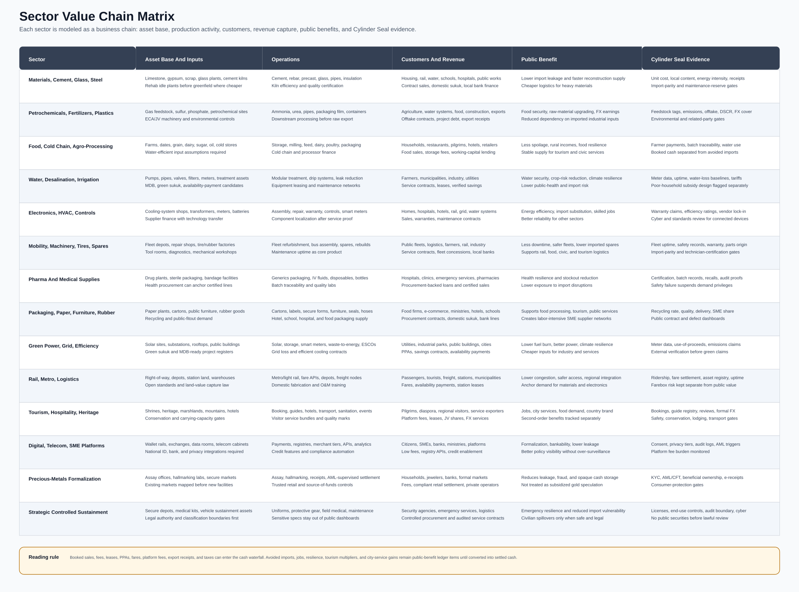
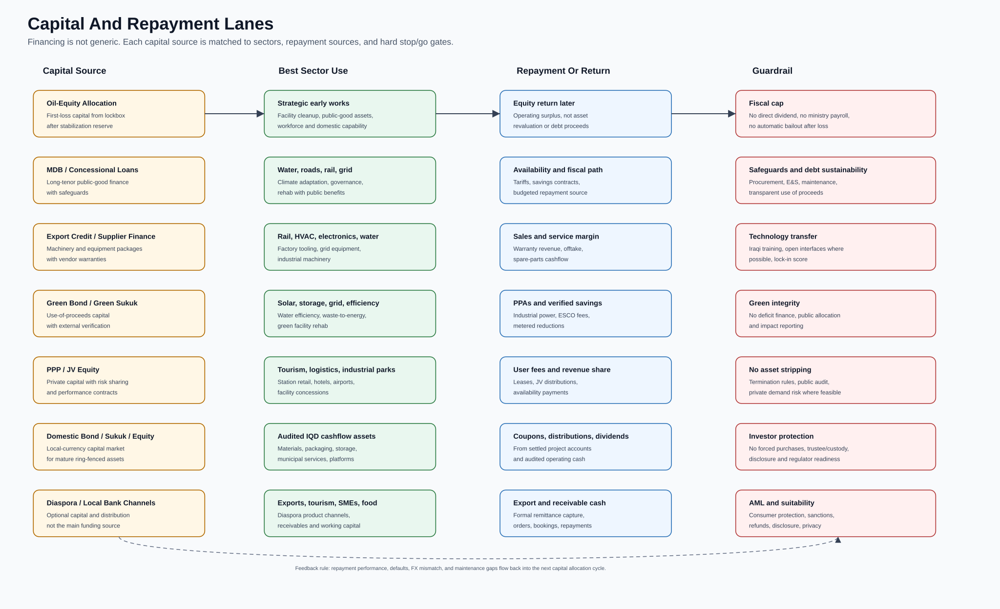
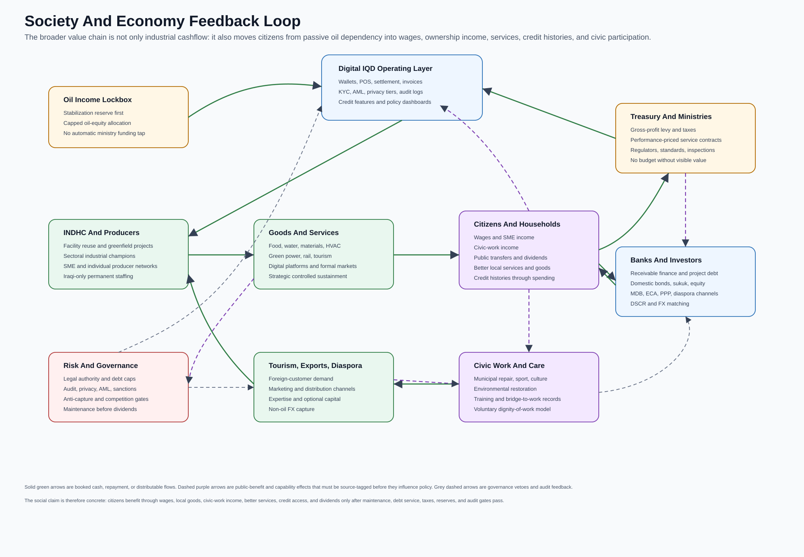

# Business Value Chain Charts

Status: visual planning aid. These charts explain the business logic of the
Cylinder Seal economic model. They are not forecasts, investment offers,
budgets, procurement packages, or claims that any sector is already financeable.

The purpose is to make the model legible as a set of value chains rather than a
collection of policy essays. Every sector has to answer the same practical
questions:

- What assets and inputs does it use?
- What does it produce or operate?
- Who pays?
- What is booked cash, and what is only a wider public benefit?
- Which Digital IQD evidence and governance gates prevent overclaiming?

## Rendered Chart Atlas

### Business Value Chain Overview


This chart shows the end-to-end circuit: capital sources, Digital IQD evidence,
facility recycling, sector production, markets, cash waterfall, public benefits,
and risk gates.

### Sector Value Chain Matrix



This chart maps all current sectors across asset base, operations, customers,
revenue, public benefit, and evidence controls. It is the broadest business
chart in the repo.

### Capital And Repayment Lanes



This chart explains which sources of capital fit which sectors, how repayment
works, and which guardrails block hidden bailouts or forced domestic-market
funding.

### Society And Economy Feedback Loop



This chart connects the business model to society: citizens benefit through
wages, domestic goods, civic-work income, public services, credit histories, and
dividends from audited surplus.

## Reading Rules

The charts follow the same accounting discipline as the unified economic model:

```text
Booked cash
  = sales
  + leases
  + PPAs
  + fares
  + platform fees
  + service contracts
  + export receipts
  + taxes and levies actually settled

Public benefit
  = avoided imports
  + avoided fuel cost
  + lower congestion
  + water security
  + food resilience
  + jobs and skills
  + tourism second-order effects
  + SME bankability
  + cultural and social value
```

Only booked cash can satisfy debt service, maintenance, taxes, retained
earnings, and dividends. Public benefits can justify strategy and investment
priority, but they cannot be counted as distributable cash until they become
settled revenue, fees, taxes, leases, service payments, or other auditable cash
flows.

## Sector Coverage

The sector matrix covers:

| Sector | Primary business question |
| --- | --- |
| Materials, cement, glass, steel | Can domestic heavy materials beat landed cost and support housing, rail, water, and public works? |
| Petrochemicals, fertilizers, plastics | Can Iraq process gas, sulfur, phosphate, and polymers into useful domestic and export inputs? |
| Food, cold chain, agro-processing | Can food imports and spoilage be reduced without pretending water-intensive self-sufficiency is always rational? |
| Water, desalination, irrigation | Can water security become a bankable equipment and service industry? |
| Electronics, HVAC, controls | Can assembly, repair, warranty, and energy efficiency replace import leakage and support every other sector? |
| Mobility, machinery, tires, spares | Can fleet uptime and repair capacity reduce imported parts dependency and downtime? |
| Pharma and medical supplies | Can certified medical production reduce health-sector stockout risk? |
| Packaging, paper, furniture, rubber | Can local packaging and public-fitout demand create labor-intensive supplier networks? |
| Green power, grid, efficiency | Can metered savings and PPAs lower the cost base of the economy? |
| Rail, metro, logistics | Can mobility and logistics produce fares, leases, availability payments, and lower system costs? |
| Tourism, hospitality, heritage | Can Iraq turn natural, religious, and cultural assets into formal service exports while protecting heritage? |
| Digital, telecom, SME platforms | Can payment evidence turn informal activity into bankable, taxable, privacy-bounded economic records? |
| Precious-metals formalization | Can high-value household savings and retail activity move into AML-supervised formal channels? |
| Strategic controlled sustainment | Can sensitive resilience supply chains become audited domestic capability without exposing unsafe details? |

## Cleanup Notes

This chart pack also clarifies three repository boundaries:

- It replaces vague "industrial transformation" language with sector-specific
  business chains.
- It keeps facility recycling visible as a first gate before greenfield capex.
- It separates cashflow charts from public-benefit charts so readers do not
  confuse GDP, avoided imports, or social outcomes with dividend capacity.
