# System And Financial Flow Diagrams

This document maps the Cylinder Seal prototype as a software system and as a set
of financial-flow patterns. It is intentionally conservative: diagrams describe
the target architecture and current prototype boundaries, not production-ready
CBDC infrastructure.

The financial-flow matrix is "complete" for the design surface used in this
repository: every modeled transaction is a combination of actor pair, channel,
programmability primitive, settlement mode, and oversight path.

## Rendered Diagram Atlas

These SVGs are the primary reviewer-facing diagrams. They are kept as standalone
files so they render cleanly in GitHub, can be reused in presentations, and can
be inspected in code review.

### Software System Architecture

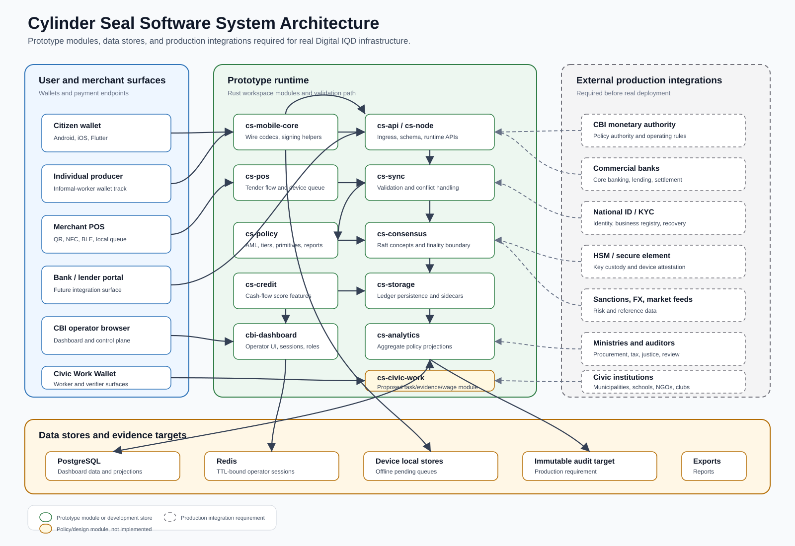

### Unified Economic Model

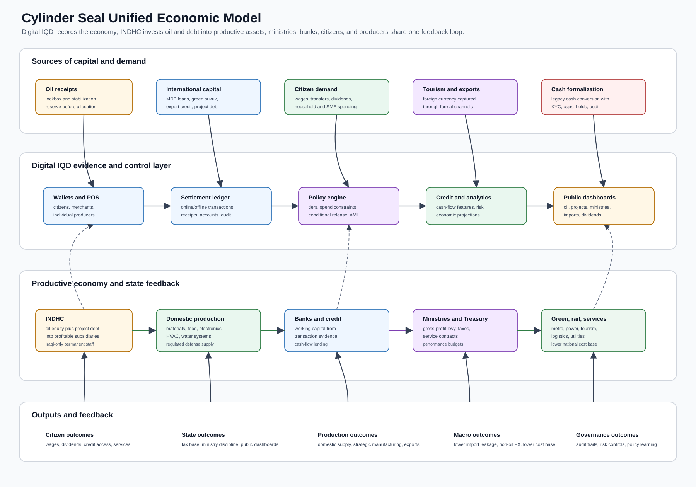

### Transaction Lifecycle

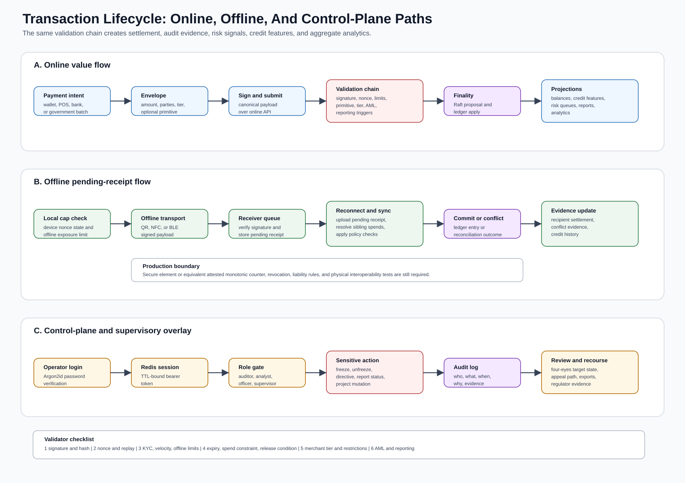

### Financial Flow Combinations

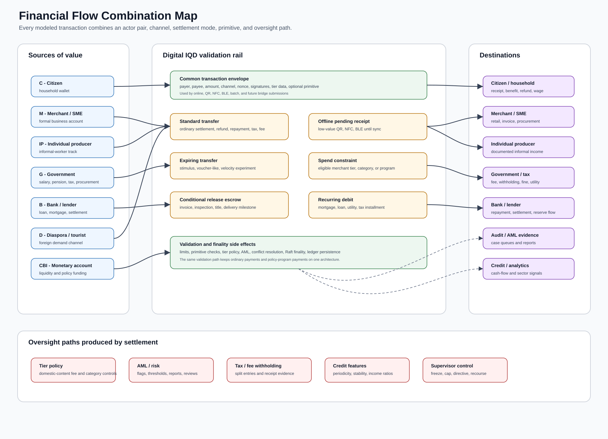

### Transaction Combination Matrix

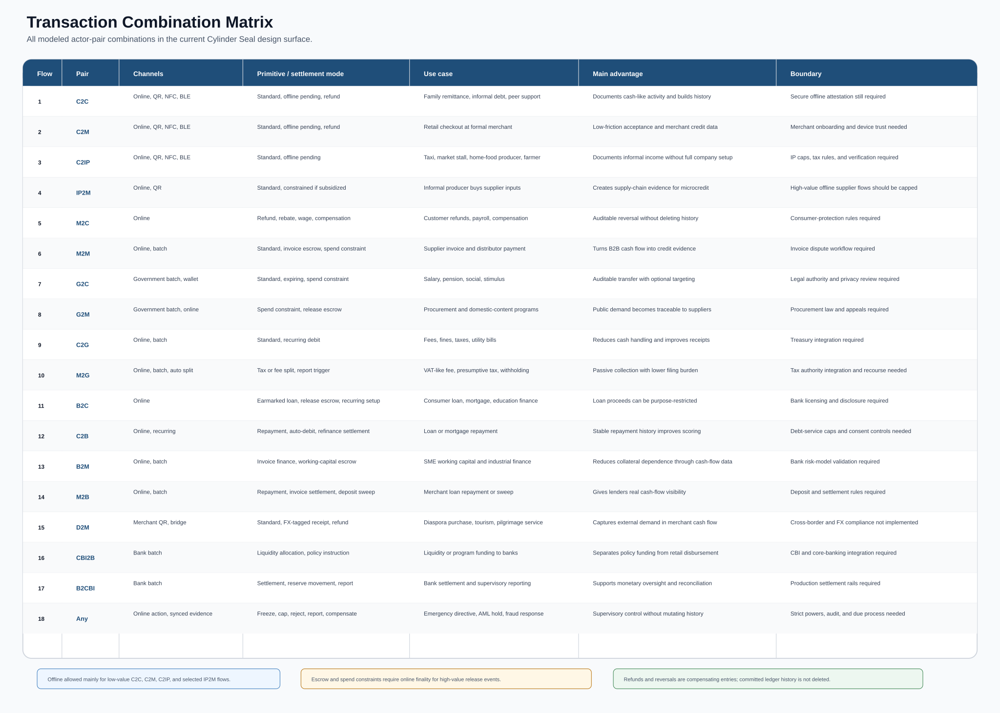

### National Dividend Holding Company

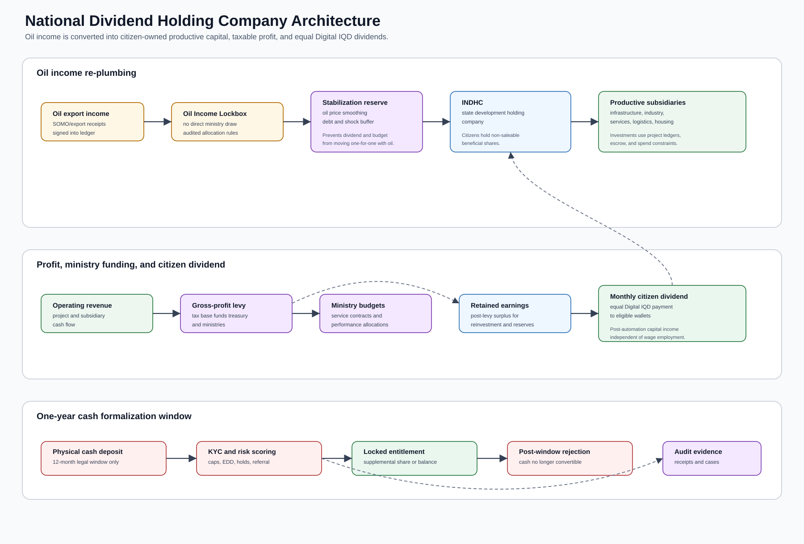

## Legend

| Marker | Meaning |
| --- | --- |
| Prototype | Code or tests exist in this repository, but production hardening may be incomplete. |
| Integration requirement | External system, legal rule, HSM, secure element, national ID, bank/core-banking system, or supervisory process required before real deployment. |
| Control-plane flow | Operator, policy, audit, compliance, or emergency-control action. |
| Value flow | Movement of Digital IQD or related value claim. |
| Data flow | Derived analytics, audit trail, risk signal, or credit feature. |

## Unified Economic Model

The unified model is documented in
[Unified Economic Model](unified-economic-model.md). It connects the software
system, financial flows, INDHC, ministries, banks, producers, tourism, green
capital, rail, taxes, reinvestment, and citizen dividends into one accounting
and feedback structure.

## Software System Diagrams

### 1. System Context

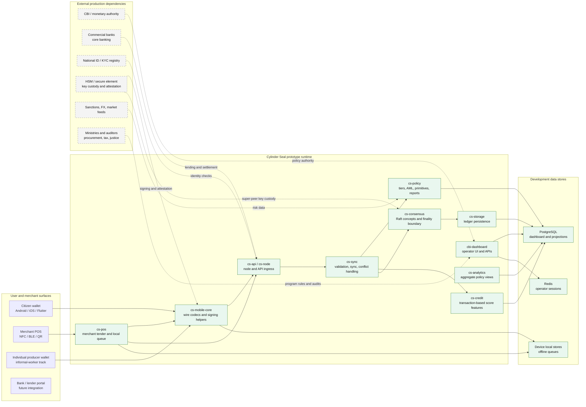
```mermaid
flowchart LR
    subgraph Users["User and merchant surfaces"]
        Citizen["Citizen wallet<br/>Android / iOS / Flutter"]
        Merchant["Merchant POS<br/>NFC / BLE / QR"]
        IP["Individual producer wallet<br/>informal-worker track"]
        BankUser["Bank / lender portal<br/>future integration"]
    end

    subgraph Runtime["Cylinder Seal prototype runtime"]
        MobileCore["cs-mobile-core<br/>wire codecs and signing helpers"]
        POS["cs-pos<br/>merchant tender and local queue"]
        API["cs-api / cs-node<br/>node and API ingress"]
        Sync["cs-sync<br/>validation, sync, conflict handling"]
        Consensus["cs-consensus<br/>Raft concepts and finality boundary"]
        Policy["cs-policy<br/>tiers, AML, primitives, reports"]
        Credit["cs-credit<br/>transaction-based score features"]
        Storage["cs-storage<br/>ledger persistence"]
        Dashboard["cbi-dashboard<br/>operator UI and APIs"]
        Analytics["cs-analytics<br/>aggregate policy views"]
    end

    subgraph DataStores["Development data stores"]
        Postgres["PostgreSQL<br/>dashboard and projections"]
        Redis["Redis<br/>operator sessions"]
        LocalStores["Device local stores<br/>offline queues"]
    end

    subgraph External["External production dependencies"]
        CBI["CBI / monetary authority"]
        Banks["Commercial banks<br/>core banking"]
        KYC["National ID / KYC registry"]
        HSM["HSM / secure element<br/>key custody and attestation"]
        Feeds["Sanctions, FX, market feeds"]
        Ministries["Ministries and auditors<br/>procurement, tax, justice"]
    end

    Citizen --> MobileCore
    IP --> MobileCore
    Merchant --> POS
    POS --> MobileCore
    MobileCore --> API
    POS --> API
    API --> Sync
    Sync --> Policy
    Sync --> Credit
    Sync --> Consensus
    Consensus --> Storage
    Storage --> Postgres
    Policy --> Postgres
    Credit --> Postgres
    Dashboard --> Postgres
    Dashboard --> Redis
    Analytics --> Postgres
    MobileCore --> LocalStores
    POS --> LocalStores

    CBI -. policy authority .-> Dashboard
    Banks -. lending and settlement .-> API
    KYC -. identity checks .-> API
    HSM -. signing and attestation .-> MobileCore
    HSM -. super-peer key custody .-> Consensus
    Feeds -. risk data .-> Policy
    Ministries -. program rules and audits .-> Dashboard

    classDef prototype fill:#e9f7ef,stroke:#2f7d32,color:#111;
    classDef partial fill:#fff8e1,stroke:#b26a00,color:#111;
    classDef external fill:#f4f4f4,stroke:#777,stroke-dasharray: 5 5,color:#111;
    class MobileCore,POS,API,Sync,Consensus,Policy,Credit,Storage,Dashboard,Analytics,Postgres,Redis,LocalStores prototype;
    class CBI,Banks,KYC,HSM,Feeds,Ministries external;
```

Use case: gives CBI, banks, MDB reviewers, and implementers a single map of the
software boundary.

Advantage: separates repository code from required production integrations,
which reduces readiness overclaiming.

### 2. Transaction Processing Pipeline

```mermaid
flowchart TB
    Start["Wallet, POS, dashboard, or bank system<br/>creates transaction intent"]
    Build["Build transaction envelope<br/>amount, parties, tier data, optional primitive"]
    Sign["Canonical encode and sign<br/>wallet, merchant, operator, or program key"]
    Wire["Transport<br/>online API, QR, NFC, BLE, or batch import"]
    Ingress["Node/API ingress<br/>schema and version checks"]
    Auth["Authentication and attestation<br/>session, device, operator, future HSM"]
    Validate["Validation chain"]
    V1["Signature and hash checks"]
    V2["Nonce chain and replay checks"]
    V3["KYC tier, velocity, offline limits"]
    V4["Programmability primitive checks<br/>expiry, spend constraint, release condition"]
    V5["Merchant tier and hard-restriction checks"]
    V6["AML, sanctions, risk, reporting triggers"]
    Conflict["Conflict resolver<br/>offline sibling detection"]
    Propose["Raft proposal<br/>super-peer finality boundary"]
    Apply["Ledger applier<br/>append entry and sidecars"]
    Project["Projections<br/>balances, reports, credit features, analytics"]
    Audit["Audit evidence<br/>operator log, primitive log, risk log"]

    Start --> Build --> Sign --> Wire --> Ingress --> Auth --> Validate
    Validate --> V1 --> V2 --> V3 --> V4 --> V5 --> V6 --> Conflict --> Propose --> Apply --> Project
    Apply --> Audit
    Project --> Audit

    classDef check fill:#eef7ff,stroke:#27659a,color:#111;
    classDef finality fill:#f7edff,stroke:#74459a,color:#111;
    class V1,V2,V3,V4,V5,V6,Conflict check;
    class Propose,Apply finality;
```

Use case: shows where a payment becomes more than a balance transfer: it can
also produce risk signals, credit features, policy compliance, and aggregate
economic visibility.

Advantage: makes it clear that restrictions are meant to be enforced in the
validation path, not only in wallet UI code.

### 3. Online Transaction Lifecycle

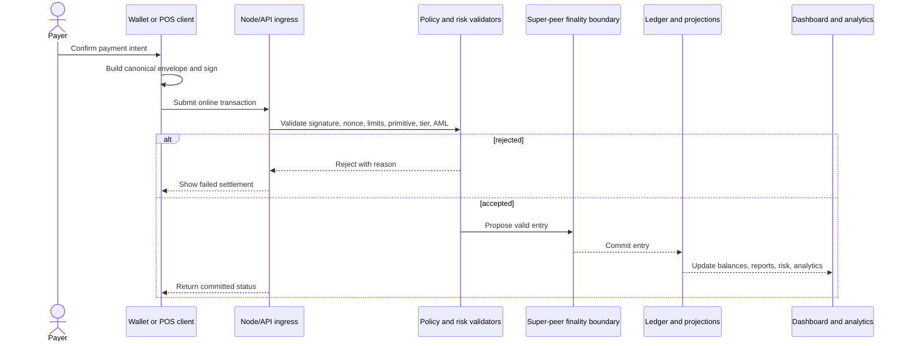
```mermaid
sequenceDiagram
    actor Payer
    participant Wallet as Wallet or POS client
    participant API as Node/API ingress
    participant Policy as Policy and risk validators
    participant Raft as Super-peer finality boundary
    participant Ledger as Ledger and projections
    participant Dash as Dashboard and analytics

    Payer->>Wallet: Confirm payment intent
    Wallet->>Wallet: Build canonical envelope and sign
    Wallet->>API: Submit online transaction
    API->>Policy: Validate signature, nonce, limits, primitive, tier, AML
    alt rejected
        Policy-->>API: Reject with reason
        API-->>Wallet: Show failed settlement
    else accepted
        Policy->>Raft: Propose valid entry
        Raft-->>Ledger: Commit entry
        Ledger-->>Dash: Update balances, reports, risk, analytics
        API-->>Wallet: Return committed status
    end
```

Use case: connected retail payment, online P2P transfer, bank disbursement,
government transfer, tax payment, or procurement payment.

Advantage: fastest finality and strongest immediate policy/risk enforcement.

### 4. Offline Transaction Lifecycle

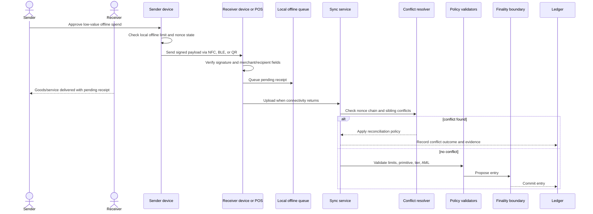
```mermaid
sequenceDiagram
    actor Sender
    actor Receiver
    participant SDev as Sender device
    participant RDev as Receiver device or POS
    participant Local as Local offline queue
    participant Sync as Sync service
    participant Resolver as Conflict resolver
    participant Policy as Policy validators
    participant Raft as Finality boundary
    participant Ledger as Ledger

    Sender->>SDev: Approve low-value offline spend
    SDev->>SDev: Check local offline limit and nonce state
    SDev->>RDev: Send signed payload via NFC, BLE, or QR
    RDev->>RDev: Verify signature and merchant/recipient fields
    RDev->>Local: Queue pending receipt
    Receiver-->>Sender: Goods/service delivered with pending receipt
    RDev->>Sync: Upload when connectivity returns
    Sync->>Resolver: Check nonce chain and sibling conflicts
    alt conflict found
        Resolver-->>Sync: Apply reconciliation policy
        Sync-->>Ledger: Record conflict outcome and evidence
    else no conflict
        Sync->>Policy: Validate limits, primitive, tier, AML
        Policy->>Raft: Propose entry
        Raft-->>Ledger: Commit entry
    end
```

Use case: rural retail, market stalls, taxis, conflict-zone connectivity gaps,
and low-value citizen-to-citizen payments.

Advantage: keeps transactions documented when internet service is missing, while
constraining exposure through tier limits and sync-time conflict handling.

Production boundary: real deployment still needs secure elements or equivalent
attested monotonic counters, formal liability rules, revocation, and device
recovery.

### 5. Control Plane And Operator Security

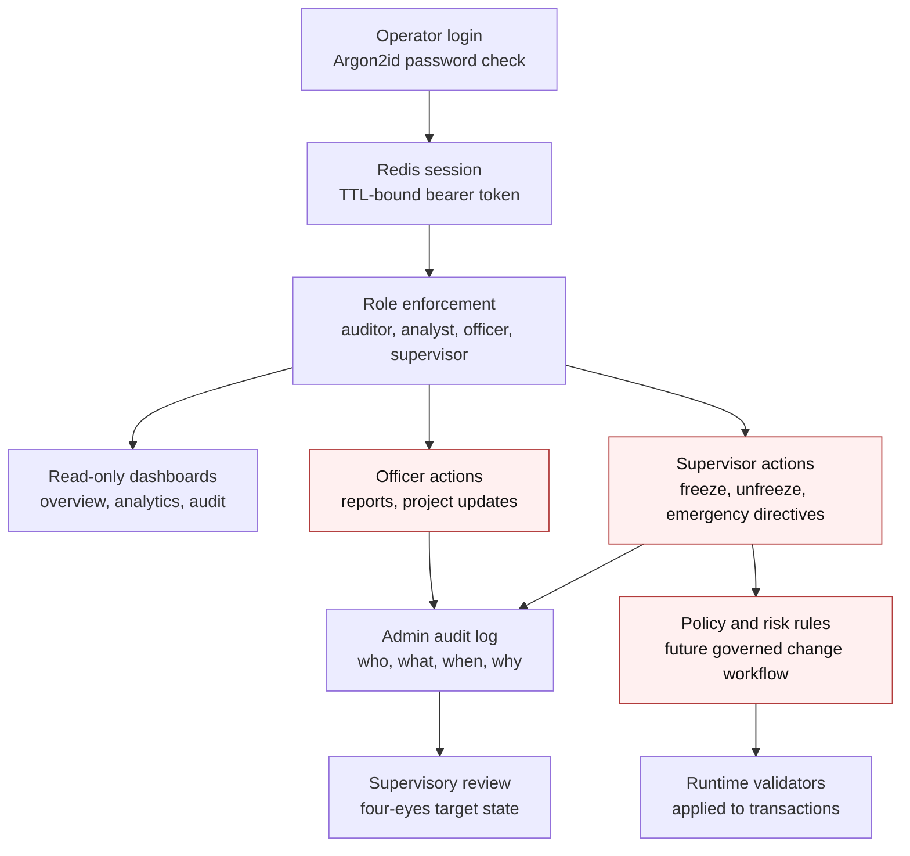
```mermaid
flowchart TB
    Login["Operator login<br/>Argon2id password check"]
    Session["Redis session<br/>TTL-bound bearer token"]
    Role["Role enforcement<br/>auditor, analyst, officer, supervisor"]
    ReadOnly["Read-only dashboards<br/>overview, analytics, audit"]
    Officer["Officer actions<br/>reports, project updates"]
    Supervisor["Supervisor actions<br/>freeze, unfreeze, emergency directives"]
    AuditLog["Admin audit log<br/>who, what, when, why"]
    Review["Supervisory review<br/>four-eyes target state"]
    PolicyRules["Policy and risk rules<br/>future governed change workflow"]
    Validation["Runtime validators<br/>applied to transactions"]

    Login --> Session --> Role
    Role --> ReadOnly
    Role --> Officer
    Role --> Supervisor
    Officer --> AuditLog
    Supervisor --> AuditLog
    AuditLog --> Review
    Supervisor --> PolicyRules --> Validation

    classDef sensitive fill:#fff0f0,stroke:#b23b3b,color:#111;
    class Officer,Supervisor,PolicyRules sensitive;
```

Use case: CBI-style operators need visibility and intervention powers without
turning every dashboard user into a superuser.

Advantage: creates a visible authorization boundary for the exact actions that
matter most to a financial-infrastructure reviewer.

### 6. Data And Privacy Boundaries

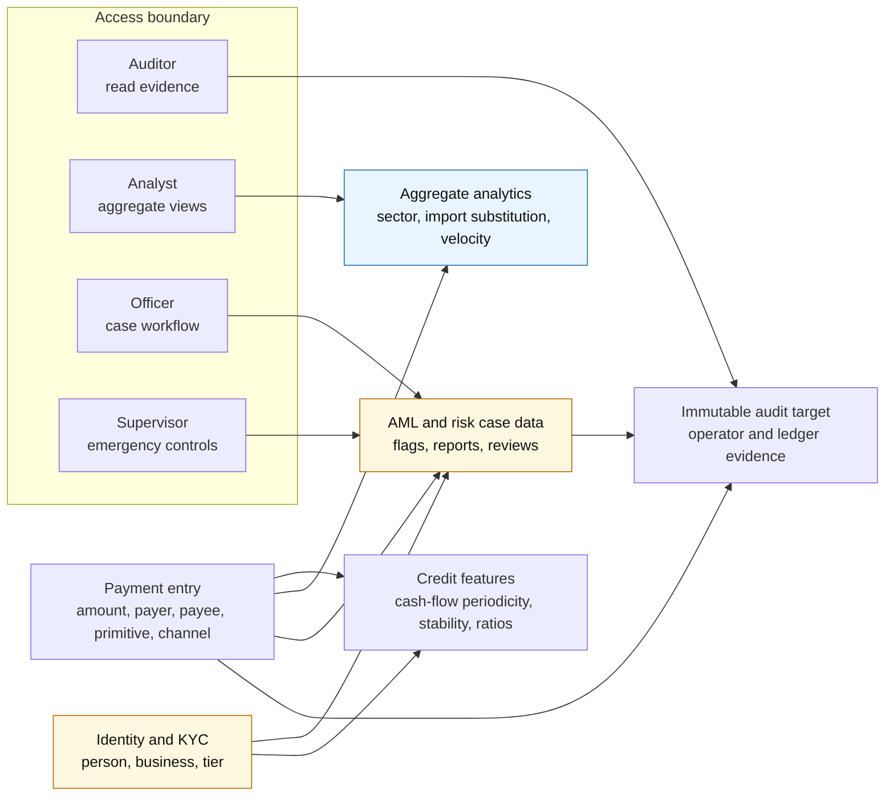
```mermaid
flowchart LR
    Tx["Payment entry<br/>amount, payer, payee, primitive, channel"]
    Identity["Identity and KYC<br/>person, business, tier"]
    Risk["AML and risk case data<br/>flags, reports, reviews"]
    Credit["Credit features<br/>cash-flow periodicity, stability, ratios"]
    Analytics["Aggregate analytics<br/>sector, import substitution, velocity"]
    Audit["Immutable audit target<br/>operator and ledger evidence"]

    Tx --> Credit
    Tx --> Analytics
    Tx --> Risk
    Identity --> Risk
    Identity --> Credit
    Risk --> Audit
    Tx --> Audit

    subgraph Access["Access boundary"]
        Auditor["Auditor<br/>read evidence"]
        Analyst["Analyst<br/>aggregate views"]
        Officer["Officer<br/>case workflow"]
        Supervisor["Supervisor<br/>emergency controls"]
    end

    Auditor --> Audit
    Analyst --> Analytics
    Officer --> Risk
    Supervisor --> Risk

    classDef pii fill:#fff8e1,stroke:#b26a00,color:#111;
    classDef aggregate fill:#e8f5ff,stroke:#2670a8,color:#111;
    class Identity,Risk pii;
    class Analytics aggregate;
```

Use case: defines the minimum split reviewers expect between payment data,
identity data, compliance access, and aggregate policy analytics.

Advantage: gives a starting point for privacy impact assessment and data
minimization work.

## Financial Flow Model

Every transaction flow is assembled from these dimensions:

| Dimension | Allowed values in the design surface |
| --- | --- |
| Actor pair | C2C, C2M, C2IP, M2C, M2M, IP2M, G2P, G2B, C2G, M2G, B2C, C2B, B2M, M2B, D2M, CBI2B, B2CBI |
| Channel | Online API, QR, NFC, BLE, bank batch, government batch, future correspondent-bank bridge |
| Settlement mode | Immediate online finality, pending offline receipt, batch settlement, conditional release |
| Primitive | Standard transfer, expiring transfer, spend constraint, conditional release escrow, recurring debit, refund/compensating transfer |
| Oversight path | None beyond normal validation, tier policy, AML/risk report, tax/fee withholding, credit feature extraction, supervisor/emergency control |

Actor shorthand:

| Code | Actor |
| --- | --- |
| C | Citizen or household wallet |
| M | Formal merchant or business |
| IP | Individual producer / informal-worker wallet |
| G | Government ministry, salary, pension, social, tax, or procurement account |
| B | Bank, lender, or industrial-finance account |
| D | Diaspora buyer, tourist, pilgrim, or foreign customer |
| CBI | Central-bank or super-peer operating account |

### 7. Financial Flow Combination Map

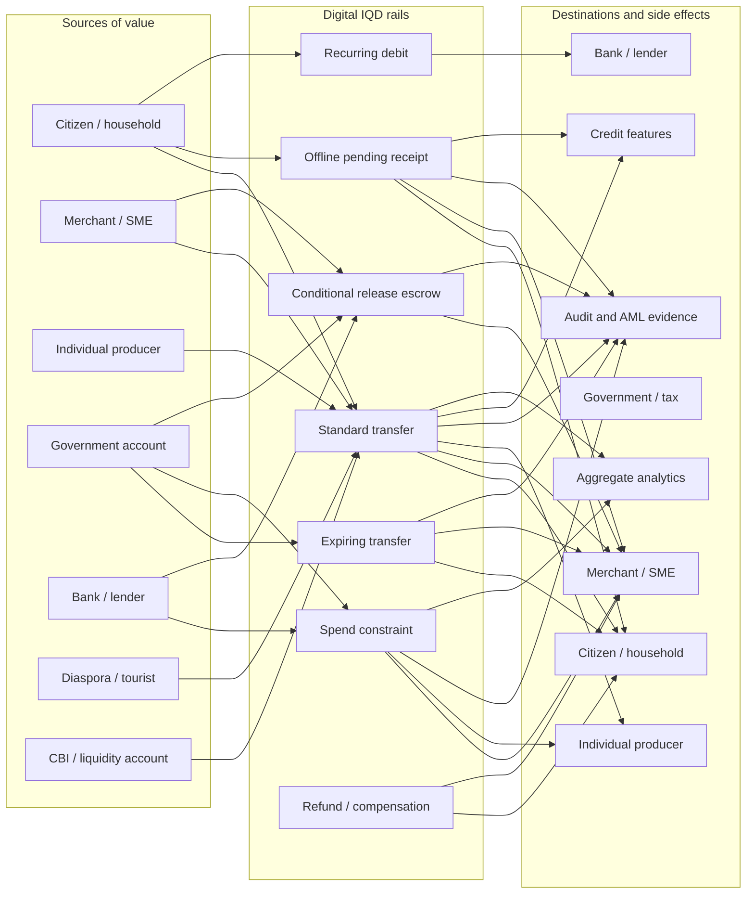
```mermaid
flowchart LR
    subgraph Sources["Sources of value"]
        C["Citizen / household"]
        M["Merchant / SME"]
        IP["Individual producer"]
        G["Government account"]
        B["Bank / lender"]
        D["Diaspora / tourist"]
        CBI["CBI / liquidity account"]
    end

    subgraph Rails["Digital IQD rails"]
        Standard["Standard transfer"]
        Offline["Offline pending receipt"]
        Expiring["Expiring transfer"]
        Earmarked["Spend constraint"]
        Escrow["Conditional release escrow"]
        Recurring["Recurring debit"]
        Refund["Refund / compensation"]
    end

    subgraph Destinations["Destinations and side effects"]
        C2["Citizen / household"]
        M2["Merchant / SME"]
        IP2["Individual producer"]
        G2["Government / tax"]
        B2["Bank / lender"]
        Audit["Audit and AML evidence"]
        Credit2["Credit features"]
        Analytics2["Aggregate analytics"]
    end

    C --> Standard
    C --> Offline
    C --> Recurring
    M --> Standard
    M --> Escrow
    IP --> Standard
    G --> Expiring
    G --> Earmarked
    G --> Escrow
    B --> Earmarked
    B --> Escrow
    D --> Standard
    CBI --> Standard

    Standard --> C2
    Standard --> M2
    Standard --> IP2
    Offline --> C2
    Offline --> M2
    Expiring --> C2
    Expiring --> M2
    Earmarked --> M2
    Earmarked --> IP2
    Escrow --> M2
    Recurring --> B2
    Refund --> C2
    Refund --> M2

    Standard --> Audit
    Offline --> Audit
    Expiring --> Audit
    Earmarked --> Audit
    Escrow --> Audit
    Standard --> Credit2
    Offline --> Credit2
    Standard --> Analytics2
    Earmarked --> Analytics2
```

Use case: shows that the system is not a single payment path. It is a small set
of reusable rails that combine into retail, government, bank, producer, and
diaspora flows.

Advantage: reduces product sprawl. New use cases should reuse the same envelope,
validation, audit, and projection paths.

## Transaction Combination Matrix

| Flow | Actor pair | Channels | Valid primitives | Use case | Advantage | Boundary |
| --- | --- | --- | --- | --- | --- | --- |
| 1 | C2C | Online, QR, NFC, BLE | Standard, offline pending, refund | Citizen remittance, family support, informal debt repayment | Documents cash-like activity and builds payment history | Offline conflict prevention still needs secure attestation |
| 2 | C2M | Online, QR, NFC, BLE | Standard, offline pending, refund | Retail checkout at formal merchants | Low-friction acceptance, immediate credit features for merchant | Merchant onboarding and device attestation required |
| 3 | C2IP | Online, QR, NFC, BLE | Standard, offline pending | Taxi, market stall, home-food producer, small farmer | Lets informal producers receive documented income without full company registration | IP registration, caps, and tax rules need legal approval |
| 4 | IP2M | Online, QR | Standard, spend constraint where subsidized | Informal producer buys inputs from formal supplier | Creates supply-chain evidence for microcredit and audits | Offline high-value supplier flows should be capped |
| 5 | M2C | Online | Refund, rebate, wage, compensating transfer | Refunds, payroll, customer compensation | Keeps reversals auditable without deleting ledger history | Consumer-protection rules required |
| 6 | M2M | Online, batch | Standard, invoice escrow, spend constraint | Supplier invoice, distributor payment, construction materials | Turns B2B cash flow into credit evidence | Invoice authenticity and dispute workflow required |
| 7 | G2C | Government batch, online wallet | Standard, expiring, spend constraint | Salary, pension, social transfer, stimulus | Can improve inclusion and policy targeting while preserving traceability | Must be legally authorized and privacy-reviewed |
| 8 | G2M | Government batch, online | Spend constraint, conditional release, hard-restriction policy | Procurement, food/textile programs, domestic-content purchasing | Makes public demand auditable and directs funds to eligible suppliers | Procurement law and appeals process required |
| 9 | C2G | Online, batch | Standard, recurring debit | Fees, fines, utility bills, taxes | Reduces cash handling and improves receipts | Government treasury integration required |
| 10 | M2G | Online, batch, automatic withholding | Standard, tax/fee split, report trigger | VAT-like fee, presumptive IP tax, payroll withholding | Passive collection with lower filing burden | Tax authority integration and taxpayer recourse required |
| 11 | B2C | Online | Earmarked loan, conditional release, recurring repayment setup | Consumer loan, mortgage tranche, education finance | Loan proceeds can be restricted to approved purposes | Bank licensing, disclosures, and collateral law required |
| 12 | C2B | Online, recurring | Repayment, auto-debit, refinance settlement | Loan or mortgage repayment | Stable repayment history improves credit scoring | Debt-service caps and consent controls required |
| 13 | B2M | Online, batch | Invoice finance, working-capital escrow, spend constraint | SME working capital and industrial finance | Reduces collateral dependence by using transaction history | Bank risk model validation required |
| 14 | M2B | Online, batch | Repayment, invoice settlement | Merchant loan repayment or deposit sweep | Gives lenders real cash-flow visibility | Deposit and settlement rules required |
| 15 | D2M | Online, merchant QR, future correspondent bridge | Standard, FX-tagged receipt, refund | Diaspora purchase, tourism, pilgrimage services, Iraqi-origin goods | Captures foreign-customer demand through documented merchants | Cross-border and FX compliance not implemented |
| 16 | CBI2B | Bank batch | Liquidity allocation, policy instruction | Liquidity provision or program funding to banks | Clean separation between policy funding and retail disbursement | CBI/core-banking integration required |
| 17 | B2CBI | Bank batch | Settlement, reserve movement, report | Bank settlement and supervisory reporting | Supports monetary oversight and reconciliation | Production settlement rails required |
| 18 | Any valid payer to any valid payee | Online only for action; offline receipt may later sync | Freeze, cap, reject, report, reverse by compensating transfer | Emergency directive, AML hold, fraud response | Provides supervisory control without mutating history | Requires strict emergency powers, audit, and due process |

## Validity Rules For Combinations

| Rule | Applies to | Reason |
| --- | --- | --- |
| Offline is limited to low-value C2C, C2M, C2IP, and selected IP2M flows. | NFC, BLE, QR pending receipts | High-value, bank, government, procurement, and cross-border flows need online finality. |
| Conditional-release escrow can be initiated online and represented in the ledger; release should be online. | G2M, B2C, B2M, M2M | Release depends on third-party evidence, inspector approval, title event, or invoice state. |
| Spend constraints may be carried offline only when recipient eligibility and cap data are locally verifiable. | C2M, C2IP, G2C, G2M, B2C | Final validation still occurs at sync, so offline recipients carry settlement risk. |
| Expiring transfers can be spent before expiry; expired value must revert or be blocked by validator policy. | G2C stimulus, voucher-like flows | Prevents stale stimulus balances and supports velocity policy experiments. |
| Refunds and reversals are new compensating entries, not ledger deletion. | C2M, M2C, D2M, M2M | Preserves auditability and avoids tampering with committed entries. |
| Tax, fee, and tier effects are side effects of settlement, not separate UI promises. | C2M, C2IP, M2G, IP2M | Keeps enforcement at validation and projection layers. |
| AML and risk flags do not automatically prove wrongdoing. | All flows | They create review queues, reports, and evidence packs subject to legal process. |

## Detailed Financial Flow Diagrams

### 8. Retail Merchant Payment With Tier Effects

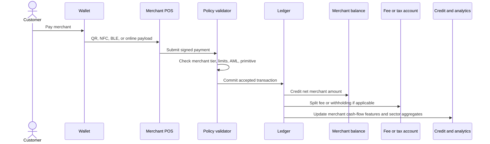
```mermaid
sequenceDiagram
    actor Customer
    participant Wallet
    participant MerchantPOS as Merchant POS
    participant Validator as Policy validator
    participant Ledger
    participant Merchant as Merchant balance
    participant Gov as Fee or tax account
    participant Analytics as Credit and analytics

    Customer->>Wallet: Pay merchant
    Wallet->>MerchantPOS: QR, NFC, BLE, or online payload
    MerchantPOS->>Validator: Submit signed payment
    Validator->>Validator: Check merchant tier, limits, AML, primitive
    Validator->>Ledger: Commit accepted transaction
    Ledger->>Merchant: Credit net merchant amount
    Ledger->>Gov: Split fee or withholding if applicable
    Ledger->>Analytics: Update merchant cash-flow features and sector aggregates
```

Use case: retail checkout with domestic-content tiering.

Advantages:

- Merchant receives documented revenue usable for credit scoring.
- Tier policy can reward local content without relying only on after-the-fact audits.
- Government fee/tax effects are visible as ledger side effects rather than hidden cash leakage.

### 9. Offline Citizen Or Retail Payment

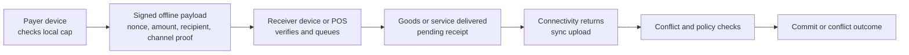
```mermaid
flowchart LR
    Sender["Payer device<br/>checks local cap"]
    Payload["Signed offline payload<br/>nonce, amount, recipient, channel proof"]
    Receiver["Receiver device or POS<br/>verifies and queues"]
    Goods["Goods or service delivered<br/>pending receipt"]
    Sync["Connectivity returns<br/>sync upload"]
    Resolve["Conflict and policy checks"]
    Commit["Commit or conflict outcome"]

    Sender --> Payload --> Receiver --> Goods --> Sync --> Resolve --> Commit
```

Use case: rural market, taxi ride, family transfer, or merchant checkout without
network coverage.

Advantages:

- Keeps low-value activity documented instead of forcing a return to cash.
- Gives merchants and IPs a path into credit evidence.
- Limits exposure through offline caps and sync-time reconciliation.

### 10. Government Transfer With Programmability

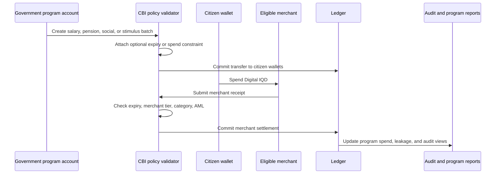
```mermaid
sequenceDiagram
    participant G as Government program account
    participant CBI as CBI policy validator
    participant Citizen as Citizen wallet
    participant Merchant as Eligible merchant
    participant Ledger
    participant Reports as Audit and program reports

    G->>CBI: Create salary, pension, social, or stimulus batch
    CBI->>CBI: Attach optional expiry or spend constraint
    CBI->>Ledger: Commit transfer to citizen wallets
    Citizen->>Merchant: Spend Digital IQD
    Merchant->>CBI: Submit merchant receipt
    CBI->>CBI: Check expiry, merchant tier, category, AML
    CBI->>Ledger: Commit merchant settlement
    Ledger->>Reports: Update program spend, leakage, and audit views
```

Use case: salary, pension, social benefit, voucher-like stimulus, or targeted
domestic-production program.

Advantages:

- Public money remains auditable from issuance to spend.
- Expiry can support velocity experiments for stimulus.
- Spend constraints can target eligible categories while producing evidence for review.

Boundary: real use requires law, appeals, privacy safeguards, and clear public
communications.

### 11. SME Invoice And Working-Capital Flow

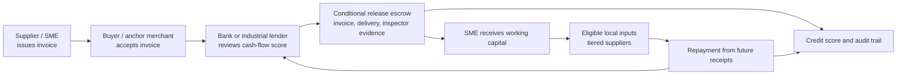
```mermaid
flowchart LR
    Supplier["Supplier / SME<br/>issues invoice"]
    Buyer["Buyer / anchor merchant<br/>accepts invoice"]
    Bank["Bank or industrial lender<br/>reviews cash-flow score"]
    Escrow["Conditional release escrow<br/>invoice, delivery, inspector evidence"]
    SME["SME receives working capital"]
    Inputs["Eligible local inputs<br/>tiered suppliers"]
    Repay["Repayment from future receipts"]
    Credit["Credit score and audit trail"]

    Supplier --> Buyer --> Bank --> Escrow --> SME --> Inputs --> Repay --> Bank
    Escrow --> Credit
    Repay --> Credit
```

Use case: supplier financing, distributor financing, construction supply-chain
finance, or working-capital advance.

Advantages:

- Uses transaction history and invoices instead of only fixed collateral.
- Earmarking can keep loan proceeds inside eligible productive uses.
- Repayment behavior becomes future credit evidence.

### 12. Mortgage And Real-Estate Flow

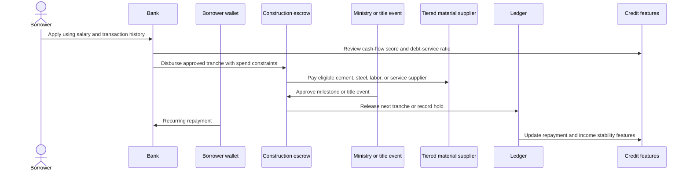
```mermaid
sequenceDiagram
    actor Borrower
    participant Bank
    participant Wallet as Borrower wallet
    participant Escrow as Construction escrow
    participant Inspector as Ministry or title event
    participant Supplier as Tiered material supplier
    participant Ledger
    participant Credit as Credit features

    Borrower->>Bank: Apply using salary and transaction history
    Bank->>Credit: Review cash-flow score and debt-service ratio
    Bank->>Escrow: Disburse approved tranche with spend constraints
    Escrow->>Supplier: Pay eligible cement, steel, labor, or service supplier
    Inspector->>Escrow: Approve milestone or title event
    Escrow->>Ledger: Release next tranche or record hold
    Wallet->>Bank: Recurring repayment
    Ledger->>Credit: Update repayment and income stability features
```

Use case: IQD mortgage, construction loan, staged homebuilding, or developer
tranche finance.

Advantages:

- Connects long-duration IQD savings/borrowing to real domestic assets.
- Staged release can reduce leakage and unfinished-project risk.
- Repayment records improve borrower and supplier credit history.

Boundary: title registry, foreclosure law, consumer protection, and bank risk
rules are external dependencies.

### 13. Tax, Fee, And Withholding Flow

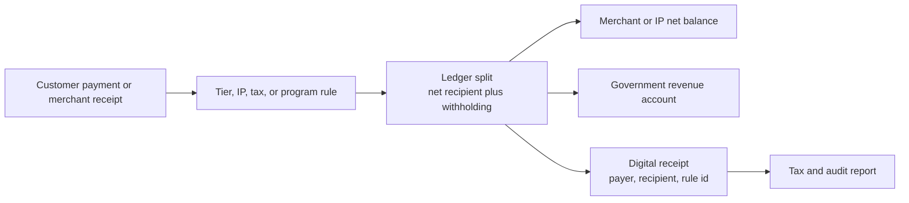
```mermaid
flowchart LR
    Payment["Customer payment or merchant receipt"]
    Rule["Tier, IP, tax, or program rule"]
    Split["Ledger split<br/>net recipient plus withholding"]
    Recipient["Merchant or IP net balance"]
    Gov["Government revenue account"]
    Receipt["Digital receipt<br/>payer, recipient, rule id"]
    Audit["Tax and audit report"]

    Payment --> Rule --> Split
    Split --> Recipient
    Split --> Gov
    Split --> Receipt --> Audit
```

Use case: merchant tier fee, presumptive IP micro-tax, payroll withholding, or
government service fee.

Advantages:

- Reduces manual filing burden for small participants.
- Makes the rule and amount visible on the receipt.
- Preserves evidence for appeal and audit.

### 14. Diaspora, Tourism, And FX-Tagged Merchant Flow

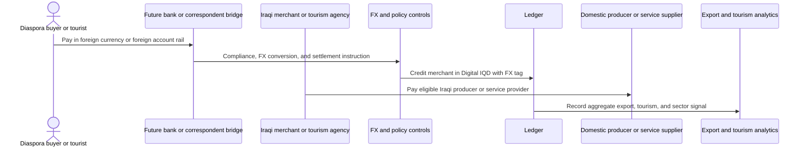
```mermaid
sequenceDiagram
    actor Buyer as Diaspora buyer or tourist
    participant Bridge as Future bank or correspondent bridge
    participant Merchant as Iraqi merchant or tourism agency
    participant CBI as FX and policy controls
    participant Ledger
    participant Supplier as Domestic producer or service supplier
    participant Analytics as Export and tourism analytics

    Buyer->>Bridge: Pay in foreign currency or foreign account rail
    Bridge->>CBI: Compliance, FX conversion, and settlement instruction
    CBI->>Ledger: Credit merchant in Digital IQD with FX tag
    Merchant->>Supplier: Pay eligible Iraqi producer or service provider
    Ledger->>Analytics: Record aggregate export, tourism, and sector signal
```

Use case: diaspora purchase of Iraqi-origin goods, pilgrimage/tourism package,
foreign customer paying an Iraqi service provider.

Advantages:

- Treats diaspora/tourism as distribution demand, not only remittance capital.
- FX-tagged receipts can distinguish external demand from domestic recycling.
- Domestic supplier payments become visible in the same credit and tier system.

Boundary: cross-border, AML, correspondent banking, and FX controls are not
implemented in the current prototype.

### 15. Emergency, AML, And Dispute Overlay

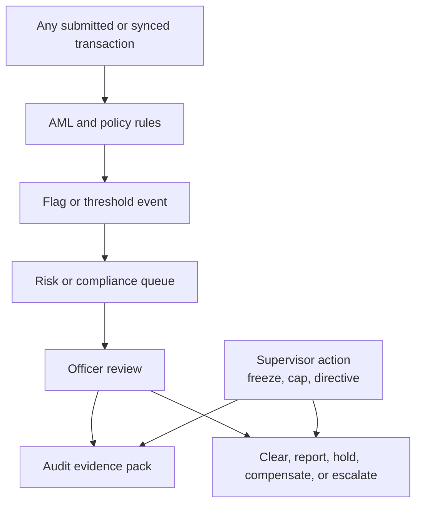
```mermaid
flowchart TB
    Tx["Any submitted or synced transaction"]
    Rules["AML and policy rules"]
    Flag["Flag or threshold event"]
    Queue["Risk or compliance queue"]
    Officer["Officer review"]
    Supervisor["Supervisor action<br/>freeze, cap, directive"]
    Evidence["Audit evidence pack"]
    Outcome["Clear, report, hold, compensate, or escalate"]

    Tx --> Rules --> Flag --> Queue --> Officer
    Officer --> Evidence
    Officer --> Outcome
    Supervisor --> Outcome
    Supervisor --> Evidence
```

Use case: suspected fraud, sanctions hit, compromised wallet, emergency program
control, or disputed offline receipt.

Advantages:

- Keeps intervention powers auditable.
- Supports case review rather than silent automated punishment.
- Allows emergency controls while preserving a committed evidence trail.

## Flow Advantages By Policy Objective

| Objective | Best-fit flows | Why they help |
| --- | --- | --- |
| Financial inclusion | C2C, C2M, C2IP, offline pending receipts, IP registration | Converts cash-like activity into documented income and payment history. |
| SME credit | C2M, M2M, B2M, invoice escrow, recurring repayment | Creates cash-flow features and invoice evidence for thin-file firms. |
| Public-transfer control | G2C, G2M, expiring transfers, spend constraints | Gives program administrators a visible issuance-to-spend trail. |
| National dividend and ministry feedback | Oil-income lockbox, INDHC investment allocations, gross-profit levy, citizen dividend | Converts raw oil receipts into audited productive capital, tax-funded ministry budgets, and equal Digital IQD dividends. |
| Domestic-production incentives | C2M, G2M, B2M, tier policy, earmarked spend | Rewards eligible local suppliers through validation and settlement side effects. |
| Monetary visibility | All committed flows, aggregate analytics | Gives privacy-bounded velocity, sector, and geography signals. |
| AML and supervisory control | All online and synced flows, risk queue, freeze/cap overlay | Produces evidence packs and role-gated intervention paths. |
| Offline resilience | C2C, C2M, C2IP over NFC/BLE/QR | Maintains payment availability during connectivity gaps. |

## Implementation Mapping

| Diagram area | Main files and crates |
| --- | --- |
| Transaction envelope and signatures | `crates/cs-core/src/models.rs`, `crates/cs-core/src/cryptography.rs`, `crates/cs-mobile-core/src/wire.rs` |
| NFC/BLE/QR and POS tender | `crates/cs-pos/src/payment.rs`, `crates/cs-pos/src/nfc.rs`, `crates/cs-pos/src/ble.rs`, `crates/cs-pos/src/qr.rs` |
| Offline conflict handling | `crates/cs-sync/src/conflict_resolver.rs`, `crates/cs-tests/tests/spec_13_conflict_resolution.rs` |
| Programmability primitives | `crates/cs-core/src/primitives.rs`, `crates/cs-policy/src/primitives.rs`, `crates/cs-tests/tests/spec_22_programmability_primitives.rs` |
| Merchant tiers and hard restrictions | `crates/cs-policy`, `crates/cs-tests/tests/spec_23_tier_policy.rs` |
| AML and reporting | `crates/cs-policy/src/aml.rs`, `crates/cs-policy/src/reporting.rs`, `crates/cbi-dashboard/src/routes/compliance.rs`, `crates/cbi-dashboard/src/routes/risk.rs` |
| Credit features | `crates/cs-credit`, `crates/cs-policy/src/risk_scoring.rs` |
| Consensus boundary | `crates/cs-consensus`, `crates/cs-sync/src/sync_service.rs`, `crates/cs-sync/src/state_machine.rs` |
| Dashboard sessions and roles | `crates/cbi-dashboard/src/auth.rs`, `crates/cbi-dashboard/src/middleware.rs`, `crates/cbi-dashboard/src/main.rs` |

## Remaining Diagram Gaps

These diagrams make the intended system legible, but they do not close the
remaining engineering gaps:

- HSM and secure-element attestation need a concrete design and tests.
- Offline double-spend prevention still needs hardware-backed monotonic counters
  or an equivalent attested mechanism.
- Real PostgreSQL/Redis endpoint integration tests are needed for dashboard
  route credibility.
- Cross-border, FX, diaspora, and correspondent-bank flows are scenario designs,
  not implemented rails.
- Production privacy, legal authority, appeal, and emergency-power procedures
  must be specified before using real citizen or business data.
- The national dividend holding-company model is a policy architecture proposal;
  its legal authority, oil-revenue handling, share-entitlement rules, investment
  governance, and dividend formula require independent review.
